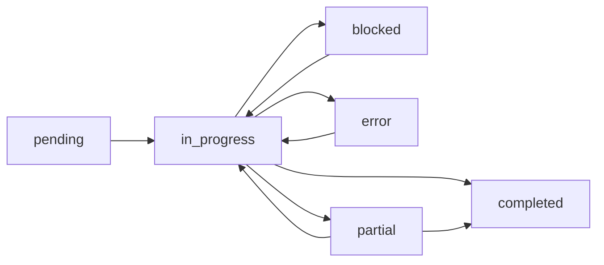

# Do Task - Baby-Steps Pair Programming Collaboration

## Intent: Accomplish Complex Tasks Through Expert Collaboration

This command enables you to tackle complex tasks by orchestrating specialized agents who work together using pair programming methodology. Each agent contributes their expertise in small, verified steps, ensuring high quality and continuous progress toward your goal.

## 🚼 BABY-STEPS METHODOLOGY
**Every action must be a small, atomic, testable step:**
- ✅ Each step takes 2-5 minutes maximum
- ✅ Switch agents after EVERY baby step
- ✅ One agent does, next agent reviews and continues
- ✅ Continuous micro-handoffs like real pair programming

## Overview
This command orchestrates multiple specialized agents using **baby-steps pair programming** methodology. Agents alternate after each tiny step, ensuring continuous review, knowledge transfer, and quality control - exactly like developers switching keyboard control in pair programming.

**NEW**: When working on todo lists, agents automatically track and update todo item status (pending → in_progress → completed/blocked/error) throughout the execution.

## Baby-Steps Rules

### 1. Micro-Task Decomposition
- **NEVER** work on entire features or components
- **ALWAYS** break work into 2-5 minute atomic steps
- **EXAMPLE**: Instead of "implement login service", do:
  1. Create interface file (2 min) → SWITCH
  2. Add method signature (1 min) → SWITCH  
  3. Write first test (3 min) → SWITCH
  4. Implement method (5 min) → SWITCH
  5. Review and refactor (3 min) → SWITCH

### 2. Mandatory Agent Switching
- **After EVERY baby step**, agents MUST switch roles
- **Driver** → becomes **Navigator**
- **Navigator** → becomes **Driver**
- No agent works on two consecutive steps

### 3. Explicit Handoff Protocol
Each handoff MUST include:
```
Agent A: "Completed: [specific micro-task]. State: [current state]. Next: [suggested next step]"
         "Todo Status: [if applicable - in_progress/completed/blocked/error]"
Agent B: "Acknowledged. Reviewing [micro-task]. Proceeding with [next step]"
```

### 4. Git Status Discovery Rule
**ALWAYS check `git status` to discover actual changes:**
- Before starting work: Run `git status` to see current state
- After each baby step: Check `git status` to verify changes
- During handoffs: Include git status in state description
- Never assume what changed - always verify with git
- This ensures nothing gets missed or overlooked

## Usage
```
/do-task <agent1,agent2,...> <task_description>
/do-task <shortcut> <task_description>
/do-task <task_description>  # Auto-selects best agents for the task
/do-task <task_from_todo_list>  # Automatically tracks todo status
```

## Auto-Selection
When no agents are specified, the command **MUST** automatically match the best pair of agents based on the task description:
- **Testing/QA tasks** → `qa-automation-engineer and principal-engineer`
- **Security/Crypto tasks** → `system-architect-crypto and principal-engineer`
- **Blazor/WebAssembly tasks** → `system-architect-blazor and principal-engineer`
- **Application architecture** → `system-architect-app and principal-engineer`
- **Implementation tasks** → `principal-engineer 1 and principal-engineer 2`
- **Architecture tasks** → `system-architect-app and system-architect-crypto`
- **Git/Release tasks** → `principal-engineer and git-flow-automation`
- **Product/Scrum tasks** → `product-owner-scrum and principal-engineer`
- **Complex features** → `system-architect-app and principal-engineer`

## Shortcuts
- `engineers` → `principal-engineer 1 and principal-engineer 2`
- `architects` → `system-architect-app 1 and system-architect-app 2`

## Baby-Steps Process Flow

### Phase 1: Micro-Planning (10 minutes max)
**Step 1** (Agent A - 3 min): Identify first concrete deliverable
**Step 2** (Agent B - 2 min): Break deliverable into 5-10 baby steps
**Step 3** (Agent A - 2 min): Validate steps are truly atomic
**Step 4** (Agent B - 3 min): Establish first 3 steps to execute

### Phase 2: Baby-Steps Execution Loop
Repeat until complete:

**Driver Phase** (Agent currently driving):
1. Execute ONE baby step (2-5 min)
2. Make changes visible/testable
3. Document what was done
4. Suggest next baby step
5. **SWITCH ROLES**

**Navigator Phase** (Agent currently navigating):
1. Review previous baby step (1 min)
2. Validate or request adjustment
3. Accept handoff
4. Become new driver
5. Execute next baby step

### Phase 3: Micro-Integration
After every 5-7 baby steps:
- **Quick sync** (2 min): Review overall progress
- **Adjust course** (1 min): Refine next steps if needed
- **Continue** with baby steps

## Example Baby-Steps Execution

### Task: "Create a login service"

**Round 1** (Agent A drives, Agent B navigates):
```
Agent A: "Creating file src/services/ILoginService.cs with empty interface. Done in 2 min."
Handoff: "File created. Next: add namespace and interface declaration."
```

**Round 2** (Agent B drives, Agent A navigates):
```
Agent B: "Added namespace and public interface ILoginService. Done in 1 min."
Handoff: "Interface declared. Next: add Login method signature."
```

**Round 3** (Agent A drives, Agent B navigates):
```
Agent A: "Added Task<LoginResult> LoginAsync(string username, string password). Done in 2 min."
Handoff: "Method signature added. Next: create LoginResult class."
```

**Round 4** (Agent B drives, Agent A navigates):
```
Agent B: "Created LoginResult record with Success and Token properties. Done in 3 min."
Handoff: "Result type ready. Next: create implementation file."
```

## Baby-Steps Patterns

### Pattern 1: Test-First Baby Steps
1. Write test method signature (1 min) → SWITCH
2. Add arrange section (2 min) → SWITCH
3. Add act section (2 min) → SWITCH
4. Add assert section (2 min) → SWITCH
5. Run test, see it fail (1 min) → SWITCH
6. Implement minimum to pass (3 min) → SWITCH

### Pattern 2: Refactoring Baby Steps
1. Extract method (2 min) → SWITCH
2. Rename for clarity (1 min) → SWITCH
3. Remove duplication (3 min) → SWITCH
4. Simplify logic (2 min) → SWITCH
5. Add documentation (2 min) → SWITCH

### Pattern 3: Debugging Baby Steps
1. Add logging statement (1 min) → SWITCH
2. Run and observe (2 min) → SWITCH
3. Form hypothesis (2 min) → SWITCH
4. Test hypothesis (3 min) → SWITCH
5. Apply fix (2 min) → SWITCH

## Coordination Rules

### Mandatory Switching
- **MUST** switch after each baby step
- **CANNOT** do two steps in a row
- **MUST** explicitly hand off

### Review Requirements
- Every baby step is reviewed by the next agent
- Review takes 30-60 seconds
- Quick validation, not deep analysis

### Progress Tracking
- Track baby steps completed
- Note which agent did what
- Maintain running context
- **NEW**: Automatically update todo list items (see Todo List Integration below)

## 📋 Todo List Integration

When agents are working on tasks from a todo list, they **MUST** automatically update the todo item status:

### Status Updates During Execution

**1. Starting Work on a Todo Item:**
```
Agent: "Starting work on todo item: [item description]"
Action: Mark todo item as 'in_progress' ⏳
```

**2. Completing a Todo Item:**
```
Agent: "Successfully completed: [item description]"
Action: Mark todo item as 'completed' ✅
```

**3. Encountering Blockers:**
```
Agent: "Blocked on: [item description] - Reason: [specific blocker]"
Action: Mark todo item as 'blocked' 🚫
```

**4. Encountering Errors:**
```
Agent: "Error on: [item description] - Error: [error details]"
Action: Mark todo item as 'error' ❌
```

**5. Partial Completion:**
```
Agent: "Partially completed: [item description] - Done: [what's done], Remaining: [what's left]"
Action: Mark todo item as 'partial' ⚠️
```

### Todo Status Lifecycle



### Integration with Baby-Steps

When working on todo items, agents should:

1. **At Baby-Step Start**: If starting a new todo item, mark it as `in_progress`
2. **During Baby-Steps**: Keep the same status while working on the item
3. **At Baby-Step Completion**: 
   - If todo item is fully done → mark as `completed`
   - If blocked → mark as `blocked` with reason
   - If error → mark as `error` with details
   - If partially done → mark as `partial` with progress notes
4. **At Handoff**: Include todo status in handoff message

### Example Todo-Integrated Workflow

```
Agent A: "Starting todo item: 'Implement user authentication'"
[Marks todo as 'in_progress']
Agent A: "Created auth interface file. Handoff: Todo still in progress, next: add methods"

Agent B: "Continuing todo item: 'Implement user authentication'"
Agent B: "Added login method. Handoff: Todo still in progress, next: add tests"

Agent A: "Continuing todo item: 'Implement user authentication'"
Agent A: "Added unit tests. Todo item complete!"
[Marks todo as 'completed']
```

### Todo List Commands for Agents

Agents should use these commands when working with todo lists:

- `TodoWrite` - Update todo item status
- `TodoRead` - Check current todo list status
- `TodoReport` - Generate progress report on all todos

### Best Practices for Todo Management

1. **One Todo at a Time**: Focus on completing one todo item before moving to the next
2. **Clear Status Updates**: Always provide clear reasons when marking as blocked/error
3. **Progress Notes**: Add helpful notes when marking items as partial
4. **Regular Syncs**: Check todo list status at micro-integration points
5. **Completion Verification**: Ensure todo item acceptance criteria are met before marking complete

## 📝 Epic and Story Status Updates

When working on Epics and User Stories from Scrum documentation, agents **MUST** invoke the product-owner-scrum agent to update acceptance criteria checkboxes and story states:

### When to Invoke Product Owner Agent

**1. Starting a User Story:**
```
Agent: "Starting Story 1.2: Camera Stream Initialization"
Action: Invoke product-owner-scrum agent to:
  - Mark story as 'IN PROGRESS' in epic document
  - Update story header with status badge
  - Note start timestamp
```

**2. Completing Acceptance Criteria:**
```
Agent: "Completed: Camera preview displays within 2 seconds"
Action: Invoke product-owner-scrum agent to:
  - Check off specific acceptance criteria checkbox
  - Update completion percentage
  - Add implementation notes
```

**3. Completing a User Story:**
```
Agent: "Story 1.2 complete - all acceptance criteria met"
Action: Invoke product-owner-scrum agent to:
  - Mark story as 'COMPLETED' in epic document
  - Check all acceptance criteria boxes
  - Update epic completion percentage
  - Add completion timestamp
```

**4. Encountering Blockers:**
```
Agent: "Blocked on Story 1.4 - Browser API not available"
Action: Invoke product-owner-scrum agent to:
  - Mark story as 'BLOCKED' with reason
  - Document blocker in epic risks section
  - Update epic status accordingly
```

### Product Owner Agent Invocation Example

```
Agent A: "Completed implementation of camera stream initialization"
Agent A: "Invoking product-owner-scrum agent to update Story 1.2 status..."

[Invokes product-owner-scrum agent with]:
- Epic file: /docs/scrum/epics/ocr-scanner/epic-001-document-capture.md
- Story: 1.2 - Camera Stream Initialization
- Action: Mark as COMPLETED
- Checkboxes to mark:
  - [x] Camera preview displays within 2 seconds
  - [x] Loading indicator shown during initialization
  - [x] Error message if camera fails to start
  - [x] Automatic selection of rear camera
  - [x] Stream properly disposed when component unmounts

Product Owner Agent: "Updated Story 1.2 to COMPLETED in epic document"
```

### Epic Document Updates by Product Owner

The product-owner-scrum agent will:
1. **Update Story Headers** with status badges:
   - `[IN PROGRESS]` - Currently being worked on
   - `[COMPLETED]` - All acceptance criteria met
   - `[BLOCKED]` - Cannot proceed due to blocker
   - `[PARTIAL]` - Some criteria completed

2. **Check Acceptance Criteria Boxes**:
   - Convert `- [ ]` to `- [x]` for completed items
   - Add completion notes where applicable

3. **Update Epic Metrics**:
   - Overall completion percentage
   - Stories completed vs total
   - Update success metrics section

4. **Maintain Traceability**:
   - Add implementation references (file paths, commit IDs)
   - Document deviations from original requirements
   - Note any technical debt incurred

## Anti-Patterns to Avoid

❌ **Large Steps**
```
Agent A: "I'll implement the entire login service now..."
```

✅ **Baby Steps**
```
Agent A: "Creating just the interface file first..."
```

❌ **No Handoff**
```
Agent A: "Done. Your turn."
```

✅ **Explicit Handoff**
```
Agent A: "Created interface with Login method. State: compilable. Next: add result type."
```

❌ **Sequential Work**
```
Agent A: "I'll do steps 1, 2, and 3..."
```

✅ **Alternating Work**
```
Agent A: "Step 1 done, switching to you for step 2..."
```

## Success Metrics

### Good Baby-Steps Session
- 15-25 switches per hour
- Each step 2-5 minutes
- Clear handoffs
- Continuous progress
- Both agents engaged

### Poor Session (Needs Correction)
- Less than 10 switches per hour
- Steps over 10 minutes
- Vague handoffs
- One agent dominating
- Large batches of work

## Agent-Specific Baby-Steps Guidance

### Principal Engineer
- Focus on one method at a time
- Write one test, then switch
- Implement one feature, then switch

### System Architects
- Design one component, then switch
- Document one decision, then switch
- Create one diagram, then switch

### QA Engineer
- Write one test case, then switch
- Execute one test, then switch
- Document one bug, then switch

### Product Owner
- Define one acceptance criterion, then switch
- Write one user story, then switch
- Prioritize one item, then switch

## Error Recovery

If agents get stuck in large steps:
1. **STOP** current work
2. **IDENTIFY** next tiny step
3. **EXECUTE** that step only
4. **SWITCH** agents
5. **CONTINUE** with baby steps

## Completion Criteria

Task is complete when:
- All baby steps executed
- Both agents agree no more steps needed
- Work is tested/validated
- Documentation updated
- Clean handoff to user

## Tips for Effective Baby-Steps

1. **Think Smaller**: If a step takes >5 min, break it down more
2. **Switch Often**: More switches = better quality
3. **Communicate Clearly**: Every handoff should be explicit
4. **Stay Focused**: One thing at a time
5. **Review Quickly**: Don't over-analyze during handoff
6. **Keep Momentum**: Quick switches maintain flow

## Command Modifiers

### Force Baby-Steps Mode
```
/do-task --baby-steps <task>
```

### Set Step Duration
```
/do-task --max-step=3 <task>  # 3 minute maximum per step
```

### Track Switches
```
/do-task --track-switches <task>  # Report switch count
```

## Monitoring Baby-Steps

The system tracks:
- Number of switches
- Average step duration  
- Handoff quality
- Progress velocity
- Agent participation balance

## Final Notes

Baby-steps pair programming is proven to:
- Reduce defects by 40-60%
- Improve code quality
- Share knowledge effectively
- Maintain high engagement
- Prevent tunnel vision

Always remember: **Smaller steps, frequent switches, better results!**