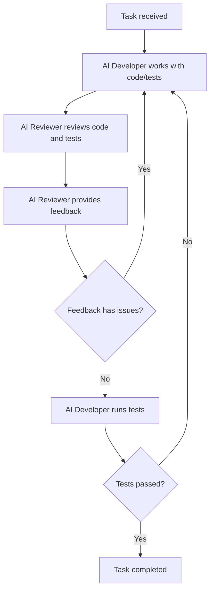

# Do Task - Multi-Agent Collaboration

## Overview
This command orchestrates multiple specialized agents to work together on a complex task, similar to pair programming but adapted for any type of work. Agents take turns contributing their expertise, reviewing each other's work, and iterating until the task is complete.

## Usage
```
/do-task <agent1,agent2,...> <task_description>
```

## Examples
```
/do-task general-purpose,system-architect-crypto Design and implement a secure messaging system
/do-task git-flow-automation,general-purpose Refactor the authentication module and prepare a release
/do-task system-architect-crypto,general-purpose Review and optimize the cryptographic architecture
```

## Process

1. **Task Analysis Phase**
   - First agent analyzes the task and creates an initial plan
   - Identifies key components and dependencies
   - Establishes success criteria

2. **Collaborative Work Loop**
   - Each agent contributes based on their specialty
   - Agents review and build upon previous work
   - Continue until consensus that task is complete

3. **Completion Criteria**
   - All agents agree the task is done
   - Success criteria are met
   - No critical issues remain

## Agent Coordination

The agents work in rounds:
- **Round 1**: Initial analysis and planning
- **Round 2+**: Implementation/execution with peer review
- **Final Round**: Validation and cleanup

Each agent can:
- Build on previous agent's work
- Suggest improvements or corrections
- Request clarification or additional work
- Declare task complete

## Best Practices

1. **Choose complementary agents** - Select agents whose skills complement each other
2. **Clear task definition** - Provide specific, measurable goals
3. **Let agents iterate** - Allow multiple rounds for complex tasks
4. **Trust the process** - Agents will coordinate naturally
5. **Dynamic task management** - Agents use TodoWrite to:
   - Maintain a shared task list throughout collaboration
   - Add new todo items as they discover additional work
   - Track progress across all todos (original and newly added)
   - Continue iterating until all todos are complete

## How It Works

The command orchestrates a multi-agent collaboration through these phases:

### Phase 1: Task Analysis
The first agent analyzes the task and creates an initial plan, establishing:
- Clear understanding of requirements
- Success criteria
- Initial approach
- Division of responsibilities

### Phase 2: Collaborative Work Loop
Agents work in rounds, each:
- Reviewing previous contributions
- Adding their specialized expertise
- Suggesting improvements
- Building on others' work
- **Dynamically expanding the todo list** when discovering additional subtasks

**Important**: Agents maintain task progress using TodoWrite tool throughout the collaboration:
- Create initial todo items during planning phase
- Mark items as in_progress when starting work
- Mark items as completed when done
- **Add new todo items dynamically** as they discover additional work needed
- Continue the loop until all todos (including newly added ones) are complete

### Phase 3: Consensus & Completion
When an agent believes the task is complete:
- All todos (original and dynamically added) must be marked complete
- They declare "TASK COMPLETE"
- Other agents review and confirm
- Consensus required from all agents
- Maximum 100 rounds to prevent infinite loops

### Example Flow Diagram



### Coordination Protocol
Each agent receives context including:
- Original task description
- All previous work from all agents
- Current round number
- List of participating agents
- Current todo list status (including dynamically added items)

Agents communicate through:
- Structured work products
- Clear status declarations
- Consensus confirmations
- Improvement suggestions
- Todo list updates:
  - Marking items as in_progress/complete
  - **Adding new todo items when discovering additional work**
  - Tracking overall progress across all todos

## Advanced Usage

### Specialized Team Combinations

**Architecture & Implementation**:
```
/do-task system-architect-crypto,general-purpose Design secure API architecture and implement core endpoints
```

**Review & Refactor**:
```
/do-task general-purpose,git-flow-automation Review code quality, refactor, and prepare release
```

**Research & Document**:
```
/do-task general-purpose,system-architect-crypto Research best practices and document system design
```

### Task Templates

**Security Review**:
```
/do-task system-architect-crypto,general-purpose Perform security review of authentication system, identify vulnerabilities, and implement fixes
```

**Performance Optimization**:
```
/do-task general-purpose,system-architect-crypto Profile application, identify bottlenecks, and optimize critical paths
```

**Architecture Evolution**:
```
/do-task system-architect-crypto,general-purpose Evolve architecture from monolith to microservices, maintaining backward compatibility
```

## Limitations

1. **Max 100 rounds** - Prevents infinite loops
2. **Agents must reach consensus** - All agents must agree task is complete
3. **Sequential execution** - Agents work in turns, not parallel
4. **Context limits** - Very large tasks may exceed context

## Tips

1. **Start with 2-3 agents** - More agents increase coordination overhead
2. **Be specific** - Vague tasks lead to unfocused work
3. **Include success criteria** - Help agents know when they're done
4. **Mix specialties** - Architect + implementer works well
5. **Trust iteration** - Let agents refine through multiple rounds

## Error Handling

The command will:
- Validate agent names exist
- Ensure task description is provided
- Prevent infinite loops with round limit
- Require consensus for completion
- Provide clear status updates

## Output

The command returns:
- Task description and agents involved
- Number of rounds completed
- Final status (complete or max rounds)
- Summary of final outcome
- Complete work history available on request