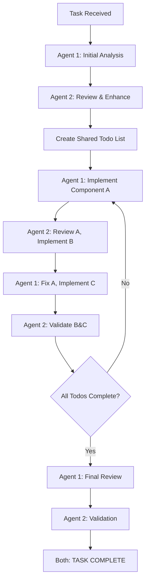

# Do Task - Multi-Agent Collaboration

## Overview
This command orchestrates multiple specialized agents to work together on a complex task, similar to pair programming but adapted for any type of work. Agents take turns contributing their expertise, reviewing each other's work, and iterating until the task is complete.

## Usage
```
/do-task <agent1,agent2,...> <task_description>
```

## Examples
```
/do-task general-purpose,system-architect-crypto Design and implement a secure messaging system
/do-task git-flow-automation,general-purpose Refactor the authentication module and prepare a release
/do-task system-architect-crypto,general-purpose Review and optimize the cryptographic architecture
```

## Process

1. **Task Analysis Phase**
   - First agent analyzes the task and creates an initial plan
   - Identifies key components and dependencies
   - Establishes success criteria

2. **Collaborative Work Loop**
   - Each agent contributes based on their specialty
   - Agents review and build upon previous work
   - Continue until consensus that task is complete

3. **Completion Criteria**
   - **Every todo item has mutual agreement from both agents**
   - All agents agree the overall task is done
   - Success criteria are met
   - No critical issues remain
   - No todo can be marked complete without explicit agreement from both agents

## Agent Coordination - Explicit Task Division

The agents work in clearly defined rounds with specific responsibilities:

### Round-by-Round Coordination

**Round 1: Task Analysis & Planning**
- **Agent 1** analyzes the task, breaks it down into components, creates initial todo list
- **Agent 2** reviews Agent 1's analysis, adds missing components, refines todo list
- **Both agents** establish clear success criteria and task boundaries

**Round 2+: Alternating Implementation & Review**
- **Agent 1** implements specific components from todo list, marks items in_progress, proposes completion
- **Agent 2** reviews Agent 1's work, agrees/disagrees on completion, implements different components
- **Agent 1** incorporates Agent 2's feedback, fixes issues if needed, continues with next todo items
- **Agent 2** validates changes, confirms completion when satisfied, adds new todos if gaps discovered
- **Items only marked complete when BOTH agents explicitly agree**
- **Continue alternating** until all todos have mutual agreement

**Final Round: Validation & Sign-off**
- **Agent 1** performs final review of all completed work
- **Agent 2** validates against success criteria
- **Both agents** must explicitly agree: "TASK COMPLETE"

### Specific Agent Responsibilities

**Agent 1 (Primary Implementer)**:
- Creates initial plan and todo list
- Implements core functionality
- **Validates work against task description**
- **Ensures compliance with architecture docs**
- Responds to Agent 2's feedback
- Ensures code quality and tests
- Performs final integration

**Agent 2 (Reviewer/Secondary Implementer)**:
- Reviews and validates Agent 1's work
- **Cross-checks against original requirements**
- **Verifies architecture compliance (when provided)**
- Identifies gaps and edge cases
- Implements complementary features
- Ensures requirements are met
- Validates final deliverable against relevant documentation

## Mutual Agreement Rules

### Todo Completion Requirements
1. **No Unilateral Completion**: An agent CANNOT mark a todo as complete on their own
2. **Explicit Agreement Required**: Both agents must explicitly state agreement
3. **Disagreement = More Work**: If either agent disagrees, work continues on that item
4. **Clear Agreement Language**: Use "I AGREE todo #X is complete" for clarity

### Agreement Process
- **Proposing Completion**: "I believe todo #X is complete because [reasons]"
- **Agreeing**: "I AGREE todo #X is complete" 
- **Disagreeing**: "Todo #X is NOT complete, needs [specific fixes]"
- **After Fixes**: "Fixed [issues]. Requesting agreement on todo #X"

### Validation Requirements
**Agents MUST always validate work against:**
1. **Original Task Description**: Does the work fulfill what was requested?
2. **Architecture Documentation (when provided)**: Does it follow the documented patterns and requirements?
3. **Success Criteria**: Does it meet all defined success metrics?
4. **Technical Standards**: Does it follow best practices and coding standards?
5. **Any other relevant documentation mentioned in the task**

### Task Cannot End Until:
- Every single todo has mutual agreement
- Both agents state "TASK COMPLETE"
- No todos remain in "in_progress" state
- All work validated against task description and relevant documentation

## Best Practices

1. **Choose complementary agents** - Select agents whose skills complement each other
2. **Clear task definition** - Provide specific, measurable goals
3. **Let agents iterate** - Allow multiple rounds for complex tasks
4. **Trust the process** - Agents will coordinate naturally
5. **Enforce mutual agreement** - No todo is done until both agents agree
6. **Dynamic task management** - Agents use TodoWrite to:
   - Maintain a shared task list throughout collaboration
   - Add new todo items as they discover additional work
   - Track progress with mutual agreement
   - Continue iterating until all todos have consensus

## How It Works - Explicit Agent Actions

The command orchestrates a multi-agent collaboration through these phases:

### Phase 1: Task Analysis (Rounds 1-2)

**Round 1 - Agent 1 says:**
"I'll analyze this task and break it down. The main components are: [lists components]. Creating initial todo list with [X] items. My plan is to [describes approach]."

**Round 2 - Agent 2 says:**
"Reviewing Agent 1's analysis. I agree with components A, B, C. However, we also need to consider [additional aspects]. Adding todos for [missing items]. Let me refine the success criteria to include [specific metrics]."

### Phase 2: Collaborative Work Loop (Rounds 3+)

**Round N - Agent 1 says:**
"Working on todo item #3: [specific task]. I'm implementing [specific solution]. Code/content created: [shows work]. I believe todo #3 is ready for review. Moving to todo #5."

**Round N+1 - Agent 2 says:**
"Reviewing Agent 1's implementation of #3. Checking against task description and architecture docs... Found issues: [lists problems]. The implementation doesn't follow the architecture pattern specified in section X. Todo #3 is NOT complete yet - needs [improvement]. I'll work on todo #4 while you fix #3. Also discovered we need [new requirement] - adding as todo #8."

**Round N+2 - Agent 1 says:**
"Fixed the issues in todo #3: [shows fixes]. Now follows architecture pattern from section X. Validated against original task requirements. Requesting your approval to mark #3 complete. Meanwhile implementing todo #5: [shows work]. Tests added: [test details]."

**Round N+3 - Agent 2 says:**
"Reviewing todo #3 fixes - validating against architecture doc... Confirmed it now matches the documented pattern. Cross-checked with task description - all requirements met. I AGREE todo #3 is complete. Let's mark it done. For todo #5, checking against requirements... This violates the constraint mentioned in the task description about [specific concern]. Not ready to mark complete. Todo #4 which I implemented follows all architecture guidelines and is ready for your review."

**Round N+4 - Agent 1 says:**
"Reviewing your todo #4 - excellent work. I AGREE todo #4 is complete. Fixing todo #5 based on your feedback: [shows fix]. This should address your concern."

**Round N+5 - Agent 2 says:**
"Todo #5 fix confirmed. I AGREE todo #5 is complete. Current status: 3 of 8 todos mutually agreed as complete. Let's continue with remaining items."

**Important**: Agents maintain task progress using TodoWrite tool throughout the collaboration:
- Create initial todo items during planning phase
- Mark items as in_progress when starting work
- **Items can ONLY be marked complete when BOTH agents explicitly agree**
- **If one agent disagrees, the item remains in_progress and work continues**
- **Add new todo items dynamically** as they discover additional work needed
- Continue the loop until all todos have mutual agreement for completion

**Mutual Agreement Protocol**:
- Agent 1: "I believe todo #X is complete"
- Agent 2: "I AGREE todo #X is complete" → Mark as complete
- OR
- Agent 2: "Todo #X needs more work: [specific issues]" → Remains in_progress

### Phase 3: Consensus & Completion

**Final Round - Agent 1 says:**
"All todos are now complete. Let me validate against original task description: [checks each requirement]. Verifying architecture compliance: [confirms patterns followed]. Running final tests: [test results]. Everything passes. I believe we've met all success criteria. TASK COMPLETE."

**Final Round - Agent 2 says:**
"Performing final validation: 
- ✓ Original task description: All requirements fulfilled
- ✓ Relevant documentation: Follows provided architecture/design docs
- ✓ Success criteria: All metrics achieved
- ✓ Technical standards: Code quality and tests meet standards
- ✓ All todos have mutual agreement
I agree the task is complete. TASK COMPLETE."

### Clear Handoff Protocol

Each agent explicitly states:
1. **What they just did**: "I implemented X using approach Y"
2. **What they're handing off**: "Agent 2, please review my implementation of X"
3. **What they expect next**: "After your review, we should tackle todo #5"
4. **Current todo status**: "Todos complete: 3/7, In progress: #4"

Example handoff:
- **Agent 1**: "I've completed the authentication service (todo #2). Tests are passing. Agent 2, please review the security aspects while I start on the UI components (todo #3)."
- **Agent 2**: "Reviewing your auth service now. Security looks good but needs rate limiting. I'll add that (new todo #8) while you continue with UI."

### Detailed Coordination Examples

#### Example 1: Architecture Design Task
```
/do-task system-architect-crypto,general-purpose Design secure login system
```

**Round 1:**
- **Architect (Agent 1)**: "I'll design the authentication flow with these components: KeyDerivation, SessionState, LoginAdapter. Creating todos: 1) Crypto specs, 2) API design, 3) Security docs"
- **Developer (Agent 2)**: "I see gaps. Adding todos: 4) Error handling, 5) UI components, 6) Integration tests. Starting on todo #5."

**Round 2:**
- **Architect (Agent 1)**: "Completed todo #1: PBKDF2 with 100k iterations, ECDSA P-256. I believe it's ready."
- **Developer (Agent 2)**: "Reviewing todo #1 - need to specify memory cleanup. NOT complete yet. My todo #5 (UI) is ready for your review."

**Round 3:**
- **Architect (Agent 1)**: "Todo #5 needs loading states. NOT complete. Fixed todo #1 with memory cleanup specs."
- **Developer (Agent 2)**: "Todo #1 now complete - I AGREE. Fixed todo #5 with loading states."

**Round 4:**
- **Architect (Agent 1)**: "I AGREE todo #5 is complete. Working on todo #2 (API design)..."
- **Developer (Agent 2)**: "Good. Starting todo #6 (tests) while you finish #2..."

#### Example 2: Code Review & Refactor Task
```
/do-task general-purpose,git-flow-automation Review and refactor authentication module
```

**Round 1:**
- **Developer (Agent 1)**: "Analyzing code structure. Found: 3 code smells, 2 performance issues, missing tests..."
- **Git Expert (Agent 2)**: "Confirming issues. Creating feature branch 'refactor/auth-cleanup'. Adding todos for each issue..."

**Round 2:**
- **Developer (Agent 1)**: "Refactoring authentication service, extracting interfaces, adding unit tests..."
- **Git Expert (Agent 2)**: "Reviewing changes, ensuring atomic commits. Implementing pre-commit hooks..."

**Round 3:**
- **Developer (Agent 1)**: "All refactoring complete, tests passing, coverage at 95%..."
- **Git Expert (Agent 2)**: "Creating release branch, updating version, preparing changelog. TASK COMPLETE"

### Example Flow Diagram



### Coordination Protocol
Each agent receives context including:
- Original task description
- All previous work from all agents
- Current round number
- List of participating agents
- Current todo list status (including dynamically added items)

Agents communicate through:
- Structured work products
- Clear status declarations
- Consensus confirmations
- Improvement suggestions
- Todo list updates:
  - Marking items as in_progress when starting work
  - Proposing items for completion, requiring mutual agreement
  - Only marking complete after both agents explicitly agree
  - **Adding new todo items when discovering additional work**
  - Tracking overall progress across all todos with consensus

## Advanced Usage

### Specialized Team Combinations with Explicit Coordination

#### Architecture & Implementation Team
```
/do-task system-architect-crypto,general-purpose Design secure API architecture and implement core endpoints
```
**Agent 1 (Architect)** designs system architecture, defines security requirements, creates API contracts
**Agent 2 (Developer)** implements endpoints, writes tests, handles error cases, creates documentation

#### Review & Refactor Team
```
/do-task general-purpose,git-flow-automation Review code quality, refactor, and prepare release
```
**Agent 1 (Developer)** identifies code issues, performs refactoring, writes/updates tests
**Agent 2 (Git Expert)** manages branches, creates atomic commits, prepares release, updates changelog

#### Research & Document Team
```
/do-task general-purpose,system-architect-crypto Research best practices and document system design
```
**Agent 1 (Researcher)** gathers information, analyzes options, compares approaches
**Agent 2 (Architect)** evaluates technical merit, designs solution, creates architecture docs

### Specific Coordination Patterns

#### Pattern 1: Designer-Builder
**Agent 1** creates specifications → **Agent 2** implements → **Agent 1** validates → **Agent 2** refines

#### Pattern 2: Peer Review
**Agent 1** implements feature A → **Agent 2** reviews A, implements B → **Agent 1** reviews B, implements C

#### Pattern 3: Specialist Consultation
**Agent 1** builds main solution → **Agent 2** adds specialized expertise → **Agent 1** integrates feedback

#### Pattern 4: Quality Gate
**Agent 1** creates solution → **Agent 2** tests/validates → **Agent 1** fixes issues → **Agent 2** approves

### Task Templates

**Security Review**:
```
/do-task system-architect-crypto,general-purpose Perform security review of authentication system, identify vulnerabilities, and implement fixes
```

**Performance Optimization**:
```
/do-task general-purpose,system-architect-crypto Profile application, identify bottlenecks, and optimize critical paths
```

**Architecture Evolution**:
```
/do-task system-architect-crypto,general-purpose Evolve architecture from monolith to microservices, maintaining backward compatibility
```

## Limitations

1. **Max 100 rounds** - Prevents infinite loops
2. **Agents must reach consensus** - All agents must agree task is complete
3. **Sequential execution** - Agents work in turns, not parallel
4. **Context limits** - Very large tasks may exceed context

## Tips

1. **Start with 2-3 agents** - More agents increase coordination overhead
2. **Be specific** - Vague tasks lead to unfocused work
3. **Include success criteria** - Help agents know when they're done
4. **Mix specialties** - Architect + implementer works well
5. **Trust iteration** - Let agents refine through multiple rounds

## Error Handling

The command will:
- Validate agent names exist
- Ensure task description is provided
- Prevent infinite loops with round limit
- Require consensus for completion
- Provide clear status updates

## Output

The command returns:
- Task description and agents involved
- Number of rounds completed
- Final status (complete or max rounds)
- Summary of final outcome
- Complete work history available on request