[🏠 Home](../../../README.md) | [📚 Documentation](../../index.md)

---

# 📝 Documentation Generation Prompts

**Author:** Alex Fedin | [O2.services](https://O2.services) | [LinkedIn](https://linkedin.com/in/alex-fedin)

## 📑 Table of Contents
1. [Master Architecture Documentation Prompt](#master-architecture-documentation-prompt)
2. [Component-Specific Prompts](#component-specific-prompts)
3. [Diagram Generation Prompts](#diagram-generation-prompts)
4. [Robustness Diagram Prompts](#robustness-diagram-prompts)
5. [API Documentation Prompts](#api-documentation-prompts)
6. [Security Documentation Prompts](#security-documentation-prompts)
7. [Performance Analysis Prompts](#performance-analysis-prompts)

---

## Master Architecture Documentation Prompt

### 🎯 The Ultimate Codebase Analysis & Documentation Prompt

```markdown
Analyze this codebase and create comprehensive architectural documentation. Your analysis should be thorough, technical, and actionable. Follow this structured approach:

## 1. CODEBASE DISCOVERY & ANALYSIS

### Initial Reconnaissance
- Scan all directories and files to understand project structure
- Identify programming languages, frameworks, and tech stack
- Locate configuration files (package.json, requirements.txt, Cargo.toml, etc.)
- Find and analyze README files, documentation folders
- Identify entry points (main.js, index.ts, app.py, main.go, etc.)
- Detect build systems and deployment configurations
- Review .gitignore to understand what's excluded

### Deep Code Analysis
- Map all dependencies and their versions
- Analyze code organization (layers, modules, components)
- Detect architectural patterns (monolith, microservices, serverless, event-driven)
- Find all external integrations and APIs
- Identify data storage solutions (databases, caches, queues)
- Analyze authentication and authorization mechanisms
- Review error handling and logging strategies
- Examine testing approach and coverage

### Ontological Model Analysis
Identify and document the knowledge representation in the codebase:

**Domain Ontology Discovery:**
- **Entity Identification**: Find all domain concepts and their hierarchies
  - Core business entities (Customer, Product, Order)
  - Supporting entities (Address, Payment, Shipment)
  - Meta-entities (Audit, Version, History)
  - Abstract concepts (Policy, Rule, Strategy)

- **Relationship Mapping**: Document all entity relationships
  - Inheritance hierarchies (is-a relationships)
  - Composition relationships (has-a, part-of)
  - Association relationships (uses, references)
  - Dependency relationships (depends-on, requires)
  - Temporal relationships (precedes, follows)

- **Property Analysis**: Identify attributes and characteristics
  - Intrinsic properties (immutable characteristics)
  - Extrinsic properties (contextual attributes)
  - Derived properties (calculated values)
  - Metadata properties (timestamps, versions)

- **Constraint Rules**: Document business rules and invariants
  - Cardinality constraints (one-to-many, many-to-many)
  - Existence dependencies (must-have, optional)
  - Value constraints (ranges, enumerations)
  - Behavioral constraints (state transitions)

**Knowledge Graph Construction:**
- Map entities to nodes
- Map relationships to edges
- Identify graph patterns (cycles, hierarchies, clusters)
- Document inference rules
- Find implicit relationships

**Semantic Layer Analysis:**
- **Vocabulary Consistency**: Check naming coherence
  - Synonym detection (same concept, different names)
  - Homonym detection (same name, different concepts)
  - Ubiquitous language adherence (DDD)
  
- **Taxonomic Structure**: Analyze classification systems
  - Category hierarchies
  - Type systems
  - Classification schemes
  - Tagging systems

**Ontological Patterns:**
- **Upper Ontology Patterns**:
  - Thing/Object/Entity pattern
  - Process/Event/Activity pattern
  - Role/Function pattern
  - Location/Space pattern
  - Time/Temporal pattern

- **Domain Patterns**:
  - Product catalog ontology
  - Organization structure ontology
  - Document/Content ontology
  - Workflow/Process ontology
  - Financial/Transaction ontology

**Reasoning Capabilities:**
- Identify inference opportunities
- Document derivation rules
- Find transitive relationships
- Detect contradiction potential
- Evaluate completeness

**Generate Ontology Diagrams:**
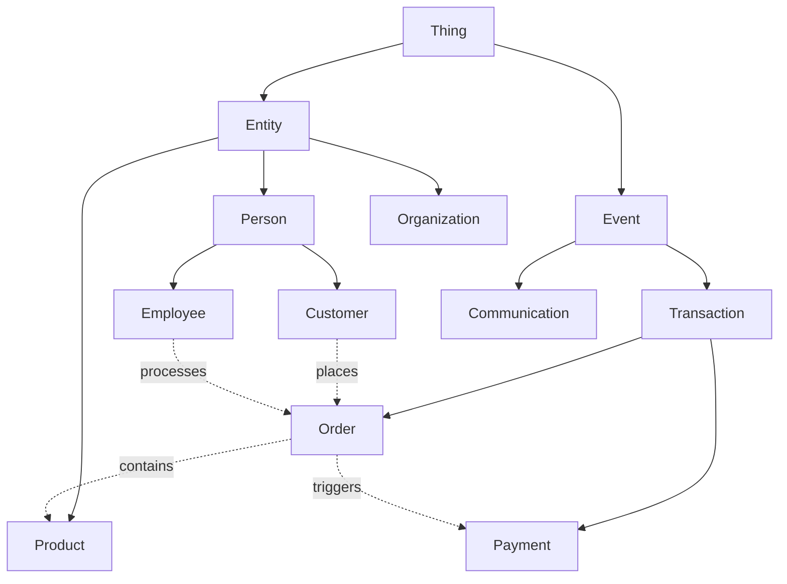

**Ontology Quality Metrics:**
- Completeness (coverage of domain)
- Consistency (no contradictions)
- Conciseness (no redundancy)
- Clarity (unambiguous definitions)
- Computability (machine-processable)

### Software Engineering Principles Analysis
Evaluate adherence to fundamental principles and methodologies:

**SOLID Principles:**
- **Single Responsibility Principle (SRP)**: Each class/module has one reason to change
  - Identify classes with multiple responsibilities
  - Find God objects and split opportunities
  - Measure cohesion metrics
- **Open/Closed Principle (OCP)**: Open for extension, closed for modification
  - Find hardcoded switch statements that should be polymorphic
  - Identify extension points and plugin architectures
  - Evaluate abstraction levels
- **Liskov Substitution Principle (LSP)**: Subtypes must be substitutable
  - Find inheritance violations
  - Identify problematic type checks
  - Verify behavioral compatibility
- **Interface Segregation Principle (ISP)**: No client forced to depend on unused methods
  - Find fat interfaces
  - Identify role-based interface opportunities
  - Measure interface cohesion
- **Dependency Inversion Principle (DIP)**: Depend on abstractions, not concretions
  - Identify direct dependencies on concrete classes
  - Find missing abstractions
  - Evaluate dependency injection usage

**Development Principles:**
- **DRY (Don't Repeat Yourself)**:
  - Find code duplication (exact and structural)
  - Identify knowledge duplication
  - Locate repeated business rules
  - Measure duplication percentage
- **KISS (Keep It Simple, Stupid)**:
  - Identify over-engineered solutions
  - Find unnecessary complexity
  - Measure cyclomatic complexity
  - Locate premature abstractions
- **YAGNI (You Aren't Gonna Need It)**:
  - Find unused code and features
  - Identify speculative generality
  - Locate over-flexible designs
  - Find dead code paths

**Domain-Driven Design (DDD) Analysis:**
- **Strategic Design**:
  - Identify Bounded Contexts and their boundaries
  - Find Context Maps and integration patterns
  - Locate Ubiquitous Language usage
  - Analyze Subdomain types (Core, Supporting, Generic)
- **Tactical Design**:
  - **Entities**: Objects with identity lifecycle
  - **Value Objects**: Immutable domain concepts
  - **Aggregates**: Consistency boundaries and roots
  - **Domain Services**: Cross-entity operations
  - **Domain Events**: Important business occurrences
  - **Repositories**: Aggregate persistence abstractions
  - **Factories**: Complex object creation
  - **Specifications**: Business rules encapsulation
- **Domain Model Quality**:
  - **Rich Domain Model**: Business logic in domain objects
    - Behavior-rich entities
    - Encapsulated business rules
    - Domain-specific methods
  - **Anemic Domain Model** (Anti-pattern):
    - Data-only objects
    - Logic in services/managers
    - Missing domain behavior
  - Measure behavior-to-data ratio
  - Identify transaction script patterns
  - Find domain logic leakage

**TRIZ Principles for Software:**
- **Contradiction Resolution**:
  - Identify technical contradictions (performance vs. flexibility)
  - Find physical contradictions (same element, different requirements)
  - Document resolution patterns used
- **Ideality**:
  - "The ideal code is no code"
  - Find opportunities to eliminate components
  - Identify self-service patterns
  - Locate zero-maintenance solutions
- **System Evolution**:
  - Assess current evolution stage
  - Identify next evolution steps
  - Find patterns: Monolith → Modular → Services → Serverless
- **Innovation Principles Applied**:
  - Segmentation (microservices, modules)
  - Asymmetry (read/write splitting, CQRS)
  - Dynamics (feature flags, hot-reload)
  - Self-service (auto-scaling, self-healing)
  - Nesting (decorators, middleware chains)

**Emergent Design Practices:**
- **Evolutionary Architecture**:
  - Identify refactoring patterns
  - Find incremental design improvements
  - Locate design pivot points
  - Measure architectural fitness functions
- **Test-Driven Development (TDD)**:
  - Test coverage and quality
  - Test-first evidence
  - Red-Green-Refactor cycles
  - Test as documentation
- **Continuous Refactoring**:
  - Refactoring frequency
  - Code smell remediation
  - Technical debt management
  - Boy Scout Rule adherence
- **Simple Design Rules** (Kent Beck):
  1. Passes all tests
  2. Reveals intention
  3. No duplication
  4. Minimal elements

**Clean Architecture Principles:**
- **Dependency Rule**: Dependencies point inward
- **Layer Independence**: UI, database, framework agnostic
- **Testability**: Business logic testable without externals
- **Plugin Architecture**: Swappable components
- Find violations and coupling issues

**Hexagonal Architecture (Ports & Adapters):**
- Identify ports (interfaces)
- Find adapters (implementations)
- Evaluate external dependency isolation
- Measure core domain purity

**Additional Principles:**
- **Law of Demeter**: Don't talk to strangers
  - Find chain calls (a.b().c().d())
  - Identify inappropriate intimacy
- **Composition over Inheritance**:
  - Find deep inheritance hierarchies
  - Identify composition opportunities
- **Convention over Configuration**:
  - Evaluate framework usage
  - Find boilerplate reduction opportunities
- **Principle of Least Astonishment**:
  - Identify surprising behavior
  - Find naming inconsistencies
- **Separation of Concerns**:
  - Evaluate layer separation
  - Find cross-cutting concerns
  - Identify aspect opportunities

### Object-Oriented Design (OOD) Patterns Analysis
Identify and document all design patterns used in the codebase:

**Creational Patterns:**
- **Singleton**: Find single instance classes (database connections, config managers, loggers)
- **Factory Method**: Identify object creation interfaces and concrete factories
- **Abstract Factory**: Find families of related object factories
- **Builder**: Locate complex object construction with step-by-step assembly
- **Prototype**: Find cloneable objects and copy mechanisms
- **Object Pool**: Identify reusable object pools (connection pools, thread pools)
- **Dependency Injection**: Find DI containers and injection patterns

**Structural Patterns:**
- **Adapter**: Find interface conversions between incompatible classes
- **Bridge**: Identify abstraction-implementation separation
- **Composite**: Find tree structures with leaf-composite hierarchies
- **Decorator**: Locate dynamic behavior additions to objects
- **Facade**: Find simplified interfaces to complex subsystems
- **Flyweight**: Identify shared object optimization for memory efficiency
- **Proxy**: Find placeholder/surrogate objects (lazy loading, caching, access control)

**Behavioral Patterns:**
- **Chain of Responsibility**: Find request handling chains
- **Command**: Identify encapsulated requests as objects
- **Interpreter**: Find domain-specific language implementations
- **Iterator**: Locate sequential access patterns for collections
- **Mediator**: Find centralized complex communications
- **Memento**: Identify state capture and restoration
- **Observer**: Find publish-subscribe implementations
- **State**: Locate state-dependent behavior changes
- **Strategy**: Find algorithm family encapsulations
- **Template Method**: Identify algorithm skeletons with overridable steps
- **Visitor**: Find operations on object structures without changing classes

**Enterprise Patterns:**
- **Repository**: Data access abstraction layers
- **Unit of Work**: Transaction coordination patterns
- **Data Mapper**: Object-database mapping implementations
- **Service Layer**: Business logic organization
- **Domain Model**: Business domain representations
- **Value Object**: Immutable domain concepts
- **Data Transfer Object (DTO)**: Data carriers between layers
- **Model-View-Controller (MVC)**: UI separation patterns
- **Model-View-ViewModel (MVVM)**: Data binding patterns
- **Model-View-Presenter (MVP)**: Presentation logic patterns

**Concurrent Patterns:**
- **Active Object**: Asynchronous method invocation
- **Monitor Object**: Synchronization patterns
- **Producer-Consumer**: Queue-based work distribution
- **Read-Write Lock**: Concurrent read, exclusive write patterns
- **Thread Pool**: Worker thread management

**Anti-Patterns to Identify:**
- **God Object**: Classes doing too much
- **Spaghetti Code**: Tangled control flow
- **Copy-Paste Programming**: Duplicated code blocks
- **Magic Numbers/Strings**: Hardcoded values
- **Circular Dependencies**: Bidirectional dependencies
- **Anemic Domain Model**: Logic-less data models
- **Premature Optimization**: Unnecessary complexity
- **Golden Hammer**: Overuse of familiar patterns
- **Lava Flow**: Dead code accumulation
- **Boat Anchor**: Unused retained code

For each pattern found, document:
- Location in codebase (file:line)
- Implementation quality (proper, partial, misused)
- Refactoring opportunities
- Pattern interactions and combinations
- Performance implications
- Maintainability impact

## 2. SYSTEM ARCHITECTURE DOCUMENTATION

Create detailed documentation including:

### High-Level Architecture
- System overview with context diagram
- Architecture style and rationale
- Key architectural decisions (ADRs)
- System boundaries and interfaces
- Deployment architecture
- Technology stack visualization

### Component Architecture
For each major component, document:
- Purpose and responsibilities
- Input/output interfaces
- Dependencies (internal and external)
- Data flow and transformations
- State management
- Configuration requirements
- Performance characteristics
- Scaling considerations

### Data Architecture
- Data models and schemas
- Data flow diagrams
- Storage solutions and rationale
- Data consistency patterns
- Caching strategies
- Data migration approach
- Backup and recovery procedures

### Integration Architecture
- External system integrations
- API contracts and specifications
- Message formats and protocols
- Event-driven communication patterns
- Webhook implementations
- Third-party service dependencies
- Integration error handling

## 3. TECHNICAL DOCUMENTATION

### Interface & Communication Documentation

**Auto-Discovery Approach:**
Scan the codebase to identify ALL communication interfaces by looking for:

1. **Interface Detection Patterns:**
   - Network listeners (ports, sockets, endpoints)
   - Serialization/deserialization code
   - Protocol handlers and parsers
   - Message routing and dispatching
   - Client/server initialization code
   - Configuration files mentioning protocols
   - Dependencies that indicate communication libraries

2. **Generic Interface Analysis Framework:**
   For EACH discovered interface, regardless of technology:
   
   **Communication Model:**
   - Synchronous vs Asynchronous
   - Request-Response vs Fire-and-Forget vs Streaming
   - Point-to-Point vs Publish-Subscribe vs Broadcast
   - Stateful vs Stateless
   - Connection-oriented vs Connectionless
   
   **Data Contract:**
   - Message format (binary, text, structured)
   - Schema definition (strict, flexible, schema-less)
   - Serialization method (JSON, XML, Protobuf, custom)
   - Versioning strategy
   - Backward/forward compatibility
   
   **Transport Characteristics:**
   - Network protocol (TCP, UDP, WebSocket, etc.)
   - Local protocol (IPC, shared memory, pipes)
   - Reliability guarantees
   - Ordering guarantees
   - Delivery semantics (at-most-once, at-least-once, exactly-once)
   
   **Interaction Patterns:**
   - Operations/methods exposed
   - Parameter passing conventions
   - Return value/response handling
   - Error propagation mechanism
   - Timeout and retry behavior
   
   **Quality Attributes:**
   - Authentication mechanism
   - Authorization model
   - Encryption (transport, message)
   - Rate limiting/throttling
   - Performance characteristics
   - Scalability considerations

3. **Universal Documentation Template:**
   ```yaml
   interface:
     discovered_type: [auto-detected protocol/framework]
     location: [file:line where defined]
     
     communication:
       model: [sync/async, pattern]
       transport: [protocol, guarantees]
       
     contract:
       format: [serialization type]
       schema: [location or inline]
       versioning: [strategy]
       
     operations:
       - name: [operation]
         input: [schema/type]
         output: [schema/type]
         errors: [possible errors]
         
     security:
       auth: [method]
       encryption: [type]
       
     usage:
       examples: [client code]
       sdk: [available libraries]
   ```

4. **Automatic Classification:**
   Based on discovered patterns, classify into:
   - External APIs (public-facing)
   - Internal APIs (service-to-service)
   - System interfaces (OS/hardware)
   - User interfaces (CLI, GUI)
   - Data interfaces (files, databases)
   - Event interfaces (queues, streams)

### Database Documentation
- Schema definitions with relationships
- Indexes and optimization strategies
- Stored procedures/functions
- Migration scripts and versioning
- Query performance considerations
- Backup and restore procedures

### Security Documentation
- Authentication mechanisms
- Authorization models and RBAC
- Encryption (at rest and in transit)
- Secret management
- Security headers and CSP
- Input validation and sanitization
- OWASP compliance status
- Vulnerability management process

### Infrastructure Documentation
- Cloud services and configurations
- Container orchestration setup
- CI/CD pipeline architecture
- Monitoring and alerting setup
- Log aggregation strategy
- Disaster recovery plan
- Cost optimization measures

## 4. OPERATIONAL DOCUMENTATION

### Deployment & DevOps
- Build process and scripts
- Deployment procedures (dev/staging/prod)
- Environment configurations
- Feature flags and toggles
- Rollback procedures
- Health check endpoints
- Smoke test procedures

### Performance & Scalability
- Performance benchmarks and SLAs
- Bottleneck analysis
- Caching strategies and TTLs
- Load balancing configuration
- Auto-scaling policies
- Resource optimization
- Performance monitoring metrics

### Monitoring & Observability
- Key metrics and KPIs
- Logging standards and levels
- Distributed tracing setup
- Alert thresholds and escalation
- Dashboard configurations
- Synthetic monitoring setup
- APM integration

## 5. DIAGRAMS TO GENERATE

Create these diagrams using Mermaid (GitHub native support - NO PlantUML):

### Architecture Diagrams
- C4 Model diagrams (Context, Container, Component, Code)
- System landscape diagram
- Deployment diagram with infrastructure
- Network topology diagram
- Data flow diagram (DFD)
- Sequence diagrams for critical flows (use `actor` for users)
- State diagrams for complex processes
- Entity-Relationship Diagram (ERD)
- **Robustness diagrams** (ICONIX process - boundary/control/entity objects)

### Operational Diagrams
- CI/CD pipeline flow
- Disaster recovery flow
- Incident response workflow
- Release process diagram
- Rollback procedure flowchart

### Security Diagrams
- Authentication flow
- Authorization decision tree
- Threat model diagram
- Security zones and boundaries

## 6. QUALITY ASSESSMENT

### Code Quality Metrics
- Cyclomatic complexity analysis
- Code duplication percentage (DRY violations)
- Test coverage metrics
- Technical debt assessment
- Dependency vulnerability scan
- License compliance check
- Code smell detection
- SOLID principles adherence score
- DDD implementation maturity
- Rich vs Anemic domain model ratio
- Ontological consistency score
- Knowledge graph completeness
- Semantic coherence metrics

### Architecture Quality Attributes
- Scalability assessment (horizontal/vertical)
- Reliability measures (MTBF, MTTR)
- Maintainability index
- Performance benchmarks
- Security posture score
- Observability maturity level
- Disaster recovery readiness

### Recommendations
- Critical issues requiring immediate attention
- Performance optimization opportunities
- Security hardening recommendations
- Technical debt prioritization
- Modernization opportunities
- Cost optimization suggestions
- Scalability improvements

## 7. SPECIFIC ANALYSIS AREAS

### Microservices (if applicable)
- Service boundaries and responsibilities
- Inter-service communication patterns
- Service discovery mechanism
- Circuit breaker implementations
- Distributed transaction handling
- Service mesh configuration
- API gateway setup

### Event-Driven Architecture (if applicable)
- Event sources and consumers
- Event schemas and versioning
- Event store implementation
- Event sourcing patterns
- CQRS implementation
- Saga orchestration
- Dead letter queue handling

### Frontend Architecture (if applicable)
- Component hierarchy
- State management pattern
- Routing configuration
- Build optimization
- Bundle splitting strategy
- PWA capabilities
- Accessibility compliance

### Mobile Architecture (if applicable)
- Platform-specific implementations
- Offline-first capabilities
- Push notification architecture
- Deep linking setup
- App update mechanism
- Crash reporting integration
- Analytics implementation

## 8. DOCUMENTATION DELIVERABLES

### Multi-File Documentation Structure

Create a well-organized documentation system with proper navigation:

#### Root Documentation Files
```
/README.md                          # Project overview with links to all docs
/docs/
├── index.md                        # Documentation hub with categorized links
├── QUICKSTART.md                   # 5-minute setup guide
├── CONTRIBUTING.md                 # Development guidelines
└── CHANGELOG.md                    # Version history
```

#### Architecture Documentation
```
/docs/architecture/
├── index.md                        # Architecture overview & navigation
├── SYSTEM_ARCHITECTURE.md          # Complete system design
├── TECHNICAL_DECISIONS.md          # ADRs and design rationale
├── COMPONENT_INTERACTIONS.md       # Detailed component flows
├── DATA_ARCHITECTURE.md            # Data models and flows
├── INTEGRATION_ARCHITECTURE.md     # External integrations
└── SECURITY_ARCHITECTURE.md        # Security design
```

#### API Documentation
```
/docs/api/
├── index.md                        # API documentation hub
├── REST_API.md                     # REST endpoints reference
├── GRAPHQL_SCHEMA.md               # GraphQL schema docs
├── WEBSOCKET_EVENTS.md             # WebSocket event reference
├── AUTHENTICATION.md               # Auth flows and tokens
├── ERROR_CODES.md                  # Error code reference
└── examples/                       # Code examples
    ├── javascript.md
    ├── python.md
    └── curl.md
```

#### Operations Documentation
```
/docs/operations/
├── index.md                        # Operations overview
├── DEPLOYMENT.md                   # Deployment procedures
├── MONITORING.md                   # Monitoring and alerting
├── PERFORMANCE.md                  # Performance tuning
├── TROUBLESHOOTING.md              # Common issues
├── DISASTER_RECOVERY.md            # DR procedures
└── RUNBOOKS.md                     # Operational runbooks
```

#### Development Documentation
```
/docs/development/
├── index.md                        # Developer guide hub
├── SETUP.md                        # Development environment
├── CODING_STANDARDS.md             # Code style and standards
├── TESTING.md                      # Testing strategies
├── PATTERNS.md                     # Design patterns used
├── DEPENDENCIES.md                 # Dependency management
└── TOOLS.md                        # Development tools
```

### Documentation Standards

#### Table of Contents Requirements
Every documentation file MUST include:

```markdown
[🏠 Home](../README.md) | [📚 Documentation](../docs/index.md) | [⬆️ Section](./index.md)

---

# Document Title

**Author:** [Name] | [Company] | [LinkedIn/GitHub]
**Last Updated:** YYYY-MM-DD
**Version:** X.Y.Z

## 📑 Table of Contents
1. [Section 1](#section-1)
   - [Subsection 1.1](#subsection-11)
   - [Subsection 1.2](#subsection-12)
2. [Section 2](#section-2)
3. [Section 3](#section-3)
4. [Related Documents](#related-documents)
5. [References](#references)

---

## Section 1
Content...

### Subsection 1.1
Content...

[⬆️ Back to top](#-table-of-contents)

---

## Related Documents
- [Link to Related Doc 1](./related1.md)
- [Link to Related Doc 2](../other/related2.md)

---

[⬅️ Doc Name](./previous.md) | [⬆️ Section](./index.md) | [➡️ Doc Name](./next.md)
```

#### Navigation Headers and Footers

**Header Template:**
```markdown
[🏠 Home](../README.md) | [📚 Documentation](../docs/index.md) | [⬆️ Section](./index.md)

---
```

**Footer Template:**
```markdown
---

[⬅️ Doc Name](./previous.md) | [⬆️ Section](./index.md) | [➡️ Doc Name](./next.md)
```

#### Index File Requirements
Each directory MUST have an index.md with:

```markdown
[🏠 Home](../README.md) | [📚 Documentation](../index.md)

---

# Section Name

**Purpose:** Brief description of this documentation section

## 📑 Quick Navigation

### 📖 Essential Reading (Start Here)
1. [Document 1](./doc1.md) - Critical concept
2. [Document 2](./doc2.md) - Must understand

### 🔧 How-To Guides
- [Guide 1](./guide1.md) - Step-by-step instructions
- [Guide 2](./guide2.md) - Common tasks

### 📚 Reference
- [Reference 1](./ref1.md) - Detailed specifications
- [Reference 2](./ref2.md) - API documentation

### 🎯 By Topic
- **Topic A:** [Doc1](./doc1.md), [Doc2](./doc2.md)
- **Topic B:** [Doc3](./doc3.md), [Doc4](./doc4.md)

## 📊 Documentation Map
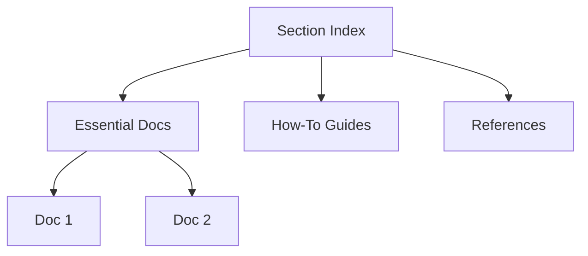

## 🔍 Find What You Need

| Looking for... | Go to... |
|---------------|----------|
| Quick setup | [QUICKSTART.md](./quickstart.md) |
| Architecture overview | [SYSTEM_ARCHITECTURE.md](./architecture.md) |
| API reference | [API.md](./api.md) |
| Troubleshooting | [TROUBLESHOOTING.md](./troubleshooting.md) |

---

[⬆️ Documentation Hub](../index.md) | [➡️ Start: First Doc](./first-doc.md)
```

#### Cross-Linking Best Practices

1. **Use Relative Paths:**
   - Same directory: `[Link](./file.md)`
   - Parent directory: `[Link](../file.md)`
   - Child directory: `[Link](./child/file.md)`

2. **Link Types:**
   - **Inline Links:** For immediate context
   - **Reference Links:** For repeated URLs
   - **See Also Sections:** For related topics
   - **Prerequisites:** Link to required reading

3. **Link Context:**
   ```markdown
   For authentication details, see [Authentication Guide](./auth.md#oauth-flow).
   
   > **Note:** Before proceeding, ensure you've completed the [Setup Guide](./setup.md).
   
   **Related:** 
   - [Security Best Practices](./security.md)
   - [API Authentication](../api/auth.md)
   ```

#### Documentation Metadata
Every document should include:

```markdown
---
title: Document Title
description: Brief description for search/preview
tags: [tag1, tag2, tag3]
audience: [developers, operators, architects]
complexity: [beginner, intermediate, advanced]
reading_time: 10 minutes
prerequisites: 
  - [Prerequisite Doc 1](./prereq1.md)
  - [Prerequisite Doc 2](./prereq2.md)
---
```

#### Search and Discovery

Create a search guide in docs/index.md:

```markdown
## 🔍 Search Guide

### By Technology
- **Docker:** [Deployment](./ops/deployment.md), [Dev Setup](./dev/setup.md)
- **Kubernetes:** [K8s Deploy](./ops/k8s.md), [Scaling](./ops/scaling.md)

### By Task
- **Deploy to Production:** [Deployment Guide](./ops/deployment.md)
- **Fix Performance Issues:** [Performance Guide](./ops/performance.md)

### By Role
- **Developers:** Start with [Dev Guide](./development/index.md)
- **DevOps:** Start with [Ops Guide](./operations/index.md)
- **Architects:** Start with [Architecture](./architecture/index.md)
```

#### Version Control for Docs

Include version information:

```markdown
## 📋 Version History

| Version | Date | Changes | Author |
|---------|------|---------|--------|
| 1.0.0 | 2025-01-01 | Initial documentation | @author |
| 1.1.0 | 2025-02-01 | Added API section | @author |
| 1.2.0 | 2025-03-01 | Updated architecture | @author |

View [Full Changelog](../CHANGELOG.md)
```

## 9. ANALYSIS OUTPUT FORMAT

Structure your analysis as follows:

### Executive Summary
- Project purpose and business value
- Key architectural decisions
- Technology stack summary
- Critical findings and risks
- Recommended actions (prioritized)

### Detailed Findings
For each area analyzed, provide:
- Current state description
- Strengths identified
- Weaknesses and risks
- Improvement recommendations
- Implementation priority (P0-P3)

### Visual Documentation
- Include all generated diagrams (Mermaid only for GitHub compatibility)
- Add annotations explaining key points
- Provide diagram source code for maintenance
- Ensure all diagrams render natively on GitHub

### Code Examples
- Include representative code snippets
- Highlight best practices found
- Show antipatterns to avoid
- Provide refactoring examples

### Metrics Dashboard
- Create a summary table of all metrics
- Use color coding for health status
- Include trend indicators
- Benchmark against industry standards

## 10. ROBUSTNESS ANALYSIS (ICONIX Process)

Perform robustness analysis to bridge requirements and design:

### Identify Object Types
- **Boundary Objects**: User interfaces, API endpoints, external system interfaces
  - All UI screens, forms, and pages
  - REST/GraphQL/gRPC endpoints
  - File I/O interfaces
  - Message queue interfaces
  - Third-party API clients
  
- **Control Objects**: Use case controllers, business logic orchestrators
  - Service classes
  - Controllers/Handlers
  - Workflow managers
  - Validation logic
  - Transaction coordinators
  
- **Entity Objects**: Domain models, persistent data structures
  - Database entities
  - Domain models
  - Value objects
  - DTOs/POCOs
  - Configuration objects

### Validate Interaction Rules
- Actors can only interact with boundary objects
- Boundary objects can only interact with control objects
- Control objects can interact with entities and other controls
- Entity objects should not interact with boundaries directly
- No boundary-to-boundary communication

### Generate Robustness Diagrams For
- Each major use case
- Complex business workflows
- Integration scenarios
- User interaction flows
- API request processing
- Event handling pipelines
- Batch processing workflows

### Analysis Output
- List of boundary/control/entity objects per use case
- Interaction violations found
- Missing control logic identification
- Over-coupled boundaries
- Anemic entities that should have behavior
- Control objects doing too much (God controllers)

## 11. SPECIAL CONSIDERATIONS

Pay special attention to:
- Legacy code and technical debt
- Security vulnerabilities
- Performance bottlenecks
- Scalability limitations
- Single points of failure
- Missing documentation
- Outdated dependencies
- Non-idiomatic code patterns
- Accessibility issues
- Internationalization readiness
- GDPR/compliance requirements
- Cost optimization opportunities

Remember to:
- Be specific with file paths and line numbers
- Provide actionable recommendations
- Prioritize findings by impact
- Include effort estimates where possible
- Suggest incremental improvement paths
- Consider team expertise and resources
- Account for business constraints
- Maintain a pragmatic approach

## 12. DOCUMENTATION NAVIGATION REQUIREMENTS

**MANDATORY**: Every documentation file MUST include:

1. **Navigation Header** (top of file):
   ```markdown
   [🏠 Home](../README.md) | [📚 Documentation](../docs/index.md) | [⬆️ Section](./index.md)
   ---
   ```

2. **Table of Contents** (after header):
   ```markdown
   ## 📑 Table of Contents
   ```

3. **Back to Top Links** (after each major section):
   ```markdown
   [⬆️ Back to top](#-table-of-contents)
   ```

4. **Navigation Footer** (bottom of file):
   ```markdown
   ---
   [⬅️ Previous](./prev.md) | [⬆️ Up](./index.md) | [➡️ Next](./next.md)
   ```

5. **Every directory MUST have index.md** with:
   - Section overview
   - Quick navigation menu
   - Documentation map (Mermaid diagram)
   - Search guide by topic/task/role

6. **Cross-linking Requirements**:
   - Use relative paths only
   - Include section anchors for deep linking
   - Add "Related" and "Prerequisites" sections
   - Provide context for every link

7. **Documentation Metadata** (YAML frontmatter):
   - Title, description, tags
   - Audience, complexity level
   - Reading time estimate
   - Prerequisites list

This ensures professional, navigable documentation that users can easily explore.
```

---

## Component-Specific Prompts

### 🔍 Frontend Component Analysis

```markdown
Analyze the frontend components in this codebase:

**Diagram Guidelines**: In sequence diagrams, use `actor` for users/external systems, `participant` for internal components.

1. **Component Inventory**
   - List all UI components with their locations
   - Identify component hierarchy and relationships
   - Detect shared/reusable components
   - Find component composition patterns

2. **State Management Analysis**
   - Identify state management solution (Redux, MobX, Context, etc.)
   - Map state flow through components
   - Find prop drilling issues
   - Detect unnecessary re-renders

3. **Performance Analysis**
   - Identify lazy-loaded components
   - Find memo/optimization opportunities
   - Detect large bundle sizes
   - Analyze render performance

4. **Styling Architecture**
   - CSS methodology (BEM, CSS Modules, CSS-in-JS)
   - Theme implementation
   - Responsive design approach
   - Animation strategies

5. **Generate Diagrams**
   - Component dependency graph
   - State flow diagram
   - Route hierarchy map
   - Bundle composition chart
```

### 🔧 Backend Service Analysis

```markdown
Analyze the backend services in this codebase:

1. **Service Architecture**
   - Identify all services and their responsibilities
   - Map service dependencies
   - Analyze communication patterns (REST, GraphQL, gRPC)
   - Document service contracts

2. **Data Layer Analysis**
   - Database schema and relationships
   - ORM/Query builder usage
   - Connection pooling strategy
   - Transaction management

3. **Business Logic**
   - Core domain models
   - Business rule implementation
   - Validation logic
   - Error handling patterns

4. **Integration Points**
   - External API integrations
   - Message queue implementations
   - Cache layer usage
   - File storage solutions

5. **Generate Documentation**
   - API endpoint reference
   - Database ERD
   - Service interaction diagram
   - Error code dictionary
```

---

## Diagram Generation Prompts

### 📊 Mermaid Diagram Generation (GitHub Native Support)

```markdown
Generate comprehensive Mermaid diagrams for this codebase (DO NOT use PlantUML - GitHub doesn't support it).

**Sequence Diagram Rules:**
- ALWAYS use `actor` keyword for human users and external systems
- Use `participant` only for internal system components
- This distinction improves diagram clarity and follows UML standards

1. **System Architecture**
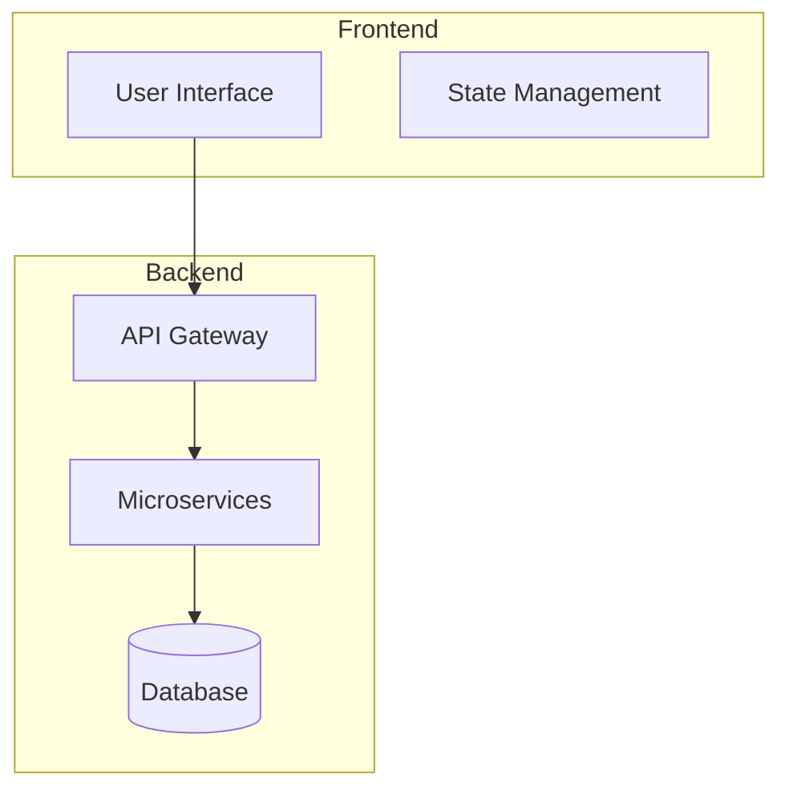

2. **Data Flow**
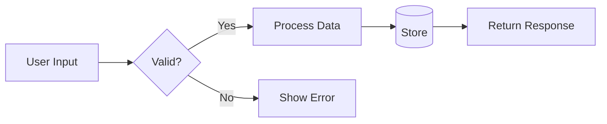

3. **Sequence Diagrams**
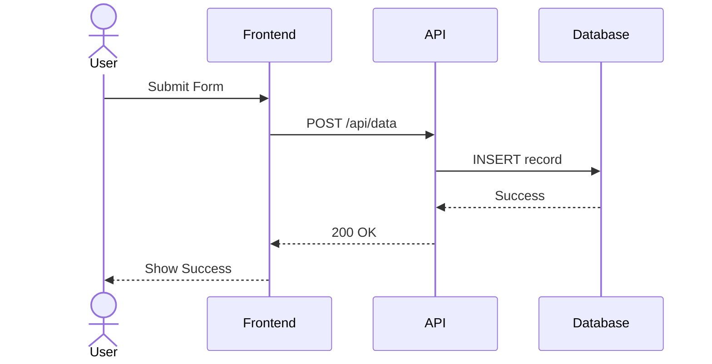

**IMPORTANT**: Always use `actor` for human users/external systems, and `participant` for system components:
- `actor` - Human users, external systems, third-party services
- `participant` - Internal components, services, databases

Generate similar diagrams for:
- Authentication flow
- Payment processing
- Data synchronization
- Error handling
- Deployment pipeline

4. **Design Pattern & Principle Diagrams**

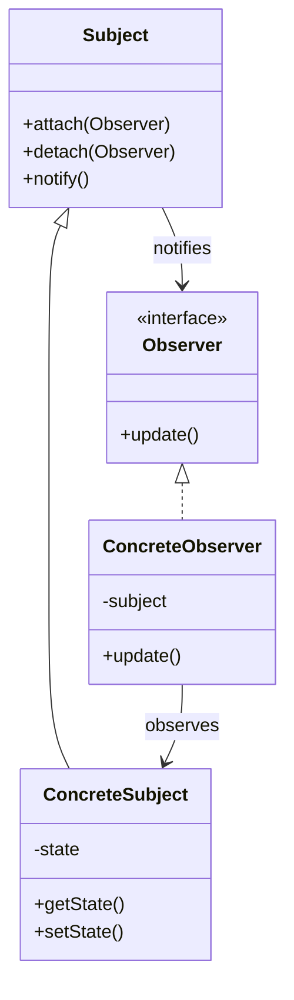

```mermaid
graph TB
    %% DDD Bounded Context Diagram
    subgraph "Sales Context"
        Lead[Lead Entity]
        Opportunity[Opportunity Aggregate]
        Quote[Quote Value Object]
    end
    subgraph "Billing Context"
        Invoice[Invoice Entity]
        Payment[Payment Service]
    end
    subgraph "Inventory Context"
        Product[Product Aggregate]
        Stock[Stock Entity]
    end
    Opportunity --> Invoice : Domain Event
    Quote --> Product : Context Mapping
```

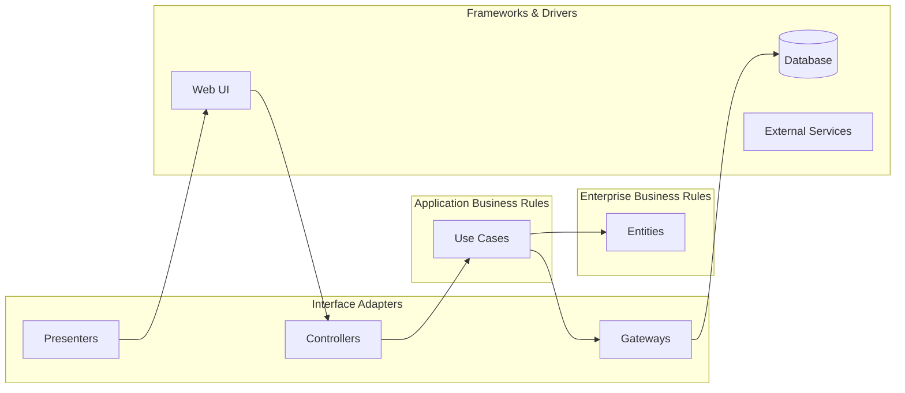

5. **Robustness Diagrams (Analysis Level Design)**
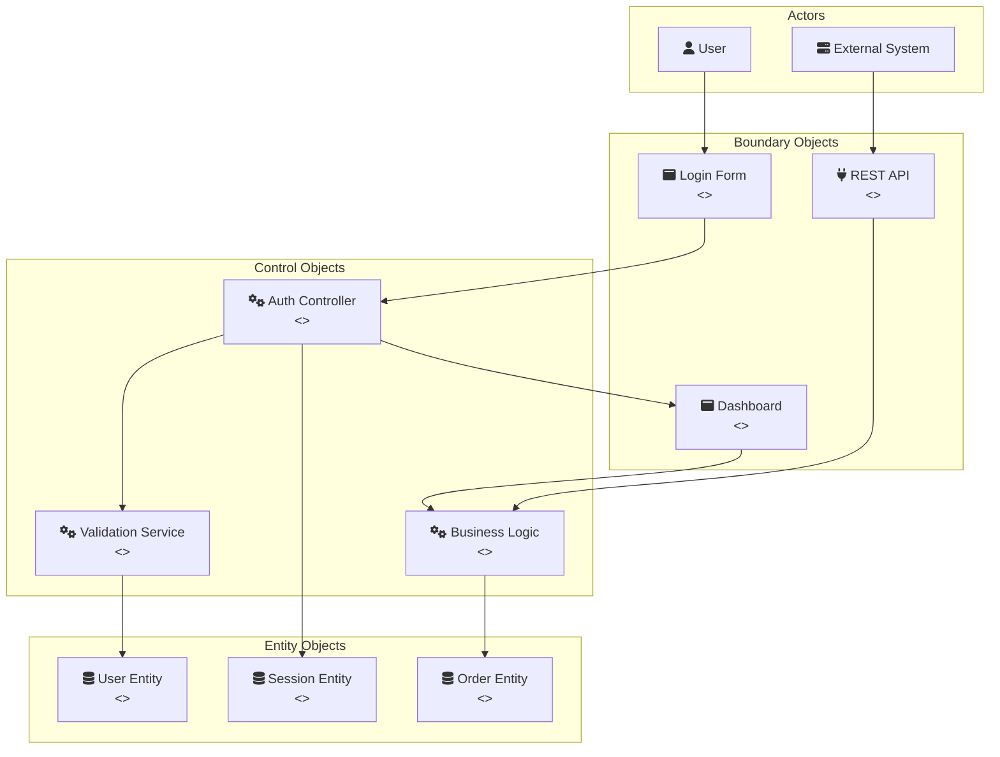

**Robustness Diagram Rules (ICONIX Process):**
- **Boundary Objects** (UI, API interfaces): Actors can only interact with boundaries
- **Control Objects** (Controllers, Services): Implement use case logic and workflow
- **Entity Objects** (Domain models, Data): Persistent business objects
- **Interaction Rules:**
  - Actors ↔ Boundary only
  - Boundary ↔ Control only
  - Control ↔ Entity
  - Control ↔ Control
  - Entity objects cannot interact with boundaries directly
  - Boundaries cannot interact with other boundaries directly

Generate robustness diagrams for:
- User authentication flow
- Order processing workflow
- Data synchronization process
- Payment handling
- Report generation
- API integration flows
- Event processing pipelines

6. **Ontology & Knowledge Graphs**
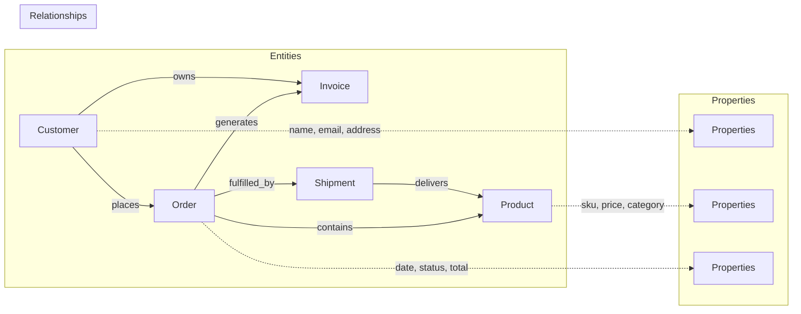

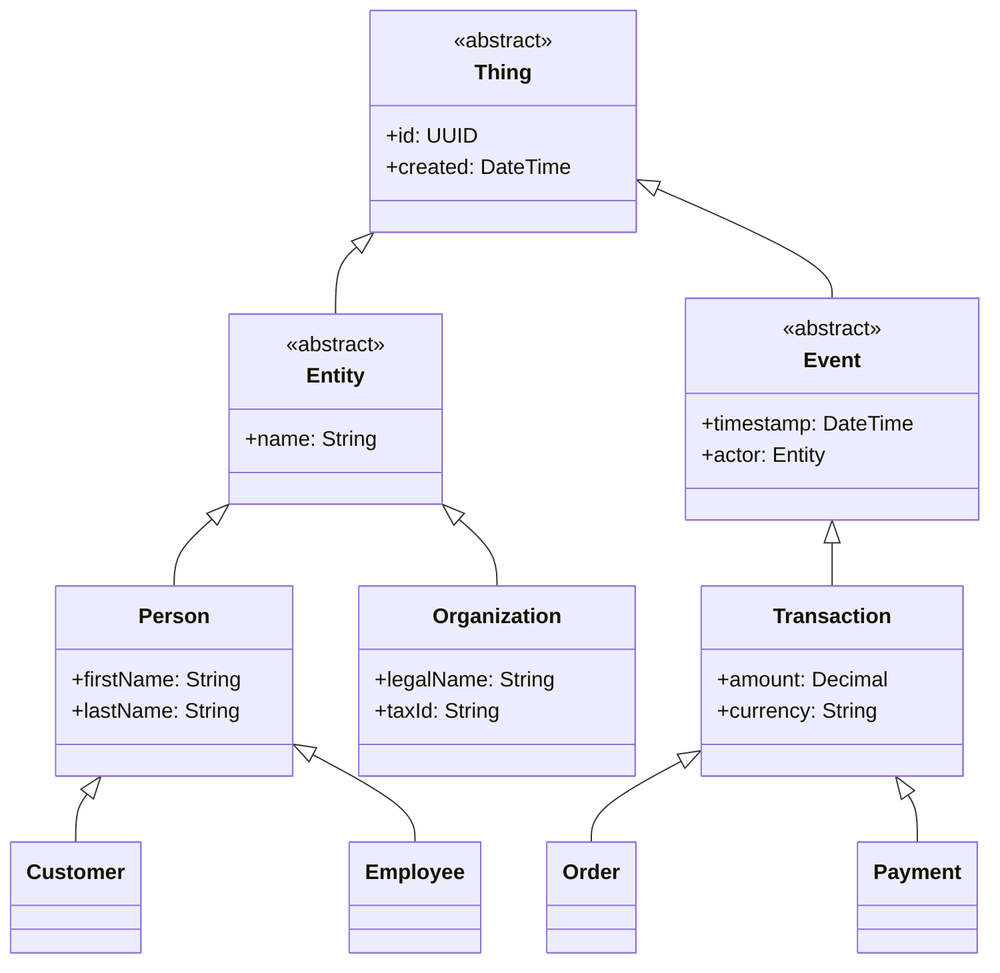

Generate diagrams for:
- Domain ontology hierarchies
- Knowledge graphs with entities and relationships
- Semantic networks
- Concept maps
- Taxonomy trees
- SOLID principle violations and fixes
- DDD aggregate boundaries
- Rich vs Anemic domain models
- Clean/Hexagonal architecture layers
- TRIZ contradiction resolutions
- Emergent design evolution
- Factory patterns in use
- Strategy pattern implementations
- Repository pattern structure
- Decorator chains
- Command pattern flow

**Sequence Diagram Standards:**
- Use `actor` for: End users, administrators, external APIs, third-party services, IoT devices
- Use `participant` for: Frontend, backend, database, cache, queue, internal services
- This follows UML 2.0+ standards and improves diagram readability

Note: Use ONLY Mermaid syntax. GitHub natively supports Mermaid but NOT PlantUML.
```

---

## Robustness Diagram Prompts

### 🔄 ICONIX Robustness Analysis

```markdown
Perform comprehensive robustness analysis using the ICONIX process:

1. **Object Stereotypes Identification**
   
   Scan the codebase and categorize all classes/modules into:
   
   **Boundary Objects <<boundary>>:**
   Discover by identifying code that:
   - Accepts external input (any source)
   - Produces external output (any destination)
   - Transforms between external and internal formats
   - Validates/sanitizes data crossing system boundaries
   - Implements protocol-specific handling
   - Common patterns to find:
     * UI components (web, mobile, desktop, CLI)
     * Network endpoints (any protocol)
     * File I/O operations
     * Message queue interfaces
     * External service clients
     * Report/document generators
     * Inter-process communication points
   
   **Control Objects <<control>>:**
   - Controllers (MVC)
   - Service classes
   - Use case handlers
   - Command handlers (CQRS)
   - Workflow orchestrators
   - Business rule engines
   - Validation services
   - Transaction managers
   - State machines
   - Saga coordinators
   - Event processors
   - Middleware components
   
   **Entity Objects <<entity>>:**
   - Domain models
   - Database entities
   - Value objects
   - Aggregates (DDD)
   - DTOs
   - View models
   - Configuration objects
   - Cache entries

2. **Use Case Realization**
   
   For each use case, create a robustness diagram showing:
   - Actor interactions
   - Object collaborations
   - Data flow between stereotypes
   - Alternative flows
   - Exception handling paths

3. **Validation Checklist**
   
   Check for violations:
   - [ ] Actor talking directly to entity (violation!)
   - [ ] Boundary talking to boundary (violation!)
   - [ ] Entity talking to boundary (violation!)
   - [ ] Missing control logic between boundary and entity
   - [ ] Control object doing UI work
   - [ ] Boundary object containing business logic
   - [ ] Entity object with presentation logic

4. **Generate Robustness Diagrams**

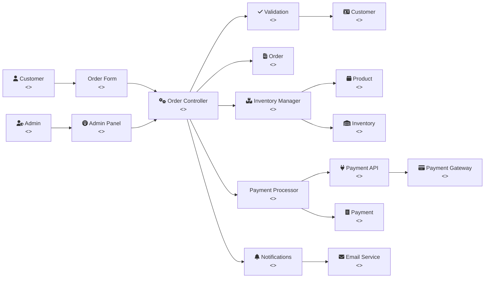

5. **Analysis Questions**
   - Which use cases have the most complex object interactions?
   - Are there control objects doing too much (God controllers)?
   - Which boundaries are over-coupled to controls?
   - Are entities properly encapsulated with behavior?
   - Where are the transaction boundaries?
   - Which controls could be simplified or split?
   - Are there missing boundary objects for external integrations?

6. **Refactoring Opportunities**
   Based on robustness analysis, identify:
   - Controllers that should be split
   - Entities that need behavior (combat anemic models)
   - Boundaries that have leaked business logic
   - Missing service layer components
   - Direct entity access that should go through repositories
   - UI logic that belongs in presentation models

7. **Pattern Alignment**
   Map robustness objects to patterns:
   - Boundary → Facade, Adapter, Proxy patterns
   - Control → Strategy, Command, Chain of Responsibility
   - Entity → Domain Model, Value Object, Aggregate

Generate robustness diagrams for these scenarios:
- User registration and authentication
- Order placement and fulfillment
- Payment processing
- Search and filtering
- Report generation
- Data import/export
- Notification delivery
- Admin operations
- Batch processing
- Real-time updates
```

### 🎯 Quick Robustness Check

```markdown
Quick robustness validation checklist:

**Red Flags (Immediate Issues):**
- Controllers in the UI layer
- Business logic in DTOs
- Entities depending on frameworks
- Direct database access from boundaries
- Circular dependencies between controls

**Yellow Flags (Review Needed):**
- Fat controllers (>300 lines)
- Anemic entities (data only)
- Too many boundaries per use case (>5)
- Control-to-control chains (>3 deep)
- Missing error handling controls

**Green Flags (Good Design):**
- Clear separation of stereotypes
- Rich domain entities
- Thin boundaries
- Focused controls
- Proper dependency direction
```

---

## API Documentation Prompts

### 🌐 Interface Documentation Generation

```markdown
Discover and document ALL interfaces using a protocol-agnostic approach:

1. **Interface Discovery Strategy**
   
   Scan for interface indicators:
   - Import statements for communication libraries
   - Network port bindings
   - URL/URI path definitions
   - Message channel subscriptions
   - Schema definition files
   - Interface definition files (*.proto, *.thrift, *.idl, *.wsdl, *.graphql)
   - Serialization/marshaling code
   - Client factory patterns
   - Server initialization code

2. **Generic Documentation Generation**
   
   For each discovered interface, generate documentation in the native format:
   
   ```yaml
   # Universal Interface Documentation
   interface_name: [discovered name]
   type: [auto-detected type]
   location: [where defined in code]
   
   specification:
     # Use native spec format if standard exists
     # (OpenAPI for REST, SDL for GraphQL, Proto for gRPC, etc.)
     # Otherwise use this generic format:
     
     operations:
       - name: [operation/method/endpoint]
         description: [purpose]
         communication_pattern: [sync/async, stream/batch]
         
         input:
           format: [json/xml/binary/custom]
           schema: [inline or reference]
           validation: [rules]
           
         output:
           format: [json/xml/binary/custom]
           schema: [inline or reference]
           error_cases: [list of possible errors]
           
         metadata:
           idempotent: [true/false]
           cacheable: [true/false]
           deprecated: [true/false]
           since_version: [version]
   ```

3. **Specification Detection & Generation**
   
   Auto-detect and use appropriate specification format:
   - If REST-like → Generate OpenAPI/Swagger
   - If GraphQL → Generate SDL
   - If RPC-style → Generate appropriate IDL
   - If Message-based → Generate AsyncAPI
   - If Unknown → Use generic YAML format above

4. **Cross-Cutting Concerns Documentation**
   
   For ALL interfaces, regardless of type, document:
   
   **Behavioral Patterns:**
   - Request-response cycles
   - Streaming patterns
   - Polling/webhook patterns
   - Batch processing
   
   **Data Patterns:**
   - Pagination strategies
   - Filtering/sorting
   - Field selection/projection
   - Aggregation capabilities
   
   **Operational Patterns:**
   - Health checks
   - Metrics endpoints
   - Circuit breaker behavior
   - Retry policies
   - Timeout configurations
   
   **Evolution Patterns:**
   - Versioning approach
   - Deprecation strategy
   - Migration paths
   - Compatibility matrix

5. **Interface Testing Documentation**
   
   Generate test specifications:
   ```yaml
   test_scenarios:
     - scenario: [happy path]
       given: [preconditions]
       when: [action]
       then: [expected outcome]
       
     - scenario: [error case]
       given: [preconditions]
       when: [invalid action]
       then: [error response]
   ```

6. **Client Generation Hints**
   
   Document how to generate/use clients:
   - Code generation tools available
   - SDK languages supported
   - Example client initialization
   - Common usage patterns
   - Error handling patterns
```

---

## Security Documentation Prompts

### 🔒 Security Audit Prompt

```markdown
Perform a comprehensive security analysis:

1. **Authentication & Authorization**
   - Authentication mechanisms used
   - Session management
   - Password policies
   - MFA implementation
   - JWT usage and validation

2. **Data Protection**
   - Encryption at rest
   - Encryption in transit
   - PII handling
   - Data masking/redaction
   - Secure key storage

3. **Input Validation**
   - SQL injection prevention
   - XSS protection
   - CSRF tokens
   - File upload validation
   - Rate limiting

4. **Security Headers**
   - CSP implementation
   - CORS configuration
   - Security headers audit
   - Cookie security flags

5. **Vulnerability Scan**
   - Outdated dependencies
   - Known CVEs
   - Security misconfigurations
   - Hardcoded secrets
   - Insecure endpoints

Generate:
- Security audit report
- Threat model diagram
- Remediation roadmap
- Security checklist
```

---

## Performance Analysis Prompts

### ⚡ Performance Optimization Prompt

```markdown
Analyze performance characteristics and optimization opportunities:

1. **Code Performance**
   - Algorithm complexity analysis
   - Database query optimization
   - N+1 query detection
   - Memory leak potential
   - CPU-intensive operations

2. **Frontend Performance**
   - Bundle size analysis
   - Code splitting opportunities
   - Image optimization
   - Lazy loading candidates
   - Critical rendering path

3. **Backend Performance**
   - Response time analysis
   - Database indexing needs
   - Caching opportunities
   - Connection pooling
   - Async operation candidates

4. **Infrastructure Performance**
   - Resource utilization
   - Scaling bottlenecks
   - Network latency
   - CDN usage
   - Load balancing

Generate:
- Performance report card
- Optimization roadmap
- Benchmark comparisons
- Performance budget
- Monitoring dashboard config
```

---

## 💡 Usage Tips

### How to Use These Prompts Effectively

1. **Start with the Master Prompt** for comprehensive analysis
2. **Pay special attention to OOD patterns** - they reveal code quality and maintainability
3. **Use Component-Specific Prompts** for deep dives
4. **Combine multiple prompts** for complete coverage
5. **Customize based on your tech stack**
6. **Iterate and refine** based on initial results
7. **Look for anti-patterns** as refactoring opportunities

### Best Practices

- Provide context about business requirements
- Include specific areas of concern
- Request specific diagram types needed
- Ask for prioritized recommendations
- Request effort estimates for improvements
- Explicitly ask for SOLID, DDD, KISS, DRY, YAGNI analysis
- Request Rich vs Anemic domain model comparison
- Ask for TRIZ contradiction identification
- Request Emergent Design opportunities
- Specify if you want Clean/Hexagonal architecture assessment
- **Request ontological model extraction and knowledge graphs**
- **Ask for semantic consistency analysis**
- **Require entity relationship inference**
- **ALWAYS request multi-file documentation with full navigation**
- **Enforce index.md creation for every documentation directory**
- **Require TOC, cross-links, and nav headers/footers in all files**

### Output Formats

Request documentation in:
- Markdown for version control
- HTML for web viewing
- PDF for stakeholder distribution
- JSON for automated processing
- Confluence/Wiki format for team wikis

---

[⬆️ Top](#-documentation-generation-prompts) | [📚 Documentation](../../index.md)