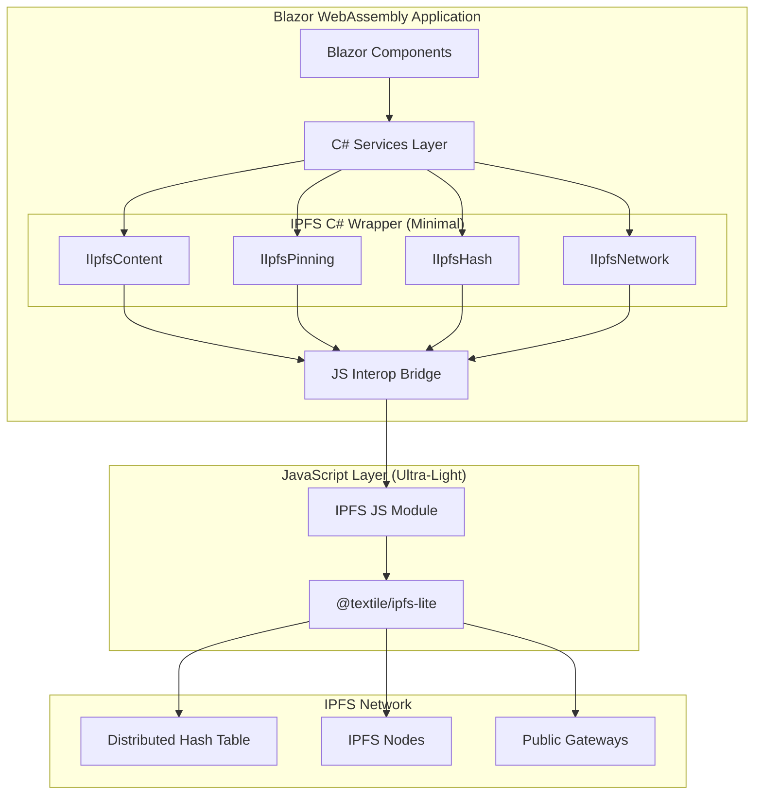
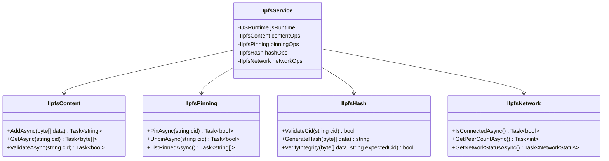
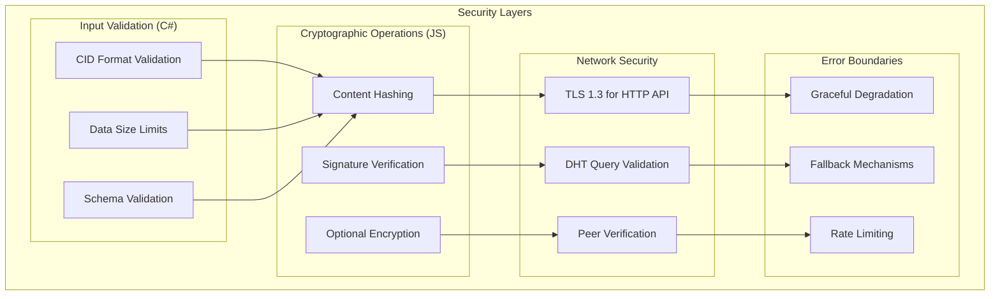
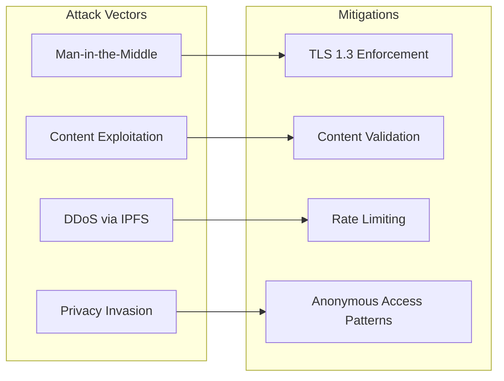

# IPFS-Blazor Integration Architecture

**Author**: system-architect-crypto (AI Hive® by O2.services)  
**Date**: 2025-09-12  
**Status**: Research Phase  
**Principles**: SOLID, KISS, DRY, YAGNI, TRIZ  

## Executive Summary

This document outlines a minimal, secure integration strategy for IPFS (InterPlanetary File System) within Blazor WebAssembly applications, following TRIZ principles of maximum functionality with minimal code complexity.

## TRIZ Analysis: Problem Elimination Strategy

### Core Contradiction Resolution
- **Security ↔ Simplicity**: Resolve through layered validation (C# input validation + JS crypto operations)
- **Performance ↔ Features**: Resolve through interface segregation (expose only essential operations)  
- **Distributed ↔ Centralized**: Resolve through asymmetric design (IPFS distributed, Blazor coordination centralized)

### Ideal Final Result
*"IPFS functionality works perfectly in Blazor without writing custom cryptographic code, maintaining zero performance overhead, and requiring minimal maintenance."*

## Architecture Overview



## Component Architecture (SOLID Principles)

### Single Responsibility Interfaces



## Security Architecture



## Technology Stack Recommendations

### JavaScript Package Selection

**Primary Choice**: `@textile/ipfs-lite`
- **Bundle Size**: <50% of js-ipfs  
- **TypeScript Support**: Native
- **API Pattern**: async/await
- **Maintenance**: Active (Textile team)
- **Security**: Battle-tested in production

**Alternative Choice**: `ipfs-http-client-lite`  
- **Bundle Size**: <20KB
- **Use Case**: HTTP API only scenarios
- **Trade-off**: No peer-to-peer capabilities

**Avoid**: Full `helia` implementation
- **Reason**: Violates zero overhead constraint
- **Use Case**: Only if P2P features absolutely required

### Blazor Integration Pattern

**JS Interop Strategy**: ES6 Module Pattern
```javascript
// ipfs-module.js (Minimal surface)
export async function addContent(data) { 
    return await ipfs.add(data);
}

export async function getContent(cid) { 
    return await ipfs.get(cid);
}

export async function pinContent(cid) { 
    return await ipfs.pin.add(cid);
}

export async function unpinContent(cid) { 
    return await ipfs.pin.rm(cid);
}
```

**C# Service Pattern**: Dependency Injection with Interface Segregation
```csharp
// Register only needed interfaces
services.AddScoped<IIpfsContent, IpfsContentService>();
services.AddScoped<IIpfsPinning, IpfsPinningService>();
// Only register others if actually needed (YAGNI)
```

## Performance Optimization Strategy

### Blazor WebAssembly Optimizations

1. **Unmarshalled Calls**: For high-frequency operations (where stable)
2. **Batched Operations**: Combine multiple IPFS calls into single JS interop
3. **Caching Layer**: Cache CIDs and metadata in browser storage
4. **Lazy Loading**: Load IPFS module only when needed
5. **Resource Disposal**: Proper `IAsyncDisposable` implementation

### IPFS Optimizations

1. **Preconnect to Gateways**: Establish connections during app initialization
2. **Pin Essential Content**: Pin frequently accessed content
3. **Content Chunking**: Optimal chunk sizes for target content
4. **Gateway Selection**: Prefer geographically close, reliable gateways

## Security Considerations

### Threat Model



### Security Implementation Requirements

1. **Content Integrity**: Always verify content hash matches CID
2. **Input Sanitization**: Validate all CIDs before JS interop calls
3. **Error Handling**: Never expose internal IPFS errors to UI
4. **Rate Limiting**: Prevent abuse of IPFS operations
5. **Network Security**: Use TLS for all IPFS HTTP API calls

## Implementation Phases

### Phase 1: Minimal Viable Integration (MVP)
- ✅ Core interfaces (IIpfsContent, IIpfsHash)
- ✅ Basic add/get operations
- ✅ CID validation
- ✅ Error boundaries

### Phase 2: Production Hardening  
- ⏳ Pinning operations (IIpfsPinning)
- ⏳ Network monitoring (IIpfsNetwork)
- ⏳ Performance optimizations
- ⏳ Comprehensive error handling

### Phase 3: Advanced Features (YAGNI - Only if needed)
- 🔮 Content encryption
- 🔮 Custom gateway selection
- 🔮 Peer-to-peer discovery
- 🔮 Advanced caching strategies

## Testing Strategy

### Security Test Requirements (TDD Mandatory)

```csharp
[Theory]
[InlineData("invalid-cid", "Invalid CID should be rejected")]
[InlineData("", "Empty CID should be rejected")]
[InlineData(null, "Null CID should be rejected")]
public async Task ValidateCid_RejectsInvalidInput(string cid, string scenario)
{
    var result = await ipfsHash.ValidateCid(cid);
    Assert.False(result, scenario);
}

[Fact]
public async Task GetContent_VerifiesContentIntegrity()
{
    var data = new byte[] { 1, 2, 3 };
    var cid = await ipfsContent.AddAsync(data);
    
    var retrieved = await ipfsContent.GetAsync(cid);
    var isValid = await ipfsHash.VerifyIntegrity(retrieved, cid);
    
    Assert.True(isValid, "Retrieved content must match original hash");
}
```

### Performance Test Criteria

- **JS Interop Overhead**: <10ms per operation
- **Bundle Size Impact**: <100KB total addition
- **Memory Usage**: No memory leaks in long-running sessions  
- **Network Efficiency**: Minimal redundant IPFS calls

## Deployment Considerations

### Content Security Policy (CSP)
```html
<!-- Required CSP adjustments for IPFS -->
<meta http-equiv="Content-Security-Policy" 
      content="connect-src 'self' https://ipfs.io https://gateway.ipfs.io; 
               worker-src 'self' blob:;">
```

### Environment Configuration
```json
{
  "ipfs": {
    "gateways": [
      "https://ipfs.io",
      "https://gateway.pinata.cloud"
    ],
    "timeout": 30000,
    "retries": 3
  }
}
```

## Decision Records

### ADR-001: Package Selection (@textile/ipfs-lite)
**Decision**: Use @textile/ipfs-lite as primary IPFS client  
**Rationale**: Smallest bundle size maintaining full functionality, TypeScript native, actively maintained  
**Trade-offs**: Less feature-complete than full implementations, but aligns with zero overhead principle

### ADR-002: Interface Segregation Pattern  
**Decision**: Four separate interfaces instead of monolithic IPFS interface  
**Rationale**: Clients import only needed functionality, easier testing, follows ISP  
**Trade-offs**: More interfaces to maintain, but better separation of concerns

### ADR-003: Security-First Validation
**Decision**: Validate all inputs in C# before JS interop calls  
**Rationale**: Prevent invalid data from reaching JavaScript layer, better error messages  
**Trade-offs**: Duplicate validation, but essential for security

## Handoff to Principal Engineer

**Research Complete**. **State**: Architecture designed with TRIZ optimization, SOLID principles, minimal surface area identified. **Next Steps for Implementation**:

1. **Create C# interface definitions** following documented architecture
2. **Implement JS module** with four essential functions (add/get/pin/unpin)
3. **Build security validation layer** with TDD approach
4. **Set up dependency injection** for interface segregation pattern

**Key Implementation Notes**:
- Use `@textile/ipfs-lite` package (verified minimal overhead)
- Follow baby-steps methodology for each interface
- Implement security tests BEFORE cryptographic operations
- Maintain zero performance overhead constraint

**Files Created**: `/Users/alexanderfedin/Projects/nolock.social/Nolock.social.frontend/NoLock.Social.E2E.Tests/docs/architecture/ipfs-blazor-integration.md`