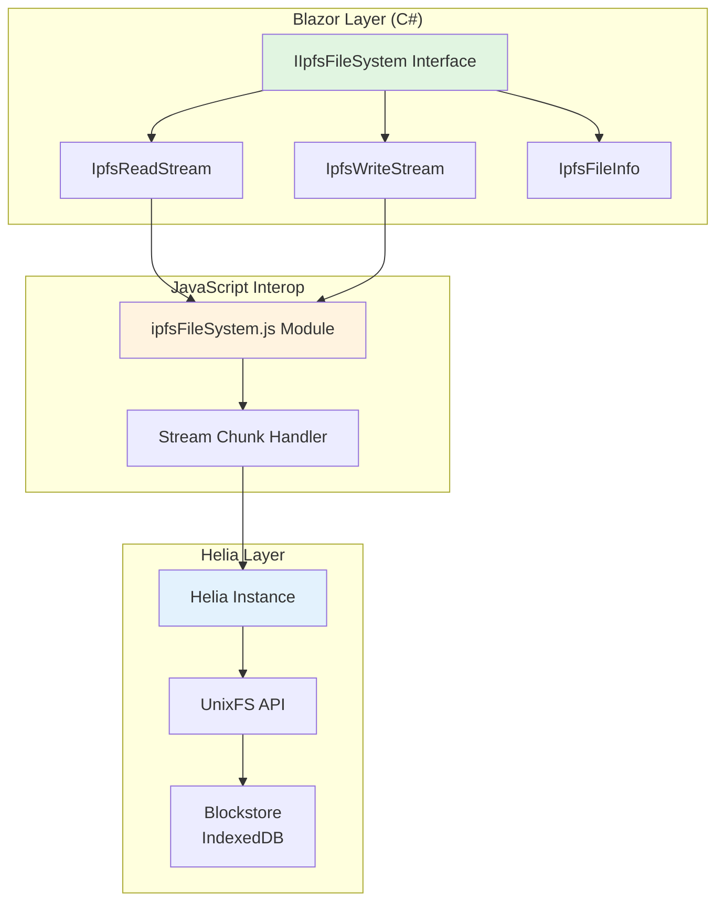
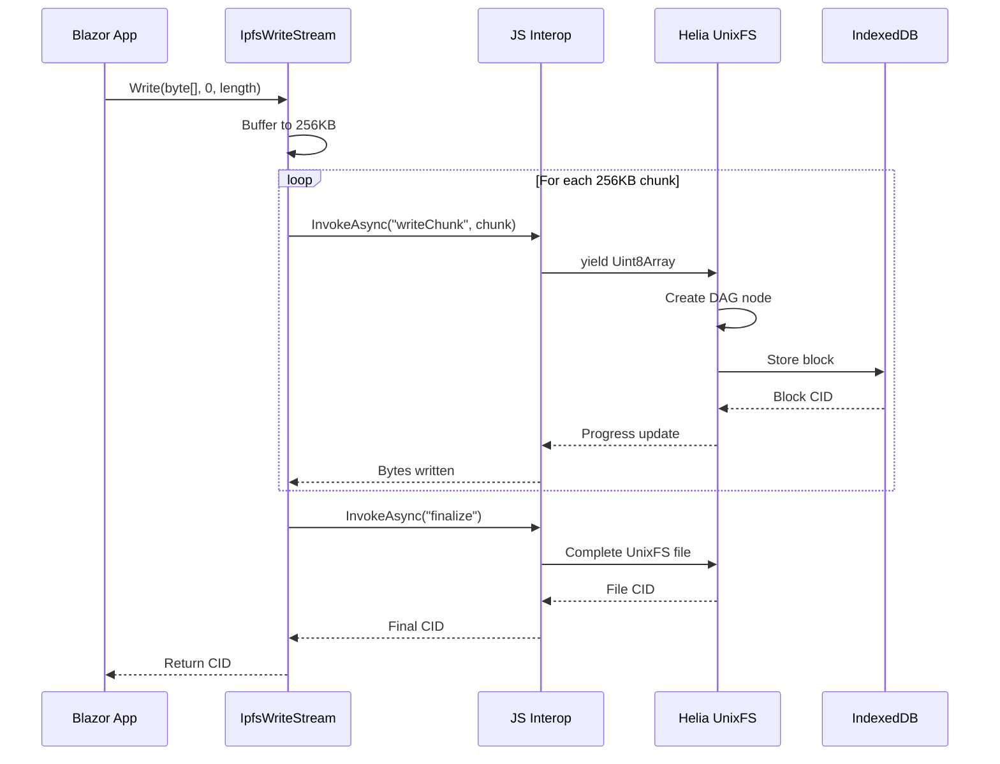
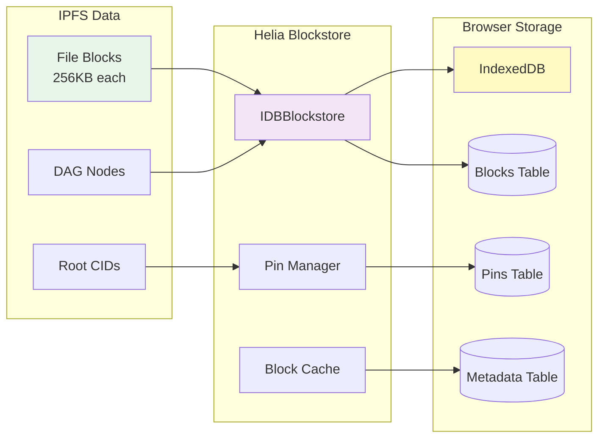

# IPFS Helia Integration - Architecture Diagrams

## 1. Component Architecture
Shows how C# Stream components connect to Helia UnixFS through JavaScript interop.

**Key Points:**
- **IIpfsFileSystem**: Primary C# interface exposing Stream-based operations
- **Stream Wrappers**: IpfsReadStream and IpfsWriteStream handle chunked data transfer
- **JavaScript Module**: Thin translation layer, no business logic
- **Helia UnixFS**: Native async iterable support for streaming

---

## 2. Data Flow Diagram
Illustrates how data streams from Blazor application to IPFS storage in 256KB chunks.

**Key Points:**
- **256KB Chunks**: Optimal size for browser memory and IPFS blocks
- **Async Streaming**: Non-blocking data transfer using async iterables
- **Progressive Updates**: Real-time progress reporting during upload
- **CID Generation**: Content-addressed storage with unique identifiers

---

## 3. Storage Architecture
Shows how IPFS data persists in browser's IndexedDB for offline capability.

**Key Points:**
- **IndexedDB**: Persistent browser storage (50% of available disk)
- **Block-level Storage**: Each 256KB chunk stored separately
- **Pin Management**: Prevents garbage collection of important files
- **Offline Support**: Full functionality without network connectivity

---

## Summary

These diagrams illustrate the minimal abstraction approach:

1. **Component Architecture**: Direct mapping from C# Streams to Helia UnixFS
2. **Data Flow**: Efficient chunked streaming with progress updates
3. **Storage Architecture**: Browser-native persistence using IndexedDB

The design follows "programming by intent" - developers work with familiar C# Stream patterns while Helia handles the IPFS complexity underneath.

**Total Abstraction Layers**: 2
- C# Stream interface (familiar API)
- JavaScript translation (thin mapping layer)

This architecture ensures junior developers can work with standard .NET patterns while leveraging the full power of IPFS in the browser.