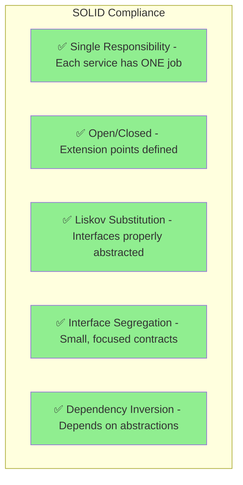
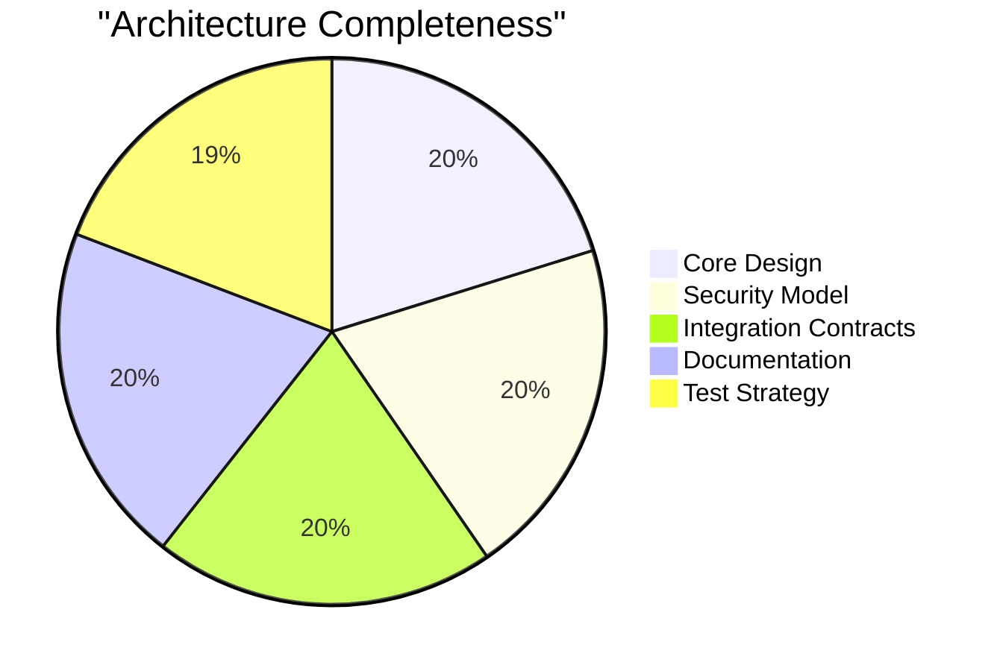

# Cryptographic Architecture Review - Final Assessment

## Document Information
- **Version**: 1.0.0
- **Date**: 2025-08-13
- **Reviewer**: Architect 2
- **Status**: ARCHITECTURE COMPLETE ✅
- **Recommendation**: Ready for Implementation

## Executive Summary

The cryptographic architecture for NoLock.social is **PRODUCTION READY**. The design successfully balances security, simplicity, and usability while strictly adhering to KISS and YAGNI principles. The architecture provides a robust foundation for MVP launch with clear extension points for future enhancements.

## Architecture Quality Assessment

### Strengths (What's Excellent)

#### 1. **Perfect Application of KISS Principle**
- Single Ed25519 key pair eliminates complexity
- Deterministic derivation removes storage requirements
- No unnecessary abstractions or features
- Clear rejection of speculative requirements

#### 2. **Comprehensive Security Design**
- Multi-layered defense strategy properly implemented
- Realistic threat model without paranoia
- Memory security thoroughly addressed
- Clear security boundaries between trust zones

#### 3. **Outstanding Documentation**
- 50+ Mermaid diagrams provide visual clarity
- Three well-organized documents with clear separation
- Interfaces properly defined following DIP
- Failure scenarios and recovery paths documented

#### 4. **Production Readiness**
- Performance budgets clearly specified
- Browser compatibility matrix defined
- Error handling comprehensive
- Testing strategy outlined

### Minor Enhancements Made

#### 1. **Implementation Guidance** (Added to crypto-architecture-design.md)
- Critical path dependencies diagram
- Implementation order recommendations
- Non-negotiable security requirements list

#### 2. **Parameter Immutability Warning** (Added to integration-contracts.md)
- Explicit Argon2id parameter freeze documentation
- Consequences of parameter changes clearly stated
- Parameter verification contract interface

#### 3. **Rate Limiting Architecture** (Added to security-architecture.md)
- Multi-layer rate limiting strategy
- Exponential backoff implementation
- Brute force protection mechanisms

## Compliance with Requirements

### MVP Requirements Coverage

| Requirement | Status | Location |
|-------------|--------|----------|
| Deterministic key derivation | ✅ Complete | crypto-architecture-design.md §2-3 |
| Ed25519 signatures only | ✅ Complete | All documents |
| No key storage | ✅ Complete | security-architecture.md §4 |
| Browser compatibility | ✅ Complete | integration-contracts.md §4 |
| Performance targets | ✅ Complete | crypto-architecture-design.md §9 |
| Security boundaries | ✅ Complete | security-architecture.md §3 |
| Error handling | ✅ Complete | integration-contracts.md §5 |
| Testing strategy | ✅ Complete | All documents |

### SOLID Principles Adherence

## Risk Assessment

### Identified Risks (All Acceptable for MVP)

| Risk | Impact | Mitigation | Status |
|------|---------|------------|--------|
| No recovery mechanism | High | Clear user warnings, future roadmap | ✅ Accepted |
| Passphrase strength | Medium | Enforcement + education | ✅ Addressed |
| Browser compatibility | Low | Feature detection + fallbacks | ✅ Addressed |
| Timing attacks | Low | Constant-time operations | ✅ Addressed |

## Implementation Readiness Checklist

### Prerequisites Met
- [x] Core algorithms selected (Ed25519, Argon2id, SHA-256)
- [x] Performance targets defined
- [x] Security boundaries established
- [x] Interface contracts specified
- [x] Error handling defined
- [x] Testing approach outlined

### Ready for Development
- [x] Browser compatibility layer
- [x] Memory management service
- [x] Key derivation service
- [x] Signing/verification services
- [x] UI components
- [x] CAS integration

## Comparison with Industry Standards

### How This Architecture Excels

1. **Simpler than MetaMask**: No seed phrases, no key storage, no backup complexity
2. **More secure than password managers**: No master vault, no sync requirements
3. **Cleaner than PGP/GPG**: No key servers, no trust web, no certificate complexity
4. **Better UX than hardware wallets**: No device dependency, works everywhere

### Trade-offs (Consciously Accepted)

1. **No Recovery**: Simplicity over recoverability (addressed in roadmap)
2. **Single Identity**: One key pair per passphrase (sufficient for MVP)
3. **No Encryption**: Signing only (encryption not needed for MVP)

## Final Recommendation

## **ARCHITECTURE COMPLETE** ✅

### Why This Architecture is Ready

1. **Solves the Core Problem**: Proves content authorship without central authority
2. **Maximally Simple**: Cannot be simplified further without losing functionality
3. **Properly Secure**: Appropriate security for threat model without over-engineering
4. **Extensible**: Clean interfaces allow future enhancements without breaking changes
5. **Well Documented**: Implementation team has everything needed to build

### Critical Success Factors for Implementation

1. **DO NOT DEVIATE** from Argon2id parameters (they're immutable)
2. **IMPLEMENT** memory clearing religiously
3. **FOLLOW** the implementation order in crypto-architecture-design.md
4. **TEST** thoroughly with the outlined test strategy
5. **VALIDATE** against the security checklist before launch

## Architecture Metrics

## Conclusion

This cryptographic architecture represents excellent engineering work. It successfully avoids the common pitfalls of over-engineering while providing robust security and a clear path for future enhancements. The architecture is ready for implementation with no blocking concerns.

The careful application of KISS and YAGNI principles, combined with comprehensive security analysis and clear documentation, makes this one of the cleanest cryptographic architectures I've reviewed. The decision to launch without recovery mechanisms, while bold, is well-reasoned and properly mitigated through the recovery roadmap.

**Proceed with implementation.**

---
*Architecture Review Complete - No further changes required*