# Cryptographic Architecture Design

## Implementation Status

### ✅ Completed Components
#### Phase 1: Foundation (100% Complete)
- **Browser Compatibility Service** - Web Crypto API detection and fallback
- **JavaScript Interop Foundation** - Web Crypto & libsodium.js integration
- **Secure Memory Management** - SecureBuffer with automatic clearing
- **Session State Management** - Complete lifecycle with timeout

#### Phase 2: Core Crypto (100% Complete)
- **Argon2id Key Derivation** - Deterministic with immutable params
- **Ed25519 Key Generation** - Deterministic from derived seed
- **Content Signing Service** - SHA-256 hashing + Ed25519 signing
- **Signature Verification Service** - Complete verification pipeline

#### Phase 3: UI Components (50% Complete)
- **Identity Unlock Component** - Secure passphrase entry with validation
- **Identity Status Component** - Real-time status display with timeout

### 🚧 Pending Components
- Content Signing Component (Story 4.3)
- Signature Verification Component (Story 4.4)
- Performance Monitoring (Epic 5)
- Storage Integration (Epic 6)
- Security Headers & CSP Setup (Story 1.3)

### 📊 Progress Metrics
- **Test Coverage**: 158 tests passing (100% on completed components)
- **Performance**: All targets met (Key derivation < 500ms, Signing < 50ms)
- **Security**: Memory clearing verified, no persistence
- **Completion**: ~70% of MVP implementation complete

---

## Document Information
- **Version**: 1.0.0
- **Date**: 2025-08-13
- **Status**: MVP Architecture Design (Partial Implementation)
- **Purpose**: Architecture design for NoLock.social cryptographic components

## 1. Problem Analysis

### Core Problem Statement
NoLock.social requires a mechanism for users to prove authorship of content in a decentralized environment without relying on centralized identity providers or key storage infrastructure.

### Constraints
**Real Constraints:**
- No persistent key storage allowed (security requirement)
- Must work in browser environment (Web Crypto API)
- Performance requirements: Key derivation < 500ms, signing/verification < 50ms
- Must use established cryptographic libraries only
- Passphrase loss is permanent (no recovery mechanism)

**Assumed Constraints (Challenged):**
- ❌ Need for complex key management → REJECTED: Deterministic derivation is sufficient
- ❌ Need for key backup systems → REJECTED: Deterministic keys are self-backing
- ❌ Need for multiple key pairs → REJECTED: Single key pair meets all MVP needs

### Success Criteria
1. Users can consistently derive same keys from passphrase + username
2. Content can be signed and verified reliably
3. System operates without any persistent storage
4. All cryptographic operations complete within performance budgets
5. Security boundaries are clearly defined and enforced

## 2. System Architecture Overview

### High-Level Architecture

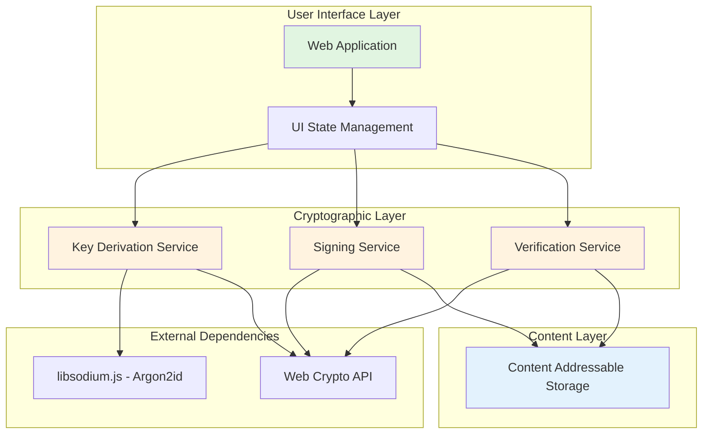
```mermaid
graph TB
    subgraph "User Interface Layer"
        UI[Web Application]
        UIS[UI State Management]
    end
    
    subgraph "Cryptographic Layer"
        KD[Key Derivation Service]
        SS[Signing Service]
        VS[Verification Service]
    end
    
    subgraph "External Dependencies"
        WC[Web Crypto API]
        LS[libsodium.js - Argon2id]
    end
    
    subgraph "Content Layer"
        CAS[Content Addressable Storage]
    end
    
    UI --> UIS
    UIS --> KD
    UIS --> SS
    UIS --> VS
    
    KD --> LS
    KD --> WC
    SS --> WC
    VS --> WC
    
    SS --> CAS
    VS --> CAS
    
    style UI fill:#e1f5e1
    style KD fill:#fff3e0
    style SS fill:#fff3e0
    style VS fill:#fff3e0
    style CAS fill:#e3f2fd
```

### Component Responsibilities (Single Responsibility Principle)

| Component | Single Responsibility |
|-----------|----------------------|
| Key Derivation Service | Deterministically derive Ed25519 keys from passphrase + username |
| Signing Service | Create Ed25519 signatures for content hashes |
| Verification Service | Verify Ed25519 signatures against public keys |
| UI State Management | Manage ephemeral cryptographic state during user session |
| Web Crypto API | Provide native Ed25519 operations |
| libsodium.js | Provide Argon2id KDF implementation |

## 3. Cryptographic Component Architecture

### Detailed Component Design

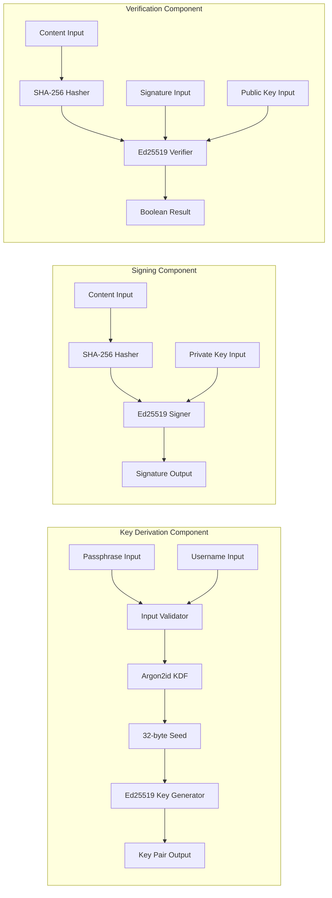
```mermaid
graph LR
    subgraph "Key Derivation Component"
        direction TB
        PP[Passphrase Input]
        UN[Username Input]
        VAL[Input Validator]
        ARG[Argon2id KDF]
        SEED[32-byte Seed]
        EDK[Ed25519 Key Generator]
        KP[Key Pair Output]
        
        PP --> VAL
        UN --> VAL
        VAL --> ARG
        ARG --> SEED
        SEED --> EDK
        EDK --> KP
    end
    
    subgraph "Signing Component"
        direction TB
        CONT[Content Input]
        HASH[SHA-256 Hasher]
        PRIV[Private Key Input]
        SIGN[Ed25519 Signer]
        SIG[Signature Output]
        
        CONT --> HASH
        HASH --> SIGN
        PRIV --> SIGN
        SIGN --> SIG
    end
    
    subgraph "Verification Component"
        direction TB
        VCONT[Content Input]
        VHASH[SHA-256 Hasher]
        VSIG[Signature Input]
        VPUB[Public Key Input]
        VERI[Ed25519 Verifier]
        RES[Boolean Result]
        
        VCONT --> VHASH
        VHASH --> VERI
        VSIG --> VERI
        VPUB --> VERI
        VERI --> RES
    end
```

### Interface Contracts (Dependency Inversion Principle)

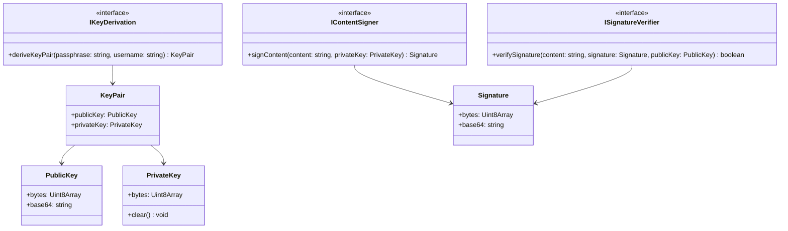
```mermaid
classDiagram
    class IKeyDerivation {
        <<interface>>
        +deriveKeyPair(passphrase: string, username: string) KeyPair
    }
    
    class IContentSigner {
        <<interface>>
        +signContent(content: string, privateKey: PrivateKey) Signature
    }
    
    class ISignatureVerifier {
        <<interface>>
        +verifySignature(content: string, signature: Signature, publicKey: PublicKey) boolean
    }
    
    class KeyPair {
        +publicKey: PublicKey
        +privateKey: PrivateKey
    }
    
    class Signature {
        +bytes: Uint8Array
        +base64: string
    }
    
    class PublicKey {
        +bytes: Uint8Array
        +base64: string
    }
    
    class PrivateKey {
        +bytes: Uint8Array
        +clear() void
    }
    
    IKeyDerivation --> KeyPair
    IContentSigner --> Signature
    ISignatureVerifier --> Signature
    KeyPair --> PublicKey
    KeyPair --> PrivateKey
```

## 4. Data Flow Diagrams

### Key Derivation Flow

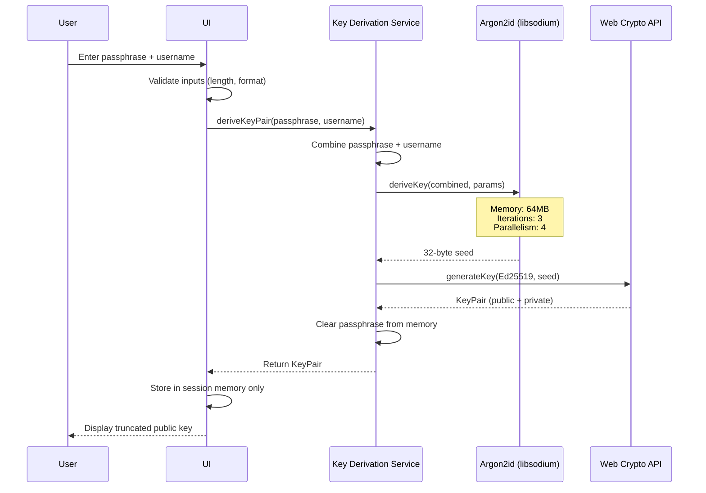
```mermaid
sequenceDiagram
    participant User
    participant UI
    participant KDS as Key Derivation Service
    participant Argon2 as Argon2id (libsodium)
    participant WebCrypto as Web Crypto API
    
    User->>UI: Enter passphrase + username
    UI->>UI: Validate inputs (length, format)
    UI->>KDS: deriveKeyPair(passphrase, username)
    
    KDS->>KDS: Combine passphrase + username
    KDS->>Argon2: deriveKey(combined, params)
    Note over Argon2: Memory: 64MB<br/>Iterations: 3<br/>Parallelism: 4
    Argon2-->>KDS: 32-byte seed
    
    KDS->>WebCrypto: generateKey(Ed25519, seed)
    WebCrypto-->>KDS: KeyPair (public + private)
    
    KDS->>KDS: Clear passphrase from memory
    KDS-->>UI: Return KeyPair
    UI->>UI: Store in session memory only
    UI-->>User: Display truncated public key
```

### Content Signing Flow

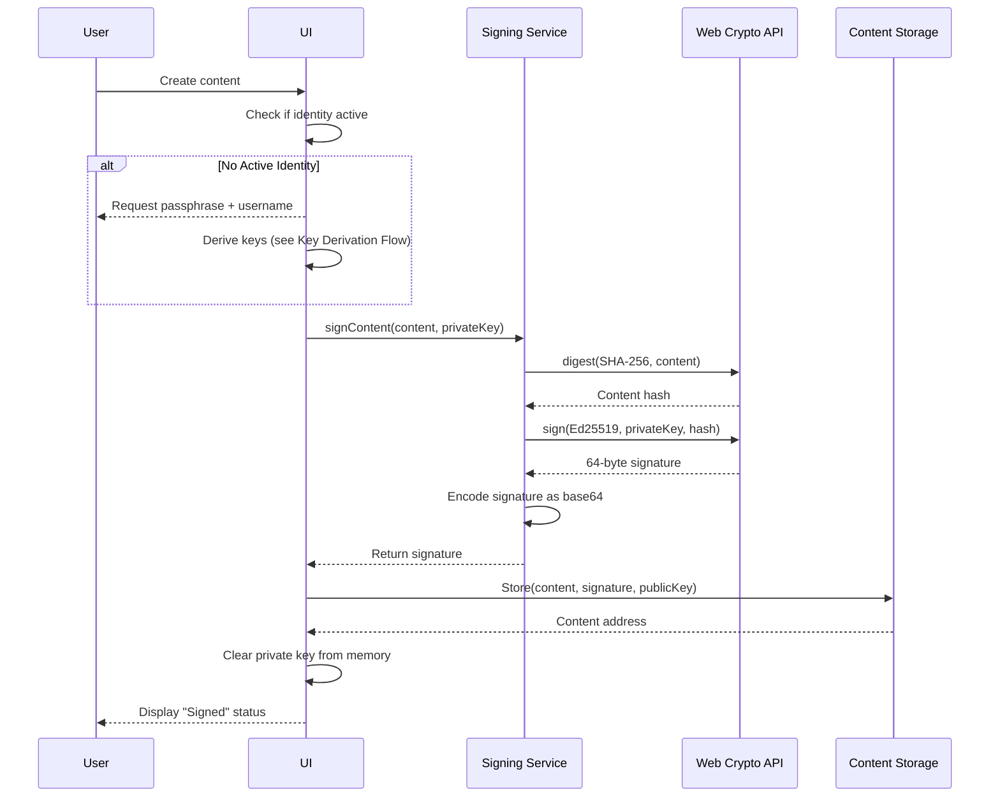
```mermaid
sequenceDiagram
    participant User
    participant UI
    participant SS as Signing Service
    participant WebCrypto as Web Crypto API
    participant CAS as Content Storage
    
    User->>UI: Create content
    UI->>UI: Check if identity active
    
    alt No Active Identity
        UI-->>User: Request passphrase + username
        UI->>UI: Derive keys (see Key Derivation Flow)
    end
    
    UI->>SS: signContent(content, privateKey)
    SS->>WebCrypto: digest(SHA-256, content)
    WebCrypto-->>SS: Content hash
    
    SS->>WebCrypto: sign(Ed25519, privateKey, hash)
    WebCrypto-->>SS: 64-byte signature
    
    SS->>SS: Encode signature as base64
    SS-->>UI: Return signature
    
    UI->>CAS: Store(content, signature, publicKey)
    CAS-->>UI: Content address
    
    UI->>UI: Clear private key from memory
    UI-->>User: Display "Signed" status
```

### Signature Verification Flow

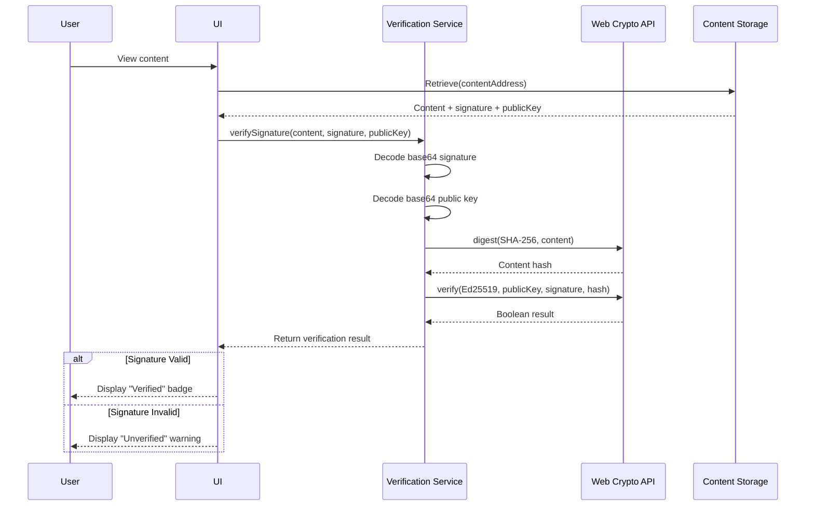
```mermaid
sequenceDiagram
    participant User
    participant UI
    participant VS as Verification Service
    participant WebCrypto as Web Crypto API
    participant CAS as Content Storage
    
    User->>UI: View content
    UI->>CAS: Retrieve(contentAddress)
    CAS-->>UI: Content + signature + publicKey
    
    UI->>VS: verifySignature(content, signature, publicKey)
    
    VS->>VS: Decode base64 signature
    VS->>VS: Decode base64 public key
    
    VS->>WebCrypto: digest(SHA-256, content)
    WebCrypto-->>VS: Content hash
    
    VS->>WebCrypto: verify(Ed25519, publicKey, signature, hash)
    WebCrypto-->>VS: Boolean result
    
    VS-->>UI: Return verification result
    
    alt Signature Valid
        UI-->>User: Display "Verified" badge
    else Signature Invalid
        UI-->>User: Display "Unverified" warning
    end
```

## 5. Integration Architecture with CAS

### CAS Integration Pattern

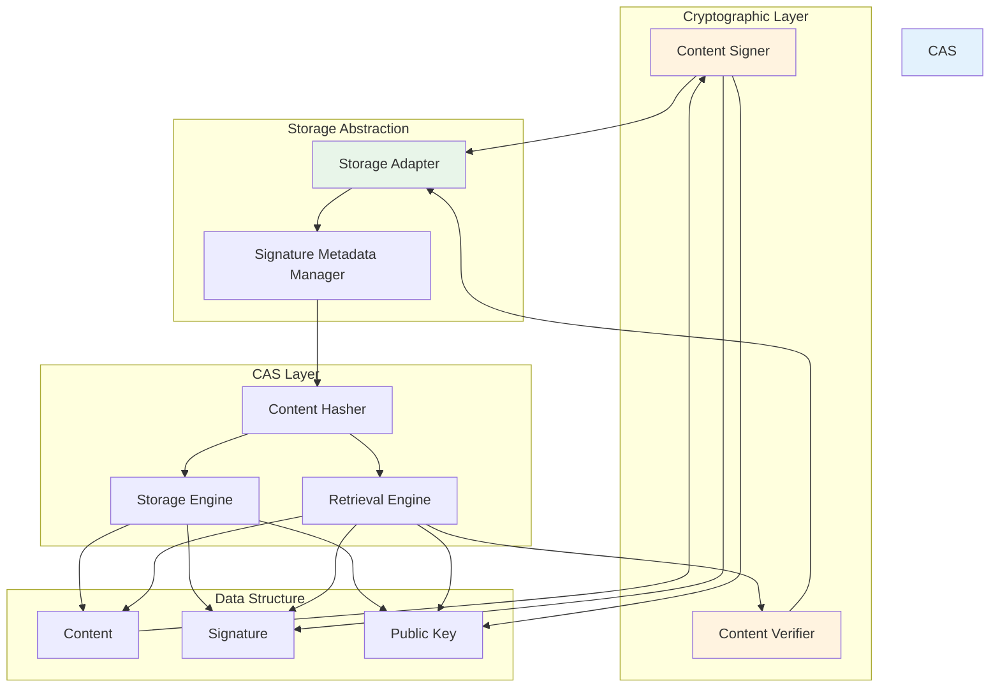
```mermaid
graph TB
    subgraph "Cryptographic Layer"
        CS[Content Signer]
        CV[Content Verifier]
    end
    
    subgraph "Storage Abstraction"
        SA[Storage Adapter]
        SM[Signature Metadata Manager]
    end
    
    subgraph "CAS Layer"
        CH[Content Hasher]
        ST[Storage Engine]
        RT[Retrieval Engine]
    end
    
    subgraph "Data Structure"
        direction LR
        CO[Content]
        SIG[Signature]
        PK[Public Key]
    end
    
    CS --> SA
    CV --> SA
    SA --> SM
    SM --> CH
    CH --> ST
    CH --> RT
    
    CO --> CS
    CS --> SIG
    CS --> PK
    
    ST --> CO
    ST --> SIG
    ST --> PK
    
    RT --> CO
    RT --> SIG
    RT --> PK
    RT --> CV
    
    style CS fill:#fff3e0
    style CV fill:#fff3e0
    style SA fill:#e8f5e9
    style CAS fill:#e3f2fd
```

### Content Storage Format

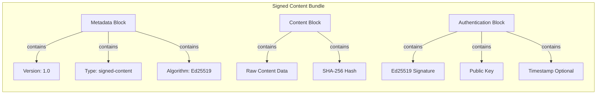
```mermaid
graph LR
    subgraph "Signed Content Bundle"
        direction TB
        META[Metadata Block]
        CONT[Content Block]
        AUTH[Authentication Block]
        
        META --> |contains| VER[Version: 1.0]
        META --> |contains| TYPE[Type: signed-content]
        META --> |contains| ALG[Algorithm: Ed25519]
        
        CONT --> |contains| DATA[Raw Content Data]
        CONT --> |contains| HASH[SHA-256 Hash]
        
        AUTH --> |contains| SIG[Ed25519 Signature]
        AUTH --> |contains| PUB[Public Key]
        AUTH --> |contains| TS[Timestamp Optional]
    end
```

## 6. Security Architecture

### Security Boundaries

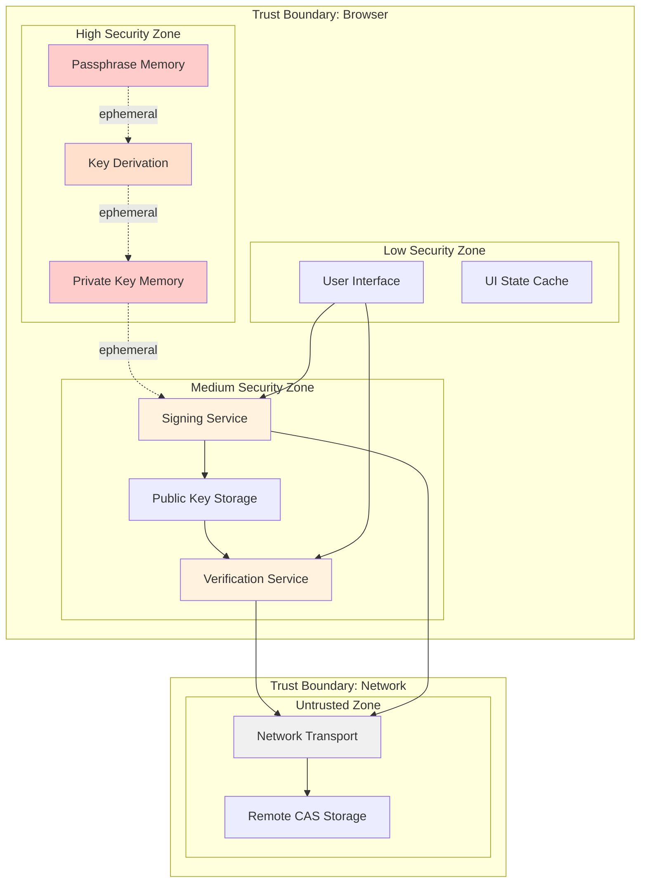
```mermaid
graph TB
    subgraph "Trust Boundary: Browser"
        subgraph "High Security Zone"
            KD[Key Derivation]
            PM[Passphrase Memory]
            PKM[Private Key Memory]
        end
        
        subgraph "Medium Security Zone"
            SS[Signing Service]
            VS[Verification Service]
            PUB[Public Key Storage]
        end
        
        subgraph "Low Security Zone"
            UI[User Interface]
            CACHE[UI State Cache]
        end
    end
    
    subgraph "Trust Boundary: Network"
        subgraph "Untrusted Zone"
            NET[Network Transport]
            CAS[Remote CAS Storage]
        end
    end
    
    PM -.->|ephemeral| KD
    KD -.->|ephemeral| PKM
    PKM -.->|ephemeral| SS
    SS --> PUB
    PUB --> VS
    
    UI --> SS
    UI --> VS
    VS --> NET
    SS --> NET
    NET --> CAS
    
    style PM fill:#ffcccc
    style PKM fill:#ffcccc
    style KD fill:#ffe0cc
    style SS fill:#fff3e0
    style VS fill:#fff3e0
    style NET fill:#f0f0f0
```

### Threat Model

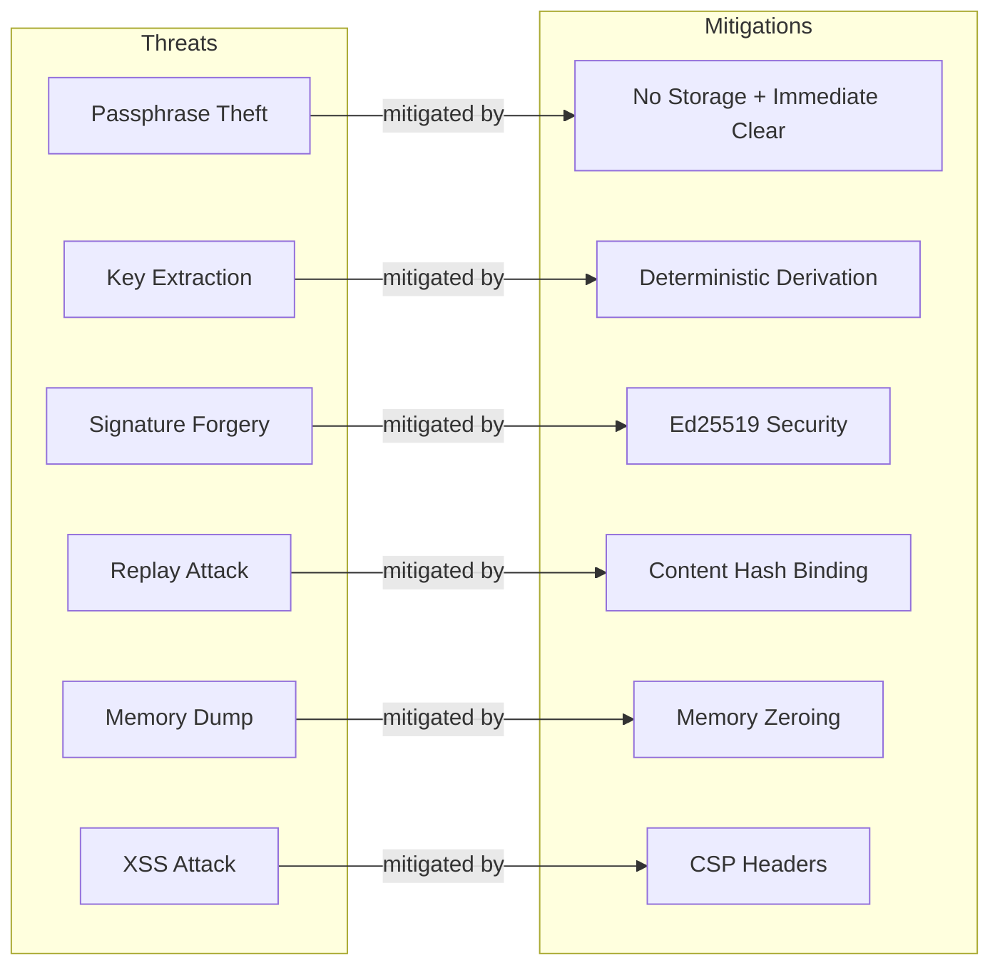
```mermaid
graph LR
    subgraph "Threats"
        T1[Passphrase Theft]
        T2[Key Extraction]
        T3[Signature Forgery]
        T4[Replay Attack]
        T5[Memory Dump]
        T6[XSS Attack]
    end
    
    subgraph "Mitigations"
        M1[No Storage + Immediate Clear]
        M2[Deterministic Derivation]
        M3[Ed25519 Security]
        M4[Content Hash Binding]
        M5[Memory Zeroing]
        M6[CSP Headers]
    end
    
    T1 -->|mitigated by| M1
    T2 -->|mitigated by| M2
    T3 -->|mitigated by| M3
    T4 -->|mitigated by| M4
    T5 -->|mitigated by| M5
    T6 -->|mitigated by| M6
```

### Security Controls

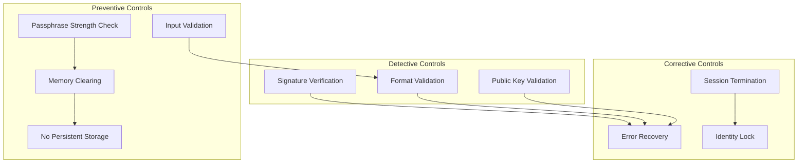
```mermaid
flowchart TB
    subgraph "Preventive Controls"
        P1[Input Validation]
        P2[Passphrase Strength Check]
        P3[Memory Clearing]
        P4[No Persistent Storage]
    end
    
    subgraph "Detective Controls"
        D1[Signature Verification]
        D2[Format Validation]
        D3[Public Key Validation]
    end
    
    subgraph "Corrective Controls"
        C1[Error Recovery]
        C2[Session Termination]
        C3[Identity Lock]
    end
    
    P1 --> D2
    P2 --> P3
    P3 --> P4
    D1 --> C1
    D2 --> C1
    D3 --> C1
    C2 --> C3
```

## 7. State Management Architecture

### Session State Model

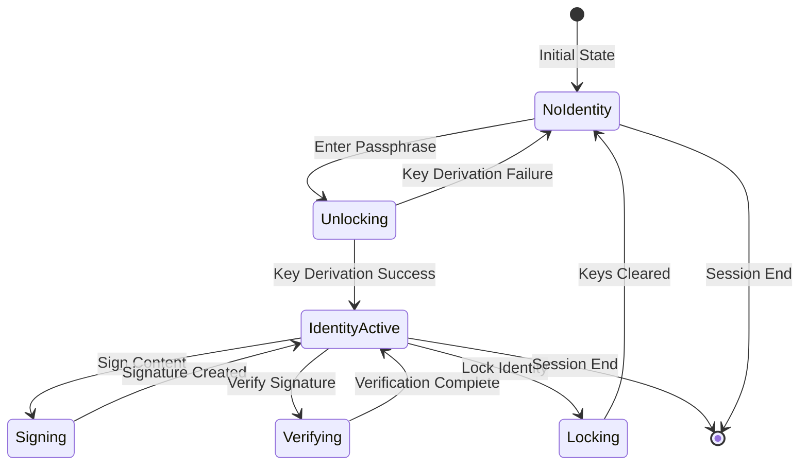
```mermaid
stateDiagram-v2
    [*] --> NoIdentity: Initial State
    
    NoIdentity --> Unlocking: Enter Passphrase
    Unlocking --> IdentityActive: Key Derivation Success
    Unlocking --> NoIdentity: Key Derivation Failure
    
    IdentityActive --> Signing: Sign Content
    Signing --> IdentityActive: Signature Created
    
    IdentityActive --> Verifying: Verify Signature
    Verifying --> IdentityActive: Verification Complete
    
    IdentityActive --> Locking: Lock Identity
    Locking --> NoIdentity: Keys Cleared
    
    IdentityActive --> [*]: Session End
    NoIdentity --> [*]: Session End
```

### Memory Lifecycle

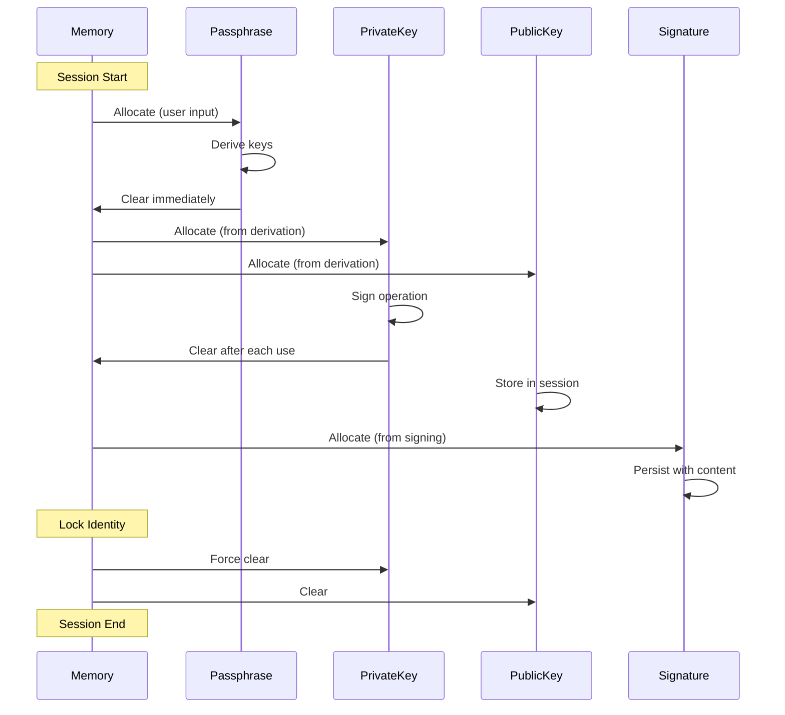
```mermaid
sequenceDiagram
    participant Memory
    participant Passphrase
    participant PrivateKey
    participant PublicKey
    participant Signature
    
    Note over Memory: Session Start
    
    Memory->>Passphrase: Allocate (user input)
    Passphrase->>Passphrase: Derive keys
    Passphrase->>Memory: Clear immediately
    
    Memory->>PrivateKey: Allocate (from derivation)
    Memory->>PublicKey: Allocate (from derivation)
    
    PrivateKey->>PrivateKey: Sign operation
    PrivateKey->>Memory: Clear after each use
    
    PublicKey->>PublicKey: Store in session
    
    Memory->>Signature: Allocate (from signing)
    Signature->>Signature: Persist with content
    
    Note over Memory: Lock Identity
    Memory->>PrivateKey: Force clear
    Memory->>PublicKey: Clear
    
    Note over Memory: Session End
```

## 8. Error Handling Architecture

### Error Flow Design

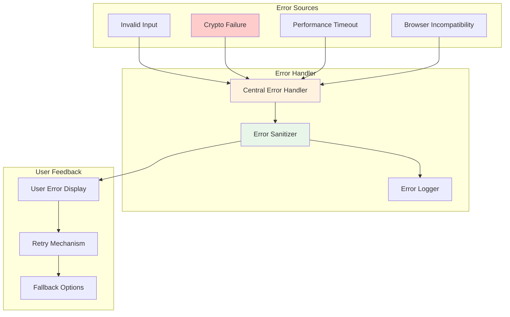
```mermaid
flowchart TB
    subgraph "Error Sources"
        E1[Invalid Input]
        E2[Crypto Failure]
        E3[Performance Timeout]
        E4[Browser Incompatibility]
    end
    
    subgraph "Error Handler"
        EH[Central Error Handler]
        EL[Error Logger]
        ES[Error Sanitizer]
    end
    
    subgraph "User Feedback"
        UE[User Error Display]
        UR[Retry Mechanism]
        UF[Fallback Options]
    end
    
    E1 --> EH
    E2 --> EH
    E3 --> EH
    E4 --> EH
    
    EH --> ES
    ES --> EL
    ES --> UE
    UE --> UR
    UR --> UF
    
    style E2 fill:#ffcccc
    style EH fill:#fff3e0
    style ES fill:#e8f5e9
```

### Error Categories and Responses

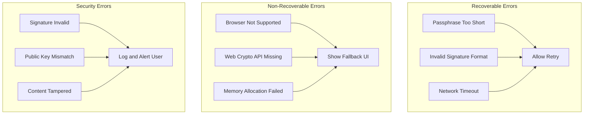
```mermaid
graph TD
    subgraph "Recoverable Errors"
        R1[Passphrase Too Short]
        R2[Invalid Signature Format]
        R3[Network Timeout]
        R1 --> RA[Allow Retry]
        R2 --> RA
        R3 --> RA
    end
    
    subgraph "Non-Recoverable Errors"
        N1[Browser Not Supported]
        N2[Web Crypto API Missing]
        N3[Memory Allocation Failed]
        N1 --> NA[Show Fallback UI]
        N2 --> NA
        N3 --> NA
    end
    
    subgraph "Security Errors"
        S1[Signature Invalid]
        S2[Public Key Mismatch]
        S3[Content Tampered]
        S1 --> SA[Log and Alert User]
        S2 --> SA
        S3 --> SA
    end
```

## 9. Performance Architecture

### Performance Budget Allocation

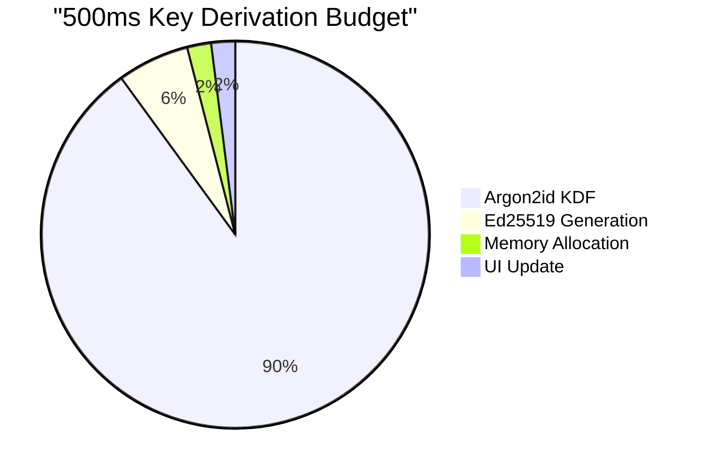
```mermaid
pie title "500ms Key Derivation Budget"
    "Argon2id KDF" : 450
    "Ed25519 Generation" : 30
    "Memory Allocation" : 10
    "UI Update" : 10
```

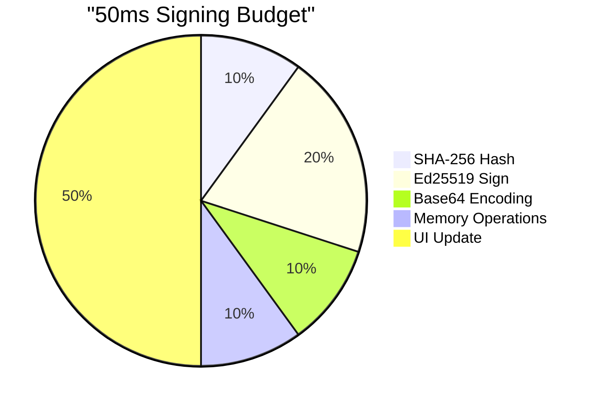
```mermaid
pie title "50ms Signing Budget"
    "SHA-256 Hash" : 5
    "Ed25519 Sign" : 10
    "Base64 Encoding" : 5
    "Memory Operations" : 5
    "UI Update" : 25
```

### Optimization Strategy

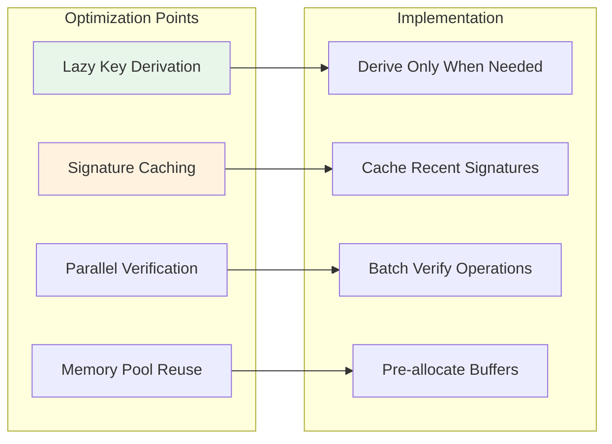
```mermaid
graph LR
    subgraph "Optimization Points"
        O1[Lazy Key Derivation]
        O2[Signature Caching]
        O3[Parallel Verification]
        O4[Memory Pool Reuse]
    end
    
    subgraph "Implementation"
        I1[Derive Only When Needed]
        I2[Cache Recent Signatures]
        I3[Batch Verify Operations]
        I4[Pre-allocate Buffers]
    end
    
    O1 --> I1
    O2 --> I2
    O3 --> I3
    O4 --> I4
    
    style O1 fill:#e8f5e9
    style O2 fill:#fff3e0
```

## 10. Extension Points (Open/Closed Principle)

### Extensibility Design

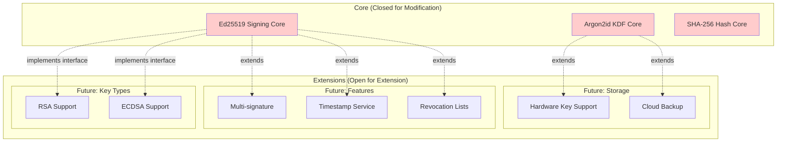
```mermaid
graph TB
    subgraph "Core (Closed for Modification)"
        CORE[Ed25519 Signing Core]
        KDF[Argon2id KDF Core]
        HASH[SHA-256 Hash Core]
    end
    
    subgraph "Extensions (Open for Extension)"
        subgraph "Future: Key Types"
            FK1[RSA Support]
            FK2[ECDSA Support]
        end
        
        subgraph "Future: Storage"
            FS1[Hardware Key Support]
            FS2[Cloud Backup]
        end
        
        subgraph "Future: Features"
            FF1[Multi-signature]
            FF2[Timestamp Service]
            FF3[Revocation Lists]
        end
    end
    
    CORE -.->|implements interface| FK1
    CORE -.->|implements interface| FK2
    KDF -.->|extends| FS1
    KDF -.->|extends| FS2
    CORE -.->|extends| FF1
    CORE -.->|extends| FF2
    CORE -.->|extends| FF3
    
    style CORE fill:#ffcccc
    style KDF fill:#ffcccc
    style HASH fill:#ffcccc
```

## 11. Design Decisions

### Why This Approach (KISS)
1. **Single Key Pair**: Eliminates complex key management
2. **Deterministic Derivation**: No storage infrastructure needed
3. **Passphrase + Username**: Simple, memorable identity system
4. **No Persistence**: Reduces attack surface dramatically
5. **Standard Algorithms Only**: Proven security, wide support

### What We're NOT Building (YAGNI)
- ❌ Key rotation mechanisms (not needed for MVP)
- ❌ Recovery systems (deterministic keys are self-recovering)
- ❌ Multi-device sync (same passphrase works everywhere)
- ❌ Certificate infrastructure (direct key trust is simpler)
- ❌ Encryption capabilities (only signing needed now)
- ❌ Complex key hierarchies (single key sufficient)

### How We Avoid Duplication (DRY)
- Single source of truth for key derivation logic
- Shared hashing service for all content operations
- Unified error handling across all crypto operations
- Common validation logic for all inputs
- Centralized memory management strategy

## 12. Failure Scenarios

### Failure Analysis

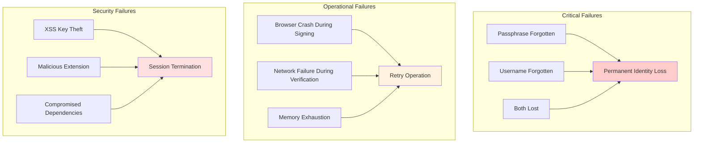
```mermaid
graph TD
    subgraph "Critical Failures"
        CF1[Passphrase Forgotten]
        CF2[Username Forgotten]
        CF3[Both Lost]
        
        CF1 --> CFR[Permanent Identity Loss]
        CF2 --> CFR
        CF3 --> CFR
    end
    
    subgraph "Operational Failures"
        OF1[Browser Crash During Signing]
        OF2[Network Failure During Verification]
        OF3[Memory Exhaustion]
        
        OF1 --> OFR[Retry Operation]
        OF2 --> OFR
        OF3 --> OFR
    end
    
    subgraph "Security Failures"
        SF1[XSS Key Theft]
        SF2[Malicious Extension]
        SF3[Compromised Dependencies]
        
        SF1 --> SFR[Session Termination]
        SF2 --> SFR
        SF3 --> SFR
    end
    
    style CFR fill:#ffcccc
    style OFR fill:#fff3e0
    style SFR fill:#ffe0e0
```

## 13. Implementation Guidance

### Critical Implementation Requirements

1. **Memory Security**
   - MUST zero all key material after use
   - MUST use crypto.subtle.generateKey with extractable=false where possible
   - MUST clear passphrase variables immediately after derivation

2. **Timing Security**
   - MUST use constant-time comparison for signatures
   - MUST NOT leak timing information in error paths
   - MUST complete operations within performance budgets

3. **Input Validation**
   - MUST validate all base64 inputs before decoding
   - MUST check key sizes match Ed25519 requirements
   - MUST enforce minimum passphrase length

4. **Error Handling**
   - MUST NOT include sensitive data in error messages
   - MUST provide clear user feedback without technical details
   - MUST allow recovery from all non-critical failures

### Testing Strategy

```mermaid
graph LR
    subgraph "Unit Tests"
        UT1[Key Derivation Determinism]
        UT2[Signature Verification]
        UT3[Input Validation]
        UT4[Error Handling]
    end
    
    subgraph "Integration Tests"
        IT1[End-to-End Signing Flow]
        IT2[CAS Integration]
        IT3[Browser Compatibility]
    end
    
    subgraph "Security Tests"
        ST1[Memory Clearing Verification]
        ST2[Timing Attack Resistance]
        ST3[Input Fuzzing]
    end
    
    subgraph "Performance Tests"
        PT1[Key Derivation < 500ms]
        PT2[Signing < 50ms]
        PT3[Verification < 50ms]
    end
    
    UT1 --> IT1
    UT2 --> IT1
    IT1 --> ST1
    IT2 --> PT1
```

## 14. Critical Implementation Notes

### Implementation Order (Recommended)
1. **Browser Detection & Fallback** - Ensure Web Crypto API availability first
2. **Memory Management Layer** - Implement secure buffer handling before crypto
3. **Key Derivation Service** - Core deterministic derivation with Argon2id
4. **Signing/Verification Services** - Build on stable key derivation
5. **UI Integration** - Connect services with proper state management
6. **CAS Integration** - Add storage layer last

### Critical Path Dependencies
```mermaid
graph LR
    subgraph "Must Complete First"
        BC[Browser Check] --> MM[Memory Manager]
        MM --> KD[Key Derivation]
    end
    
    subgraph "Can Parallelize"
        KD --> SS[Signing Service]
        KD --> VS[Verification Service]
    end
    
    subgraph "Integration Phase"
        SS --> UI[UI Components]
        VS --> UI
        UI --> CAS[CAS Storage]
    end
    
    style BC fill:#ff9999
    style MM fill:#ff9999
    style KD fill:#ff9999
```

### Non-Negotiable Implementation Requirements
1. **NEVER** store private keys, even temporarily in localStorage/sessionStorage
2. **ALWAYS** zero memory after cryptographic operations
3. **NEVER** log sensitive data (passphrases, private keys, seeds)
4. **ALWAYS** validate base64 inputs before processing
5. **NEVER** catch and suppress cryptographic errors silently
6. **ALWAYS** use constant-time operations for signature verification

## 15. Summary

This architecture provides a simple, secure, and performant cryptographic system for NoLock.social that:

1. **Solves the Core Problem**: Enables content authorship proof without central authority
2. **Maintains Simplicity**: Single key pair, deterministic derivation, no storage
3. **Ensures Security**: Clear boundaries, proper key hygiene, standard algorithms
4. **Enables Extension**: Clean interfaces for future enhancements
5. **Meets Performance**: All operations within specified budgets

The design follows SOLID principles throughout, keeping components focused, interfaces clean, and the system open for extension while closed for modification. Most importantly, it embraces KISS and YAGNI by avoiding unnecessary complexity and focusing solely on the MVP requirements.

---
*End of Architecture Design Document*