# Cryptographic Integration Contracts

## Document Information
- **Version**: 1.0.0
- **Date**: 2025-08-13
- **Status**: MVP Integration Specification
- **Purpose**: Define integration contracts and boundaries for cryptographic components

## 1. Service Contracts

### Core Service Interfaces

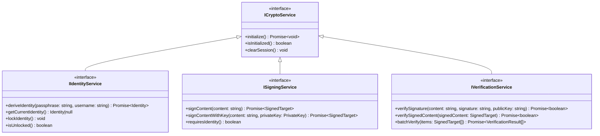
```mermaid
classDiagram
    class ICryptoService {
        <<interface>>
        +initialize() Promise~void~
        +isInitialized() boolean
        +clearSession() void
    }
    
    class IIdentityService {
        <<interface>>
        +deriveIdentity(passphrase: string, username: string) Promise~Identity~
        +getCurrentIdentity() Identity|null
        +lockIdentity() void
        +isUnlocked() boolean
    }
    
    class ISigningService {
        <<interface>>
        +signContent(content: string) Promise~SignedTarget~
        +signContentWithKey(content: string, privateKey: PrivateKey) Promise~SignedTarget~
        +requiresIdentity() boolean
    }
    
    class IVerificationService {
        <<interface>>
        +verifySignature(content: string, signature: string, publicKey: string) Promise~boolean~
        +verifySignedContent(signedContent: SignedTarget) Promise~boolean~
        +batchVerify(items: SignedTarget[]) Promise~VerificationResult[]~
    }
    
    ICryptoService <|-- IIdentityService
    ICryptoService <|-- ISigningService
    ICryptoService <|-- IVerificationService
```

### Data Transfer Objects

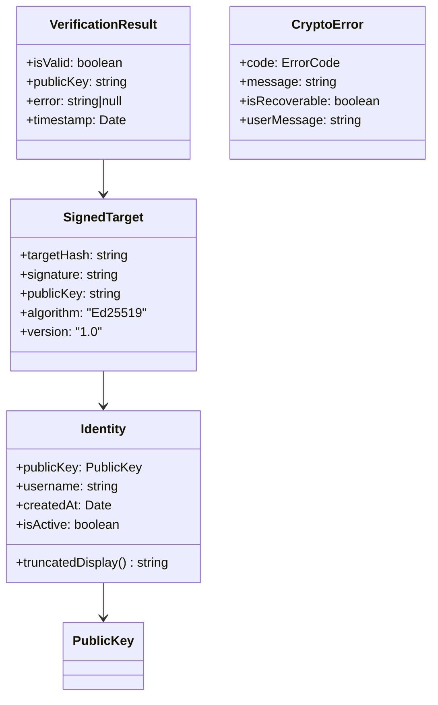
```mermaid
classDiagram
    class Identity {
        +publicKey: PublicKey
        +username: string
        +createdAt: Date
        +isActive: boolean
        +truncatedDisplay() string
    }
    
    class SignedTarget {
        +targetHash: string
        +signature: string
        +publicKey: string
        +algorithm: "Ed25519"
        +version: "1.0"
    }
    
    class VerificationResult {
        +isValid: boolean
        +publicKey: string
        +error: string|null
        +timestamp: Date
    }
    
    class CryptoError {
        +code: ErrorCode
        +message: string
        +isRecoverable: boolean
        +userMessage: string
    }
    
    Identity --> PublicKey
    SignedTarget --> Identity
    VerificationResult --> SignedTarget
```

## 2. Integration Patterns

### Service Initialization Pattern

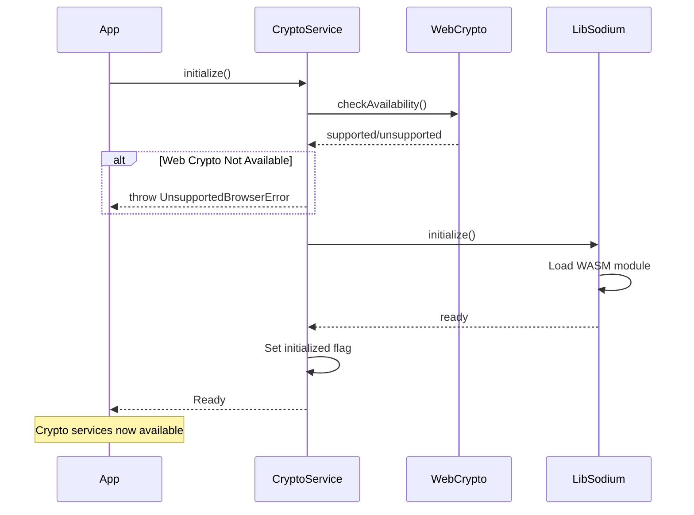
```mermaid
sequenceDiagram
    participant App
    participant CryptoService
    participant WebCrypto
    participant LibSodium
    
    App->>CryptoService: initialize()
    
    CryptoService->>WebCrypto: checkAvailability()
    WebCrypto-->>CryptoService: supported/unsupported
    
    alt Web Crypto Not Available
        CryptoService-->>App: throw UnsupportedBrowserError
    end
    
    CryptoService->>LibSodium: initialize()
    LibSodium->>LibSodium: Load WASM module
    LibSodium-->>CryptoService: ready
    
    CryptoService->>CryptoService: Set initialized flag
    CryptoService-->>App: Ready
    
    Note over App: Crypto services now available
```

### Lazy Identity Loading Pattern

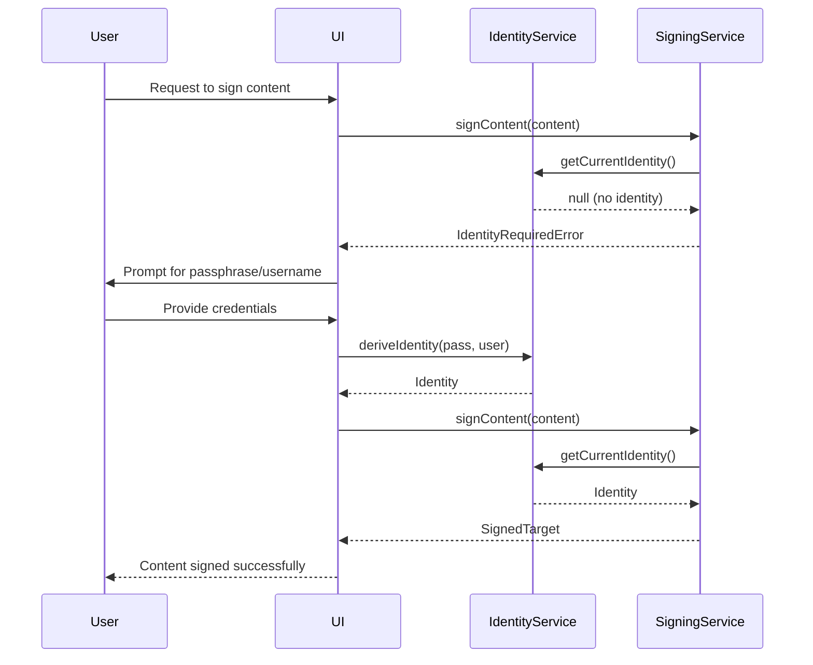
```mermaid
sequenceDiagram
    participant User
    participant UI
    participant IdentityService
    participant SigningService
    
    User->>UI: Request to sign content
    UI->>SigningService: signContent(content)
    
    SigningService->>IdentityService: getCurrentIdentity()
    IdentityService-->>SigningService: null (no identity)
    
    SigningService-->>UI: IdentityRequiredError
    
    UI->>User: Prompt for passphrase/username
    User->>UI: Provide credentials
    
    UI->>IdentityService: deriveIdentity(pass, user)
    IdentityService-->>UI: Identity
    
    UI->>SigningService: signContent(content)
    SigningService->>IdentityService: getCurrentIdentity()
    IdentityService-->>SigningService: Identity
    
    SigningService-->>UI: SignedTarget
    UI-->>User: Content signed successfully
```

## 3. CAS Integration Contract

### Storage Adapter Interface

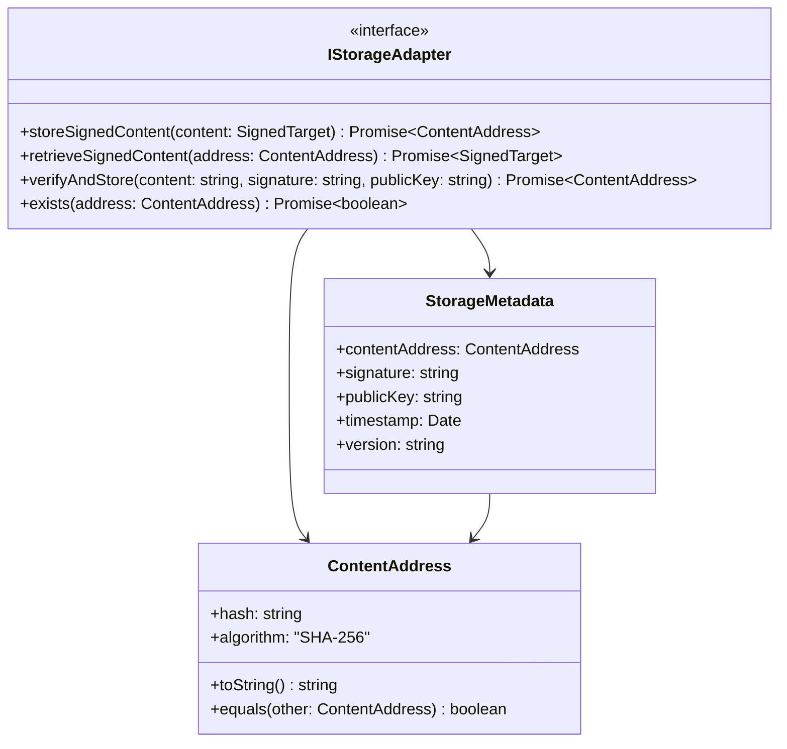
```mermaid
classDiagram
    class IStorageAdapter {
        <<interface>>
        +storeSignedContent(content: SignedTarget) Promise~ContentAddress~
        +retrieveSignedContent(address: ContentAddress) Promise~SignedTarget~
        +verifyAndStore(content: string, signature: string, publicKey: string) Promise~ContentAddress~
        +exists(address: ContentAddress) Promise~boolean~
    }
    
    class ContentAddress {
        +hash: string
        +algorithm: "SHA-256"
        +toString() string
        +equals(other: ContentAddress) boolean
    }
    
    class StorageMetadata {
        +contentAddress: ContentAddress
        +signature: string
        +publicKey: string
        +timestamp: Date
        +version: string
    }
    
    IStorageAdapter --> ContentAddress
    IStorageAdapter --> StorageMetadata
    StorageMetadata --> ContentAddress
```

### CAS Integration Flow

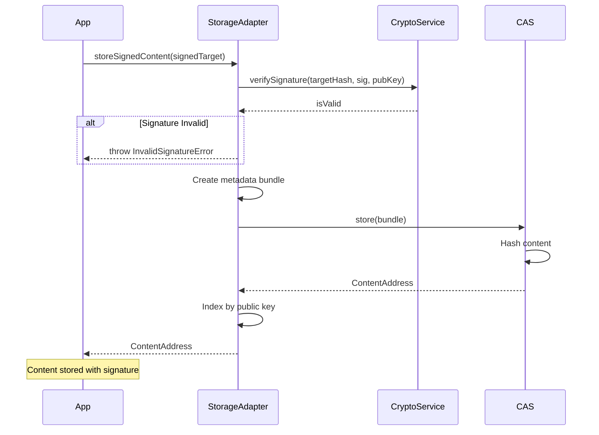
```mermaid
sequenceDiagram
    participant App
    participant StorageAdapter
    participant CryptoService
    participant CAS
    
    App->>StorageAdapter: storeSignedContent(signedTarget)
    
    StorageAdapter->>CryptoService: verifySignature(targetHash, sig, pubKey)
    CryptoService-->>StorageAdapter: isValid
    
    alt Signature Invalid
        StorageAdapter-->>App: throw InvalidSignatureError
    end
    
    StorageAdapter->>StorageAdapter: Create metadata bundle
    StorageAdapter->>CAS: store(bundle)
    CAS->>CAS: Hash content
    CAS-->>StorageAdapter: ContentAddress
    
    StorageAdapter->>StorageAdapter: Index by public key
    StorageAdapter-->>App: ContentAddress
    
    Note over App: Content stored with signature
```

## 4. Browser API Contracts

### Web Crypto API Usage

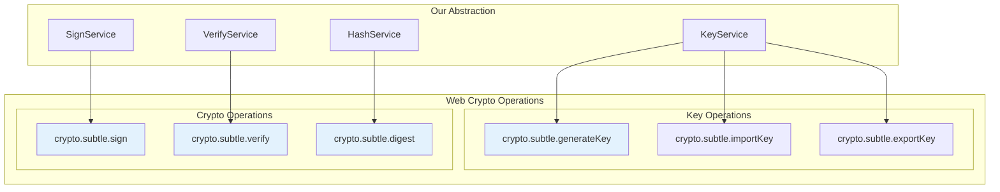
```mermaid
graph TB
    subgraph "Web Crypto Operations"
        subgraph "Key Operations"
            GK[crypto.subtle.generateKey]
            IK[crypto.subtle.importKey]
            EK[crypto.subtle.exportKey]
        end
        
        subgraph "Crypto Operations"
            SGN[crypto.subtle.sign]
            VFY[crypto.subtle.verify]
            DIG[crypto.subtle.digest]
        end
    end
    
    subgraph "Our Abstraction"
        KS[KeyService]
        SS[SignService]
        VS[VerifyService]
        HS[HashService]
    end
    
    KS --> GK
    KS --> IK
    KS --> EK
    SS --> SGN
    VS --> VFY
    HS --> DIG
    
    style GK fill:#e3f2fd
    style SGN fill:#e3f2fd
    style VFY fill:#e3f2fd
    style DIG fill:#e3f2fd
```

### LibSodium Integration

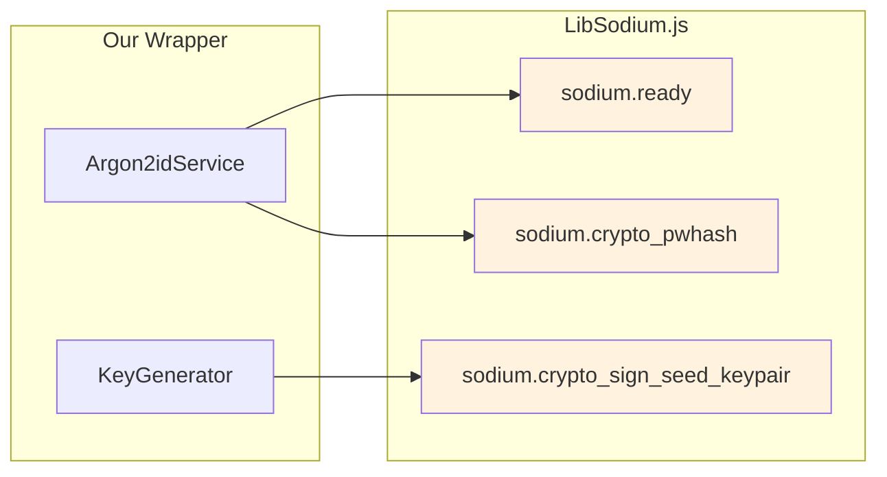
```mermaid
graph LR
    subgraph "LibSodium.js"
        INIT[sodium.ready]
        ARG[sodium.crypto_pwhash]
        SEED[sodium.crypto_sign_seed_keypair]
    end
    
    subgraph "Our Wrapper"
        KDF[Argon2idService]
        KG[KeyGenerator]
    end
    
    KDF --> INIT
    KDF --> ARG
    KG --> SEED
    
    style INIT fill:#fff3e0
    style ARG fill:#fff3e0
    style SEED fill:#fff3e0
```

## 5. Error Handling Contracts

### Error Hierarchy

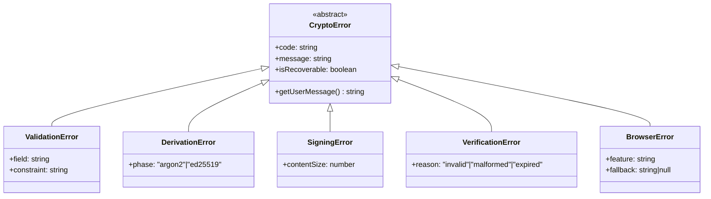
```mermaid
classDiagram
    class CryptoError {
        <<abstract>>
        +code: string
        +message: string
        +isRecoverable: boolean
        +getUserMessage() string
    }
    
    class ValidationError {
        +field: string
        +constraint: string
    }
    
    class DerivationError {
        +phase: "argon2"|"ed25519"
    }
    
    class SigningError {
        +contentSize: number
    }
    
    class VerificationError {
        +reason: "invalid"|"malformed"|"expired"
    }
    
    class BrowserError {
        +feature: string
        +fallback: string|null
    }
    
    CryptoError <|-- ValidationError
    CryptoError <|-- DerivationError
    CryptoError <|-- SigningError
    CryptoError <|-- VerificationError
    CryptoError <|-- BrowserError
```

### Error Recovery Strategy

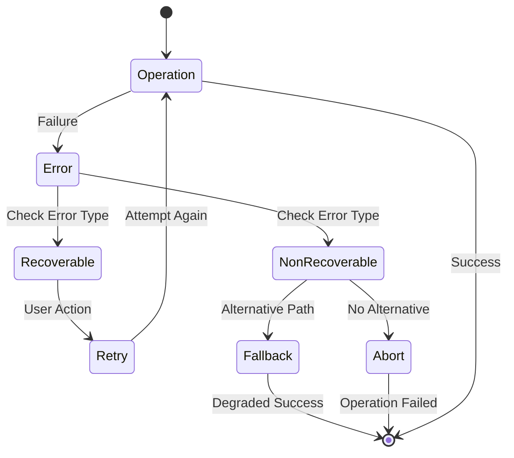
```mermaid
stateDiagram-v2
    [*] --> Operation
    
    Operation --> Error: Failure
    
    Error --> Recoverable: Check Error Type
    Error --> NonRecoverable: Check Error Type
    
    Recoverable --> Retry: User Action
    Retry --> Operation: Attempt Again
    
    NonRecoverable --> Fallback: Alternative Path
    NonRecoverable --> Abort: No Alternative
    
    Fallback --> [*]: Degraded Success
    Abort --> [*]: Operation Failed
    Operation --> [*]: Success
```

## 6. Performance Contracts

### Performance SLA

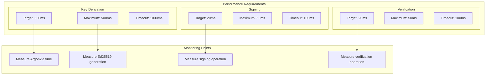
```mermaid
graph TD
    subgraph "Performance Requirements"
        subgraph "Key Derivation"
            KD1[Target: 300ms]
            KD2[Maximum: 500ms]
            KD3[Timeout: 1000ms]
        end
        
        subgraph "Signing"
            S1[Target: 20ms]
            S2[Maximum: 50ms]
            S3[Timeout: 100ms]
        end
        
        subgraph "Verification"
            V1[Target: 20ms]
            V2[Maximum: 50ms]
            V3[Timeout: 100ms]
        end
    end
    
    subgraph "Monitoring Points"
        M1[Measure Argon2id time]
        M2[Measure Ed25519 generation]
        M3[Measure signing operation]
        M4[Measure verification operation]
    end
    
    KD1 --> M1
    KD2 --> M2
    S1 --> M3
    V1 --> M4
```

### Performance Monitoring Interface

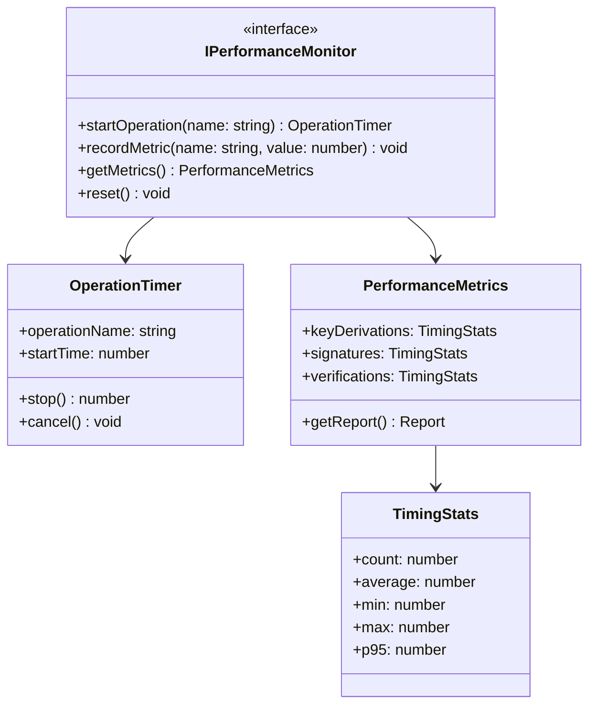
```mermaid
classDiagram
    class IPerformanceMonitor {
        <<interface>>
        +startOperation(name: string) OperationTimer
        +recordMetric(name: string, value: number) void
        +getMetrics() PerformanceMetrics
        +reset() void
    }
    
    class OperationTimer {
        +operationName: string
        +startTime: number
        +stop() number
        +cancel() void
    }
    
    class PerformanceMetrics {
        +keyDerivations: TimingStats
        +signatures: TimingStats
        +verifications: TimingStats
        +getReport() Report
    }
    
    class TimingStats {
        +count: number
        +average: number
        +min: number
        +max: number
        +p95: number
    }
    
    IPerformanceMonitor --> OperationTimer
    IPerformanceMonitor --> PerformanceMetrics
    PerformanceMetrics --> TimingStats
```

## 7. State Management Contract

### Session State Interface

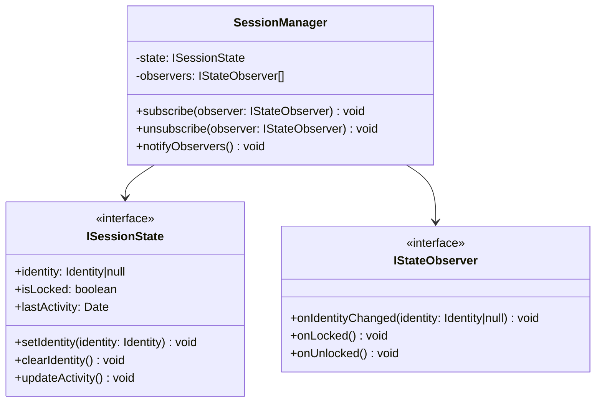
```mermaid
classDiagram
    class ISessionState {
        <<interface>>
        +identity: Identity|null
        +isLocked: boolean
        +lastActivity: Date
        +setIdentity(identity: Identity) void
        +clearIdentity() void
        +updateActivity() void
    }
    
    class IStateObserver {
        <<interface>>
        +onIdentityChanged(identity: Identity|null) void
        +onLocked() void
        +onUnlocked() void
    }
    
    class SessionManager {
        -state: ISessionState
        -observers: IStateObserver[]
        +subscribe(observer: IStateObserver) void
        +unsubscribe(observer: IStateObserver) void
        +notifyObservers() void
    }
    
    SessionManager --> ISessionState
    SessionManager --> IStateObserver
```

### State Transition Rules

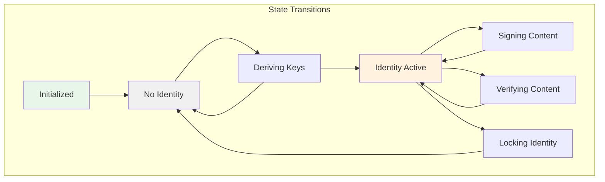
```mermaid
graph TD
    subgraph "State Transitions"
        INIT[Initialized]
        IDLE[No Identity]
        DERIVING[Deriving Keys]
        ACTIVE[Identity Active]
        SIGNING[Signing Content]
        VERIFYING[Verifying Content]
        LOCKING[Locking Identity]
    end
    
    INIT --> IDLE
    IDLE --> DERIVING
    DERIVING --> ACTIVE
    DERIVING --> IDLE
    
    ACTIVE --> SIGNING
    SIGNING --> ACTIVE
    
    ACTIVE --> VERIFYING
    VERIFYING --> ACTIVE
    
    ACTIVE --> LOCKING
    LOCKING --> IDLE
    
    style INIT fill:#e8f5e9
    style ACTIVE fill:#fff3e0
    style IDLE fill:#f0f0f0
```

## 8. Security Contracts

### Memory Security Interface

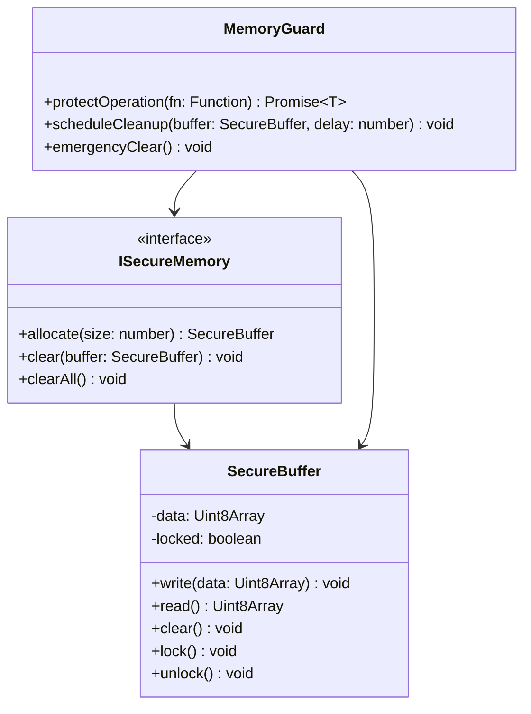
```mermaid
classDiagram
    class ISecureMemory {
        <<interface>>
        +allocate(size: number) SecureBuffer
        +clear(buffer: SecureBuffer) void
        +clearAll() void
    }
    
    class SecureBuffer {
        -data: Uint8Array
        -locked: boolean
        +write(data: Uint8Array) void
        +read() Uint8Array
        +clear() void
        +lock() void
        +unlock() void
    }
    
    class MemoryGuard {
        +protectOperation(fn: Function) Promise~T~
        +scheduleCleanup(buffer: SecureBuffer, delay: number) void
        +emergencyClear() void
    }
    
    ISecureMemory --> SecureBuffer
    MemoryGuard --> ISecureMemory
    MemoryGuard --> SecureBuffer
```

### Security Validation Rules

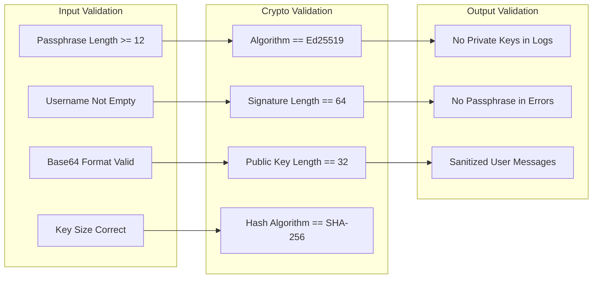
```mermaid
graph LR
    subgraph "Input Validation"
        IV1[Passphrase Length >= 12]
        IV2[Username Not Empty]
        IV3[Base64 Format Valid]
        IV4[Key Size Correct]
    end
    
    subgraph "Crypto Validation"
        CV1[Algorithm == Ed25519]
        CV2[Signature Length == 64]
        CV3[Public Key Length == 32]
        CV4[Hash Algorithm == SHA-256]
    end
    
    subgraph "Output Validation"
        OV1[No Private Keys in Logs]
        OV2[No Passphrase in Errors]
        OV3[Sanitized User Messages]
    end
    
    IV1 --> CV1
    IV2 --> CV2
    IV3 --> CV3
    IV4 --> CV4
    
    CV1 --> OV1
    CV2 --> OV2
    CV3 --> OV3
```

## 9. Testing Contracts

### Test Interface Requirements

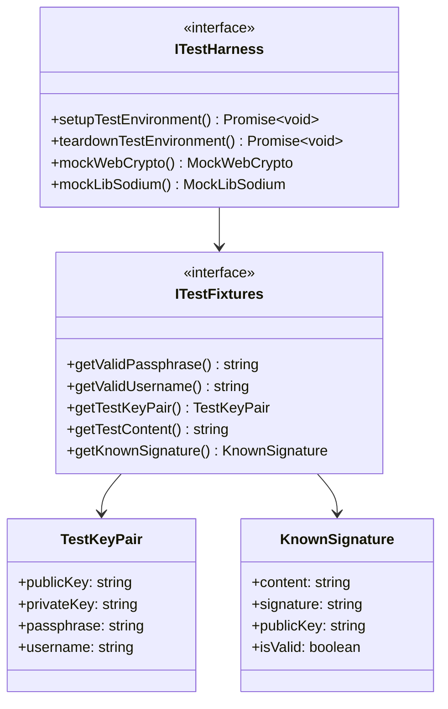
```mermaid
classDiagram
    class ITestHarness {
        <<interface>>
        +setupTestEnvironment() Promise~void~
        +teardownTestEnvironment() Promise~void~
        +mockWebCrypto() MockWebCrypto
        +mockLibSodium() MockLibSodium
    }
    
    class ITestFixtures {
        <<interface>>
        +getValidPassphrase() string
        +getValidUsername() string
        +getTestKeyPair() TestKeyPair
        +getTestContent() string
        +getKnownSignature() KnownSignature
    }
    
    class TestKeyPair {
        +publicKey: string
        +privateKey: string
        +passphrase: string
        +username: string
    }
    
    class KnownSignature {
        +content: string
        +signature: string
        +publicKey: string
        +isValid: boolean
    }
    
    ITestHarness --> ITestFixtures
    ITestFixtures --> TestKeyPair
    ITestFixtures --> KnownSignature
```

## 10. Critical Parameter Consistency

### Immutable Argon2id Parameters
**WARNING**: These parameters MUST NEVER change after MVP launch as they affect key derivation determinism.

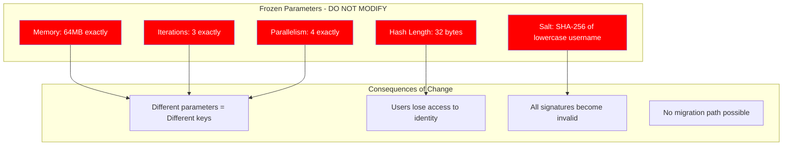
```mermaid
graph TD
    subgraph "Frozen Parameters - DO NOT MODIFY"
        P1[Memory: 64MB exactly]
        P2[Iterations: 3 exactly]
        P3[Parallelism: 4 exactly]
        P4[Hash Length: 32 bytes]
        P5[Salt: SHA-256 of lowercase username]
    end
    
    subgraph "Consequences of Change"
        C1[Different parameters = Different keys]
        C2[Users lose access to identity]
        C3[All signatures become invalid]
        C4[No migration path possible]
    end
    
    P1 --> C1
    P2 --> C1
    P3 --> C1
    P4 --> C2
    P5 --> C3
    
    style P1 fill:#ff0000,color:#fff
    style P2 fill:#ff0000,color:#fff
    style P3 fill:#ff0000,color:#fff
    style P4 fill:#ff0000,color:#fff
    style P5 fill:#ff0000,color:#fff
```

### Parameter Verification Contract
```typescript
interface IArgon2Parameters {
    readonly memory: 65536;        // 64MB in KiB - IMMUTABLE
    readonly iterations: 3;         // Exactly 3 - IMMUTABLE
    readonly parallelism: 4;        // Exactly 4 - IMMUTABLE
    readonly hashLength: 32;        // 32 bytes - IMMUTABLE
    readonly type: "Argon2id";      // Algorithm - IMMUTABLE
    
    // This function MUST return the same parameters always
    getParameters(): Readonly<Argon2Config>;
    
    // This function MUST throw if parameters don't match expected
    validateParameters(params: Argon2Config): void;
}
```

## 11. Summary of Integration Points

### Primary Integration Boundaries

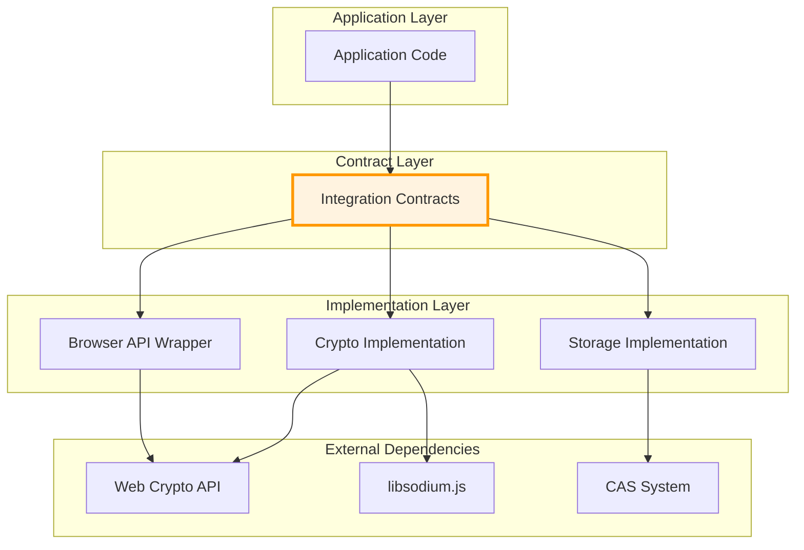
```mermaid
graph TB
    subgraph "Application Layer"
        APP[Application Code]
    end
    
    subgraph "Contract Layer"
        CONTRACTS[Integration Contracts]
    end
    
    subgraph "Implementation Layer"
        CRYPTO[Crypto Implementation]
        STORAGE[Storage Implementation]
        BROWSER[Browser API Wrapper]
    end
    
    subgraph "External Dependencies"
        WEB[Web Crypto API]
        LIB[libsodium.js]
        CAS[CAS System]
    end
    
    APP --> CONTRACTS
    CONTRACTS --> CRYPTO
    CONTRACTS --> STORAGE
    CONTRACTS --> BROWSER
    
    CRYPTO --> WEB
    CRYPTO --> LIB
    STORAGE --> CAS
    BROWSER --> WEB
    
    style CONTRACTS fill:#fff3e0,stroke:#ff9800,stroke-width:3px
```

These contracts define clear boundaries between components, ensuring that implementations can evolve independently while maintaining compatibility. The interfaces follow the Dependency Inversion Principle, depending on abstractions rather than concrete implementations.

---
*End of Integration Contracts Document*