# Cryptographic Security Architecture

## Document Information
- **Version**: 1.0.0
- **Date**: 2025-08-13
- **Status**: MVP Security Architecture
- **Purpose**: Define security architecture and threat model for cryptographic components

## 1. Security Principles

### Core Security Tenets

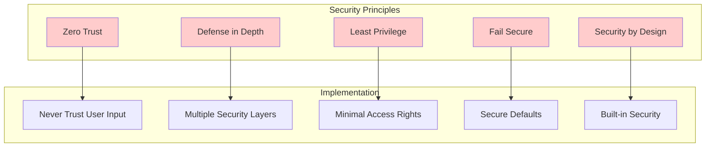

### Applied KISS Principle for Security
- **Simple is Secure**: Complex systems have more attack surface
- **Standard Algorithms**: Never roll custom crypto
- **Minimal State**: Less state = fewer vulnerabilities
- **Clear Boundaries**: Well-defined security perimeters

## 2. Threat Model

### Threat Actors and Capabilities

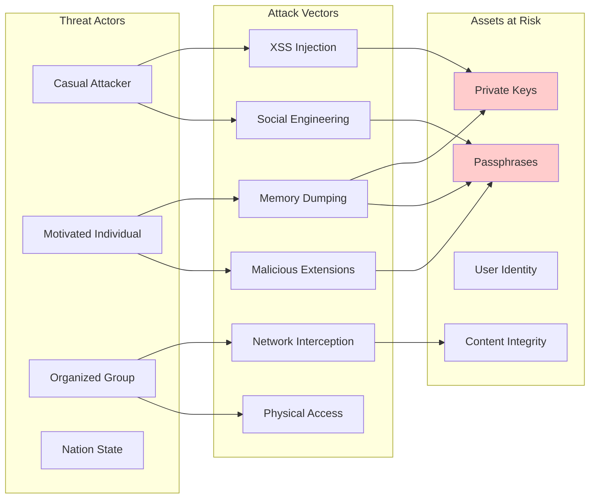

### Attack Tree Analysis

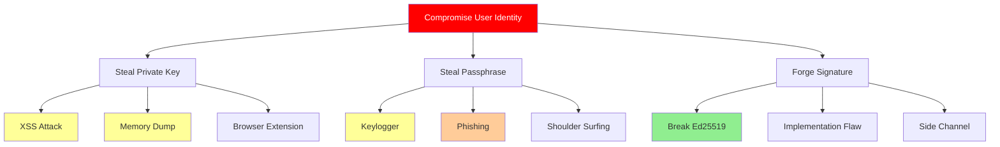

## 3. Security Architecture Layers

### Defense in Depth Implementation

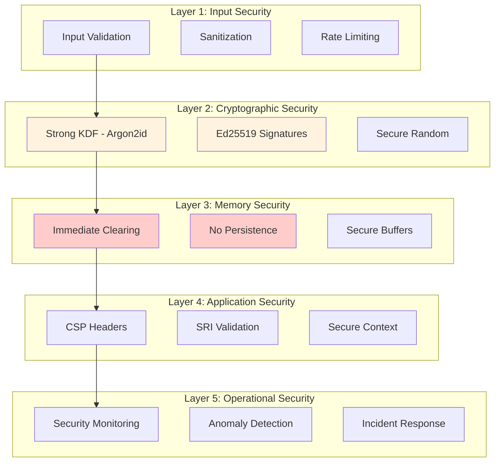

## 4. Key Management Security

### Key Lifecycle Security Model

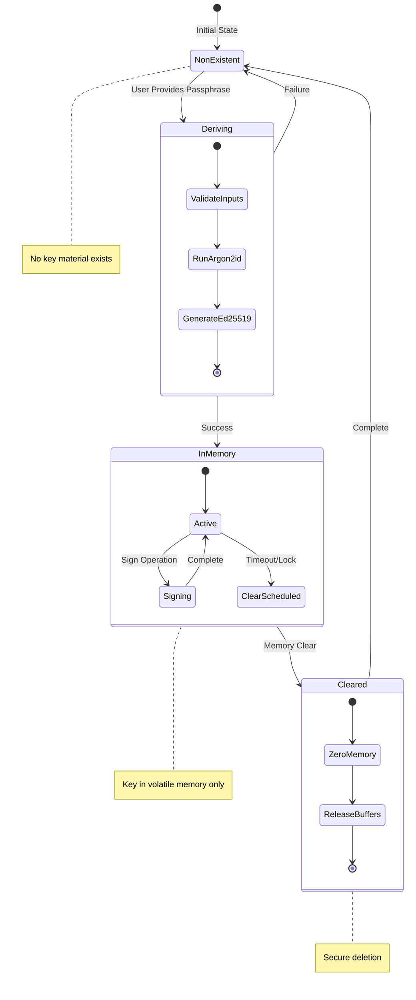

### Passphrase Security Requirements

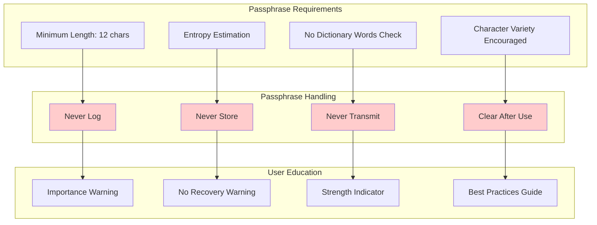

## 5. Memory Security Architecture

### Memory Protection Strategy

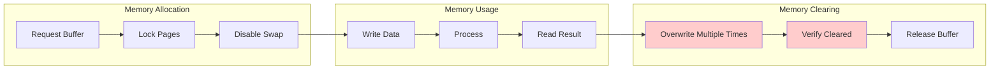

### Sensitive Data Handling

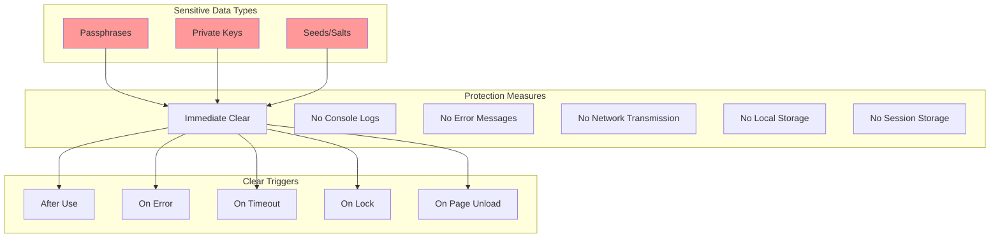

## 6. Browser Security Context

### Browser API Security

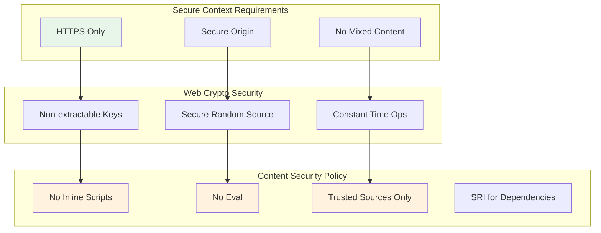

### Extension and XSS Protection

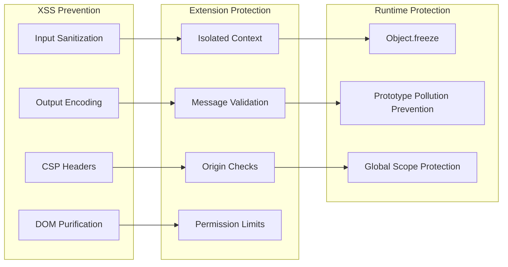

## 7. Cryptographic Security

### Algorithm Security Properties

```mermaid
graph TD
    subgraph "Argon2id Properties"
        A1[Memory Hard: 64MB]
        A2[Time Cost: 3 iterations]
        A3[Parallelism: 4 threads]
        A4[Salt: username as salt]
    end
    
    subgraph "Ed25519 Properties"
        E1[128-bit Security Level]
        E2[Deterministic Signatures]
        E3[Fast Verification]
        E4[Small Key Size]
    end
    
    subgraph "SHA-256 Properties"
        S1[Collision Resistant]
        S2[Pre-image Resistant]
        S3[256-bit Output]
        S4[Widely Analyzed]
    end
    
    A1 --> A2
    A2 --> A3
    A3 --> A4
    
    E1 --> E2
    E2 --> E3
    E3 --> E4
    
    S1 --> S2
    S2 --> S3
    S3 --> S4
    
    style A1 fill:#e8f5e9
    style E1 fill:#fff3e0
    style S1 fill:#e3f2fd
```

### Side-Channel Protection

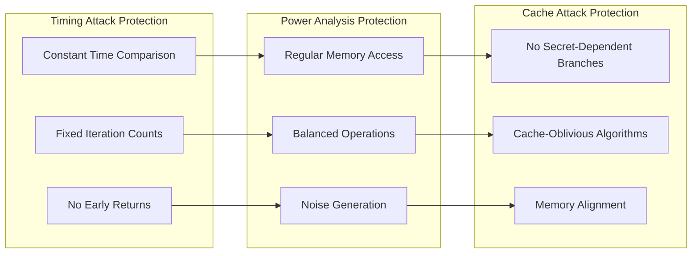

## 8. Operational Security

### Security Monitoring

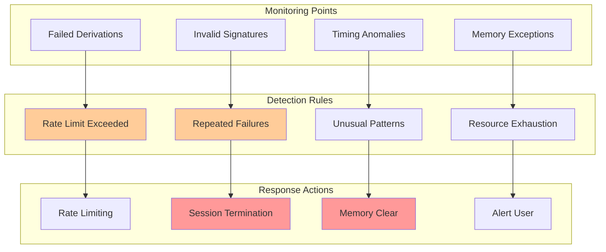

### Incident Response Plan

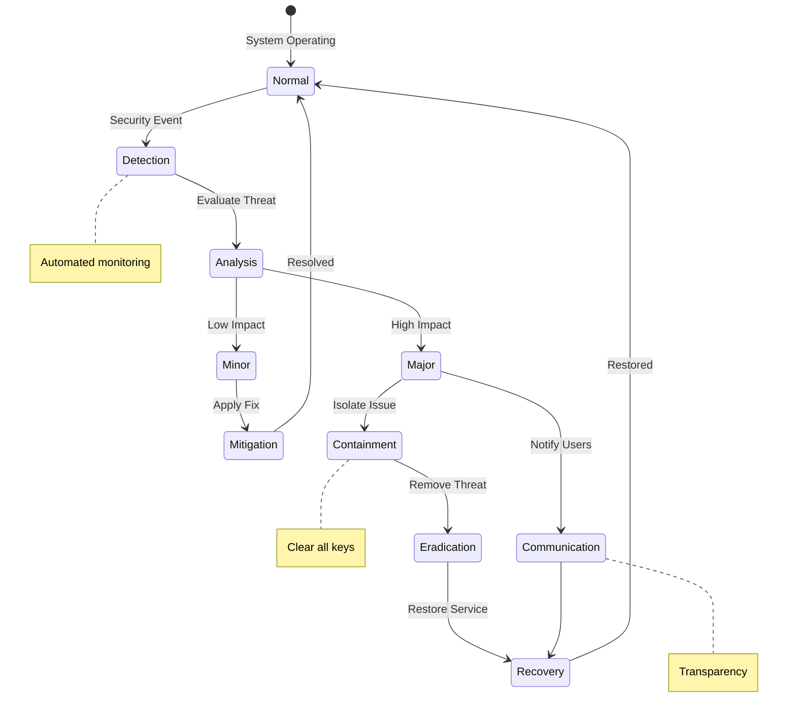

## 9. Security Testing Requirements

### Security Test Categories

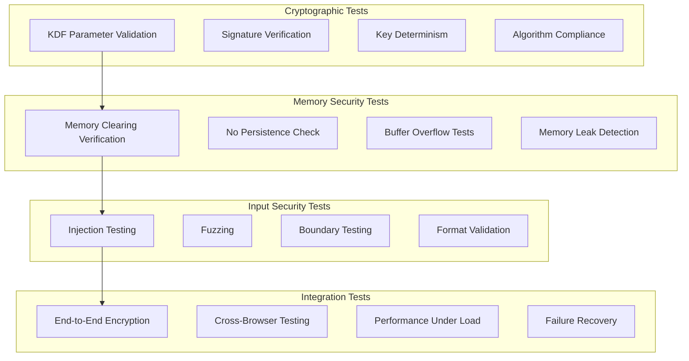

### Penetration Testing Scope

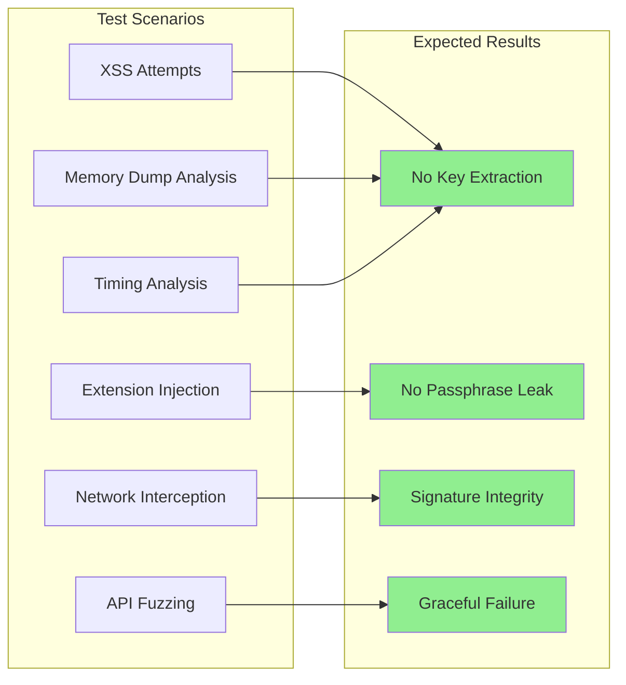

## 10. Security Compliance

### Security Standards Alignment

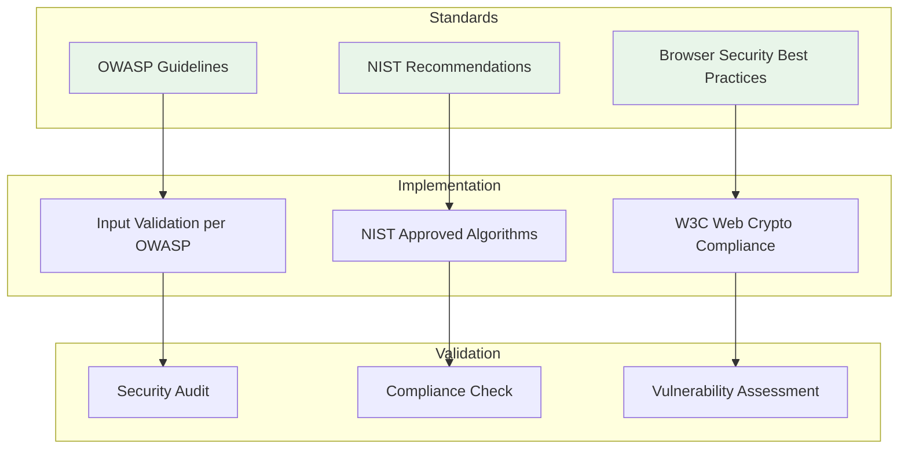

## 11. Security Risk Matrix

### Risk Assessment

| Risk | Likelihood | Impact | Mitigation | Residual Risk |
|------|------------|---------|------------|---------------|
| Passphrase theft via keylogger | Medium | Critical | User education, no storage | Medium |
| XSS key extraction | Low | Critical | CSP, input sanitization | Low |
| Memory dump attack | Low | Critical | Immediate clearing | Low |
| Weak passphrase | High | High | Strength requirements | Medium |
| Browser vulnerability | Low | High | Regular updates | Low |
| Implementation bug | Medium | High | Testing, audits | Low |
| Social engineering | Medium | Critical | User education | Medium |
| Physical access | Low | Critical | Session timeout | Low |

## 12. Rate Limiting Architecture

### Key Derivation Rate Limiting
**Critical**: Prevents brute force attacks on passphrase

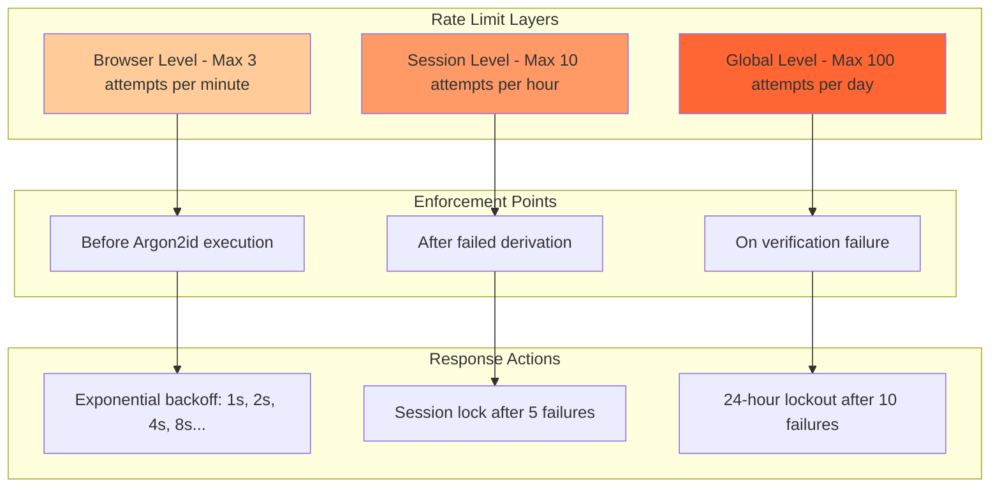

### Rate Limit Implementation
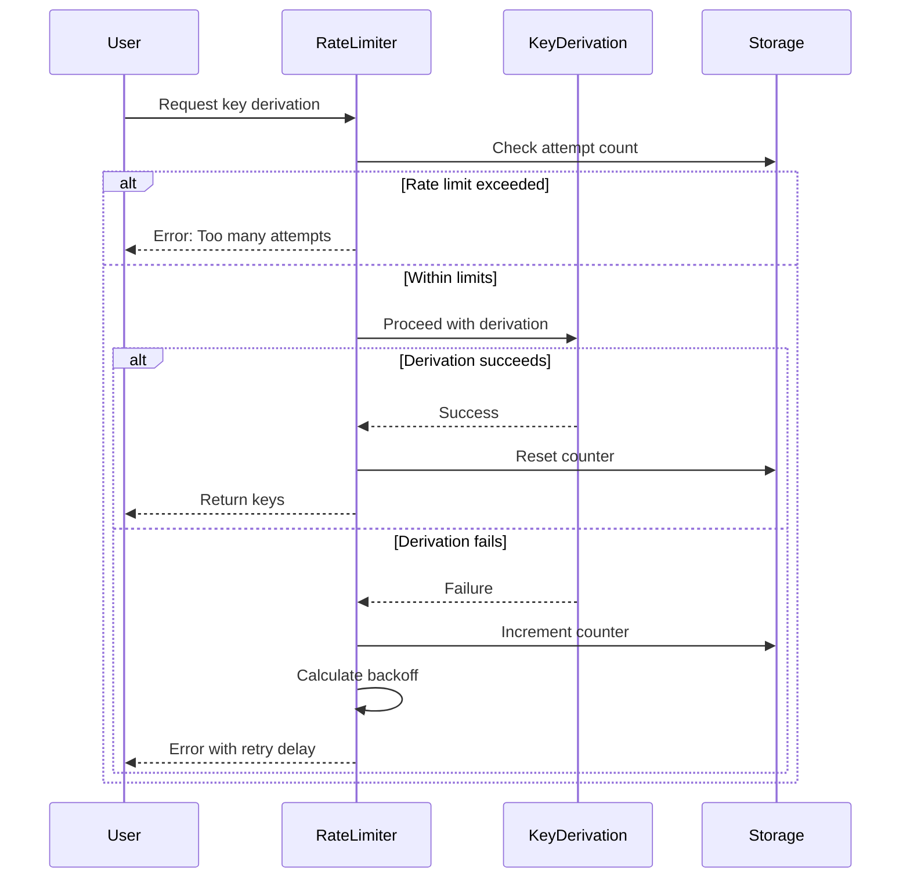

## 13. Security Recommendations

### Critical Security Controls

1. **Never Store Keys**: All keys must be ephemeral
2. **Clear Memory Immediately**: Zero out sensitive data after use
3. **Use Standard Crypto**: Only use well-tested implementations
4. **Validate Everything**: Never trust any input
5. **Fail Securely**: Default to secure state on any error
6. **Monitor Anomalies**: Detect and respond to unusual patterns
7. **Educate Users**: Security depends on user understanding

### Future Security Enhancements (Post-MVP)

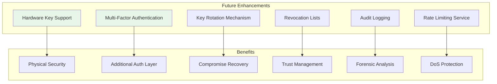

## Summary

This security architecture provides comprehensive protection for the cryptographic components while maintaining simplicity (KISS principle). The multi-layered defense strategy ensures that compromise of any single layer doesn't result in complete system failure. Most importantly, the architecture acknowledges that perfect security is impossible and focuses on making attacks expensive and detectable rather than impossible.

---
*End of Security Architecture Document*