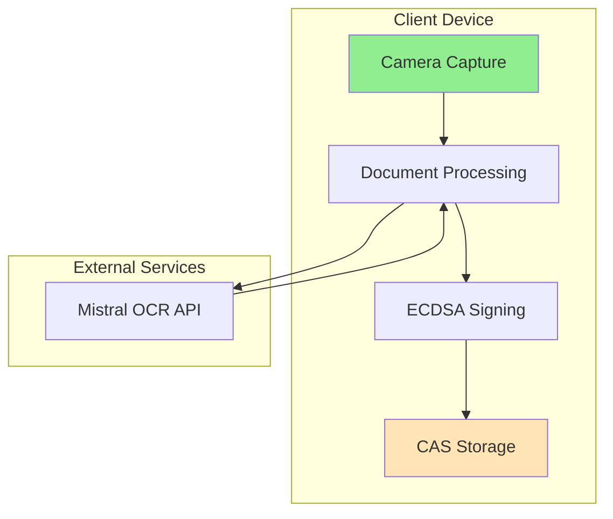
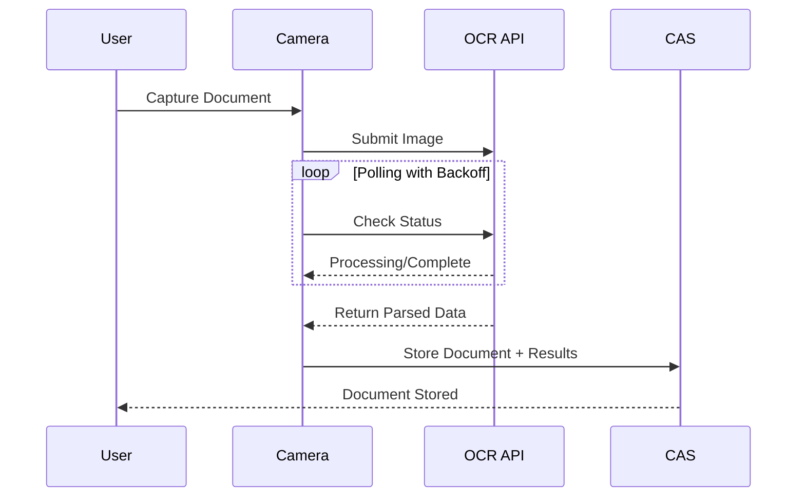
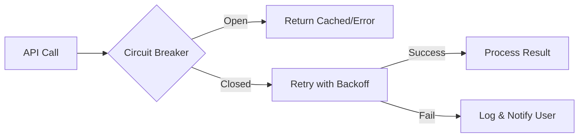

# Document Scanner and OCR Feature Architecture

## Executive Summary

Document scanning and OCR system for NoLock.Social platform using client-side processing in Blazor WebAssembly, pluggable document processors, and content-addressable storage.

## Architecture Overview

## Core Components

### 1. Document Capture
- **Technology**: Browser MediaDevices API
- **State Management**: Stateless FSM (NuGet: Stateless v5.15.0)
- **States**: Idle → RequestingPermission → CameraActive → ImageCaptured → Processing → ResultsReady

### 2. OCR Processing
- **API**: Mistral OCR (non-streaming, complete document submission)
- **Polling**: Exponential backoff (5s, 10s, 15s, 30s)
- **Response**: Fully parsed models (no client-side parsing needed)

### 3. Document Types
Supported via simple type mapping:
- Receipts (merchant, items, totals)
- W4 Forms (employee info, withholdings)
- W2 Forms (wages, taxes)
- 1099 Forms (income reporting)
- Checks (routing, account, amount)

### 4. Storage (CAS Only)
- **Implementation**: Content-Addressable Storage using SHA-256
- **Document IDs**: SHA-256 hash serves as document identifier
- **Features**: Deduplication, immutable storage, streaming APIs (IAsyncEnumerable)
- **No separate document store** - CAS is the single storage system

### 5. Cryptographic Signing
- **Algorithm**: ECDSA P-256 (browser compatible)
- **Key Derivation**: PBKDF2 with 600,000 iterations
- **Future**: Migrate to Ed25519 when browser support available

## Processing Pipeline

## Technology Stack

### Frontend
- **Framework**: Blazor WebAssembly
- **State Management**: Stateless FSM + System.Reactive
- **Storage**: Blazored.LocalStorage
- **UI Components**: MudBlazor

### Backend Integration
- **OCR Service**: OpenAPI client generation
- **Polling**: Polly for resilience
- **Caching**: IMemoryCache with 5-minute TTL

### Testing
- **Unit Tests**: 70% coverage (MSTest/xUnit)
- **Integration Tests**: 20% coverage (API mocking)
- **E2E Tests**: 10% coverage (Playwright)

## Security & Privacy

### Data Protection
- All processing on user's device
- No server-side document storage
- Local processing on user's device
- ECDSA signatures for integrity

### Compliance
- GDPR Article 25: Privacy by Design
- User controls all data
- Right to deletion supported

## Performance Considerations

### Blazor WASM Constraints
- Single-threaded execution
- No Task.Run parallelism
- No synchronization primitives needed
- Async/await for UI responsiveness

### Optimization Strategies
- Lazy loading of document processors
- Virtual scrolling for gallery
- Progressive image loading
- Browser cache for OCR results

## Error Handling

## Implementation Roadmap

### Phase 1: Core Features ✅
- Camera integration
- Receipt processing
- Basic gallery

### Phase 2: Tax Documents
- W4, W2, 1099 forms
- Bulk processing
- Export functionality

### Phase 3: Advanced Features
- Check deposits
- Multi-page documents
- OCR confidence scores

## Key Architecture Decisions

1. **No Key Manager**: Keys derived deterministically from credentials
2. **No Form Parsers**: OCR API returns pre-parsed data
3. **No Plugin System**: Simple type mappers sufficient
4. **CAS Only**: No separate document database
5. **Stateless FSM**: Proven library over custom state management

## References

- [Stateless FSM Documentation](https://github.com/dotnet-state-machine/stateless)
- [Blazor WASM Threading Model](https://docs.microsoft.com/blazor)
- [Content-Addressable Storage Pattern](https://en.wikipedia.org/wiki/Content-addressable_storage)