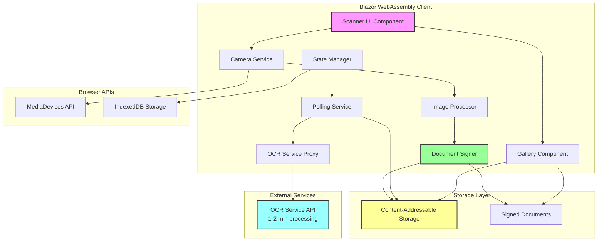
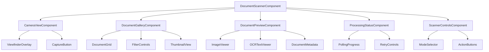
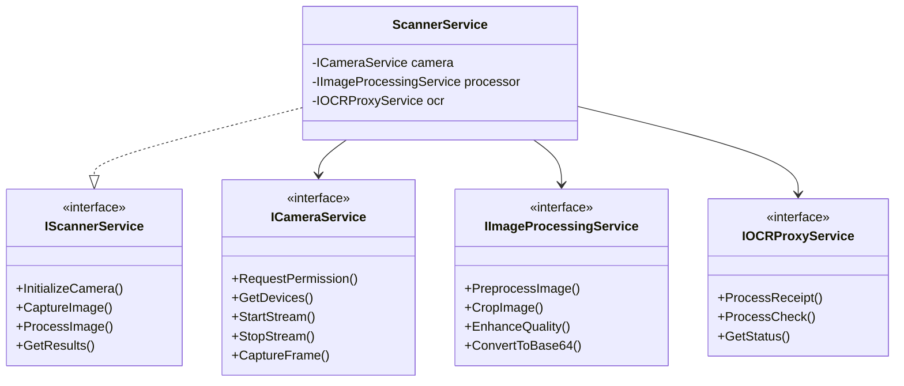
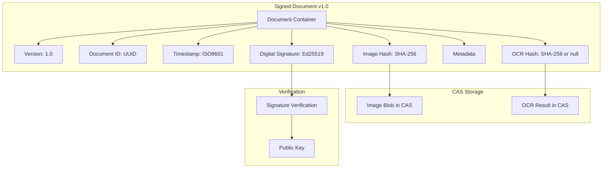
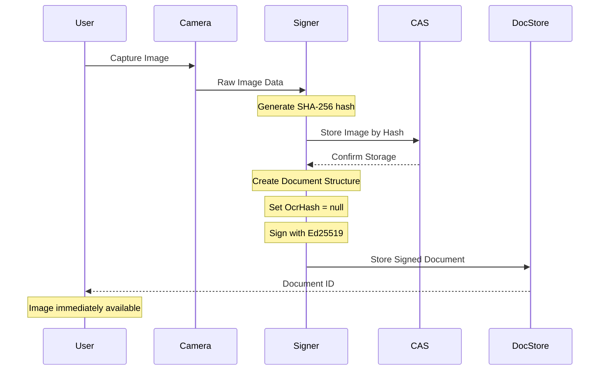
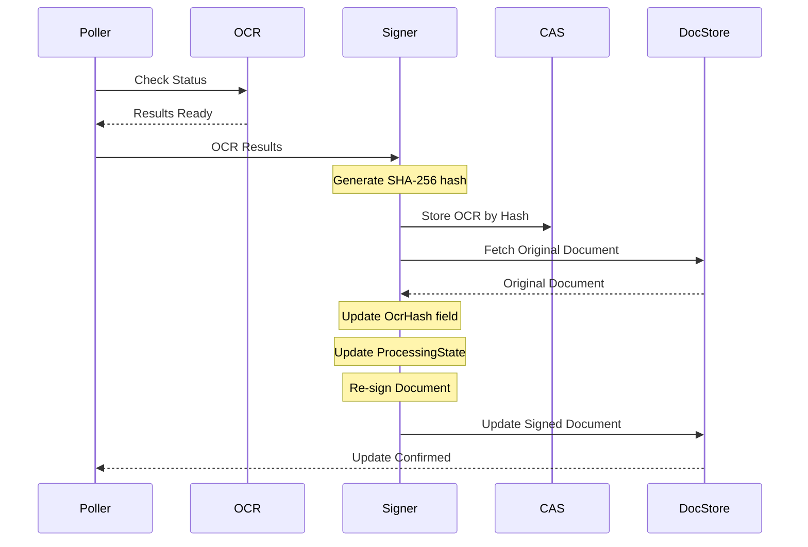
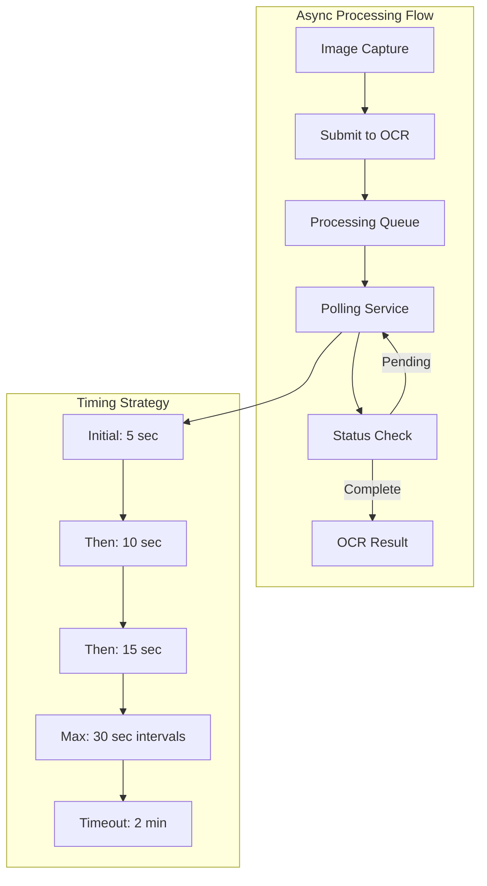
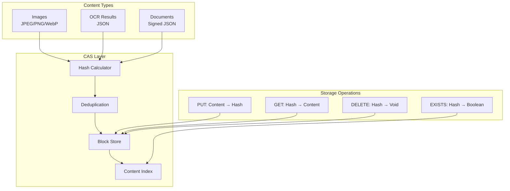
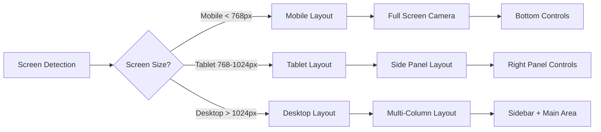

# Document Scanner and OCR Feature Architecture

## Executive Summary

This document outlines the architecture for implementing a document scanning and OCR (Optical Character Recognition) feature in the NoLock.Social platform. The feature enables users to capture documents using their device cameras and extract text/data through an external OCR service. The implementation follows a component-based architecture using Blazor WebAssembly with a focus on responsiveness, reusability, and maintainability.

## Table of Contents

1. [Overview](#overview)
2. [Architecture Overview](#architecture-overview)
3. [Component Architecture](#component-architecture)
4. [API Integration Design](#api-integration-design)
5. [UI/UX Design](#uiux-design)
6. [Project Structure](#project-structure)
7. [Technology Stack](#technology-stack)
8. [Implementation Details](#implementation-details)
9. [Security and Privacy](#security-and-privacy)
10. [Testing Strategy](#testing-strategy)
11. [Performance Considerations](#performance-considerations)
12. [Implementation Roadmap](#implementation-roadmap)

## Overview

### Business Requirements
- Capture documents using device cameras (mobile and desktop)
- Support multiple document types (receipts, checks, general documents)
- Process captured images through OCR service with async polling (1-2 minute delays)
- Display extracted data in a user-friendly format
- Support offline capture with deferred processing
- Ensure cross-device compatibility
- Store documents in Content-Addressable Storage (CAS)
- Provide browsable gallery for stored documents and OCR results

### Technical Requirements
- Integration with external OCR service at `https://nolock-ocr-services-qbhx5.ondigitalocean.app`
- Asynchronous OCR processing with polling mechanism (up to 2 minutes)
- Cryptographically signed document structures
- Content-Addressable Storage (CAS) integration
- Camera access via browser MediaDevices API
- Responsive design for mobile and desktop
- Component isolation in separate project (NoLock.Social.DocumentScanner)
- Auto-generated proxy using NSwag or OpenAPI Generator
- Error handling and retry logic
- Background job processing for OCR status polling

## Architecture Overview

### High-Level Architecture Diagram



### Component Hierarchy



## Component Architecture

### Core Components

#### 1. DocumentScannerComponent (Root Container)
```csharp
namespace NoLock.Social.DocumentScanner.Components
{
    public partial class DocumentScannerComponent : ComponentBase
    {
        // Orchestrates the scanning workflow
        // Manages state transitions
        // Handles error boundaries
    }
}
```

**Responsibilities:**
- Workflow orchestration
- State management coordination
- Error boundary handling
- Permission management

**State Management:**
```csharp
public enum ScannerState
{
    Idle,
    RequestingPermission,
    CameraActive,
    ImageCaptured,
    Processing,
    ResultsReady,
    Error
}
```

#### 2. CameraViewComponent
**Responsibilities:**
- Camera stream initialization
- Video element management
- Frame capture
- Device selection (front/back camera)

**Key Features:**
- Real-time camera preview
- Multiple camera support
- Torch/flash control (where available)
- Auto-focus and exposure adjustment

#### 3. DocumentGalleryComponent
**Responsibilities:**
- Display grid of stored documents
- Thumbnail generation from CAS
- Filter by document type and date
- Search by OCR content
- Batch operations support

**Key Features:**
- Lazy loading for performance
- Virtual scrolling for large collections
- Progressive image loading
- Quick preview on hover

#### 4. DocumentPreviewComponent
**Responsibilities:**
- Display full-size image from CAS
- Show OCR text results
- Display document metadata
- Signature verification status
- Export functionality

**Key Features:**
- Zoom and pan for images
- Text search in OCR results
- Copy text functionality
- Download original files

#### 5. ProcessingStatusComponent
**Responsibilities:**
- Show OCR processing progress
- Display polling status
- Handle retry operations
- Show error states
- Timeout notifications

### Service Layer Architecture



### State Management Design

```csharp
public class ScannerStateManager
{
    private readonly IState<ScannerState> _state;
    private readonly IState<CapturedImage> _capturedImage;
    private readonly IState<OCRResult> _ocrResult;
    private readonly IState<ProcessingQueue> _processingQueue;
    
    public IObservable<ScannerState> StateChanges => _state.Changes;
    public IObservable<CapturedImage> ImageChanges => _capturedImage.Changes;
    public IObservable<OCRResult> ResultChanges => _ocrResult.Changes;
    public IObservable<ProcessingQueue> QueueChanges => _processingQueue.Changes;
}
```

## Cryptographic Document Architecture

### Signed Document Structure

The system implements a cryptographically signed document structure that ensures integrity and authenticity of both images and OCR results. This structure allows for progressive enhancement where images are immediately available while OCR processing occurs asynchronously.



### Document Schema Definition

```csharp
public class SignedDocument
{
    public string Version { get; set; } = "1.0";
    public Guid DocumentId { get; set; }
    public DateTime CreatedAt { get; set; }
    public DateTime? UpdatedAt { get; set; }
    
    // Content References (CAS hashes)
    public string ImageHash { get; set; }  // SHA-256 of image content
    public string? OcrHash { get; set; }   // SHA-256 of OCR result (null initially)
    
    // Document Metadata
    public DocumentMetadata Metadata { get; set; }
    
    // Processing State
    public ProcessingState State { get; set; }
    
    // Cryptographic Signature
    public byte[] Signature { get; set; }  // Ed25519 signature
    public string SignerPublicKey { get; set; }
}

public class DocumentMetadata
{
    public DocumentType Type { get; set; }
    public string OriginalFileName { get; set; }
    public long FileSizeBytes { get; set; }
    public string MimeType { get; set; }
    public Dictionary<string, string> CustomFields { get; set; }
}

public enum ProcessingState
{
    ImageCaptured,      // Image saved, OCR not started
    OcrPending,         // OCR request submitted
    OcrProcessing,      // OCR in progress (polling)
    OcrCompleted,       // OCR results available
    OcrFailed,          // OCR processing failed
    OcrTimeout          // OCR exceeded 2-minute timeout
}
```

### Cryptographic Signing Process



### Document Update Process (After OCR)



## Asynchronous OCR Processing

### Polling Architecture

The system implements a sophisticated polling mechanism to handle the 1-2 minute OCR processing delays while preventing mobile devices from sleeping.



### Polling Service Implementation

```csharp
public interface IPollingService
{
    Task<Guid> SubmitForProcessingAsync(SignedDocument document, byte[] imageData);
    Task<OcrResult> PollForResultAsync(Guid taskId, CancellationToken cancellationToken);
    void CancelPolling(Guid taskId);
}

public class AdaptivePollingService : IPollingService
{
    private readonly IOCRServiceProxy _ocrProxy;
    private readonly IDocumentSigner _signer;
    private readonly ICASStorage _casStorage;
    private readonly ILogger<AdaptivePollingService> _logger;
    
    // Adaptive polling intervals (milliseconds)
    private readonly int[] _pollingIntervals = { 5000, 10000, 15000, 30000 };
    private const int MaxPollingDuration = 120000; // 2 minutes
    
    public async Task<OcrResult> PollForResultAsync(Guid taskId, CancellationToken cancellationToken)
    {
        var startTime = DateTime.UtcNow;
        var intervalIndex = 0;
        
        while (!cancellationToken.IsCancellationRequested)
        {
            // Check timeout
            if ((DateTime.UtcNow - startTime).TotalMilliseconds > MaxPollingDuration)
            {
                throw new OcrTimeoutException($"OCR processing exceeded {MaxPollingDuration}ms timeout");
            }
            
            // Check OCR status
            var status = await _ocrProxy.GetStatusAsync(taskId);
            
            switch (status.State)
            {
                case OcrState.Completed:
                    return await ProcessCompletedOcr(taskId, status.ResultId);
                    
                case OcrState.Failed:
                    throw new OcrProcessingException(status.ErrorMessage);
                    
                case OcrState.Processing:
                case OcrState.Queued:
                    // Continue polling with adaptive interval
                    var delay = _pollingIntervals[Math.Min(intervalIndex++, _pollingIntervals.Length - 1)];
                    await Task.Delay(delay, cancellationToken);
                    break;
            }
        }
        
        throw new OperationCanceledException("Polling was cancelled");
    }
    
    private async Task<OcrResult> ProcessCompletedOcr(Guid taskId, string resultId)
    {
        // Fetch OCR results
        var ocrData = await _ocrProxy.GetResultAsync(resultId);
        
        // Store in CAS
        var ocrHash = await _casStorage.StoreAsync(ocrData);
        
        // Update signed document
        await UpdateDocumentWithOcr(taskId, ocrHash);
        
        return ocrData;
    }
}
```

### Background Job Processing

```csharp
public class OcrBackgroundProcessor : BackgroundService
{
    private readonly IServiceProvider _serviceProvider;
    private readonly ILogger<OcrBackgroundProcessor> _logger;
    private readonly Channel<OcrProcessingJob> _jobQueue;
    private readonly IJSRuntime _jsRuntime;
    
    protected override async Task ExecuteAsync(CancellationToken stoppingToken)
    {
        await foreach (var job in _jobQueue.Reader.ReadAllAsync(stoppingToken))
        {
            try
            {
                using var scope = _serviceProvider.CreateScope();
                var pollingService = scope.ServiceProvider.GetRequiredService<IPollingService>();
                
                // Prevent mobile sleep during processing
                await AcquireWakeLock(job.DocumentId);
                
                // Process with individual timeout
                using var jobCts = CancellationTokenSource.CreateLinkedTokenSource(stoppingToken);
                jobCts.CancelAfter(TimeSpan.FromMinutes(2.5)); // Allow extra time for retries
                
                var result = await pollingService.PollForResultAsync(job.TaskId, jobCts.Token);
                
                // Notify completion
                await NotifyCompletion(job.DocumentId, result);
            }
            catch (Exception ex)
            {
                _logger.LogError(ex, "Failed to process OCR job {JobId}", job.TaskId);
                await NotifyFailure(job.DocumentId, ex.Message);
            }
            finally
            {
                // Release wake lock
                await ReleaseWakeLock(job.DocumentId);
            }
        }
    }
    
    private async Task AcquireWakeLock(Guid documentId)
    {
        try
        {
            // Use Wake Lock API to prevent sleep on mobile
            await _jsRuntime.InvokeVoidAsync("wakeLock.request", documentId.ToString());
        }
        catch (Exception ex)
        {
            _logger.LogWarning(ex, "Failed to acquire wake lock");
        }
    }
    
    private async Task ReleaseWakeLock(Guid documentId)
    {
        try
        {
            await _jsRuntime.InvokeVoidAsync("wakeLock.release", documentId.ToString());
        }
        catch (Exception ex)
        {
            _logger.LogWarning(ex, "Failed to release wake lock");
        }
    }
    
    public async Task EnqueueJobAsync(OcrProcessingJob job)
    {
        await _jobQueue.Writer.WriteAsync(job);
        _logger.LogInformation("Enqueued OCR job {JobId} for document {DocumentId}", 
            job.TaskId, job.DocumentId);
    }
}

// JavaScript Wake Lock Implementation
export class WakeLockManager {
    constructor() {
        this.locks = new Map();
    }
    
    async request(lockId) {
        if ('wakeLock' in navigator) {
            try {
                const wakeLock = await navigator.wakeLock.request('screen');
                this.locks.set(lockId, wakeLock);
                
                // Re-acquire on visibility change
                document.addEventListener('visibilitychange', async () => {
                    if (document.visibilityState === 'visible' && this.locks.has(lockId)) {
                        await this.request(lockId);
                    }
                });
                
                return true;
            } catch (err) {
                console.error(`Wake Lock error: ${err.message}`);
                return false;
            }
        }
        return false;
    }
    
    async release(lockId) {
        const lock = this.locks.get(lockId);
        if (lock) {
            await lock.release();
            this.locks.delete(lockId);
        }
    }
}
```

## Document Signing Implementation

### Ed25519 Signature Service

```csharp
public interface IDocumentSigner
{
    Task<SignedDocument> SignDocumentAsync(DocumentContent content);
    Task<bool> VerifyDocumentAsync(SignedDocument document);
    Task<SignedDocument> UpdateAndResignAsync(SignedDocument existing, Action<SignedDocument> update);
}

public class Ed25519DocumentSigner : IDocumentSigner
{
    private readonly IKeyManager _keyManager;
    private readonly ILogger<Ed25519DocumentSigner> _logger;
    
    public async Task<SignedDocument> SignDocumentAsync(DocumentContent content)
    {
        var document = new SignedDocument
        {
            Version = "1.0",
            DocumentId = Guid.NewGuid(),
            CreatedAt = DateTime.UtcNow,
            ImageHash = content.ImageHash,
            OcrHash = content.OcrHash,
            Metadata = content.Metadata,
            State = ProcessingState.ImageCaptured
        };
        
        // Get signing key
        var keyPair = await _keyManager.GetSigningKeyPairAsync();
        document.SignerPublicKey = Convert.ToBase64String(keyPair.PublicKey);
        
        // Create canonical representation for signing
        var canonicalData = CreateCanonicalRepresentation(document);
        
        // Sign with Ed25519
        document.Signature = Ed25519.Sign(canonicalData, keyPair.PrivateKey);
        
        return document;
    }
    
    public async Task<bool> VerifyDocumentAsync(SignedDocument document)
    {
        try
        {
            // Extract public key
            var publicKey = Convert.FromBase64String(document.SignerPublicKey);
            
            // Create canonical representation
            var signature = document.Signature;
            document.Signature = null; // Remove signature for verification
            var canonicalData = CreateCanonicalRepresentation(document);
            document.Signature = signature; // Restore
            
            // Verify signature
            return Ed25519.Verify(signature, canonicalData, publicKey);
        }
        catch (Exception ex)
        {
            _logger.LogError(ex, "Signature verification failed");
            return false;
        }
    }
    
    private byte[] CreateCanonicalRepresentation(SignedDocument doc)
    {
        // Create deterministic JSON representation
        var json = JsonSerializer.Serialize(new
        {
            version = doc.Version,
            documentId = doc.DocumentId,
            createdAt = doc.CreatedAt.ToUniversalTime().ToString("O"),
            updatedAt = doc.UpdatedAt?.ToUniversalTime().ToString("O"),
            imageHash = doc.ImageHash,
            ocrHash = doc.OcrHash,
            metadata = doc.Metadata,
            state = doc.State.ToString()
        }, new JsonSerializerOptions
        {
            PropertyNamingPolicy = JsonNamingPolicy.CamelCase,
            DefaultIgnoreCondition = JsonIgnoreCondition.WhenWritingNull,
            WriteIndented = false
        });
        
        return Encoding.UTF8.GetBytes(json);
    }
}
```

### Key Management

```csharp
public interface IKeyManager
{
    Task<Ed25519KeyPair> GetSigningKeyPairAsync();
    Task<Ed25519KeyPair> GenerateNewKeyPairAsync();
    Task RotateKeysAsync();
}

public class SecureKeyManager : IKeyManager
{
    private readonly ISecureStorage _secureStorage;
    private readonly ILogger<SecureKeyManager> _logger;
    private Ed25519KeyPair? _cachedKeyPair;
    
    public async Task<Ed25519KeyPair> GetSigningKeyPairAsync()
    {
        if (_cachedKeyPair != null)
            return _cachedKeyPair;
        
        // Try to load existing key
        var storedKey = await _secureStorage.GetAsync("signing_key");
        if (storedKey != null)
        {
            _cachedKeyPair = DeserializeKeyPair(storedKey);
            return _cachedKeyPair;
        }
        
        // Generate new key pair if none exists
        _cachedKeyPair = await GenerateNewKeyPairAsync();
        return _cachedKeyPair;
    }
    
    public async Task<Ed25519KeyPair> GenerateNewKeyPairAsync()
    {
        // Generate Ed25519 key pair
        var keyPair = Ed25519.GenerateKeyPair();
        
        // Store securely
        await _secureStorage.SetAsync("signing_key", SerializeKeyPair(keyPair));
        
        _logger.LogInformation("Generated new Ed25519 key pair");
        return keyPair;
    }
}
```

## Gallery Component Implementation

### Document Gallery Service

```csharp
public interface IDocumentGalleryService
{
    Task<PagedResult<DocumentSummary>> GetDocumentsAsync(
        int page, int pageSize, DocumentFilter filter);
    Task<byte[]> GenerateThumbnailAsync(string imageHash);
    Task<DocumentDetails> GetDocumentDetailsAsync(Guid documentId);
    Task DeleteDocumentAsync(Guid documentId);
}

public class DocumentGalleryService : IDocumentGalleryService
{
    private readonly ICASStorage _casStorage;
    private readonly IDocumentRepository _documentRepo;
    private readonly IThumbnailGenerator _thumbnailGen;
    private readonly IDocumentSigner _signer;
    
    public async Task<PagedResult<DocumentSummary>> GetDocumentsAsync(
        int page, int pageSize, DocumentFilter filter)
    {
        var query = _documentRepo.Query();
        
        // Apply filters
        if (filter.DocumentType.HasValue)
            query = query.Where(d => d.Metadata.Type == filter.DocumentType);
        
        if (filter.ProcessingState.HasValue)
            query = query.Where(d => d.State == filter.ProcessingState);
        
        if (!string.IsNullOrEmpty(filter.SearchText))
        {
            // Search in OCR content if available
            query = query.Where(d => d.OcrHash != null && 
                _casStorage.SearchContent(d.OcrHash, filter.SearchText));
        }
        
        // Sort by creation date descending
        query = query.OrderByDescending(d => d.CreatedAt);
        
        // Apply pagination
        var total = await query.CountAsync();
        var documents = await query
            .Skip((page - 1) * pageSize)
            .Take(pageSize)
            .Select(d => new DocumentSummary
            {
                DocumentId = d.DocumentId,
                ThumbnailUrl = GenerateThumbnailUrl(d.ImageHash),
                DocumentType = d.Metadata.Type,
                ProcessingState = d.State,
                CreatedAt = d.CreatedAt,
                HasOcr = d.OcrHash != null
            })
            .ToListAsync();
        
        return new PagedResult<DocumentSummary>
        {
            Items = documents,
            TotalCount = total,
            Page = page,
            PageSize = pageSize
        };
    }
    
    public async Task<byte[]> GenerateThumbnailAsync(string imageHash)
    {
        // Check thumbnail cache
        var thumbnailHash = $"thumb_{imageHash}";
        if (await _casStorage.ExistsAsync(thumbnailHash))
        {
            return await _casStorage.RetrieveAsync(thumbnailHash);
        }
        
        // Generate thumbnail
        var imageData = await _casStorage.RetrieveAsync(imageHash);
        var thumbnail = await _thumbnailGen.GenerateAsync(imageData, 200, 200);
        
        // Store in CAS for future use
        await _casStorage.StoreAsync(thumbnail, thumbnailHash);
        
        return thumbnail;
    }
}
```

### Virtual Scrolling Implementation

```csharp
@page "/gallery"
@implements IAsyncDisposable
@inject IDocumentGalleryService GalleryService
@inject IJSRuntime JSRuntime

<div class="document-gallery" @ref="galleryContainer">
    <div class="gallery-header">
        <DocumentFilterControls @bind-Filter="currentFilter" OnFilterChanged="OnFilterChanged" />
    </div>
    
    <div class="gallery-grid" @onscroll="OnScroll">
        <Virtualize Items="@documents" Context="doc" ItemSize="250" OverscanCount="3">
            <DocumentThumbnail Document="doc" OnClick="() => OpenDocument(doc)" />
        </Virtualize>
    </div>
    
    @if (isLoading)
    {
        <div class="loading-indicator">
            <span>Loading documents...</span>
        </div>
    }
</div>

@code {
    private ElementReference galleryContainer;
    private List<DocumentSummary> documents = new();
    private DocumentFilter currentFilter = new();
    private bool isLoading = false;
    private int currentPage = 1;
    private bool hasMorePages = true;
    private CancellationTokenSource? loadingCts;
    
    protected override async Task OnInitializedAsync()
    {
        await LoadDocuments();
        
        // Set up infinite scroll
        await JSRuntime.InvokeVoidAsync("gallery.setupInfiniteScroll", 
            galleryContainer, DotNetObjectReference.Create(this));
    }
    
    private async Task LoadDocuments(bool append = false)
    {
        if (isLoading || !hasMorePages) return;
        
        isLoading = true;
        loadingCts?.Cancel();
        loadingCts = new CancellationTokenSource();
        
        try
        {
            var result = await GalleryService.GetDocumentsAsync(
                currentPage, 20, currentFilter);
            
            if (append)
            {
                documents.AddRange(result.Items);
            }
            else
            {
                documents = result.Items.ToList();
            }
            
            hasMorePages = result.HasNextPage;
            currentPage++;
            
            StateHasChanged();
        }
        catch (OperationCanceledException)
        {
            // Cancelled - ignore
        }
        finally
        {
            isLoading = false;
        }
    }
    
    [JSInvokable]
    public async Task LoadMoreDocuments()
    {
        await LoadDocuments(append: true);
    }
    
    private async Task OnFilterChanged()
    {
        currentPage = 1;
        hasMorePages = true;
        await LoadDocuments(append: false);
    }
    
    private void OpenDocument(DocumentSummary doc)
    {
        NavigationManager.NavigateTo($"/document/{doc.DocumentId}");
    }
    
    public async ValueTask DisposeAsync()
    {
        loadingCts?.Cancel();
        loadingCts?.Dispose();
    }
}
```

### Preview Component with CAS Integration

```csharp
@page "/document/{DocumentId:guid}"
@inject IDocumentGalleryService GalleryService
@inject ICASStorage CASStorage
@inject IDocumentSigner Signer

<div class="document-preview">
    @if (document != null)
    {
        <div class="preview-header">
            <h3>Document Details</h3>
            <div class="signature-status">
                @if (isSignatureValid)
                {
                    <span class="valid">✓ Signature Valid</span>
                }
                else
                {
                    <span class="invalid">✗ Signature Invalid</span>
                }
            </div>
        </div>
        
        <div class="preview-content">
            <div class="image-section">
                <ImageViewer ImageData="@imageData" />
            </div>
            
            @if (document.OcrHash != null && ocrResult != null)
            {
                <div class="ocr-section">
                    <OCRTextViewer OcrData="@ocrResult" />
                </div>
            }
            else if (document.State == ProcessingState.OcrProcessing)
            {
                <div class="processing-indicator">
                    <PollingProgress DocumentId="@DocumentId" />
                </div>
            }
            else if (document.State == ProcessingState.OcrFailed)
            {
                <div class="error-section">
                    <p>OCR processing failed</p>
                    <RetryButton DocumentId="@DocumentId" OnRetry="RetryOcr" />
                </div>
            }
        </div>
        
        <div class="preview-metadata">
            <DocumentMetadataDisplay Metadata="@document.Metadata" />
        </div>
    </div>
</div>

@code {
    [Parameter] public Guid DocumentId { get; set; }
    
    private SignedDocument? document;
    private byte[]? imageData;
    private OcrResult? ocrResult;
    private bool isSignatureValid;
    
    protected override async Task OnParametersSetAsync()
    {
        await LoadDocument();
    }
    
    private async Task LoadDocument()
    {
        var details = await GalleryService.GetDocumentDetailsAsync(DocumentId);
        document = details.Document;
        
        // Verify signature
        isSignatureValid = await Signer.VerifyDocumentAsync(document);
        
        // Load image from CAS
        imageData = await CASStorage.RetrieveAsync(document.ImageHash);
        
        // Load OCR if available
        if (!string.IsNullOrEmpty(document.OcrHash))
        {
            var ocrData = await CASStorage.RetrieveAsync(document.OcrHash);
            ocrResult = JsonSerializer.Deserialize<OcrResult>(ocrData);
        }
        
        StateHasChanged();
    }
    
    private async Task RetryOcr()
    {
        // Re-submit for OCR processing
        await OcrService.RetryProcessingAsync(DocumentId);
        document.State = ProcessingState.OcrPending;
        StateHasChanged();
    }
}
```

## Content-Addressable Storage (CAS) Integration

### CAS Architecture



### CAS Service Interface

```csharp
public interface ICASStorage
{
    Task<string> StoreAsync(byte[] content);
    Task<byte[]> RetrieveAsync(string hash);
    Task<bool> ExistsAsync(string hash);
    Task DeleteAsync(string hash);
    Task<CASMetadata> GetMetadataAsync(string hash);
}

public class CASStorage : ICASStorage
{
    private readonly IBlockStore _blockStore;
    private readonly IHashCalculator _hashCalculator;
    private readonly IContentIndex _index;
    
    public async Task<string> StoreAsync(byte[] content)
    {
        // Calculate SHA-256 hash
        var hash = _hashCalculator.ComputeSHA256(content);
        
        // Check for deduplication
        if (await _index.ExistsAsync(hash))
        {
            _logger.LogDebug("Content already exists: {Hash}", hash);
            return hash;
        }
        
        // Store content blocks
        await _blockStore.StoreBlocksAsync(hash, content);
        
        // Update index
        await _index.AddAsync(hash, new ContentMetadata
        {
            Size = content.Length,
            StoredAt = DateTime.UtcNow,
            ContentType = DetectContentType(content)
        });
        
        return hash;
    }
    
    public async Task<byte[]> RetrieveAsync(string hash)
    {
        if (!await _index.ExistsAsync(hash))
        {
            throw new ContentNotFoundException($"Content not found: {hash}");
        }
        
        return await _blockStore.RetrieveBlocksAsync(hash);
    }
}
```

## API Integration Design

### Proxy Generation Strategy

#### Using NSwag for Client Generation

```bash
# Install NSwag CLI tool
dotnet tool install -g NSwag.ConsoleCore

# Generate C# client from OpenAPI specification
nswag openapi2csclient /input:https://nolock-ocr-services-qbhx5.ondigitalocean.app/swagger/v1/swagger.json \
  /classname:OCRServiceClient \
  /namespace:NoLock.Social.DocumentScanner.Services.Proxies \
  /output:NoLock.Social.DocumentScanner/Services/Proxies/OCRServiceClient.cs \
  /generateClientInterfaces:true \
  /generateDtoTypes:true \
  /generateResponseClasses:true \
  /generateDataAnnotations:true \
  /generateDefaultValues:true \
  /generateOptionalParameters:true
```

#### Alternative: OpenAPI Generator

```bash
# Install OpenAPI Generator
npm install -g @openapitools/openapi-generator-cli

# Generate C# client
openapi-generator-cli generate \
  -i https://nolock-ocr-services-qbhx5.ondigitalocean.app/swagger/v1/swagger.json \
  -g csharp-netcore \
  -o ./generated-client \
  --additional-properties=packageName=NoLock.Social.DocumentScanner.Client \
  --additional-properties=netCoreProjectFile=true \
  --additional-properties=targetFramework=net9.0
```

### Service Integration Pattern

```csharp
public interface IOCRServiceAdapter
{
    Task<ReceiptData> ProcessReceiptAsync(byte[] imageData, CancellationToken cancellationToken = default);
    Task<CheckData> ProcessCheckAsync(byte[] imageData, CancellationToken cancellationToken = default);
    Task<HealthStatus> GetHealthStatusAsync(CancellationToken cancellationToken = default);
}

public class OCRServiceAdapter : IOCRServiceAdapter
{
    private readonly IOCRServiceClient _client;
    private readonly ILogger<OCRServiceAdapter> _logger;
    private readonly IRetryPolicy _retryPolicy;
    
    public async Task<ReceiptData> ProcessReceiptAsync(byte[] imageData, CancellationToken cancellationToken)
    {
        return await _retryPolicy.ExecuteAsync(async () =>
        {
            using var stream = new MemoryStream(imageData);
            var response = await _client.ProcessReceiptAsync(stream, cancellationToken);
            return MapToReceiptData(response);
        });
    }
}
```

## UI/UX Design

### Mobile Layout (ASCII Art)

```
+------------------------+
|   Document Scanner     |
|   [Camera] [Gallery]   |
+------------------------+
|                        |
|   +----------------+   |
|   |                |   |
|   |    CAMERA      |   |
|   |     VIEW       |   |
|   |                |   |
|   |  [+] Target    |   |
|   |                |   |
|   +----------------+   |
|                        |
|  [Flash] [📷] [Switch] |
|                        |
|  Processing: ○○○○○     |
|  2 docs pending OCR    |
+------------------------+
```

### Gallery View - Mobile (ASCII Art)

```
+------------------------+
|   Document Gallery     |
|   [Camera] [Gallery]   |
+------------------------+
| Filter: [All Types  v] |
| Search: [___________]  |
+------------------------+
| +------+ +------+      |
| |      | |      |      |
| | IMG1 | | IMG2 |      |
| |  ✓   | |  ⟳   |      |
| +------+ +------+      |
| Receipt  Check         |
|                        |
| +------+ +------+      |
| |      | |      |      |
| | IMG3 | | IMG4 |      |
| |  ✓   | |  ✗   |      |
| +------+ +------+      |
| Receipt  Receipt       |
+------------------------+
| ✓ Complete ⟳ Processing|
| ✗ Failed               |
+------------------------+
```

### Desktop Layout with Gallery (ASCII Art)

```
+----------------------------------------------------------+
|  Document Scanner                          [Settings] [?] |
+----------------------------------------------------------+
|                                                          |
| +----------------------+  +----------------------------+ |
| |                      |  | Document Gallery           | |
| |     CAMERA VIEW      |  | +------+ +------+ +------+ | |
| |        -OR-          |  | | Doc1 | | Doc2 | | Doc3 | | |
| |   DOCUMENT PREVIEW   |  | |  ✓   | |  ⟳   | |  ✓   | | |
| |                      |  | +------+ +------+ +------+ | |
| |    [+] Viewfinder    |  |                            | |
| |                      |  | +------+ +------+ +------+ | |
| |                      |  | | Doc4 | | Doc5 | | Doc6 | | |
| +----------------------+  | |  ✗   | |  ✓   | |  ⟳   | | |
| |                      |  | +------+ +------+ +------+ | |
| | [Capture] [Gallery]  |  |                            | |
| |                      |  | Processing Status:          | |
| | OCR Status: [=====]  |  | • 2 documents processing   | |
| | Time: 45s / 120s     |  | • 1 document failed        | |
| +----------------------+  | • 8 documents complete      | |
|                           +----------------------------+ |
+----------------------------------------------------------+
```

### Responsive Design Strategy



## Project Structure

### NoLock.Social.DocumentScanner Project Organization

```
NoLock.Social.DocumentScanner/
├── Components/
│   ├── Camera/
│   │   ├── CameraViewComponent.razor
│   │   ├── CameraViewComponent.razor.cs
│   │   ├── CameraViewComponent.razor.css
│   │   └── ViewfinderOverlay.razor
│   ├── Gallery/
│   │   ├── DocumentGalleryComponent.razor
│   │   ├── DocumentGrid.razor
│   │   ├── ThumbnailView.razor
│   │   └── FilterControls.razor
│   ├── Preview/
│   │   ├── DocumentPreviewComponent.razor
│   │   ├── ImageViewer.razor
│   │   ├── OCRTextViewer.razor
│   │   └── DocumentMetadata.razor
│   ├── Status/
│   │   ├── ProcessingStatusComponent.razor
│   │   ├── PollingProgress.razor
│   │   └── RetryControls.razor
│   ├── Controls/
│   │   ├── ScannerControlsComponent.razor
│   │   ├── ModeSelector.razor
│   │   └── ActionButtons.razor
│   └── DocumentScannerComponent.razor
├── Services/
│   ├── Interfaces/
│   │   ├── ICameraService.cs
│   │   ├── IImageProcessingService.cs
│   │   ├── IOCRServiceAdapter.cs
│   │   ├── IScannerService.cs
│   │   ├── IPollingService.cs
│   │   ├── IDocumentSigner.cs
│   │   ├── ICASStorage.cs
│   │   └── IKeyManager.cs
│   ├── Implementation/
│   │   ├── CameraService.cs
│   │   ├── ImageProcessingService.cs
│   │   ├── OCRServiceAdapter.cs
│   │   ├── ScannerService.cs
│   │   ├── AdaptivePollingService.cs
│   │   ├── Ed25519DocumentSigner.cs
│   │   ├── CASStorage.cs
│   │   └── SecureKeyManager.cs
│   ├── Background/
│   │   └── OcrBackgroundProcessor.cs
│   ├── Proxies/
│   │   └── OCRServiceClient.cs (generated)
│   └── JavaScript/
│       └── CameraInterop.cs
├── Models/
│   ├── ScannerState.cs
│   ├── CapturedImage.cs
│   ├── OCRResult.cs
│   ├── SignedDocument.cs
│   ├── DocumentMetadata.cs
│   ├── ProcessingState.cs
│   ├── OcrProcessingJob.cs
│   ├── CASMetadata.cs
│   ├── Ed25519KeyPair.cs
│   ├── ReceiptData.cs
│   ├── CheckData.cs
│   └── DocumentType.cs
├── State/
│   ├── ScannerStateManager.cs
│   ├── IState.cs
│   └── StateContainer.cs
├── Configuration/
│   ├── ScannerConfiguration.cs
│   └── OCRServiceConfiguration.cs
├── Extensions/
│   └── ServiceCollectionExtensions.cs
├── wwwroot/
│   ├── css/
│   │   └── scanner.css
│   ├── js/
│   │   ├── camera-interop.js
│   │   └── image-processing.js
│   └── assets/
│       └── viewfinder-overlay.svg
└── NoLock.Social.DocumentScanner.csproj
```

### Dependencies Configuration

```xml
<Project Sdk="Microsoft.NET.Sdk.Razor">
  <PropertyGroup>
    <TargetFramework>net9.0</TargetFramework>
    <Nullable>enable</Nullable>
    <ImplicitUsings>enable</ImplicitUsings>
  </PropertyGroup>

  <ItemGroup>
    <PackageReference Include="Microsoft.AspNetCore.Components.Web" Version="8.0.0" />
    <PackageReference Include="Microsoft.Extensions.Http" Version="8.0.0" />
    <PackageReference Include="Microsoft.Extensions.Http.Polly" Version="8.0.0" />
    <PackageReference Include="NSwag.MSBuild" Version="14.0.0" />
    <PackageReference Include="System.Reactive" Version="6.0.0" />
    <PackageReference Include="SixLabors.ImageSharp" Version="3.1.0" />
    <PackageReference Include="Blazored.LocalStorage" Version="4.4.0" />
  </ItemGroup>

  <ItemGroup>
    <ProjectReference Include="..\NoLock.Social.Core\NoLock.Social.Core.csproj" />
  </ItemGroup>
</Project>
```

## Technology Stack

### Core Technologies
- **Blazor WebAssembly**: Component framework
- **NET 8.0**: Target framework
- **.NET Standard 2.1**: Library compatibility

### UI/UX Libraries
- **Bootstrap 5**: Responsive layout
- **Blazored.Modal**: Modal dialogs
- **Blazored.Toast**: Notifications

### Image Processing
- **SixLabors.ImageSharp**: Client-side image manipulation
- **Browser Canvas API**: Image cropping and enhancement

### API Integration
- **NSwag**: OpenAPI client generation
- **System.Net.Http**: HTTP communication
- **Polly**: Retry and resilience policies

### State Management
- **System.Reactive**: Reactive state management
- **Blazored.LocalStorage**: Offline storage

### JavaScript Interop
- **MediaDevices API**: Camera access
- **Canvas API**: Image manipulation
- **File API**: Image upload/download

## Implementation Details

### Camera Integration

```csharp
public class CameraService : ICameraService
{
    private readonly IJSRuntime _jsRuntime;
    private IJSObjectReference? _cameraModule;
    
    public async Task<MediaStream> StartCameraAsync(CameraOptions options)
    {
        _cameraModule ??= await _jsRuntime.InvokeAsync<IJSObjectReference>(
            "import", "./js/camera-interop.js");
            
        return await _cameraModule.InvokeAsync<MediaStream>(
            "startCamera", options);
    }
    
    public async Task<byte[]> CaptureFrameAsync()
    {
        if (_cameraModule == null)
            throw new InvalidOperationException("Camera not initialized");
            
        var base64 = await _cameraModule.InvokeAsync<string>("captureFrame");
        return Convert.FromBase64String(base64.Split(',')[1]);
    }
}
```

### JavaScript Camera Module

```javascript
// camera-interop.js
export async function startCamera(options) {
    const constraints = {
        video: {
            facingMode: options.facingMode || 'environment',
            width: { ideal: options.width || 1920 },
            height: { ideal: options.height || 1080 }
        }
    };
    
    try {
        const stream = await navigator.mediaDevices.getUserMedia(constraints);
        return stream;
    } catch (error) {
        console.error('Camera access error:', error);
        throw error;
    }
}

export function captureFrame(videoElement) {
    const canvas = document.createElement('canvas');
    canvas.width = videoElement.videoWidth;
    canvas.height = videoElement.videoHeight;
    
    const context = canvas.getContext('2d');
    context.drawImage(videoElement, 0, 0);
    
    return canvas.toDataURL('image/jpeg', 0.9);
}
```

### Image Preprocessing

```csharp
public class ImageProcessingService : IImageProcessingService
{
    public async Task<byte[]> PreprocessImageAsync(byte[] imageData, ProcessingOptions options)
    {
        using var image = Image.Load(imageData);
        
        // Auto-orient based on EXIF data
        image.Mutate(x => x.AutoOrient());
        
        // Apply preprocessing
        if (options.EnhanceContrast)
        {
            image.Mutate(x => x.Contrast(1.2f));
        }
        
        if (options.ConvertToGrayscale)
        {
            image.Mutate(x => x.Grayscale());
        }
        
        if (options.ResizeToMaxDimension.HasValue)
        {
            var maxDim = options.ResizeToMaxDimension.Value;
            image.Mutate(x => x.Resize(new ResizeOptions
            {
                Mode = ResizeMode.Max,
                Size = new Size(maxDim, maxDim)
            }));
        }
        
        using var output = new MemoryStream();
        await image.SaveAsJpegAsync(output);
        return output.ToArray();
    }
}
```

### Error Handling and Retry Logic

```csharp
public class RetryPolicyConfiguration
{
    public static IAsyncPolicy<HttpResponseMessage> GetRetryPolicy()
    {
        return HttpPolicyExtensions
            .HandleTransientHttpError()
            .OrResult(msg => !msg.IsSuccessStatusCode)
            .WaitAndRetryAsync(
                3,
                retryAttempt => TimeSpan.FromSeconds(Math.Pow(2, retryAttempt)),
                onRetry: (outcome, timespan, retryCount, context) =>
                {
                    var logger = context.Values["logger"] as ILogger;
                    logger?.LogWarning($"Retry {retryCount} after {timespan}s");
                });
    }
    
    public static IAsyncPolicy GetCircuitBreakerPolicy()
    {
        return Policy
            .Handle<HttpRequestException>()
            .CircuitBreakerAsync(
                handledEventsAllowedBeforeBreaking: 3,
                durationOfBreak: TimeSpan.FromSeconds(30),
                onBreak: (exception, duration) =>
                {
                    // Log circuit breaker opening
                },
                onReset: () =>
                {
                    // Log circuit breaker closing
                });
    }
}
```

### Offline Support

```csharp
public class OfflineScanManager
{
    private readonly ILocalStorageService _localStorage;
    private readonly IOCRServiceAdapter _ocrService;
    
    public async Task QueueForProcessingAsync(CapturedImage image)
    {
        var queue = await GetQueueAsync();
        queue.Add(new QueuedScan
        {
            Id = Guid.NewGuid(),
            Image = image,
            QueuedAt = DateTime.UtcNow,
            Status = ProcessingStatus.Pending
        });
        
        await _localStorage.SetItemAsync("scan_queue", queue);
    }
    
    public async Task ProcessQueueAsync()
    {
        var queue = await GetQueueAsync();
        var pending = queue.Where(x => x.Status == ProcessingStatus.Pending);
        
        foreach (var item in pending)
        {
            try
            {
                var result = await _ocrService.ProcessReceiptAsync(item.Image.Data);
                item.Status = ProcessingStatus.Completed;
                item.Result = result;
            }
            catch (Exception ex)
            {
                item.Status = ProcessingStatus.Failed;
                item.Error = ex.Message;
            }
        }
        
        await _localStorage.SetItemAsync("scan_queue", queue);
    }
}
```

## Error Handling and Resilience Patterns

### Comprehensive Error Management

```csharp
public class OcrProcessingErrorHandler
{
    private readonly ILogger<OcrProcessingErrorHandler> _logger;
    private readonly IDocumentRepository _documentRepo;
    private readonly INotificationService _notifications;
    
    public async Task HandleProcessingError(
        Guid documentId, 
        Exception exception,
        int attemptNumber)
    {
        var errorType = ClassifyError(exception);
        
        switch (errorType)
        {
            case ErrorType.Timeout:
                await HandleTimeout(documentId, attemptNumber);
                break;
                
            case ErrorType.RateLimited:
                await HandleRateLimit(documentId, attemptNumber);
                break;
                
            case ErrorType.NetworkError:
                await HandleNetworkError(documentId, attemptNumber);
                break;
                
            case ErrorType.InvalidImage:
                await HandleInvalidImage(documentId);
                break;
                
            case ErrorType.ServiceUnavailable:
                await HandleServiceUnavailable(documentId, attemptNumber);
                break;
                
            default:
                await HandleUnknownError(documentId, exception);
                break;
        }
    }
    
    private async Task HandleTimeout(Guid documentId, int attemptNumber)
    {
        if (attemptNumber < 3)
        {
            // Retry with exponential backoff
            var delay = TimeSpan.FromSeconds(Math.Pow(2, attemptNumber) * 10);
            await ScheduleRetry(documentId, delay);
            
            _logger.LogWarning(
                "OCR timeout for document {DocumentId}, retry {Attempt} scheduled in {Delay}",
                documentId, attemptNumber + 1, delay);
        }
        else
        {
            // Mark as failed after max retries
            await UpdateDocumentState(documentId, ProcessingState.OcrTimeout);
            await _notifications.NotifyUserAsync(
                documentId, 
                "OCR processing timed out after multiple attempts");
        }
    }
    
    private async Task HandleRateLimit(Guid documentId, int attemptNumber)
    {
        // Implement exponential backoff for rate limiting
        var delay = TimeSpan.FromMinutes(Math.Pow(2, attemptNumber));
        await ScheduleRetry(documentId, delay);
        
        _logger.LogInformation(
            "Rate limited for document {DocumentId}, retry scheduled in {Delay}",
            documentId, delay);
    }
    
    private ErrorType ClassifyError(Exception exception)
    {
        return exception switch
        {
            OcrTimeoutException => ErrorType.Timeout,
            HttpRequestException { StatusCode: HttpStatusCode.TooManyRequests } => ErrorType.RateLimited,
            HttpRequestException { StatusCode: HttpStatusCode.ServiceUnavailable } => ErrorType.ServiceUnavailable,
            HttpRequestException => ErrorType.NetworkError,
            InvalidImageException => ErrorType.InvalidImage,
            _ => ErrorType.Unknown
        };
    }
}

public class CircuitBreakerOcrProxy : IOCRServiceProxy
{
    private readonly IOCRServiceProxy _innerProxy;
    private readonly ICircuitBreaker _circuitBreaker;
    
    public async Task<OcrStatus> GetStatusAsync(Guid taskId)
    {
        return await _circuitBreaker.ExecuteAsync(async () =>
        {
            return await _innerProxy.GetStatusAsync(taskId);
        });
    }
    
    public async Task<Guid> SubmitForProcessingAsync(byte[] imageData)
    {
        // Check for duplicate submissions
        var imageHash = ComputeHash(imageData);
        var cached = await CheckCache(imageHash);
        
        if (cached != null)
        {
            _logger.LogDebug("Returning cached OCR result for hash {Hash}", imageHash);
            return cached.TaskId;
        }
        
        return await _circuitBreaker.ExecuteAsync(async () =>
        {
            var taskId = await _innerProxy.SubmitForProcessingAsync(imageData);
            await CacheSubmission(imageHash, taskId);
            return taskId;
        });
    }
}
```

### Retry Strategy Configuration

```csharp
public class RetryConfiguration
{
    public static IAsyncPolicy<T> GetRetryPolicy<T>()
    {
        return Policy<T>
            .Handle<HttpRequestException>()
            .OrResult(r => ShouldRetry(r))
            .WaitAndRetryAsync(
                retryCount: 3,
                sleepDurationProvider: retryAttempt => TimeSpan.FromSeconds(Math.Pow(2, retryAttempt)),
                onRetry: (outcome, timespan, retryCount, context) =>
                {
                    var logger = context.Values["logger"] as ILogger;
                    logger?.LogWarning(
                        "Retry {RetryCount} after {Timespan}s for operation {Operation}",
                        retryCount, timespan.TotalSeconds, context.OperationKey);
                });
    }
    
    public static IAsyncPolicy GetCircuitBreakerPolicy()
    {
        return Policy
            .Handle<HttpRequestException>()
            .CircuitBreakerAsync(
                handledEventsAllowedBeforeBreaking: 5,
                durationOfBreak: TimeSpan.FromMinutes(1),
                onBreak: (exception, duration) =>
                {
                    // Log and notify about circuit breaker opening
                    LogCircuitBreakerOpen(exception, duration);
                },
                onReset: () =>
                {
                    // Log circuit breaker closing
                    LogCircuitBreakerReset();
                },
                onHalfOpen: () =>
                {
                    // Log circuit breaker testing
                    LogCircuitBreakerHalfOpen();
                });
    }
}
```

## Security and Privacy

### Security Measures

1. **Data Protection**
   - Images processed in memory only
   - No permanent storage without user consent
   - Secure transmission using HTTPS
   - Client-side image preprocessing to minimize data transfer

2. **Permission Management**
   ```csharp
   public async Task<PermissionStatus> RequestCameraPermissionAsync()
   {
       try
       {
           var result = await _jsRuntime.InvokeAsync<PermissionResult>(
               "navigator.permissions.query", 
               new { name = "camera" });
           
           return result.State switch
           {
               "granted" => PermissionStatus.Granted,
               "denied" => PermissionStatus.Denied,
               "prompt" => PermissionStatus.Prompt,
               _ => PermissionStatus.Unknown
           };
       }
       catch
       {
           return PermissionStatus.Unknown;
       }
   }
   ```

3. **Content Security Policy**
   ```html
   <meta http-equiv="Content-Security-Policy" 
         content="default-src 'self'; 
                  media-src 'self' blob:; 
                  img-src 'self' data: blob:;
                  connect-src 'self' https://nolock-ocr-services-qbhx5.ondigitalocean.app;">
   ```

### Privacy Considerations

1. **Data Minimization**
   - Process images locally when possible
   - Send only necessary data to OCR service
   - Clear sensitive data from memory after use

2. **User Consent**
   - Explicit permission requests for camera access
   - Clear data usage disclosure
   - Option to process locally without sending to server

3. **Compliance**
   - GDPR compliance for EU users
   - CCPA compliance for California users
   - Right to data deletion

## State Management for Pending OCR Requests

### Processing Queue State Manager

```csharp
public class OcrProcessingStateManager
{
    private readonly ConcurrentDictionary<Guid, ProcessingState> _activeJobs;
    private readonly IMemoryCache _cache;
    private readonly IHubContext<OcrStatusHub> _hubContext;
    
    public event EventHandler<ProcessingStateChangedEventArgs>? StateChanged;
    
    public async Task TrackJobAsync(OcrProcessingJob job)
    {
        _activeJobs[job.DocumentId] = new ProcessingState
        {
            DocumentId = job.DocumentId,
            TaskId = job.TaskId,
            Status = OcrStatus.Pending,
            StartedAt = DateTime.UtcNow,
            LastPolledAt = null,
            PollCount = 0
        };
        
        // Notify UI components
        await NotifyStateChange(job.DocumentId, OcrStatus.Pending);
    }
    
    public async Task UpdatePollingStatusAsync(Guid documentId, OcrStatus status)
    {
        if (_activeJobs.TryGetValue(documentId, out var state))
        {
            state.Status = status;
            state.LastPolledAt = DateTime.UtcNow;
            state.PollCount++;
            
            // Update cache for UI components
            _cache.Set($"ocr_status_{documentId}", state, TimeSpan.FromMinutes(5));
            
            // Send real-time update via SignalR
            await _hubContext.Clients.All.SendAsync("OcrStatusUpdate", new
            {
                DocumentId = documentId,
                Status = status.ToString(),
                Progress = CalculateProgress(state),
                Message = GetStatusMessage(status)
            });
            
            // Raise event for local subscribers
            StateChanged?.Invoke(this, new ProcessingStateChangedEventArgs(documentId, status));
        }
    }
    
    public async Task CompleteJobAsync(Guid documentId, OcrResult result)
    {
        if (_activeJobs.TryRemove(documentId, out var state))
        {
            state.Status = OcrStatus.Completed;
            state.CompletedAt = DateTime.UtcNow;
            
            // Store completion in cache
            _cache.Set($"ocr_result_{documentId}", result, TimeSpan.FromHours(1));
            
            // Notify all subscribers
            await NotifyStateChange(documentId, OcrStatus.Completed);
        }
    }
    
    private int CalculateProgress(ProcessingState state)
    {
        // Calculate progress based on elapsed time vs expected duration
        var elapsed = (DateTime.UtcNow - state.StartedAt).TotalSeconds;
        var expectedDuration = 90.0; // 1.5 minutes average
        
        return Math.Min(95, (int)(elapsed / expectedDuration * 100));
    }
    
    public IEnumerable<ProcessingState> GetActiveJobs()
    {
        return _activeJobs.Values
            .Where(j => j.Status != OcrStatus.Completed && j.Status != OcrStatus.Failed)
            .OrderBy(j => j.StartedAt);
    }
}

// SignalR Hub for real-time updates
public class OcrStatusHub : Hub
{
    private readonly OcrProcessingStateManager _stateManager;
    
    public async Task SubscribeToDocument(Guid documentId)
    {
        await Groups.AddToGroupAsync(Context.ConnectionId, $"doc_{documentId}");
        
        // Send current status immediately
        var status = _stateManager.GetJobStatus(documentId);
        if (status != null)
        {
            await Clients.Caller.SendAsync("CurrentStatus", status);
        }
    }
    
    public async Task UnsubscribeFromDocument(Guid documentId)
    {
        await Groups.RemoveFromGroupAsync(Context.ConnectionId, $"doc_{documentId}");
    }
}
```

### UI State Synchronization

```csharp
@implements IAsyncDisposable
@inject OcrProcessingStateManager StateManager
@inject NavigationManager Navigation

<div class="processing-dashboard">
    <h4>OCR Processing Queue</h4>
    
    @if (activeJobs.Any())
    {
        <div class="active-jobs">
            @foreach (var job in activeJobs)
            {
                <div class="job-card">
                    <div class="job-header">
                        <span>Document @job.DocumentId.ToString().Substring(0, 8)</span>
                        <span class="status-badge @GetStatusClass(job.Status)">
                            @job.Status
                        </span>
                    </div>
                    
                    <div class="job-progress">
                        <div class="progress-bar">
                            <div class="progress-fill" style="width: @(job.Progress)%"></div>
                        </div>
                        <span class="progress-text">@job.Progress%</span>
                    </div>
                    
                    <div class="job-timing">
                        <span>Started: @job.StartedAt.ToLocalTime().ToString("HH:mm:ss")</span>
                        @if (job.LastPolledAt.HasValue)
                        {
                            <span>Last check: @((DateTime.UtcNow - job.LastPolledAt.Value).TotalSeconds)s ago</span>
                        }
                    </div>
                    
                    @if (job.Status == OcrStatus.Failed || job.Status == OcrStatus.Timeout)
                    {
                        <button class="retry-btn" @onclick="() => RetryJob(job.DocumentId)">
                            Retry Processing
                        </button>
                    }
                </div>
            }
        </div>
    }
    else
    {
        <p class="no-jobs">No documents currently processing</p>
    }
</div>

@code {
    private List<ProcessingJobViewModel> activeJobs = new();
    private HubConnection? hubConnection;
    private Timer? refreshTimer;
    
    protected override async Task OnInitializedAsync()
    {
        // Load initial state
        await RefreshActiveJobs();
        
        // Set up SignalR connection
        hubConnection = new HubConnectionBuilder()
            .WithUrl(Navigation.ToAbsoluteUri("/hubs/ocr-status"))
            .WithAutomaticReconnect()
            .Build();
        
        hubConnection.On<OcrStatusUpdate>("OcrStatusUpdate", async (update) =>
        {
            await InvokeAsync(() =>
            {
                UpdateJobStatus(update);
                StateHasChanged();
            });
        });
        
        await hubConnection.StartAsync();
        
        // Set up periodic refresh
        refreshTimer = new Timer(async _ => await RefreshActiveJobs(), 
            null, TimeSpan.Zero, TimeSpan.FromSeconds(5));
        
        // Subscribe to state changes
        StateManager.StateChanged += OnStateChanged;
    }
    
    private async Task RefreshActiveJobs()
    {
        activeJobs = StateManager.GetActiveJobs()
            .Select(j => new ProcessingJobViewModel(j))
            .ToList();
        
        await InvokeAsync(StateHasChanged);
    }
    
    private void OnStateChanged(object? sender, ProcessingStateChangedEventArgs e)
    {
        InvokeAsync(async () =>
        {
            await RefreshActiveJobs();
        });
    }
    
    public async ValueTask DisposeAsync()
    {
        StateManager.StateChanged -= OnStateChanged;
        refreshTimer?.Dispose();
        
        if (hubConnection != null)
        {
            await hubConnection.DisposeAsync();
        }
    }
}
```

## Testing Strategy

### Unit Testing

```csharp
[TestClass]
public class CameraServiceTests
{
    [TestMethod]
    public async Task StartCamera_WithValidOptions_ReturnsStream()
    {
        // Arrange
        var jsRuntime = new Mock<IJSRuntime>();
        var service = new CameraService(jsRuntime.Object);
        
        // Act
        var result = await service.StartCameraAsync(new CameraOptions());
        
        // Assert
        Assert.IsNotNull(result);
    }
}
```

### Integration Testing

```csharp
[TestClass]
public class OCRServiceIntegrationTests
{
    [TestMethod]
    [TestCategory("Integration")]
    public async Task ProcessReceipt_WithValidImage_ReturnsData()
    {
        // Arrange
        var client = new OCRServiceClient(new HttpClient());
        var adapter = new OCRServiceAdapter(client);
        var testImage = File.ReadAllBytes("TestData/receipt.jpg");
        
        // Act
        var result = await adapter.ProcessReceiptAsync(testImage);
        
        // Assert
        Assert.IsNotNull(result);
        Assert.IsNotNull(result.MerchantName);
        Assert.IsTrue(result.Total > 0);
    }
}
```

### Component Testing

```csharp
[TestClass]
public class DocumentScannerComponentTests : TestContext
{
    [TestMethod]
    public void Component_RendersCorrectly()
    {
        // Arrange & Act
        var component = RenderComponent<DocumentScannerComponent>();
        
        // Assert
        Assert.IsNotNull(component.Find(".scanner-container"));
        Assert.IsNotNull(component.Find(".camera-view"));
    }
}
```

### E2E Testing Scenarios

1. **Happy Path**
   - User grants camera permission
   - Captures image successfully
   - OCR processes correctly
   - Results displayed

2. **Error Scenarios**
   - Camera permission denied
   - Network failure during OCR
   - Invalid image format
   - OCR service unavailable

3. **Edge Cases**
   - Multiple rapid captures
   - Camera switching during capture
   - Background/foreground transitions
   - Low memory conditions

## Performance Considerations

### Optimization Strategies

1. **Image Optimization**
   ```csharp
   public async Task<byte[]> OptimizeForOCR(byte[] image)
   {
       // Resize to optimal dimensions (max 2048px)
       // Convert to grayscale if color not needed
       // Compress using appropriate quality (85-90%)
       // Remove metadata
   }
   ```

2. **Lazy Loading**
   - Load scanner component on demand
   - Defer JavaScript module loading
   - Progressive enhancement

3. **Caching Strategy**
   ```csharp
   public class OCRResultCache
   {
       private readonly IMemoryCache _cache;
       
       public async Task<T> GetOrProcessAsync<T>(
           string key, 
           Func<Task<T>> factory,
           TimeSpan expiration)
       {
           return await _cache.GetOrCreateAsync(key, async entry =>
           {
               entry.AbsoluteExpirationRelativeToNow = expiration;
               return await factory();
           });
       }
   }
   ```

4. **Bundle Size Optimization**
   - Tree shaking for unused code
   - Code splitting for scanner module
   - WebP format for assets

### Performance Metrics

- **Target Metrics**
  - Camera initialization: < 2 seconds
  - Image capture: < 100ms
  - OCR processing: < 5 seconds
  - Results rendering: < 500ms

- **Monitoring**
  ```csharp
  public class PerformanceMonitor
  {
      public async Task<T> MeasureAsync<T>(string operation, Func<Task<T>> action)
      {
          var stopwatch = Stopwatch.StartNew();
          try
          {
              return await action();
          }
          finally
          {
              _telemetry.TrackMetric($"Scanner.{operation}", stopwatch.ElapsedMilliseconds);
          }
      }
  }
  ```

## Implementation Roadmap

### Phase 1: Foundation & Cryptographic Infrastructure (Week 1)
- [ ] Create NoLock.Social.DocumentScanner project
- [ ] Set up project structure and dependencies
- [ ] Implement Ed25519 document signer service
- [ ] Create key management service
- [ ] Design signed document schema
- [ ] Set up secure key storage

### Phase 2: Content-Addressable Storage (Week 1-2)
- [ ] Implement CAS storage service
- [ ] Create hash calculator for SHA-256
- [ ] Build block store for content chunks
- [ ] Add content deduplication logic
- [ ] Implement content indexing
- [ ] Create CAS metadata management

### Phase 3: Async OCR Processing (Week 2-3)
- [ ] Generate OCR service proxy using NSwag
- [ ] Implement adaptive polling service
- [ ] Create background job processor
- [ ] Add OCR status tracking
- [ ] Implement timeout handling (2 minutes)
- [ ] Build retry logic for failed requests
- [ ] Handle duplicate submission caching

### Phase 4: Camera Integration (Week 3)
- [ ] Implement camera service with JavaScript interop
- [ ] Create camera view component
- [ ] Add device selection and switching
- [ ] Implement capture functionality
- [ ] Add permission handling
- [ ] Integrate with document signing

### Phase 5: Document Gallery & Preview (Week 4)
- [ ] Create document gallery component
- [ ] Implement thumbnail generation from CAS
- [ ] Add virtual scrolling for performance
- [ ] Build document preview component
- [ ] Add image viewer with zoom/pan
- [ ] Create OCR text viewer
- [ ] Display signature verification status

### Phase 6: Processing Status & Notifications (Week 4-5)
- [ ] Create processing status component
- [ ] Implement polling progress indicators
- [ ] Add retry controls for failures
- [ ] Build notification system
- [ ] Handle mobile sleep prevention
- [ ] Create timeout warnings

### Phase 7: UI/UX Implementation (Week 5)
- [ ] Implement responsive layouts
- [ ] Create mobile-optimized gallery
- [ ] Add desktop layout variations
- [ ] Remove image edit/crop tools
- [ ] Update navigation flow
- [ ] Add search and filter capabilities

### Phase 8: Integration & Testing (Week 6)
- [ ] Integrate all components
- [ ] Test async OCR workflow end-to-end
- [ ] Verify signature creation and validation
- [ ] Test CAS storage and retrieval
- [ ] Validate polling timeout scenarios
- [ ] Test mobile sleep handling

### Phase 9: Security & Performance (Week 6-7)
- [ ] Security audit of crypto implementation
- [ ] Verify Ed25519 signatures
- [ ] Test key rotation scenarios
- [ ] Optimize CAS performance
- [ ] Implement caching strategies
- [ ] Profile and optimize polling intervals

### Phase 10: Documentation and Deployment (Week 7-8)
- [ ] Document cryptographic architecture
- [ ] Create CAS operation guides
- [ ] Write async processing documentation
- [ ] Set up monitoring for background jobs
- [ ] Deploy to production environment
- [ ] Monitor OCR processing metrics

## Conclusion

This architecture provides a robust, cryptographically secure, and scalable solution for document scanning with asynchronous OCR processing. The implementation addresses critical challenges including long OCR processing delays, mobile device sleep issues, and the need for immediate image availability while OCR processes in the background.

### Key Architectural Decisions

1. **Cryptographic Document Structure**: Ed25519 signed documents ensure integrity and authenticity, with progressive enhancement allowing immediate image access while OCR processing continues asynchronously.

2. **Content-Addressable Storage**: CAS provides deduplication, efficient storage, and immutable content references, essential for maintaining document integrity.

3. **Adaptive Polling Strategy**: Sophisticated polling with exponential backoff prevents mobile devices from sleeping while efficiently managing the 1-2 minute OCR processing window.

4. **Gallery-First UI**: Removal of image editing tools in favor of a browsable gallery provides better user experience for reviewing multiple documents and their OCR results.

### Key Success Factors
- Cryptographically signed documents with Ed25519 for integrity verification
- Asynchronous processing architecture handling 2-minute delays gracefully
- CAS integration for efficient, deduplicated storage
- Progressive enhancement allowing immediate image access
- Mobile-optimized polling preventing device sleep
- Background job processing for reliable OCR completion

### Security Considerations
- Ed25519 signatures prevent document tampering
- SHA-256 hashing for content addressing
- Secure key storage and management
- Signature verification on document retrieval
- Immutable content storage in CAS

### Future Enhancements
- Distributed CAS replication for redundancy
- Blockchain anchoring for timestamping
- Multi-signature support for document approval workflows
- IPFS integration for decentralized storage
- Zero-knowledge proofs for privacy-preserving verification
- Homomorphic encryption for processing encrypted documents

---

*Document Version: 2.0*  
*Last Updated: 2025-01-14*  
*Author: System Architecture Team*  
*Major Update: Added Cryptographic Document Architecture, Async OCR Processing, and CAS Integration*