# Document Scanner and OCR Feature Architecture - Pluggable Processor System

## Executive Summary

This document outlines the architecture for a **document scanning and OCR system** in the NoLock.Social platform. The architecture implements a **client-side processing model** using Blazor WebAssembly. The plugin-based design enables seamless addition of new document types (receipts, checks, W4, W2, 1099, and future tax forms) without modifying the core system. Each document type is handled by a dedicated processor plugin that implements a common interface while providing document-specific logic. The implementation follows SOLID principles with a focus on simplicity (KISS) and avoiding premature optimization (YAGNI).

## Table of Contents

1. [Overview](#overview)
2. [Architecture Overview](#architecture-overview)
3. [Component Architecture](#component-architecture)
4. [API Integration Design](#api-integration-design)
5. [UI/UX Design](#uiux-design)
6. [Project Structure](#project-structure)
7. [Technology Stack](#technology-stack)
8. [Implementation Details](#implementation-details)
9. [Security and Privacy](#security-and-privacy)
10. [Testing Strategy](#testing-strategy)
11. [Performance Considerations](#performance-considerations)
12. [Implementation Roadmap](#implementation-roadmap)

## Overview

### Business Requirements
- Capture documents using device cameras (same-device capture and processing)
- Support multiple document types via plugins (receipts, checks, tax forms)
- Process captured images through OCR service (1-2 minute processing time)
- Display extracted data in a user-friendly format
- Store all documents and data in immutable Content-Addressable Storage (CAS) - the single storage system
- Store documents securely in content-addressable storage
- Provide browsable gallery for stored documents and OCR results

### Technical Requirements
- Integration with Mistral OCR API (non-streaming, complete document submission)
- Simple exponential backoff polling (5s, 10s, 15s, 30s intervals)
- ECDSA P-256 cryptographic signatures for document integrity (currently simulating Ed25519 API)
- Immutable Content-Addressable Storage (CAS) as the sole storage system for all documents, OCR results, and metadata
- Camera access via browser MediaDevices API
- Blazor WebAssembly client-side execution
- Plugin loading suitable for WASM environment
- Circuit breakers for OCR service failures
- Browser console logging for debugging (no distributed tracing)

### Blazor WebAssembly Threading Model

**Important**: Blazor WebAssembly runs in a **single-threaded environment** within the browser's JavaScript runtime. This has critical implications for the architecture:

1. **No Traditional Threading**: 
   - `Task.Run()` does not create new threads - it queues work on the same thread
   - All code executes on the single UI thread
   - Removed from this architecture: Task.Run() patterns in key derivation

2. **No Synchronization Primitives Needed**:
   - No `lock` statements, `Monitor`, `Mutex`, or `Semaphore` required
   - No `ReaderWriterLockSlim` or similar threading constructs
   - Removed from this architecture: SemaphoreSlim in CachedProcessorRegistry
   - Dictionary operations and memory caches are inherently thread-safe (single thread)

3. **Async/Await Behavior**:
   - `async`/`await` provides cooperative multitasking, not parallelism
   - Useful for I/O operations (network calls, IndexedDB access)
   - Does not improve CPU-bound computation performance

4. **Performance Considerations**:
   - CPU-intensive operations (like PBKDF2) will block the UI thread
   - Consider chunking large operations with `await Task.Yield()` to maintain responsiveness
   - Web Workers are not directly accessible from Blazor WASM

5. **Benefits for This Architecture**:
   - Simpler code without synchronization complexity
   - No race conditions or deadlocks
   - Predictable execution order
   - Reduced memory overhead from threading primitives

## Architecture Overview

### Storage Architecture: CAS-Only Design

This architecture uses **Content-Addressable Storage (CAS) as the sole storage system**. There are no separate document stores, databases, or repositories. Every piece of data - signed documents, images, OCR results, processing states, and metadata - is stored in and retrieved from CAS using content hashes.

**Document Identification**: Documents are identified by their SHA-256 content hash, not by separate IDs or GUIDs. The hash serves as both the unique identifier and the storage key. This approach ensures:

1. **Immutability**: All data is immutable once stored
2. **Deduplication**: Identical content is stored only once  
3. **Simplicity**: Single storage system for all data types
4. **Natural IDs**: Content hash serves as document ID (no separate ID generation)
5. **Integrity**: Content hashes guarantee data hasn't been modified

### High-Level Architecture Diagram

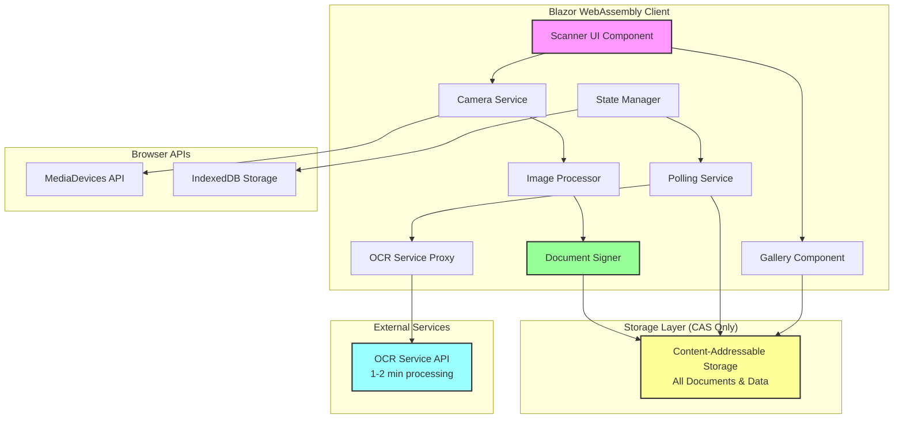
```mermaid
graph TB
    subgraph "Blazor WebAssembly Client"
        UI[Scanner UI Component]
        CAM[Camera Service]
        IMG[Image Processor]
        STATE[State Manager]
        PROXY[OCR Service Proxy]
        SIGN[Document Signer]
        POLL[Polling Service]
        GALLERY[Gallery Component]
    end
    
    subgraph "Browser APIs"
        MEDIA[MediaDevices API]
        STORE[IndexedDB Storage]
    end
    
    subgraph "Storage Layer (CAS Only)"
        CAS[Content-Addressable Storage<br/>All Documents & Data]
    end
    
    subgraph "External Services"
        OCR[OCR Service API<br/>1-2 min processing]
    end
    
    UI --> CAM
    UI --> GALLERY
    CAM --> MEDIA
    CAM --> IMG
    IMG --> SIGN
    SIGN --> CAS
    STATE --> POLL
    POLL --> PROXY
    PROXY --> OCR
    POLL --> CAS
    STATE --> STORE
    GALLERY --> CAS
    
    style UI fill:#f9f,stroke:#333,stroke-width:2px
    style OCR fill:#9ff,stroke:#333,stroke-width:2px
    style CAS fill:#ff9,stroke:#333,stroke-width:2px
    style SIGN fill:#9f9,stroke:#333,stroke-width:2px
```

### Component Hierarchy

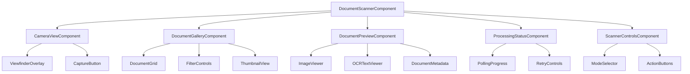
```mermaid
graph TD
    ROOT[DocumentScannerComponent]
    ROOT --> CAMERA[CameraViewComponent]
    ROOT --> GALLERY[DocumentGalleryComponent]
    ROOT --> PREVIEW[DocumentPreviewComponent]
    ROOT --> STATUS[ProcessingStatusComponent]
    ROOT --> CONTROLS[ScannerControlsComponent]
    
    CAMERA --> VIEWFINDER[ViewfinderOverlay]
    CAMERA --> CAPTURE[CaptureButton]
    
    GALLERY --> GRID[DocumentGrid]
    GALLERY --> FILTER[FilterControls]
    GALLERY --> THUMB[ThumbnailView]
    
    PREVIEW --> IMAGE[ImageViewer]
    PREVIEW --> OCR[OCRTextViewer]
    PREVIEW --> META[DocumentMetadata]
    
    STATUS --> PROGRESS[PollingProgress]
    STATUS --> RETRY[RetryControls]
    
    CONTROLS --> MODE[ModeSelector]
    CONTROLS --> ACTIONS[ActionButtons]
```

## Component Architecture

### Core Components

#### 1. DocumentScannerComponent (Root Container)

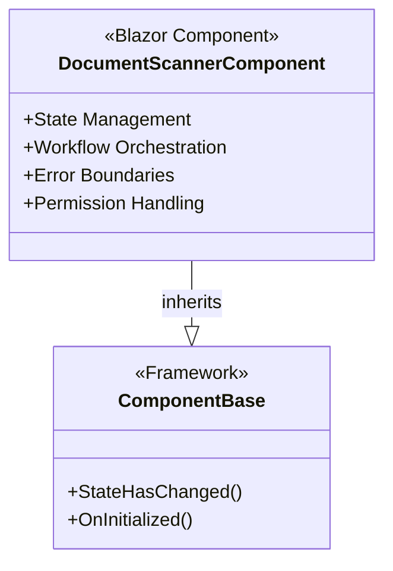
```mermaid
classDiagram
    class DocumentScannerComponent {
        <<Blazor Component>>
        +State Management
        +Workflow Orchestration
        +Error Boundaries
        +Permission Handling
    }
    
    class ComponentBase {
        <<Framework>>
        +StateHasChanged()
        +OnInitialized()
    }
    
    DocumentScannerComponent --|> ComponentBase : inherits
```

**Responsibilities:**
- Workflow orchestration
- State management coordination
- Error boundary handling
- Permission management

**State Management:**
Uses **Stateless** FSM library (NuGet: `Stateless` v5.15.0) for reliable state machine implementation. States: Idle → RequestingPermission → CameraActive → ImageCaptured → Processing → ResultsReady (with Error state for failures).

#### 2. CameraViewComponent
**Responsibilities:**
- Camera stream initialization
- Video element management
- Frame capture
- Device selection (front/back camera)

**Key Features:**
- Real-time camera preview
- Multiple camera support
- Torch/flash control (where available)
- Auto-focus and exposure adjustment

#### 3. DocumentGalleryComponent
**Responsibilities:**
- Display grid of stored documents
- Thumbnail generation from CAS
- Filter by document type and date
- Search by OCR content
- Batch operations support

**Key Features:**
- Lazy loading for performance
- Virtual scrolling for large collections
- Progressive image loading
- Quick preview on hover

#### 4. DocumentPreviewComponent
**Responsibilities:**
- Display full-size image from CAS
- Show OCR text results
- Display document metadata
- Signature verification status
- Export functionality

**Key Features:**
- Zoom and pan for images
- Text search in OCR results
- Copy text functionality
- Download original files

#### 5. ProcessingStatusComponent
**Responsibilities:**
- Show OCR processing progress
- Display polling status
- Handle retry operations
- Show error states
- Timeout notifications

### Service Layer Architecture

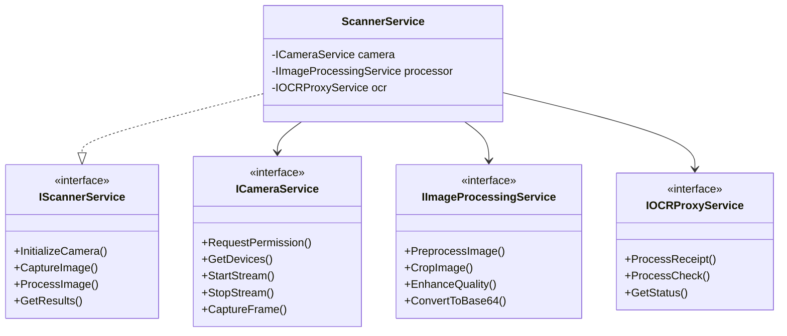
```mermaid
classDiagram
    class IScannerService {
        <<interface>>
        +InitializeCamera()
        +CaptureImage()
        +ProcessImage()
        +GetResults()
    }
    
    class ICameraService {
        <<interface>>
        +RequestPermission()
        +GetDevices()
        +StartStream()
        +StopStream()
        +CaptureFrame()
    }
    
    class IImageProcessingService {
        <<interface>>
        +PreprocessImage()
        +CropImage()
        +EnhanceQuality()
        +ConvertToBase64()
    }
    
    class IOCRProxyService {
        <<interface>>
        +ProcessReceipt()
        +ProcessCheck()
        +GetStatus()
    }
    
    class ScannerService {
        -ICameraService camera
        -IImageProcessingService processor
        -IOCRProxyService ocr
    }
    
    ScannerService ..|> IScannerService
    ScannerService --> ICameraService
    ScannerService --> IImageProcessingService
    ScannerService --> IOCRProxyService
```

### State Management Design

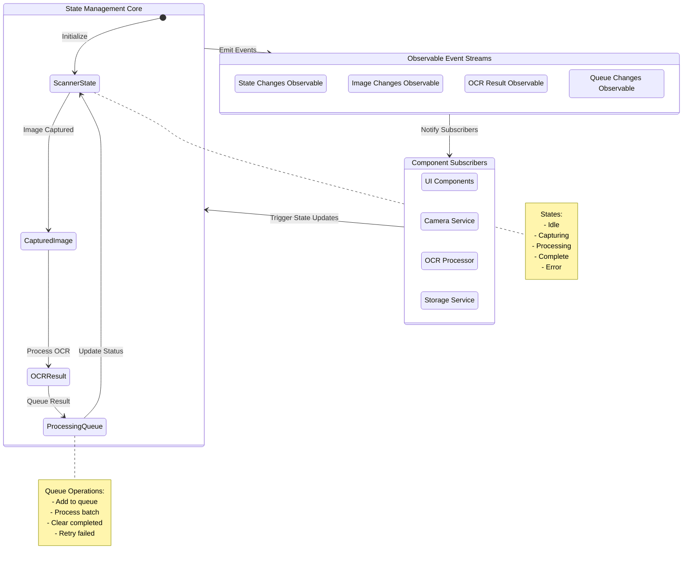
```mermaid
stateDiagram-v2
    direction TB
    
    %% State Containers
    state "State Management Core" as SMC {
        direction LR
        [*] --> ScannerState: Initialize
        ScannerState --> CapturedImage: Image Captured
        CapturedImage --> OCRResult: Process OCR
        OCRResult --> ProcessingQueue: Queue Result
        ProcessingQueue --> ScannerState: Update Status
    }
    
    %% Observable Streams
    state "Observable Event Streams" as OES {
        direction TB
        StateChanges: State Changes Observable
        ImageChanges: Image Changes Observable
        ResultChanges: OCR Result Observable
        QueueChanges: Queue Changes Observable
    }
    
    %% Component Interactions
    state "Component Subscribers" as CS {
        direction LR
        UI: UI Components
        Camera: Camera Service
        OCR: OCR Processor
        Storage: Storage Service
    }
    
    %% Event Flow Connections
    SMC --> OES: Emit Events
    OES --> CS: Notify Subscribers
    CS --> SMC: Trigger State Updates
    
    %% State Transitions Detail
    note right of ScannerState
        States:
        - Idle
        - Capturing
        - Processing
        - Complete
        - Error
    end note
    
    note right of ProcessingQueue
        Queue Operations:
        - Add to queue
        - Process batch
        - Clear completed
        - Retry failed
    end note
```

**Scanner State Manager Architecture**

The state manager orchestrates document scanning workflow through a reactive state pattern. It maintains four primary state containers that emit observable streams, enabling components to subscribe to specific state changes. This event-driven architecture ensures loose coupling between UI, camera, OCR processing, and storage components while maintaining a unidirectional data flow for predictable state updates.

## Cryptographic Document Architecture

### Signed Document Structure

The system implements a cryptographically signed document structure that ensures integrity and authenticity of both images and OCR results. ALL components - the signed document, images, and OCR results - are stored in the same Content-Addressable Storage (CAS) system. This structure allows for progressive enhancement where images are immediately available while OCR processing occurs asynchronously.

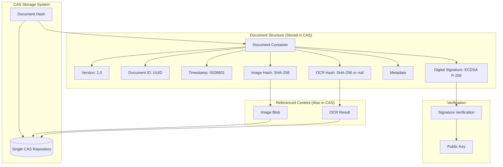
```mermaid
graph TB
    subgraph "Document Structure (Stored in CAS)"
        DOC[Document Container]
        DOC --> VER[Version: 1.0]
        DOC --> ID[Document ID: UUID]
        DOC --> TS[Timestamp: ISO8601]
        DOC --> IMG_HASH[Image Hash: SHA-256]
        DOC --> OCR_HASH[OCR Hash: SHA-256 or null]
        DOC --> META[Metadata]
        DOC --> SIG[Digital Signature: ECDSA P-256]
    end
    
    subgraph "Referenced Content (Also in CAS)"
        IMG_HASH --> IMG_CAS[Image Blob]
        OCR_HASH --> OCR_CAS[OCR Result]
    end
    
    subgraph "CAS Storage System"
        DOC_HASH[Document Hash] --> DOC
        DOC_HASH --> CAS[(Single CAS Repository)]
        IMG_CAS --> CAS
        OCR_CAS --> CAS
    end
    
    subgraph "Verification"
        SIG --> VERIFY[Signature Verification]
        VERIFY --> PUB_KEY[Public Key]
    end
```

### Document Schema Definition

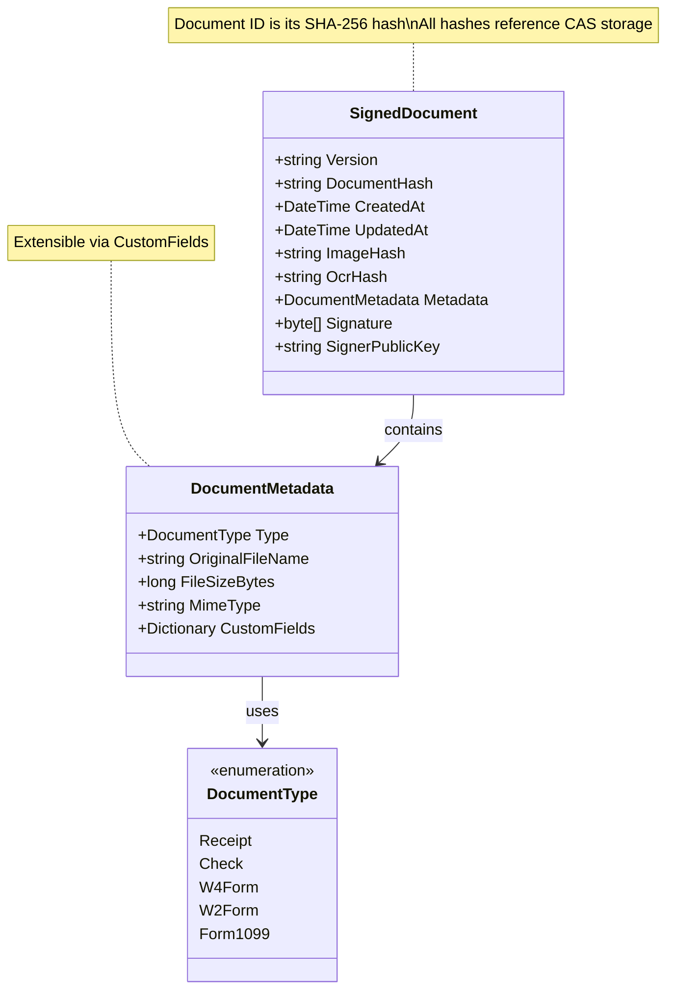
```mermaid
classDiagram
    class SignedDocument {
        +string Version
        +string DocumentHash
        +DateTime CreatedAt
        +DateTime UpdatedAt
        +string ImageHash
        +string OcrHash
        +DocumentMetadata Metadata
        +byte[] Signature
        +string SignerPublicKey
    }
    
    class DocumentMetadata {
        +DocumentType Type
        +string OriginalFileName
        +long FileSizeBytes
        +string MimeType
        +Dictionary CustomFields
    }
    
    class DocumentType {
        <<enumeration>>
        Receipt
        Check
        W4Form
        W2Form
        Form1099
    }
    
    SignedDocument --> DocumentMetadata : contains
    DocumentMetadata --> DocumentType : uses
    
    note for SignedDocument "Document ID is its SHA-256 hash\nAll hashes reference CAS storage"
    note for DocumentMetadata "Extensible via CustomFields"
```

**Key Design Decisions:**
- **DocumentHash**: SHA-256 hash serves as document ID (no separate ID generation)
- **Content References**: ImageHash and OcrHash point to CAS-stored content
- **Signature**: ECDSA P-256 (browser-compatible, future migration to Ed25519)
- **Extensibility**: CustomFields dictionary for document-type-specific data

### Cryptographic Signing Process

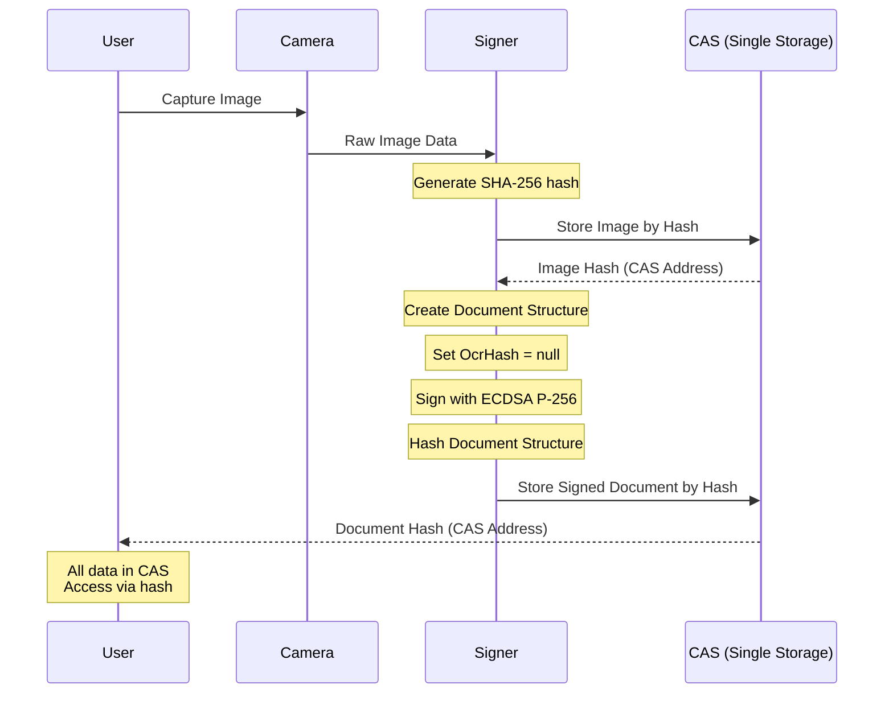
```mermaid
sequenceDiagram
    participant User
    participant Camera
    participant Signer
    participant CAS as CAS (Single Storage)
    
    User->>Camera: Capture Image
    Camera->>Signer: Raw Image Data
    
    Note over Signer: Generate SHA-256 hash
    Signer->>CAS: Store Image by Hash
    CAS-->>Signer: Image Hash (CAS Address)
    
    Note over Signer: Create Document Structure
    Note over Signer: Set OcrHash = null
    Note over Signer: Sign with ECDSA P-256
    Note over Signer: Hash Document Structure
    
    Signer->>CAS: Store Signed Document by Hash
    CAS-->>User: Document Hash (CAS Address)
    
    Note over User: All data in CAS<br/>Access via hash
```

### Document Update Process (After OCR)

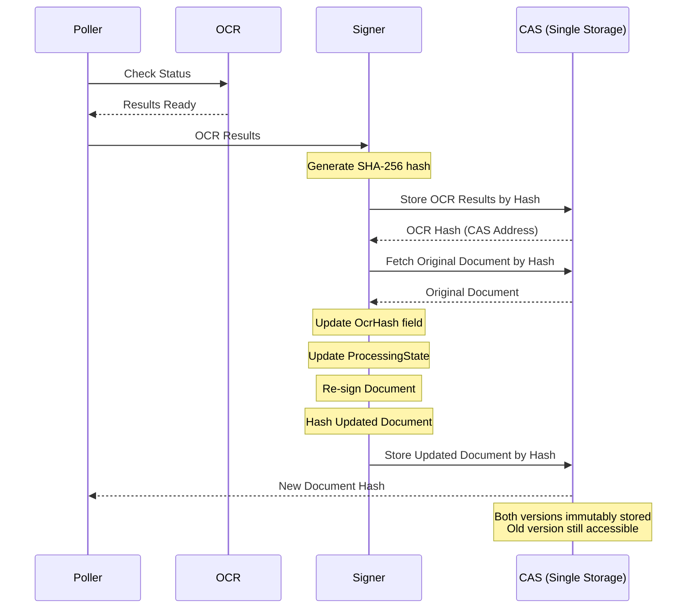
```mermaid
sequenceDiagram
    participant Poller
    participant OCR
    participant Signer
    participant CAS as CAS (Single Storage)
    
    Poller->>OCR: Check Status
    OCR-->>Poller: Results Ready
    
    Poller->>Signer: OCR Results
    Note over Signer: Generate SHA-256 hash
    Signer->>CAS: Store OCR Results by Hash
    CAS-->>Signer: OCR Hash (CAS Address)
    
    Signer->>CAS: Fetch Original Document by Hash
    CAS-->>Signer: Original Document
    
    Note over Signer: Update OcrHash field
    Note over Signer: Update ProcessingState
    Note over Signer: Re-sign Document
    Note over Signer: Hash Updated Document
    
    Signer->>CAS: Store Updated Document by Hash
    CAS-->>Poller: New Document Hash
    
    Note over CAS: Both versions immutably stored<br/>Old version still accessible
```

## Asynchronous OCR Processing

### Polling Architecture

The system implements a sophisticated polling mechanism to handle the 1-2 minute OCR processing delays while preventing mobile devices from sleeping.

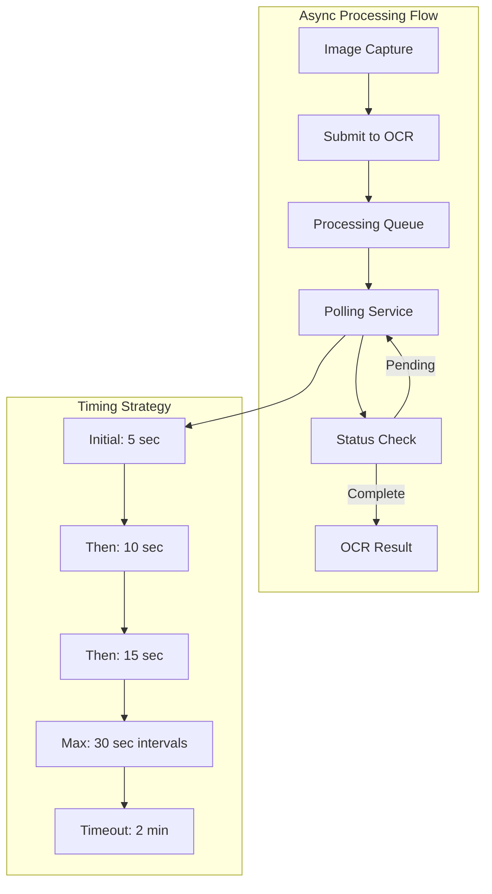
```mermaid
graph TB
    subgraph "Async Processing Flow"
        CAPTURE[Image Capture]
        SUBMIT[Submit to OCR]
        QUEUE[Processing Queue]
        POLL[Polling Service]
        CHECK[Status Check]
        RESULT[OCR Result]
    end
    
    subgraph "Timing Strategy"
        T1[Initial: 5 sec]
        T2[Then: 10 sec]
        T3[Then: 15 sec]
        T4[Max: 30 sec intervals]
        TIMEOUT[Timeout: 2 min]
    end
    
    CAPTURE --> SUBMIT
    SUBMIT --> QUEUE
    QUEUE --> POLL
    POLL --> CHECK
    CHECK -->|Pending| POLL
    CHECK -->|Complete| RESULT
    
    POLL --> T1
    T1 --> T2
    T2 --> T3
    T3 --> T4
    T4 --> TIMEOUT
```

### Polling Service Architecture

The polling service implements an adaptive exponential backoff strategy for checking OCR processing status, optimized for mobile battery life.

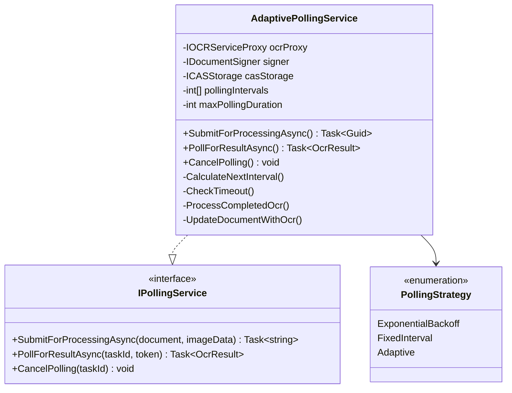
```mermaid
classDiagram
    class IPollingService {
        <<interface>>
        +SubmitForProcessingAsync(document, imageData) Task~string~
        +PollForResultAsync(taskId, token) Task~OcrResult~
        +CancelPolling(taskId) void
    }
    
    class AdaptivePollingService {
        -IOCRServiceProxy ocrProxy
        -IDocumentSigner signer
        -ICASStorage casStorage
        -int[] pollingIntervals
        -int maxPollingDuration
        +SubmitForProcessingAsync() Task~Guid~
        +PollForResultAsync() Task~OcrResult~
        +CancelPolling() void
        -CalculateNextInterval()
        -CheckTimeout()
        -ProcessCompletedOcr()
        -UpdateDocumentWithOcr()
    }
    
    class PollingStrategy {
        <<enumeration>>
        ExponentialBackoff
        FixedInterval
        Adaptive
    }
    
    AdaptivePollingService ..|> IPollingService
    AdaptivePollingService --> PollingStrategy
```

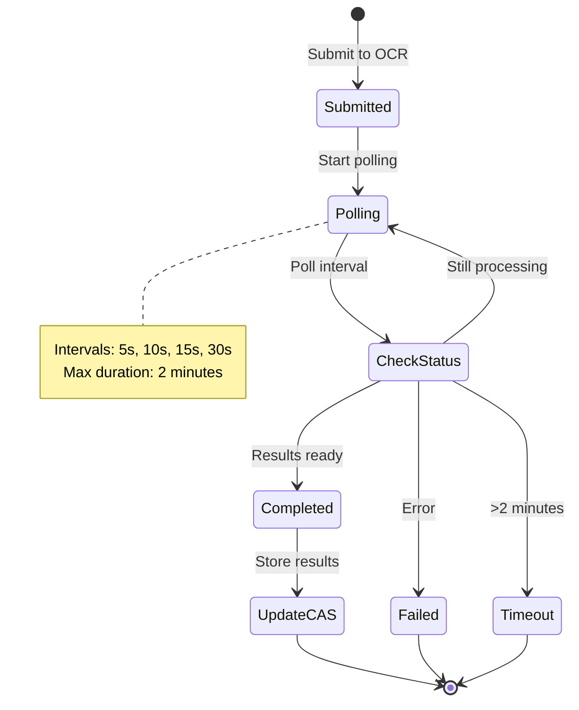
```mermaid
stateDiagram-v2
    [*] --> Submitted: Submit to OCR
    Submitted --> Polling: Start polling
    Polling --> CheckStatus: Poll interval
    CheckStatus --> Polling: Still processing
    CheckStatus --> Completed: Results ready
    CheckStatus --> Failed: Error
    CheckStatus --> Timeout: >2 minutes
    Completed --> UpdateCAS: Store results
    UpdateCAS --> [*]
    Failed --> [*]
    Timeout --> [*]
    
    note right of Polling
        Intervals: 5s, 10s, 15s, 30s
        Max duration: 2 minutes
    end note
```

**Key Interface Definition:**

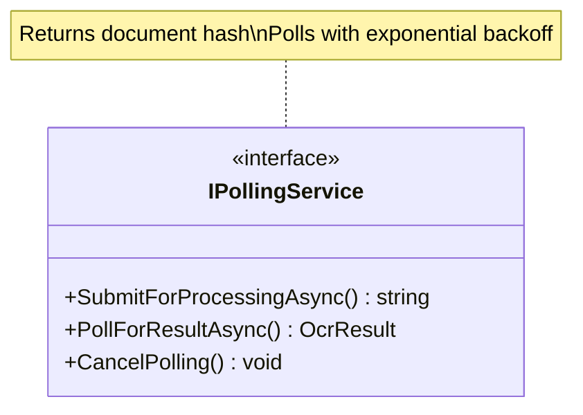
```mermaid
classDiagram
    class IPollingService {
        <<interface>>
        +SubmitForProcessingAsync() string
        +PollForResultAsync() OcrResult
        +CancelPolling() void
    }
    
    note for IPollingService "Returns document hash\nPolls with exponential backoff"
```

### Background Job Processing

**OcrBackgroundProcessor** manages the background processing queue for OCR jobs. It ensures mobile devices stay awake during processing, handles job timeouts, and coordinates with the polling service to retrieve results.

**Key Responsibilities:**
- Queue management for OCR processing jobs
- Wake lock management to prevent mobile device sleep
- Timeout enforcement (2.5 minutes per job)
- Result notification and error handling

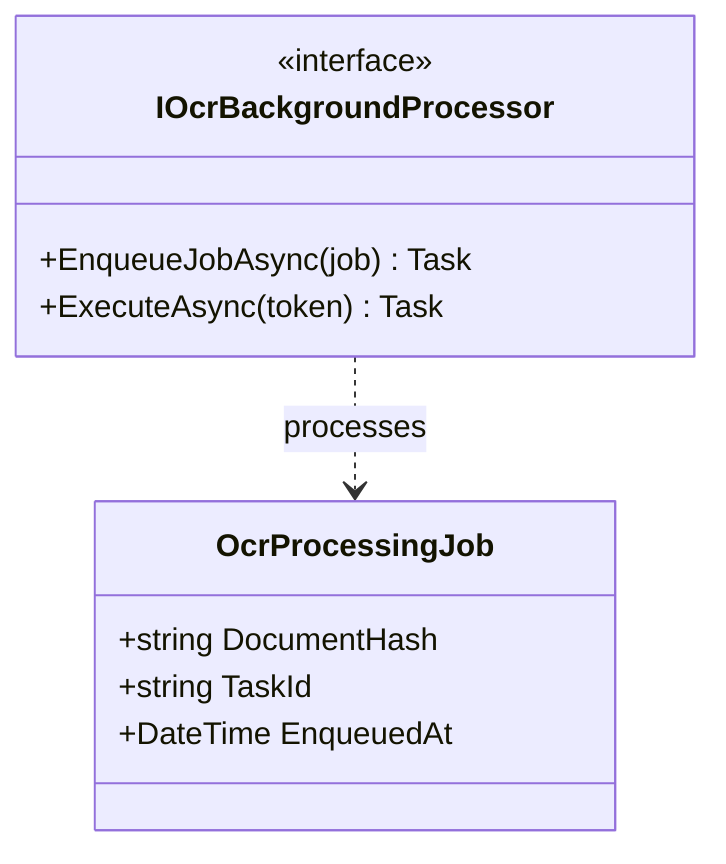
```mermaid
classDiagram
    class IOcrBackgroundProcessor {
        <<interface>>
        +EnqueueJobAsync(job) Task
        +ExecuteAsync(token) Task
    }
    
    class OcrProcessingJob {
        +string DocumentHash
        +string TaskId
        +DateTime EnqueuedAt
    }
    
    IOcrBackgroundProcessor ..> OcrProcessingJob : processes
```

**Processing Flow:**

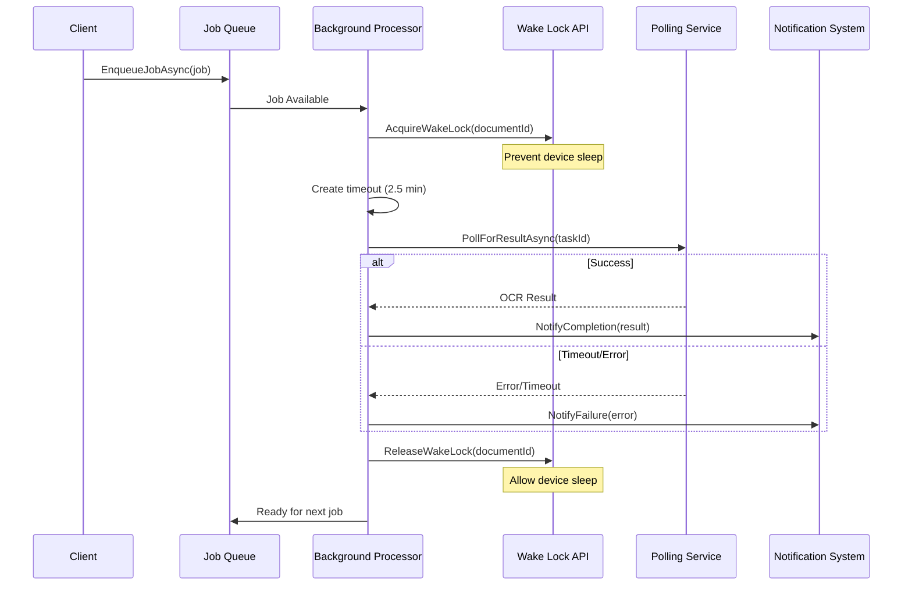
```mermaid
sequenceDiagram
    participant Client
    participant Queue as Job Queue
    participant Processor as Background Processor
    participant WakeLock as Wake Lock API
    participant Polling as Polling Service
    participant Notification as Notification System

    Client->>Queue: EnqueueJobAsync(job)
    Queue->>Processor: Job Available
    
    Processor->>WakeLock: AcquireWakeLock(documentId)
    Note over WakeLock: Prevent device sleep
    
    Processor->>Processor: Create timeout (2.5 min)
    Processor->>Polling: PollForResultAsync(taskId)
    
    alt Success
        Polling-->>Processor: OCR Result
        Processor->>Notification: NotifyCompletion(result)
    else Timeout/Error
        Polling-->>Processor: Error/Timeout
        Processor->>Notification: NotifyFailure(error)
    end
    
    Processor->>WakeLock: ReleaseWakeLock(documentId)
    Note over WakeLock: Allow device sleep
    
    Processor->>Queue: Ready for next job
```

### Wake Lock Service Architecture

The Wake Lock service prevents mobile devices from sleeping during OCR processing. It provides a thin wrapper around the browser's Wake Lock API, ensuring the device screen stays active during document processing operations.

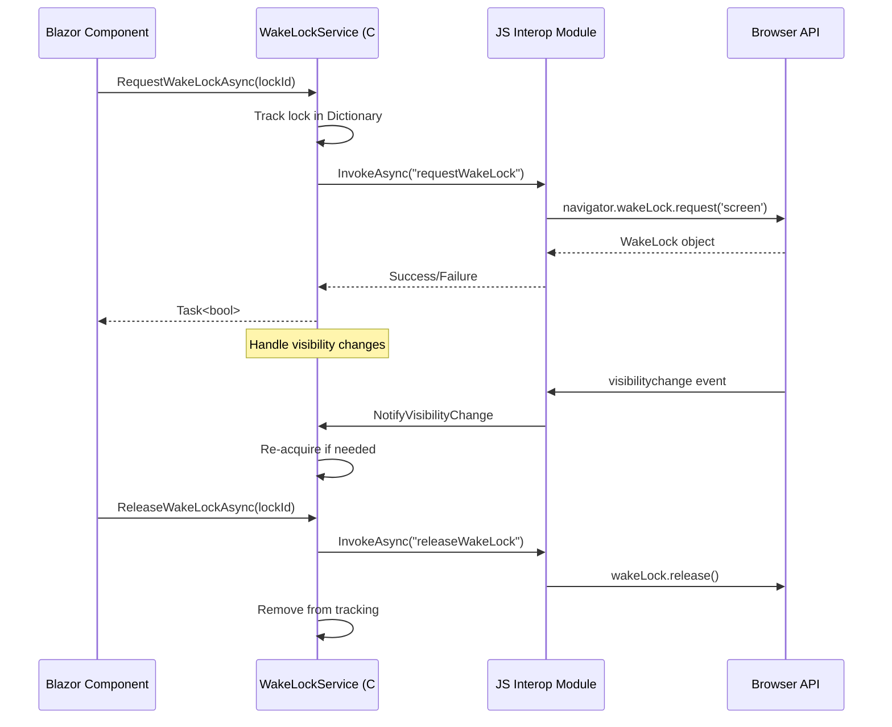
```mermaid
sequenceDiagram
    participant Component as Blazor Component
    participant Service as WakeLockService (C#)
    participant JSInterop as JS Interop Module
    participant Browser as Browser API
    
    Component->>Service: RequestWakeLockAsync(lockId)
    Service->>Service: Track lock in Dictionary
    Service->>JSInterop: InvokeAsync("requestWakeLock")
    JSInterop->>Browser: navigator.wakeLock.request('screen')
    Browser-->>JSInterop: WakeLock object
    JSInterop-->>Service: Success/Failure
    Service-->>Component: Task<bool>
    
    Note over Service: Handle visibility changes
    Browser->>JSInterop: visibilitychange event
    JSInterop->>Service: NotifyVisibilityChange
    Service->>Service: Re-acquire if needed
    
    Component->>Service: ReleaseWakeLockAsync(lockId)
    Service->>JSInterop: InvokeAsync("releaseWakeLock")
    JSInterop->>Browser: wakeLock.release()
    Service->>Service: Remove from tracking
```

**Service Interface:**

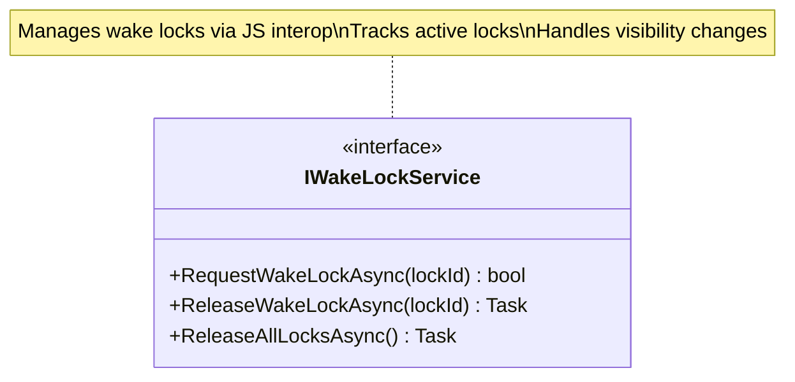
```mermaid
classDiagram
    class IWakeLockService {
        <<interface>>
        +RequestWakeLockAsync(lockId) bool
        +ReleaseWakeLockAsync(lockId) Task
        +ReleaseAllLocksAsync() Task
    }
    
    note for IWakeLockService "Manages wake locks via JS interop\nTracks active locks\nHandles visibility changes"
```

The service manages wake lock lifecycle through JavaScript interop, tracking active locks and handling browser visibility changes. The minimal JavaScript module acts as a thin wrapper that only calls native browser APIs, keeping all business logic in C#.

## Document Signing Architecture

### ECDSA P-256 Signature Service

The document signing service ensures cryptographic integrity and authenticity using ECDSA P-256 signatures.

> **Note**: The current implementation uses ECDSA P-256 while maintaining an Ed25519-compatible API for future migration. The Ed25519KeyPair class internally uses ECDSA until native Ed25519 support is available in the browser environment.

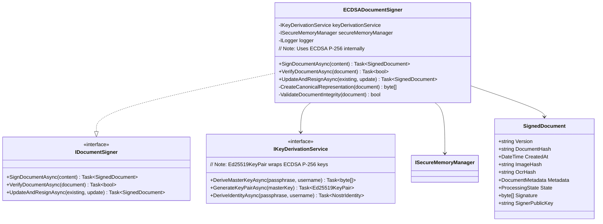
```mermaid
classDiagram
    class IDocumentSigner {
        <<interface>>
        +SignDocumentAsync(content) Task~SignedDocument~
        +VerifyDocumentAsync(document) Task~bool~
        +UpdateAndResignAsync(existing, update) Task~SignedDocument~
    }
    
    class ECDSADocumentSigner {
        -IKeyDerivationService keyDerivationService
        -ISecureMemoryManager secureMemoryManager
        -ILogger logger
        +SignDocumentAsync(content) Task~SignedDocument~
        +VerifyDocumentAsync(document) Task~bool~
        +UpdateAndResignAsync(existing, update) Task~SignedDocument~
        -CreateCanonicalRepresentation(document) byte[]
        -ValidateDocumentIntegrity(document) bool
        // Note: Uses ECDSA P-256 internally
    }
    
    class IKeyDerivationService {
        <<interface>>
        +DeriveMasterKeyAsync(passphrase, username) Task~byte[]~
        +GenerateKeyPairAsync(masterKey) Task~Ed25519KeyPair~
        +DeriveIdentityAsync(passphrase, username) Task~NostrIdentity~
        // Note: Ed25519KeyPair wraps ECDSA P-256 keys
    }
    
    class SignedDocument {
        +string Version
        +string DocumentHash
        +DateTime CreatedAt
        +string ImageHash
        +string OcrHash
        +DocumentMetadata Metadata
        +ProcessingState State
        +byte[] Signature
        +string SignerPublicKey
    }
    
    ECDSADocumentSigner ..|> IDocumentSigner
    ECDSADocumentSigner --> IKeyDerivationService
    ECDSADocumentSigner --> ISecureMemoryManager
    ECDSADocumentSigner --> SignedDocument
```

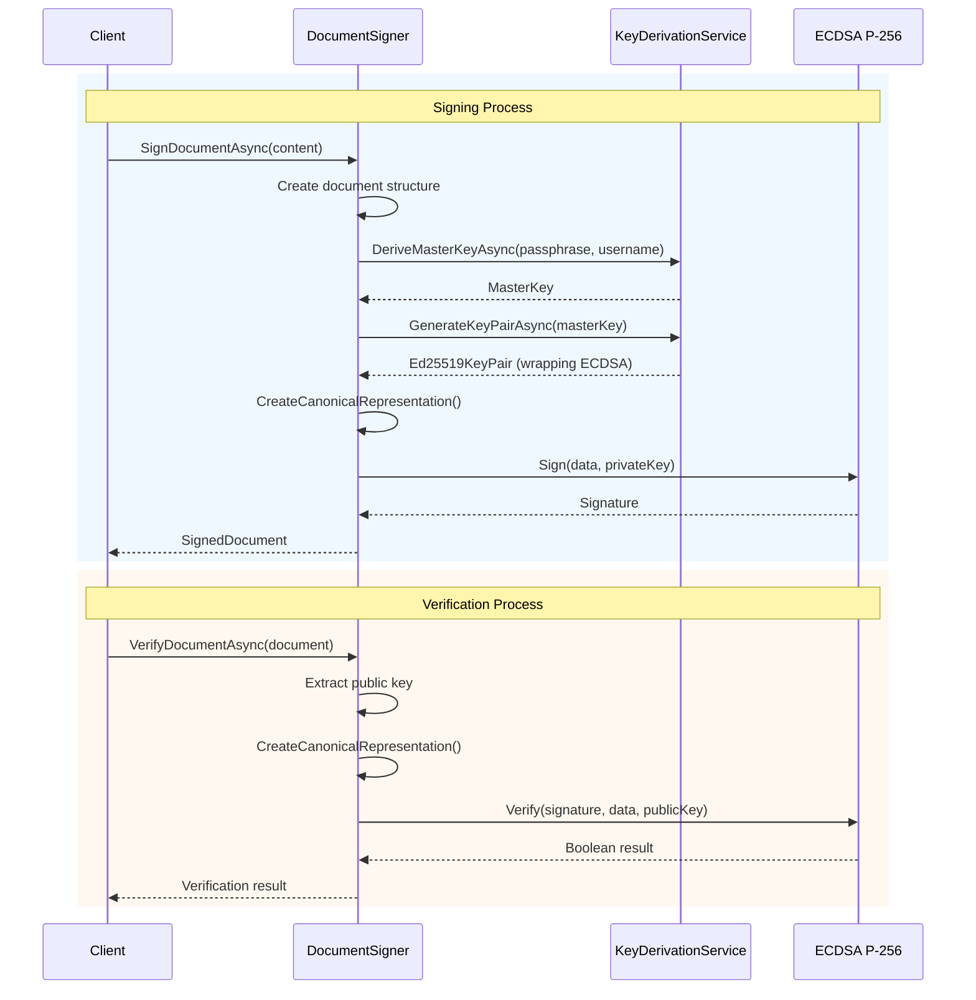
```mermaid
sequenceDiagram
    participant Client
    participant Signer as DocumentSigner
    participant KeyDerive as KeyDerivationService
    participant Crypto as ECDSA P-256
    
    rect rgb(240, 248, 255)
        Note over Client,Crypto: Signing Process
        Client->>Signer: SignDocumentAsync(content)
        Signer->>Signer: Create document structure
        Signer->>KeyDerive: DeriveMasterKeyAsync(passphrase, username)
        KeyDerive-->>Signer: MasterKey
        Signer->>KeyDerive: GenerateKeyPairAsync(masterKey)
        KeyDerive-->>Signer: Ed25519KeyPair (wrapping ECDSA)
        Signer->>Signer: CreateCanonicalRepresentation()
        Signer->>Crypto: Sign(data, privateKey)
        Crypto-->>Signer: Signature
        Signer-->>Client: SignedDocument
    end
    
    rect rgb(255, 248, 240)
        Note over Client,Crypto: Verification Process
        Client->>Signer: VerifyDocumentAsync(document)
        Signer->>Signer: Extract public key
        Signer->>Signer: CreateCanonicalRepresentation()
        Signer->>Crypto: Verify(signature, data, publicKey)
        Crypto-->>Signer: Boolean result
        Signer-->>Client: Verification result
    end
```

**Key Interface:**

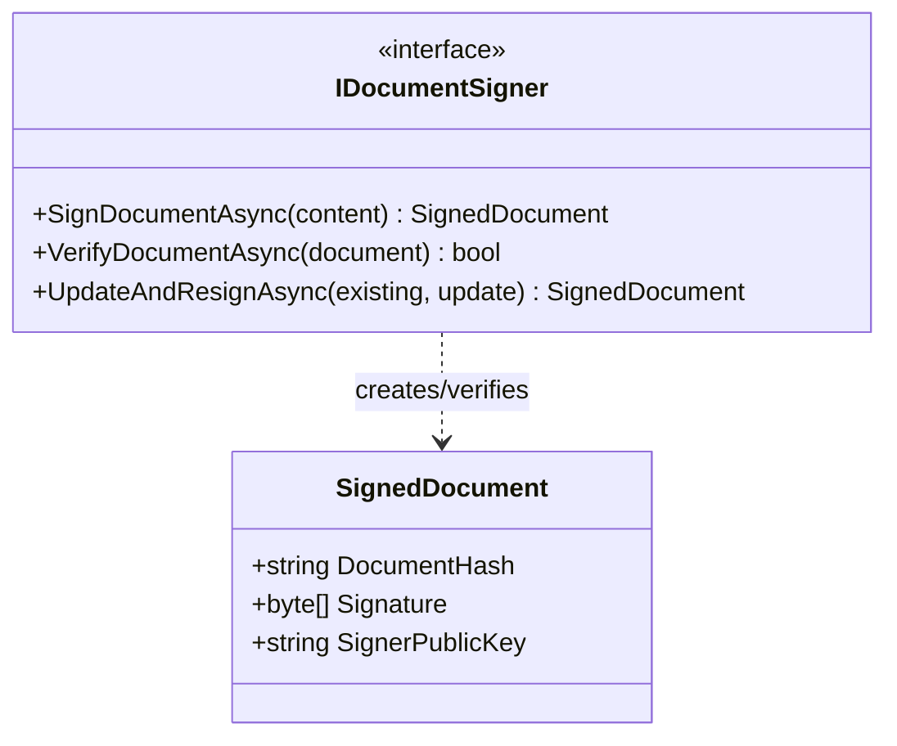
```mermaid
classDiagram
    class IDocumentSigner {
        <<interface>>
        +SignDocumentAsync(content) SignedDocument
        +VerifyDocumentAsync(document) bool
        +UpdateAndResignAsync(existing, update) SignedDocument
    }
    
    class SignedDocument {
        +string DocumentHash
        +byte[] Signature
        +string SignerPublicKey
    }
    
    IDocumentSigner ..> SignedDocument : creates/verifies
```

### Key Derivation

The system derives cryptographic keys from user credentials using PBKDF2 with 600,000 iterations. Keys are derived deterministically from username and passphrase. Currently uses ECDSA P-256 due to browser limitations (will migrate to Ed25519 when browser support is available).

```mermaid
flowchart LR
    INPUT[Username + Purpose] --> CONCAT[Concatenate with domain]
    CONCAT --> HASH[SHA-256 Hash]
    HASH --> SALT[Deterministic Salt]
    
    note right of CONCAT
        Format: username:purpose:nolock.social
    end note
```

**Key Design Principles:**
- **Stateless**: No persistent key storage - keys are derived on-demand
- **Deterministic**: Same username/password always produces same keys
- **Memory-only**: Keys exist only in secure memory during session
- **PBKDF2**: Industry-standard key derivation (600k iterations)
- **Secure Memory**: Keys protected via ISecureMemoryManager

## Gallery Component Architecture

### Document Gallery Service

The gallery service manages document retrieval, filtering, pagination, and thumbnail generation from the CAS storage.

```mermaid
classDiagram
    class IDocumentGalleryService {
        <<interface>>
        +GetDocumentsAsync(page, pageSize, filter) Task~PagedResult~
        +GenerateThumbnailAsync(imageHash) Task~byte[]~
        +GetDocumentDetailsAsync(documentId) Task~DocumentDetails~
        +DeleteDocumentAsync(documentId) Task
    }
    
    class DocumentGalleryService {
        -ICASStorage casStorage
        -IThumbnailGenerator thumbnailGen
        -IDocumentSigner signer
        +GetDocumentsAsync() Task~PagedResult~
        +GenerateThumbnailAsync() Task~byte[]~
        +GetDocumentDetailsAsync() Task~DocumentDetails~
        +DeleteDocumentAsync() Task
        -ApplyFilters(documents, filter)
        -GenerateThumbnailUrl(imageHash)
    }
    
    class DocumentFilter {
        +DocumentType? Type
        +ProcessingState? State
        +string SearchText
        +DateTime? StartDate
        +DateTime? EndDate
    }
    
    class PagedResult~T~ {
        +List~T~ Items
        +int TotalCount
        +int Page
        +int PageSize
        +int TotalPages
    }
    
    DocumentGalleryService ..|> IDocumentGalleryService
    DocumentGalleryService --> DocumentFilter
    DocumentGalleryService --> PagedResult
```

```mermaid
sequenceDiagram
    participant UI as Gallery Component
    participant Service as GalleryService
    participant CAS as CAS Storage
    participant Thumb as ThumbnailGenerator
    
    UI->>Service: GetDocumentsAsync(page, filter)
    Service->>CAS: GetDocumentHashesAsync()
    CAS-->>Service: Document hashes
    
    loop For each hash
        Service->>CAS: RetrieveAsync<SignedDocument>(hash)
        CAS-->>Service: SignedDocument
    end
    
    Service->>Service: ApplyFilters(documents, filter)
    Service->>Service: Paginate results
    
    loop For each document
        Service->>Thumb: GenerateThumbnailUrl(imageHash)
        Thumb-->>Service: Thumbnail URL
    end
    
    Service-->>UI: PagedResult<DocumentSummary>
```

**Key Interface:**

```mermaid
classDiagram
    class IDocumentGalleryService {
        <<interface>>
        +GetDocumentsAsync(page, size, filter) PagedResult
        +GenerateThumbnailAsync(imageHash) byte[]
        +GetDocumentDetailsAsync(documentHash) DocumentDetails
        +DeleteDocumentAsync(documentHash) Task
    }
    
    class DocumentFilter {
        +DocumentType Type
        +DateRange DateRange
        +string SearchText
    }
    
    IDocumentGalleryService ..> DocumentFilter : uses
```

### Virtual Scrolling Implementation

```mermaid
graph TB
    subgraph "Gallery Component"
        HEADER[Filter Controls]
        VIRTUAL[Virtualize Component]
        THUMB[Document Thumbnails]
        LOADER[Loading Indicator]
    end
    
    subgraph "Services"
        GALLERY[IDocumentGalleryService]
        JS[IJSRuntime]
    end
    
    HEADER --> VIRTUAL
    VIRTUAL --> THUMB
    VIRTUAL --> LOADER
    
    VIRTUAL -.-> GALLERY
    THUMB -.-> JS
    
    style VIRTUAL fill:#f9f
    style THUMB fill:#9ff
```

**Component Features:**
- **Route**: `/gallery`
- **Virtual Scrolling**: Renders only visible items (250px item size, 3 overscan)
- **Filtering**: Document type, date range, search text
- **Infinite Loading**: Loads more on scroll

**Gallery Component Implementation:**
- **HTML Structure**: Filter controls, virtual scroll grid, loading indicator
- **State Management**: Tracks documents, filters, pagination, loading state
- **Infinite Scroll**: JS interop for scroll detection, loads more on demand
- **Virtual Rendering**: Blazor Virtualize component (250px items, 3 overscan)
- **Navigation**: Routes to `/document/{hash}` on thumbnail click
- **Cleanup**: Implements IAsyncDisposable for resource management

### Preview Component with CAS Integration

**UI Mockup - Document Preview (Desktop):**
```
+----------------------------------------------------------+
| Document Details                    [✓ Signature Valid]  |
+----------------------------------------------------------+
|                           |                              |
|   +-------------------+   |  OCR Extracted Text:         |
|   |                   |   |  ========================    |
|   |                   |   |                              |
|   |   DOCUMENT        |   |  Merchant: Starbucks         |
|   |     IMAGE         |   |  Date: 2024-01-15            |
|   |                   |   |  Items:                      |
|   |   [Zoom +/-]      |   |  - Coffee Latte    $4.95     |
|   |                   |   |  - Croissant       $3.50     |
|   +-------------------+   |  Tax:              $0.85     |
|                           |  Total:            $9.30     |
|   Metadata:               |                              |
|   Type: Receipt           |  [Copy Text] [Export JSON]   |
|   Size: 1.2 MB            |                              |
|   Date: 2024-01-15        |                              |
+----------------------------------------------------------+
```

**UI Mockup - Processing States:**
```
Processing State:
+------------------------+
| ⟳ OCR Processing...    |
| [=========>    ] 65%   |
| Time: 45s / ~2min      |
+------------------------+

Error State:
+------------------------+
| ✗ OCR Processing Failed|
| Reason: Timeout        |
| [Retry Processing]     |
+------------------------+
```

```mermaid
stateDiagram-v2
    [*] --> Loading: Navigate to /document/{hash}
    Loading --> DisplayImage: Image loaded from CAS
    Loading --> Error: Invalid hash
    
    DisplayImage --> CheckOCR: Check OCR status
    CheckOCR --> DisplayBoth: OCR complete
    CheckOCR --> ShowProcessing: OCR in progress
    CheckOCR --> ShowError: OCR failed
    
    ShowProcessing --> DisplayBoth: OCR completes
    ShowError --> ShowProcessing: User retries
    
    DisplayBoth --> [*]: User exits
    Error --> [*]: User navigates away
```

**Component Architecture:**
- **Route**: `/document/{DocumentHash}`
- **Data Loading**: Fetches from CAS using document hash
- **Signature Verification**: ECDSA P-256 validation
- **Progressive Enhancement**: Shows image immediately, OCR when ready
- **Error Recovery**: Retry button for failed OCR

## Content-Addressable Storage (CAS) Integration

### CAS as the Single Storage System

**IMPORTANT**: Content-Addressable Storage (CAS) is the ONLY storage system in this architecture. There is no separate document database, no document repository, and no other storage mechanism. Everything - documents, images, OCR results, processing entries, and metadata - is stored in CAS.

Key principles:
- **Everything is content-addressed**: All data is stored and retrieved using its content hash
- **Immutable storage**: Once stored, content never changes (updates create new entries)
- **Natural deduplication**: Identical content automatically shares storage
- **Deduplication**: Content-addressed design automatically deduplicates identical content
- **No separate databases**: CAS replaces traditional document databases entirely

### CAS Architecture

```mermaid
graph TB
    subgraph "CAS Layer"
        HASH[Hash Calculator]
        STORE[Block Store]
        INDEX[Content Index]
        DEDUP[Deduplication]
    end
    
    subgraph "Storage Operations"
        PUT[PUT: Content → Hash]
        GET[GET: Hash → Content]
        EXISTS[EXISTS: Hash → Boolean]
        DELETE[DELETE: Hash → Void]
    end
    
    subgraph "Content Types"
        IMG[Images<br/>JPEG/PNG/WebP]
        OCR[OCR Results<br/>JSON]
        DOC[Documents<br/>Signed JSON]
    end
    
    IMG --> HASH
    OCR --> HASH
    DOC --> HASH
    
    HASH --> DEDUP
    DEDUP --> STORE
    STORE --> INDEX
    
    PUT --> STORE
    GET --> STORE
    EXISTS --> INDEX
    DELETE --> STORE
```

### CAS Service Interface

```mermaid
classDiagram
    class ICASStorage {
        <<interface>>
        +StoreAsync(content) string
        +RetrieveAsync(hash) byte[]
        +ExistsAsync(hash) bool
        +DeleteAsync(hash) Task
        +GetMetadataAsync(hash) CASMetadata
        +GetDocumentHashesAsync() IAsyncEnumerable~string~
        +RetrieveAsync~T~(hash) T
        +StoreAsync~T~(obj) string
        +SearchContent(hash, text) bool
        +FindByTypeAsync(type) IAsyncEnumerable~string~
    }
    
    class CASMetadata {
        +string Hash
        +long Size
        +DateTime Created
        +string ContentType
    }
    
    ICASStorage ..> CASMetadata : returns
    
    note for ICASStorage "SHA-256 content addressing\nImmutable storage\nStreaming APIs\nAutomatic deduplication"
```

## Pluggable Document Processor Architecture

### Overview

The pluggable document processor architecture enables seamless addition of new document types without modifying the core OCR scanning system. Each document type (receipt, check, W4, W2, 1099, etc.) is handled by a dedicated processor plugin that implements a common interface while providing document-specific logic for parsing, validation, and data extraction.

### Architecture Principles

1. **Open/Closed Principle**: System is open for extension (new document types) but closed for modification (core pipeline remains unchanged)
2. **Single Responsibility**: Each document processor handles exactly one document type
3. **Dependency Inversion**: Core system depends on abstractions (interfaces), not concrete implementations
4. **Plugin Discovery**: Automatic registration of new document processors via reflection or configuration
5. **Pipeline Consistency**: All documents flow through the same processing stages

### High-Level Plugin Architecture

```mermaid
graph TB
    subgraph "API Layer"
        API[API Gateway]
        R1[receipts endpoint]
        R2[checks endpoint]
        R3[w4 endpoint]
        R4[w2 endpoint]
        R5[1099 endpoint]
    end
    
    subgraph "Routing Layer"
        ROUTER[Document Router]
        REGISTRY[Processor Registry]
    end
    
    subgraph "Core Pipeline"
        PIPELINE[Processing Pipeline]
        PRE[Preprocessing Stage]
        OCR[OCR Stage]
        POST[Postprocessing Stage]
        VAL[Validation Stage]
        TRANS[Transform Stage]
    end
    
    subgraph "Plugin Layer"
        P1[Receipt Processor]
        P2[Check Processor]
        P3[W4 Processor]
        P4[W2 Processor]
        P5[1099 Processor]
        PNEW[... Future Processors]
    end
    
    subgraph "Storage (CAS Only)"
        CAS[Content-Addressable Storage<br/>Including All Metadata]
    end
    
    R1 --> API
    R2 --> API
    R3 --> API
    R4 --> API
    R5 --> API
    
    API --> ROUTER
    ROUTER --> REGISTRY
    REGISTRY --> PIPELINE
    
    PIPELINE --> PRE
    PRE --> OCR
    OCR --> POST
    POST --> VAL
    VAL --> TRANS
    
    P1 -.->|implements| PIPELINE
    P2 -.->|implements| PIPELINE
    P3 -.->|implements| PIPELINE
    P4 -.->|implements| PIPELINE
    P5 -.->|implements| PIPELINE
    PNEW -.->|implements| PIPELINE
    
    TRANS --> CAS
    
    style PIPELINE fill:#f9f,stroke:#333,stroke-width:2px
    style REGISTRY fill:#9ff,stroke:#333,stroke-width:2px
    style PNEW stroke-dasharray: 5 5
```

### Core Interfaces

#### IDocumentProcessor Interface

```mermaid
classDiagram
    class IDocumentMapper {
        <<interface>>
        +DocumentType DocumentType
        +string MapperVersion
        +MapResponseAsync~T~(apiResponse) Task~T~
    }
    
    note for IDocumentMapper "OCR API returns fully parsed models\nMappers only transform to domain objects"
```

#### Simplified Mapping Context

```mermaid
classDiagram
    class MappingContext {
        +string DocumentHash
        +DocumentType DocumentType  
        +ILogger Logger
        +CancellationToken Token
    }
    
    note for MappingContext "Minimal context for mapping\nDocument hash as ID"
```

### Simple Document Mapper Registry

```mermaid
classDiagram
    class IDocumentMapperRegistry {
        <<interface>>
        +RegisterMapper(mapper) void
        +GetMapper(type) IDocumentMapper
        +IsTypeSupported(type) bool
    }
    
    class DocumentMapperRegistry {
        -Dictionary~DocumentType,IDocumentMapper~ mappers
        -ILogger logger
        +RegisterMapper(mapper) void
        +GetMapper(type) IDocumentMapper  
        +IsTypeSupported(type) bool
    }
    
    DocumentMapperRegistry ..|> IDocumentMapperRegistry
    DocumentMapperRegistry --> IDocumentMapper : manages
    
    note for DocumentMapperRegistry "Simple dictionary-based registry\nAuto-discovery at startup"
```

### Simplified Processing Pipeline

```mermaid
flowchart LR
    IMG[Image Data] --> API[1. OCR API Call]
    API --> MAP[2. Map Response]
    MAP --> CAS[3. Store in CAS]
    CAS --> SIGN[4. Apply Signature]
    SIGN --> RESULT[Processing Result]
    
    API -.-> ERR1[OCR API Error]
    MAP -.-> ERR2[Mapping Error]
    CAS -.-> ERR3[Storage Error]
    
    ERR1 --> FAIL[Failed Result]
    ERR2 --> FAIL
    ERR3 --> FAIL
    
    style API fill:#9cf
    style CAS fill:#fc9
    style SIGN fill:#9fc
```

```mermaid
classDiagram
    class IDocumentProcessingService {
        <<interface>>
        +ProcessDocumentAsync(image, type) ProcessingResult
    }
    
    class ProcessingResult {
        +bool Success
        +string DocumentHash
        +object Data
        +string ErrorMessage
        +float Confidence
    }
    
    IDocumentProcessingService ..> ProcessingResult : returns
    
    note for IDocumentProcessingService "4-stage pipeline:\n1. OCR API (pre-parsed)\n2. Map to domain\n3. Store in CAS\n4. Sign document"
```

### Example Document Mapper Implementations

#### Receipt Mapper

**Architectural Note**: The OCR API (defined in OpenAPI specification) returns fully parsed receipt models with all fields populated. No client-side parsing or extraction logic is needed.

```mermaid
sequenceDiagram
    participant Client
    participant API as OCR API
    participant Mapper as Document Mapper
    participant Model as Domain Model
    
    Client->>API: Submit Document (Receipt/W4/etc)
    API->>API: Validate, OCR, Parse Fields
    API-->>Client: Return Parsed Model
    
    Note over API,Client: API returns fully parsed data:<br/>- Receipt: merchant, items, total<br/>- W4: employee info, withholdings<br/>- W2: wages, taxes, employer
    
    Client->>Mapper: Map API Response
    Mapper->>Model: Simple Type Cast
    Model-->>Client: Domain Object
    
    Note over Mapper,Model: No parsing needed!<br/>API already extracted all fields
```

**Key Architecture Decision**: The OCR API returns **fully parsed models** with all fields extracted. Mappers only perform simple type casting from API responses to domain models. No client-side parsing, field extraction, or validation logic is needed.

### Simple Configuration

```json
// appsettings.json - Simple configuration for supported document types
{
  "OcrApi": {
    "BaseUrl": "https://api.nolock.social/ocr",
    "ApiKey": "{{from-keyvault}}",
    "Timeout": 30,
    "MaxRetries": 3
  },
  "SupportedDocumentTypes": [
    "Receipt",
    "W4",
    "Check"
    // Additional types can be added as the API supports them
  ]
}
```

### Simple Mapper Registration

```mermaid
graph TB
    subgraph "Dependency Injection"
        DI[Service Collection]
        REG[Mapper Registry]
        M1[Receipt Mapper]
        M2[W4 Mapper]
        M3[W2 Mapper]
        INIT[Mapper Initializer]
    end
    
    DI --> REG
    DI --> M1
    DI --> M2
    DI --> M3
    DI --> INIT
    
    INIT -.-> REG
    M1 -.-> REG
    M2 -.-> REG
    M3 -.-> REG
    
    style DI fill:#9cf
    style REG fill:#fc9
```

**Registration Process:**
1. Register `IDocumentMapperRegistry` as singleton
2. Register individual mapper implementations
3. Use `IHostedService` to auto-register mappers at startup
4. No complex plugin loading - simple DI registration

### Simple API Integration

```mermaid
sequenceDiagram
    participant Client
    participant OcrService
    participant ApiClient
    participant MapperRegistry
    participant CAS
    
    Client->>OcrService: ProcessDocumentAsync(image, type)
    OcrService->>ApiClient: Call OCR API
    ApiClient-->>OcrService: Parsed response
    OcrService->>MapperRegistry: Get mapper for type
    MapperRegistry-->>OcrService: Document mapper
    OcrService->>OcrService: Map to domain model
    OcrService->>CAS: Store results
    OcrService-->>Client: Return mapped document
```

**Key Components:**
- **OcrService**: Orchestrates OCR API calls and response mapping
- **ApiClient**: Generated OpenAPI client for OCR service
- **MapperRegistry**: Provides type-specific mappers
- **Response Mapping**: Simple transformation from API response to domain model

### Error Handling Strategy

```mermaid
graph LR
    API[API Call] --> CB{Circuit Breaker}
    CB -->|Open| CACHE[Return Cached]
    CB -->|Closed| RETRY[Retry Logic]
    RETRY -->|Success| OK[Process Result]
    RETRY -->|Fail 3x| EXP[Exponential Backoff]
    EXP -->|Timeout| ERROR[Log & Notify]
    
    style CB fill:#f9f
    style RETRY fill:#9ff
    style ERROR fill:#f99
```

**Error Handling Components:**
- **Circuit Breaker**: Prevents cascading failures (Polly library)
- **Retry Policy**: 3 attempts with exponential backoff
- **Fallback**: Return cached results when available
- **Logging**: Structured logging with correlation IDs

### Performance Optimization

**Caching Strategy:**
- **IMemoryCache**: 5-minute TTL for OCR results
- **Cache Key**: SHA-256 hash of image content
- **Cache-aside pattern**: Check cache → Call API → Update cache

**Optimization Techniques:**
- Lazy loading of document processors
- Virtual scrolling for large galleries
- Progressive image loading
- Browser cache utilization
```

### Monitoring and Metrics

**Metrics Collection:**
- **Processing Metrics**: Total documents, success rate, duration histogram
- **Validation Metrics**: Failure counts by reason
- **Performance Metrics**: API latency, cache hit rate
- **Error Metrics**: Error rate by type

```mermaid
graph LR
    APP[Application] --> METRICS[Metrics Collector]
    METRICS --> PROM[Prometheus]
    PROM --> GRAF[Grafana]
    
    METRICS --> COUNTS[Counters]
    METRICS --> HIST[Histograms]
    METRICS --> GAUGE[Gauges]
```

**Key Metrics:**
- `document_processing_total`: Counter by type and success
- `document_processing_duration_seconds`: Histogram
- `document_validation_failures_total`: Counter by reason
- `ocr_api_latency_ms`: Histogram
- `cache_hit_rate`: Gauge
                Tags = new MetricTags("type", type.ToString(), "reason", reason)
            });
    }
}
```

## API Integration Design

### Proxy Generation Strategy

#### Using NSwag for Client Generation

```bash
# Install NSwag CLI tool
dotnet tool install -g NSwag.ConsoleCore

# Generate C# client from OpenAPI specification
nswag openapi2csclient /input:https://nolock-ocr-services-qbhx5.ondigitalocean.app/swagger/v1/swagger.json \
  /classname:OCRServiceClient \
  /namespace:NoLock.Social.DocumentScanner.Services.Proxies \
  /output:NoLock.Social.DocumentScanner/Services/Proxies/OCRServiceClient.cs \
  /generateClientInterfaces:true \
  /generateDtoTypes:true \
  /generateResponseClasses:true \
  /generateDataAnnotations:true \
  /generateDefaultValues:true \
  /generateOptionalParameters:true
```

#### Alternative: OpenAPI Generator

```bash
# Install OpenAPI Generator
npm install -g @openapitools/openapi-generator-cli

# Generate C# client
openapi-generator-cli generate \
  -i https://nolock-ocr-services-qbhx5.ondigitalocean.app/swagger/v1/swagger.json \
  -g csharp-netcore \
  -o ./generated-client \
  --additional-properties=packageName=NoLock.Social.DocumentScanner.Client \
  --additional-properties=netCoreProjectFile=true \
  --additional-properties=targetFramework=net9.0
```

### Service Integration Pattern

```mermaid
classDiagram
    class IOCRServiceAdapter {
        <<interface>>
        +ProcessReceiptAsync(imageData, token) Task~ReceiptData~
        +ProcessCheckAsync(imageData, token) Task~CheckData~
        +GetHealthStatusAsync(token) Task~HealthStatus~
    }
    
    class OCRServiceAdapter {
        -IOCRServiceClient client
        -ILogger logger
        -IRetryPolicy retryPolicy
        +ProcessReceiptAsync() Task~ReceiptData~
        +ProcessCheckAsync() Task~CheckData~
        +GetHealthStatusAsync() Task~HealthStatus~
        -MapToReceiptData(response)
        -MapToCheckData(response)
    }
    
    OCRServiceAdapter ..|> IOCRServiceAdapter
    OCRServiceAdapter --> IOCRServiceClient
    OCRServiceAdapter --> IRetryPolicy
```

## UI/UX Design

### Mobile Layout (ASCII Art)

```
+------------------------+
|   Document Scanner     |
|   [Camera] [Gallery]   |
+------------------------+
|                        |
|   +----------------+   |
|   |                |   |
|   |    CAMERA      |   |
|   |     VIEW       |   |
|   |                |   |
|   |  [+] Target    |   |
|   |                |   |
|   +----------------+   |
|                        |
|  [Flash] [📷] [Switch] |
|                        |
|  Processing: ○○○○○     |
|  2 docs pending OCR    |
+------------------------+
```

### Gallery View - Mobile (ASCII Art)

```
+------------------------+
|   Document Gallery     |
|   [Camera] [Gallery]   |
+------------------------+
| Filter: [All Types  v] |
| Search: [___________]  |
+------------------------+
| +------+ +------+      |
| |      | |      |      |
| | IMG1 | | IMG2 |      |
| |  ✓   | |  ⟳   |      |
| +------+ +------+      |
| Receipt  Check         |
|                        |
| +------+ +------+      |
| |      | |      |      |
| | IMG3 | | IMG4 |      |
| |  ✓   | |  ✗   |      |
| +------+ +------+      |
| Receipt  Receipt       |
+------------------------+
| ✓ Complete ⟳ Processing|
| ✗ Failed               |
+------------------------+
```

### Desktop Layout with Gallery (ASCII Art)

```
+----------------------------------------------------------+
|  Document Scanner                          [Settings] [?] |
+----------------------------------------------------------+
|                                                          |
| +----------------------+  +----------------------------+ |
| |                      |  | Document Gallery           | |
| |     CAMERA VIEW      |  | +------+ +------+ +------+ | |
| |        -OR-          |  | | Doc1 | | Doc2 | | Doc3 | | |
| |   DOCUMENT PREVIEW   |  | |  ✓   | |  ⟳   | |  ✓   | | |
| |                      |  | +------+ +------+ +------+ | |
| |    [+] Viewfinder    |  |                            | |
| |                      |  | +------+ +------+ +------+ | |
| |                      |  | | Doc4 | | Doc5 | | Doc6 | | |
| +----------------------+  | |  ✗   | |  ✓   | |  ⟳   | | |
| |                      |  | +------+ +------+ +------+ | |
| | [Capture] [Gallery]  |  |                            | |
| |                      |  | Processing Status:          | |
| | OCR Status: [=====]  |  | • 2 documents processing   | |
| | Time: 45s / 120s     |  | • 1 document failed        | |
| +----------------------+  | • 8 documents complete      | |
|                           +----------------------------+ |
+----------------------------------------------------------+
```

### Responsive Design Strategy

```mermaid
graph LR
    A[Screen Detection] --> B{Screen Size?}
    B -->|Mobile < 768px| C[Mobile Layout]
    B -->|Tablet 768-1024px| D[Tablet Layout]
    B -->|Desktop > 1024px| E[Desktop Layout]
    
    C --> F[Full Screen Camera]
    D --> G[Side Panel Layout]
    E --> H[Multi-Column Layout]
    
    F --> I[Bottom Controls]
    G --> J[Right Panel Controls]
    H --> K[Sidebar + Main Area]
```

## Project Structure

### NoLock.Social.DocumentScanner Project Organization

```
NoLock.Social.DocumentScanner/
├── Components/
│   ├── Camera/
│   │   ├── CameraViewComponent.razor
│   │   ├── CameraViewComponent.razor.cs
│   │   ├── CameraViewComponent.razor.css
│   │   └── ViewfinderOverlay.razor
│   ├── Gallery/
│   │   ├── DocumentGalleryComponent.razor
│   │   ├── DocumentGrid.razor
│   │   ├── ThumbnailView.razor
│   │   └── FilterControls.razor
│   ├── Preview/
│   │   ├── DocumentPreviewComponent.razor
│   │   ├── ImageViewer.razor
│   │   ├── OCRTextViewer.razor
│   │   └── DocumentMetadata.razor
│   ├── Status/
│   │   ├── ProcessingStatusComponent.razor
│   │   ├── PollingProgress.razor
│   │   └── RetryControls.razor
│   ├── Controls/
│   │   ├── ScannerControlsComponent.razor
│   │   ├── ModeSelector.razor
│   │   └── ActionButtons.razor
│   └── DocumentScannerComponent.razor
├── Services/
│   ├── Interfaces/
│   │   ├── ICameraService.cs
│   │   ├── IImageProcessingService.cs
│   │   ├── IOCRServiceAdapter.cs
│   │   ├── IScannerService.cs
│   │   ├── IPollingService.cs
│   │   ├── IDocumentSigner.cs
│   │   ├── ICASStorage.cs
│   │   └── IKeyDerivationService.cs
│   ├── Implementation/
│   │   ├── CameraService.cs
│   │   ├── ImageProcessingService.cs
│   │   ├── OCRServiceAdapter.cs
│   │   ├── ScannerService.cs
│   │   ├── AdaptivePollingService.cs
│   │   ├── ECDSADocumentSigner.cs  // Uses ECDSA P-256 internally
│   │   ├── CASStorage.cs
│   │   └── KeyDerivationService.cs
│   ├── Background/
│   │   └── OcrBackgroundProcessor.cs
│   ├── Proxies/
│   │   └── OCRServiceClient.cs (generated)
│   └── JavaScript/
│       └── CameraInterop.cs
├── Models/
│   ├── ScannerState.cs
│   ├── CapturedImage.cs
│   ├── OCRResult.cs
│   ├── SignedDocument.cs
│   ├── DocumentMetadata.cs
│   ├── ProcessingState.cs
│   ├── OcrProcessingJob.cs
│   ├── CASMetadata.cs
│   ├── Ed25519KeyPair.cs  // Wrapper class using ECDSA P-256 internally
│   ├── ReceiptData.cs
│   ├── CheckData.cs
│   └── DocumentType.cs
├── State/
│   ├── ScannerStateManager.cs
│   ├── IState.cs
│   └── StateContainer.cs
├── Configuration/
│   ├── ScannerConfiguration.cs
│   └── OCRServiceConfiguration.cs
├── Extensions/
│   └── ServiceCollectionExtensions.cs
├── wwwroot/
│   ├── css/
│   │   └── scanner.css
│   ├── js/
│   │   ├── camera-interop.js
│   │   └── image-processing.js
│   └── assets/
│       └── viewfinder-overlay.svg
└── NoLock.Social.DocumentScanner.csproj
```

### Dependencies Configuration

```xml
<Project Sdk="Microsoft.NET.Sdk.Razor">
  <PropertyGroup>
    <TargetFramework>net9.0</TargetFramework>
    <Nullable>enable</Nullable>
    <ImplicitUsings>enable</ImplicitUsings>
  </PropertyGroup>

  <ItemGroup>
    <PackageReference Include="Microsoft.AspNetCore.Components.Web" Version="8.0.0" />
    <PackageReference Include="Microsoft.Extensions.Http" Version="8.0.0" />
    <PackageReference Include="Microsoft.Extensions.Http.Polly" Version="8.0.0" />
    <PackageReference Include="NSwag.MSBuild" Version="14.0.0" />
    <PackageReference Include="System.Reactive" Version="6.0.0" />
    <PackageReference Include="SixLabors.ImageSharp" Version="3.1.0" />
    <PackageReference Include="Blazored.LocalStorage" Version="4.4.0" />
  </ItemGroup>

  <ItemGroup>
    <ProjectReference Include="..\NoLock.Social.Core\NoLock.Social.Core.csproj" />
  </ItemGroup>
</Project>
```

## Technology Stack

### Core Technologies
- **Blazor WebAssembly**: Component framework
- **NET 8.0**: Target framework
- **.NET Standard 2.1**: Library compatibility

### UI/UX Libraries
- **Bootstrap 5**: Responsive layout
- **Blazored.Modal**: Modal dialogs
- **Blazored.Toast**: Notifications

### Image Processing
- **SixLabors.ImageSharp**: Client-side image manipulation
- **Browser Canvas API**: Image cropping and enhancement

### API Integration
- **NSwag**: OpenAPI client generation
- **System.Net.Http**: HTTP communication
- **Polly**: Retry and resilience policies

### State Management
- **Stateless**: Finite state machine for workflows (lightweight, async-capable)
- **System.Reactive**: Reactive event streams
- **Blazored.LocalStorage**: Offline storage

### JavaScript Interop
- **MediaDevices API**: Camera access
- **Canvas API**: Image manipulation
- **File API**: Image upload/download

## Implementation Details

### Camera Integration Architecture

The camera service manages device camera access, stream handling, and frame capture. All business logic resides in C# with minimal JavaScript for native API calls only.

```mermaid
classDiagram
    class ICameraService {
        <<interface>>
        +RequestPermissionAsync() Task~bool~
        +GetAvailableDevicesAsync() Task~List~CameraDevice~~
        +StartStreamAsync(options) Task~string~
        +StopStreamAsync() Task
        +CaptureFrameAsync() Task~byte[]~
        +SwitchCameraAsync(deviceId) Task
    }
    
    class CameraService {
        -IJSRuntime jsRuntime
        -IJSObjectReference cameraModule
        -CameraState currentState
        -string activeStreamId
        -Dictionary~string,CameraDevice~ devices
        +RequestPermissionAsync() Task~bool~
        +GetAvailableDevicesAsync() Task~List~CameraDevice~~
        +StartStreamAsync(options) Task~string~
        +CaptureFrameAsync() Task~byte[]~
        -ValidateState()
        -BuildConstraints(options)
    }
    
    class CameraOptions {
        +string DeviceId
        +CameraFacingMode FacingMode
        +int PreferredWidth
        +int PreferredHeight
        +bool EnableTorch
    }
    
    class CameraDevice {
        +string DeviceId
        +string Label
        +CameraKind Kind
    }
    
    CameraService ..|> ICameraService
    CameraService --> CameraOptions
    CameraService --> CameraDevice
```

```mermaid
sequenceDiagram
    participant Component
    participant CameraService as CameraService (C#)
    participant JSInterop as JS Interop
    participant MediaAPI as MediaDevices API
    
    Component->>CameraService: StartStreamAsync(options)
    CameraService->>CameraService: BuildConstraints(options)
    CameraService->>JSInterop: InvokeAsync("startCamera", constraints)
    JSInterop->>MediaAPI: getUserMedia(constraints)
    MediaAPI-->>JSInterop: MediaStream
    JSInterop->>JSInterop: Attach to video element
    JSInterop-->>CameraService: streamId
    CameraService->>CameraService: Track active stream
    CameraService-->>Component: streamId
    
    Component->>CameraService: CaptureFrameAsync()
    CameraService->>CameraService: ValidateState()
    CameraService->>JSInterop: InvokeAsync("captureFrame")
    JSInterop->>JSInterop: Canvas capture
    JSInterop-->>CameraService: base64 image
    CameraService->>CameraService: Convert to byte[]
    CameraService-->>Component: byte[] image data
```

**Minimal JavaScript Interop (camera-interop.js):**
```javascript
// Thin wrapper for native MediaDevices API only
let activeStream = null;

export async function startCamera(constraints) {
    activeStream = await navigator.mediaDevices.getUserMedia(constraints);
    const video = document.getElementById('camera-preview');
    video.srcObject = activeStream;
    return activeStream.id;
}

export function captureFrame() {
    const video = document.getElementById('camera-preview');
    const canvas = document.createElement('canvas');
    canvas.width = video.videoWidth;
    canvas.height = video.videoHeight;
    canvas.getContext('2d').drawImage(video, 0, 0);
    return canvas.toDataURL('image/jpeg', 0.9);
}

export function stopCamera() {
    if (activeStream) {
        activeStream.getTracks().forEach(track => track.stop());
        activeStream = null;
    }
}
```

### Image Preprocessing Architecture

The image preprocessing service optimizes captured images for OCR processing using various enhancement techniques.

```mermaid
flowchart LR
    subgraph Input
        RAW[Raw Image]
        OPTIONS[Processing Options]
    end
    
    subgraph Processing Pipeline
        ORIENT[Auto-Orient<br/>EXIF Correction]
        ENHANCE[Enhance<br/>Contrast]
        GRAY[Convert to<br/>Grayscale]
        RESIZE[Resize<br/>Optimization]
        COMPRESS[JPEG<br/>Compression]
    end
    
    subgraph Output
        RESULT[Processed Image]
    end
    
    RAW --> ORIENT
    OPTIONS --> ORIENT
    ORIENT --> ENHANCE
    ENHANCE --> GRAY
    GRAY --> RESIZE
    RESIZE --> COMPRESS
    COMPRESS --> RESULT
    
    style RAW fill:#f9f
    style RESULT fill:#9f9
```

```mermaid
classDiagram
    class IImageProcessingService {
        <<interface>>
        +PreprocessImageAsync(imageData, options) Task~byte[]~
        +ValidateImageAsync(imageData) Task~bool~
        +GetImageMetadataAsync(imageData) Task~ImageMetadata~
    }
    
    class ImageProcessingService {
        -ILogger logger
        +PreprocessImageAsync(imageData, options) Task~byte[]~
        +ValidateImageAsync(imageData) Task~bool~
        +GetImageMetadataAsync(imageData) Task~ImageMetadata~
        -ApplyAutoOrientation(image)
        -ApplyContrastEnhancement(image, factor)
        -ConvertToGrayscale(image)
        -OptimizeSize(image, maxDimension)
    }
    
    class ProcessingOptions {
        +bool EnhanceContrast
        +float ContrastFactor
        +bool ConvertToGrayscale
        +int? ResizeToMaxDimension
        +int JpegQuality
        +bool AutoOrient
    }
    
    ImageProcessingService ..|> IImageProcessingService
    ImageProcessingService --> ProcessingOptions
```

### Error Handling and Retry Logic

**Resilience Patterns (using Polly library):**
- **Retry Policy**: 3 attempts with exponential backoff (2, 4, 8 seconds)
- **Circuit Breaker**: Opens after 3 failures, stays open for 30 seconds
- **Timeout Policy**: 30-second timeout per OCR request
- **Bulkhead Isolation**: Max 10 concurrent OCR requests

```mermaid
stateDiagram-v2
    [*] --> Attempt
    Attempt --> Success: API Success
    Attempt --> Retry: Transient Error
    Retry --> Attempt: Backoff Complete
    Retry --> CircuitOpen: Max Retries
    CircuitOpen --> Failed: Circuit Open
    Success --> [*]
    Failed --> [*]
```

### Offline Support

**Queue Management Strategy:**
- **Local Storage**: Blazored.LocalStorage for offline queue
- **Queue Processing**: Background service processes when online
- **Sync Strategy**: FIFO with retry on connection restore

```mermaid
flowchart LR
    CAP[Capture] --> CHK{Online?}
    CHK -->|Yes| API[Process via API]
    CHK -->|No| QUEUE[Queue Locally]
    QUEUE --> STORE[LocalStorage]
    STORE --> SYNC[Sync Service]
    SYNC --> MON{Monitor Connection}
    MON -->|Online| PROC[Process Queue]
    PROC --> API
    API --> CAS[Store in CAS]
```

## Error Handling and Resilience Patterns

### Comprehensive Error Management

```mermaid
graph TB
    ERR[Exception] --> CLASS[Classify Error]
    CLASS --> TO[Timeout]
    CLASS --> RL[Rate Limited]
    CLASS --> NET[Network Error]
    CLASS --> INV[Invalid Image]
    CLASS --> SVC[Service Unavailable]
    
    TO --> RETRY1{Attempt < 3?}
    RETRY1 -->|Yes| BACKOFF[Exponential Backoff]
    RETRY1 -->|No| FAIL[Mark Failed]
    
    RL --> DELAY[Delay & Retry]
    NET --> RETRY2[Retry with Jitter]
    INV --> REJECT[Reject & Notify]
    SVC --> CB[Circuit Breaker]
    
    BACKOFF --> SCHEDULE[Schedule Retry]
    DELAY --> SCHEDULE
    RETRY2 --> SCHEDULE
    
    style ERR fill:#f99
    style FAIL fill:#f66
    style REJECT fill:#fa6
```

**Error Classification:**
- **Timeout**: OCR processing exceeds 30 seconds
- **Rate Limited**: HTTP 429 response
- **Network Error**: Connection failures
- **Invalid Image**: Unsupported format or corrupt file
- **Service Unavailable**: HTTP 503 response

**Recovery Strategies:**
- **Exponential Backoff**: 10s, 20s, 40s delays
- **Circuit Breaker**: Protects against cascading failures
- **Duplicate Detection**: SHA-256 hash prevents resubmission
        
        if (cached != null)
        {
            _logger.LogDebug("Returning cached OCR result for hash {Hash}", imageHash);
            return cached.TaskId;
        }
        
        return await _circuitBreaker.ExecuteAsync(async () =>
        {
            var taskId = await _innerProxy.SubmitForProcessingAsync(imageData);
            await CacheSubmission(imageHash, taskId);
            return taskId;
        });
    }
}
```

### Retry Strategy Configuration

```mermaid
stateDiagram-v2
    [*] --> Request: API Call
    Request --> Success: 200 OK
    Request --> Retry1: Error/Timeout
    
    Retry1 --> Wait2s: Wait 2s
    Wait2s --> Request2: Retry #1
    Request2 --> Success: 200 OK
    Request2 --> Retry2: Error
    
    Retry2 --> Wait4s: Wait 4s
    Wait4s --> Request3: Retry #2
    Request3 --> Success: 200 OK
    Request3 --> Retry3: Error
    
    Retry3 --> Wait8s: Wait 8s
    Wait8s --> Request4: Retry #3
    Request4 --> Success: 200 OK
    Request4 --> CircuitOpen: Max Retries
    
    CircuitOpen --> Failed: Circuit Opens
    Success --> [*]
    Failed --> [*]
    
    note right of CircuitOpen
        Circuit breaker opens after:
        - 5 consecutive failures
        - Stays open for 1 minute
        - Half-open state for testing
    end note
```

**Resilience Configuration (Polly):**
- **Retry Policy**: 3 attempts with exponential backoff (2s, 4s, 8s)
- **Circuit Breaker**: Opens after 5 failures, 1-minute break duration
- **Logging**: Structured logging for all retry attempts and circuit state changes
- **Context**: Operation key tracking for correlation

## Security and Privacy

### Security Measures

1. **Data Protection**
   - Images processed in memory only
   - No permanent storage without user consent
   - Secure transmission using HTTPS
   - Client-side image preprocessing to minimize data transfer

2. **Permission Management**
   - Uses browser Permissions API via JS interop
   - Handles states: granted, denied, prompt, unknown
   - Graceful fallback on unsupported browsers

3. **Content Security Policy**
   ```html
   <meta http-equiv="Content-Security-Policy" 
         content="default-src 'self'; 
                  media-src 'self' blob:; 
                  img-src 'self' data: blob:;
                  connect-src 'self' https://nolock-ocr-services-qbhx5.ondigitalocean.app;">
   ```

### Privacy Considerations

1. **Data Minimization**
   - Process images locally when possible
   - Send only necessary data to OCR service
   - Clear sensitive data from memory after use

2. **User Consent**
   - Explicit permission requests for camera access
   - Clear data usage disclosure
   - Option to process locally without sending to server

3. **Compliance**
   - GDPR compliance for EU users
   - CCPA compliance for California users
   - Right to data deletion

## State Management for Pending OCR Requests

### Processing Queue State Management

```mermaid
stateDiagram-v2
    [*] --> Pending: Job Created
    Pending --> Processing: API Call Initiated
    Processing --> Polling: Awaiting Result
    Polling --> Polling: Check Status
    Polling --> Completed: Result Ready
    Polling --> Failed: Error/Timeout
    Failed --> Pending: Retry
    Completed --> [*]
    Failed --> [*]
```

**State Management Components:**
- **Job Tracking**: Concurrent dictionary for active jobs
- **Cache Layer**: IMemoryCache with 5-minute TTL
- **SignalR Hub**: Real-time status broadcasting
- **Event System**: Observable state change events
- **Progress Calculation**: Time-based progress estimation

### UI State Synchronization

### OCR Processing Dashboard Component

```mermaid
graph TB
    subgraph "Processing Dashboard"
        UI[Dashboard UI]
        STATE[State Manager]
        HUB[SignalR Hub]
        TIMER[Refresh Timer]
    end
    
    subgraph "Real-time Updates"
        POLL[5s Polling]
        PUSH[SignalR Push]
        EVENT[State Events]
    end
    
    UI --> STATE
    STATE --> HUB
    HUB --> PUSH
    TIMER --> POLL
    POLL --> STATE
    EVENT --> UI
    
    style UI fill:#9cf
    style HUB fill:#fc9
```

**Component Features:**
- **Real-time Updates**: SignalR for push notifications
- **Polling Fallback**: 5-second refresh timer
- **State Management**: Observable state pattern
- **Progress Tracking**: Visual progress bars
- **Retry Capability**: Failed job retry buttons

## Testing Strategy

```mermaid
graph TB
    subgraph "Testing Pyramid"
        UT[Unit Tests<br/>70% Coverage]
        IT[Integration Tests<br/>20% Coverage]
        E2E[E2E Tests<br/>10% Coverage]
    end
    
    subgraph "Test Targets"
        COMP[Components<br/>- Camera Service<br/>- Gallery Component<br/>- Scanner Component]
        API[API Integration<br/>- OCR Service<br/>- Polling Logic<br/>- Error Handling]
        FLOW[User Flows<br/>- Scan Document<br/>- View Gallery<br/>- Export Results]
    end
    
    subgraph "Test Data"
        MOCK[Mock Data<br/>- Sample Images<br/>- API Responses]
        FIX[Fixtures<br/>- Receipt JSONs<br/>- W4 Forms<br/>- Error Cases]
    end
    
    UT --> COMP
    IT --> API
    E2E --> FLOW
    
    MOCK --> UT
    MOCK --> IT
    FIX --> E2E
    
    style UT fill:#90EE90
    style IT fill:#FFE4B5
    style E2E fill:#FFB6C1
```

### Testing Approach

- **Unit Tests**: Mock browser APIs, test component logic in isolation
- **Integration Tests**: Test OCR API integration with mock responses
- **E2E Tests**: Full workflow testing with Playwright/Selenium
- **Test Framework**: MSTest or xUnit for .NET, bUnit for Blazor components

### E2E Testing Scenarios

1. **Happy Path**
   - User grants camera permission
   - Captures image successfully
   - OCR processes correctly
   - Results displayed

2. **Error Scenarios**
   - Camera permission denied
   - Network failure during OCR
   - Invalid image format
   - OCR service unavailable

3. **Edge Cases**
   - Multiple rapid captures
   - Camera switching during capture
   - Background/foreground transitions
   - Low memory conditions

## Performance Considerations

### Optimization Strategies

1. **Image Optimization**
   - Resize to optimal dimensions (max 2048px)
   - Convert to grayscale if color not needed  
   - Compress using appropriate quality (85-90%)
   - Remove metadata
   ```

2. **Lazy Loading**
   - Load scanner component on demand
   - Defer JavaScript module loading
   - Progressive enhancement

3. **Caching Strategy**
   - IMemoryCache with configurable TTL
   - Cache-aside pattern implementation
   - SHA-256 based cache keys

4. **Bundle Size Optimization**
   - Tree shaking for unused code
   - Code splitting for scanner module
   - WebP format for assets

### Performance Metrics

- **Target Metrics**
  - Camera initialization: < 2 seconds
  - Image capture: < 100ms
  - OCR processing: < 5 seconds
  - Results rendering: < 500ms

- **Monitoring**
  - Telemetry for operation timing
  - Performance metrics tracking
  - Application Insights integration
  ```

## CAS-Based State Management (Future Design)

### Overview
Instead of traditional queues, the system will evolve to use CAS entries for processing state management. This approach provides natural persistence and recovery capabilities.

### CAS Processing Entry Structure
```mermaid
classDiagram
    class ProcessingEntry {
        +string DocumentHash
        +string ProcessorType
        +ProcessingStatus Status
        +string ResultHash
        +DateTime CreatedAt
        +DateTime UpdatedAt
        +ECDSASignature Signature
    }
    
    class ProcessingStatus {
        <<enumeration>>
        Pending
        InProgress
        Complete
        Failed
    }
    
    ProcessingEntry --> ProcessingStatus : uses
    
    note for ProcessingEntry "All hashes reference CAS storage\nImmutable entries track processing state"
```

### Benefits of CAS-Based Approach
- **Automatic persistence**: No separate state storage needed
- **Immutable audit trail**: Every state change creates new entry
- **Persistence**: Entries persist in CAS storage
- **No ordering required**: Set-based processing, not queue-based
- **Natural recovery**: On refresh, scan CAS for incomplete entries

### Recovery After Browser Refresh

**Recovery Strategy:**
1. Scan CAS for ProcessingEntry objects with Status != Complete
2. Resume processing for each incomplete entry
3. Update status in new CAS entries (immutable append)
4. Continue from last known state

```mermaid
flowchart LR
    START[Browser Refresh] --> SCAN[Scan CAS]
    SCAN --> FILTER[Filter Incomplete]
    FILTER --> RESUME[Resume Each]
    RESUME --> UPDATE[Create New Entry]
    UPDATE --> CAS[Store in CAS]
```

## Implementation Focus (KISS/YAGNI Applied)

### Core Components to Implement

#### 1. Plugin System for Blazor WASM
- Simple plugin instantiation (browser provides sandboxing)
- Receipt processor plugin
- Check processor plugin  
- Future: W4, W2, 1099 processors as needed

#### 2. OCR Integration (Mistral API)
- Non-streaming API client (Mistral requirement)
- Simple exponential backoff polling: 5s, 10s, 15s, 30s
- Circuit breaker for service failures
- 2-minute timeout handling

#### 3. Cryptographic Foundation
- ECDSA P-256 signatures for document integrity (Ed25519 API for future migration)
- SHA-256 for content addressing
- Immutable CAS storage
- Signature verification on retrieval

#### 4. User Interface Components
- Camera capture via MediaDevices API
- Document gallery with CAS retrieval
- OCR result display
- Processing status indicator
- Console logging for debugging

### Architectural Simplifications

#### What We DON'T Need
- **No complex security**: Same-device capture/processing eliminates attack surface
- **No streaming**: Mistral API doesn't support it
- **No distributed tracing**: Console.log is sufficient
- **No WebSockets**: Simple polling works perfectly
- **No horizontal scaling**: Client-side processing model
- **No complex monitoring**: Browser console handles debugging
- **No rate limiting**: OCR service already limits
- **No plugin sandboxing beyond browser**: WASM provides isolation

#### What We DEFER (Future Considerations)
- **CAS-based queue**: Will replace in-memory processing later
- **Multi-device sync**: Future consideration
- **State versioning**: Add when migration needed
- **Lazy loading plugins**: Investigate if initial load becomes issue

## Conclusion

This architecture implements a **document scanning system** optimized for client-side processing in Blazor WebAssembly. The design prioritizes simplicity (KISS), avoids premature optimization (YAGNI), and leverages browser security features.

### Key Architectural Strengths

1. **Client-Side Security Model**: Documents captured and processed in the browser eliminate many traditional attack vectors. The browser sandbox provides natural isolation for plugins.

2. **Pluggable Processor Design**: Following SOLID's Open/Closed principle, new document types (W4, W2, 1099) can be added without modifying the core system. Each processor has single responsibility for one document type.

3. **Immutable CAS with Signatures**: ECDSA P-256 signatures (with Ed25519-compatible API) combined with content-addressable storage ensure document integrity.
   - **TODO**: Migrate to native Ed25519 when browser WebCrypto API adds support

4. **Simple Polling Strategy**: Exponential backoff (5s, 10s, 15s, 30s) is optimal for client-side processing - works offline, battery-efficient, and requires no complex infrastructure.

5. **Gallery-First UI**: Removal of image editing tools in favor of a browsable gallery provides better user experience for reviewing multiple documents and their OCR results.

### Benefits of the Pluggable Architecture

#### Extensibility
- **Zero Core Modification**: New document types can be added without changing the core processing pipeline
- **Plugin Isolation**: Each processor is independent, preventing changes to one from affecting others
- **Dynamic Registration**: Processors can be loaded at runtime from configuration or discovered via reflection
- **Hot Reload Capability**: Plugins can be updated without system downtime

#### Maintainability
- **Single Responsibility**: Each processor handles exactly one document type
- **Clear Interfaces**: Well-defined contracts between processors and the core system
- **Testability**: Each processor can be tested in isolation
- **Version Management**: Different processor versions can coexist for backward compatibility

#### Scalability
- **Parallel Processing**: Different document types can be processed concurrently
- **Resource Optimization**: Load only the processors that are needed
- **Performance Tuning**: Each processor can be optimized independently
- **Caching Strategy**: Processor-specific caching rules based on document characteristics

#### Business Agility
- **Rapid Feature Delivery**: New document types can be added quickly
- **A/B Testing**: Multiple processor versions can run simultaneously for comparison
- **Customer-Specific Processors**: Custom processors for specific client needs
- **Gradual Rollout**: New processors can be enabled selectively

### Adding New Document Types (Simplified Process)

When the OCR API adds support for a new document type (e.g., Form 1040):

1. **Create Simple Mapper**
   - Implement IDocumentMapper interface
   - Define DocumentType property
   - Map API response to domain model
   }
   ```

2. **Register in DI**
   ```csharp
   services.AddSingleton<IDocumentMapper, Form1040Mapper>();
   ```

3. **Update Configuration**
   ```json
   "SupportedDocumentTypes": [
       "Receipt", "W4", "Check", "Form1040"
   ]
   ```

### Key Success Factors
- **Simplicity**: No complex plugin system needed - just simple mappers
- **Consistent Pipeline**: All documents flow through same processing stages
- **Automatic Discovery**: New processors are discovered and registered automatically
- **Configuration-Driven**: Enable/disable processors via configuration
- **Cryptographically signed documents**: ECDSA P-256 for integrity verification (Ed25519 API wrapper)
- **Asynchronous processing**: Handles 2-minute delays gracefully
- **CAS integration**: Efficient, deduplicated storage
- **Progressive enhancement**: Immediate image access while OCR processes
- **Mobile-optimized polling**: Prevents device sleep
- **Background job processing**: Reliable OCR completion

### Security Model
- **Device-local processing**: Documents captured and processed on same device (no network attack surface)
- **Browser sandbox**: Blazor WASM provides inherent plugin isolation
- **ECDSA P-256 signatures**: Cryptographic integrity for all documents (simulating Ed25519 API)
- **Immutable CAS**: Content-addressable storage prevents tampering
- **Data integrity**: Signed items ensure authenticity
- **No external threats**: Same-device model eliminates traditional security concerns

### Future Considerations (YAGNI Applied)
- **Future expansion**: Multi-device support when needed
- **Additional document types**: New plugins added as business needs arise
- **CAS-based processing**: Replace in-memory queue with CAS entries (no ordering required)
- **Homomorphic encryption**: For processing encrypted documents

---

*Document Version: 4.0*  
*Last Updated: 2025-08-15*  
*Architecture Type: Client-Side Processing with Blazor WebAssembly*  
*Major Update: Simplified architecture for Blazor WASM, applied KISS/YAGNI principles*  
*Previous Update (v3.0): Added Pluggable Document Processor Architecture*