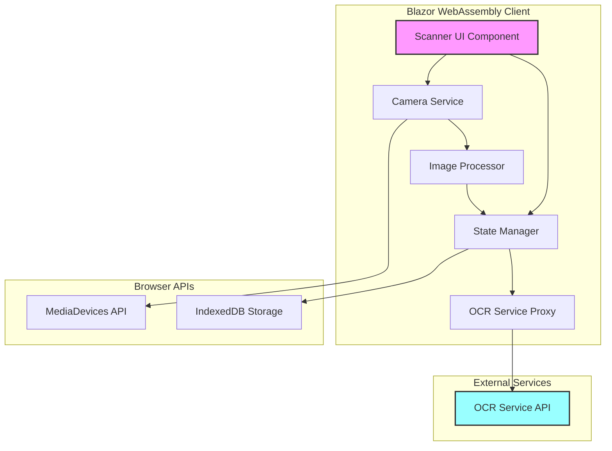
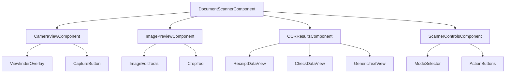
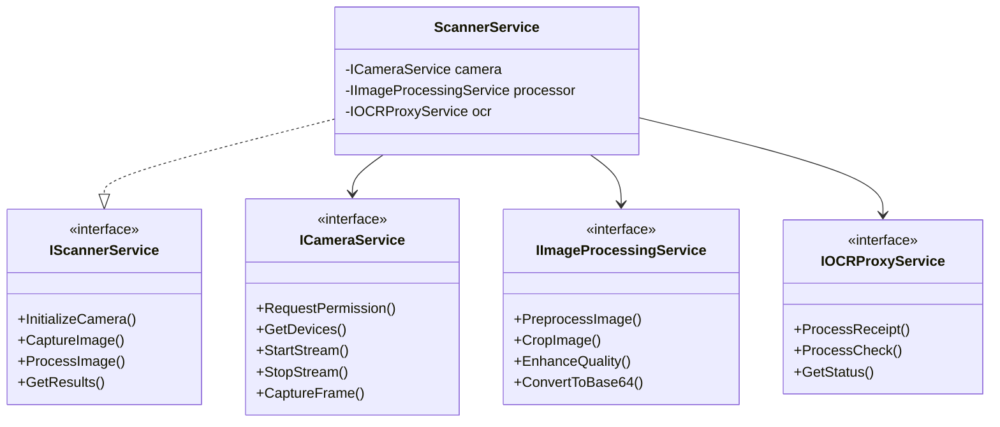
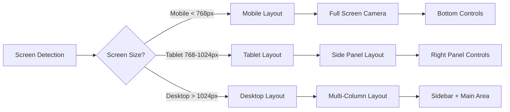

# Document Scanner and OCR Feature Architecture

## Executive Summary

This document outlines the architecture for implementing a document scanning and OCR (Optical Character Recognition) feature in the NoLock.Social platform. The feature enables users to capture documents using their device cameras and extract text/data through an external OCR service. The implementation follows a component-based architecture using Blazor WebAssembly with a focus on responsiveness, reusability, and maintainability.

## Table of Contents

1. [Overview](#overview)
2. [Architecture Overview](#architecture-overview)
3. [Component Architecture](#component-architecture)
4. [API Integration Design](#api-integration-design)
5. [UI/UX Design](#uiux-design)
6. [Project Structure](#project-structure)
7. [Technology Stack](#technology-stack)
8. [Implementation Details](#implementation-details)
9. [Security and Privacy](#security-and-privacy)
10. [Testing Strategy](#testing-strategy)
11. [Performance Considerations](#performance-considerations)
12. [Implementation Roadmap](#implementation-roadmap)

## Overview

### Business Requirements
- Capture documents using device cameras (mobile and desktop)
- Support multiple document types (receipts, checks, general documents)
- Process captured images through OCR service
- Display extracted data in a user-friendly format
- Support offline capture with deferred processing
- Ensure cross-device compatibility

### Technical Requirements
- Integration with external OCR service at `https://nolock-ocr-services-qbhx5.ondigitalocean.app`
- Camera access via browser MediaDevices API
- Responsive design for mobile and desktop
- Component isolation in separate project (NoLock.Social.DocumentScanner)
- Auto-generated proxy using NSwag or OpenAPI Generator
- Error handling and retry logic

## Architecture Overview

### High-Level Architecture Diagram



### Component Hierarchy



## Component Architecture

### Core Components

#### 1. DocumentScannerComponent (Root Container)
```csharp
namespace NoLock.Social.DocumentScanner.Components
{
    public partial class DocumentScannerComponent : ComponentBase
    {
        // Orchestrates the scanning workflow
        // Manages state transitions
        // Handles error boundaries
    }
}
```

**Responsibilities:**
- Workflow orchestration
- State management coordination
- Error boundary handling
- Permission management

**State Management:**
```csharp
public enum ScannerState
{
    Idle,
    RequestingPermission,
    CameraActive,
    ImageCaptured,
    Processing,
    ResultsReady,
    Error
}
```

#### 2. CameraViewComponent
**Responsibilities:**
- Camera stream initialization
- Video element management
- Frame capture
- Device selection (front/back camera)

**Key Features:**
- Real-time camera preview
- Multiple camera support
- Torch/flash control (where available)
- Auto-focus and exposure adjustment

#### 3. ImagePreviewComponent
**Responsibilities:**
- Display captured image
- Image editing tools (crop, rotate, brightness)
- Image quality validation
- Confirmation/retry workflow

#### 4. OCRResultsComponent
**Responsibilities:**
- Display extracted data
- Format-specific rendering (receipts, checks)
- Data editing capabilities
- Export functionality

### Service Layer Architecture



### State Management Design

```csharp
public class ScannerStateManager
{
    private readonly IState<ScannerState> _state;
    private readonly IState<CapturedImage> _capturedImage;
    private readonly IState<OCRResult> _ocrResult;
    
    public IObservable<ScannerState> StateChanges => _state.Changes;
    public IObservable<CapturedImage> ImageChanges => _capturedImage.Changes;
    public IObservable<OCRResult> ResultChanges => _ocrResult.Changes;
}
```

## API Integration Design

### Proxy Generation Strategy

#### Using NSwag for Client Generation

```bash
# Install NSwag CLI tool
dotnet tool install -g NSwag.ConsoleCore

# Generate C# client from OpenAPI specification
nswag openapi2csclient /input:https://nolock-ocr-services-qbhx5.ondigitalocean.app/swagger/v1/swagger.json \
  /classname:OCRServiceClient \
  /namespace:NoLock.Social.DocumentScanner.Services.Proxies \
  /output:NoLock.Social.DocumentScanner/Services/Proxies/OCRServiceClient.cs \
  /generateClientInterfaces:true \
  /generateDtoTypes:true \
  /generateResponseClasses:true \
  /generateDataAnnotations:true \
  /generateDefaultValues:true \
  /generateOptionalParameters:true
```

#### Alternative: OpenAPI Generator

```bash
# Install OpenAPI Generator
npm install -g @openapitools/openapi-generator-cli

# Generate C# client
openapi-generator-cli generate \
  -i https://nolock-ocr-services-qbhx5.ondigitalocean.app/swagger/v1/swagger.json \
  -g csharp-netcore \
  -o ./generated-client \
  --additional-properties=packageName=NoLock.Social.DocumentScanner.Client \
  --additional-properties=netCoreProjectFile=true \
  --additional-properties=targetFramework=net8.0
```

### Service Integration Pattern

```csharp
public interface IOCRServiceAdapter
{
    Task<ReceiptData> ProcessReceiptAsync(byte[] imageData, CancellationToken cancellationToken = default);
    Task<CheckData> ProcessCheckAsync(byte[] imageData, CancellationToken cancellationToken = default);
    Task<HealthStatus> GetHealthStatusAsync(CancellationToken cancellationToken = default);
}

public class OCRServiceAdapter : IOCRServiceAdapter
{
    private readonly IOCRServiceClient _client;
    private readonly ILogger<OCRServiceAdapter> _logger;
    private readonly IRetryPolicy _retryPolicy;
    
    public async Task<ReceiptData> ProcessReceiptAsync(byte[] imageData, CancellationToken cancellationToken)
    {
        return await _retryPolicy.ExecuteAsync(async () =>
        {
            using var stream = new MemoryStream(imageData);
            var response = await _client.ProcessReceiptAsync(stream, cancellationToken);
            return MapToReceiptData(response);
        });
    }
}
```

## UI/UX Design

### Mobile Layout (ASCII Art)

```
+------------------------+
|   Document Scanner     |
|   [Receipt] [Check]    |
+------------------------+
|                        |
|   +----------------+   |
|   |                |   |
|   |    CAMERA      |   |
|   |     VIEW       |   |
|   |                |   |
|   |  [+] Target    |   |
|   |                |   |
|   +----------------+   |
|                        |
|  [Flash] [📷] [Switch] |
|                        |
|  Align document within |
|  the frame            |
+------------------------+
```

### Desktop Layout (ASCII Art)

```
+----------------------------------------------------------+
|  Document Scanner                          [Settings] [?] |
+----------------------------------------------------------+
|                                                          |
| +----------------------+  +----------------------------+ |
| |                      |  | Scan Mode:                 | |
| |                      |  | ( ) Receipt                | |
| |     CAMERA VIEW      |  | (*) Check                  | |
| |                      |  | ( ) General Document       | |
| |    [+] Viewfinder    |  |                            | |
| |                      |  | Camera Settings:           | |
| |                      |  | Device: [Front Camera   v] | |
| |                      |  | Resolution: [1920x1080  v] | |
| +----------------------+  | Quality: [====----] 70%    | |
| |                      |  |                            | |
| | [Capture] [Gallery]  |  | Recent Scans:              | |
| |                      |  | - Receipt_2024_01.pdf      | |
| +----------------------+  | - Check_2024_02.pdf        | |
|                           +----------------------------+ |
+----------------------------------------------------------+
```

### Responsive Design Strategy



## Project Structure

### NoLock.Social.DocumentScanner Project Organization

```
NoLock.Social.DocumentScanner/
├── Components/
│   ├── Camera/
│   │   ├── CameraViewComponent.razor
│   │   ├── CameraViewComponent.razor.cs
│   │   ├── CameraViewComponent.razor.css
│   │   └── ViewfinderOverlay.razor
│   ├── Preview/
│   │   ├── ImagePreviewComponent.razor
│   │   ├── ImageEditTools.razor
│   │   └── CropTool.razor
│   ├── Results/
│   │   ├── OCRResultsComponent.razor
│   │   ├── ReceiptDataView.razor
│   │   ├── CheckDataView.razor
│   │   └── GenericTextView.razor
│   ├── Controls/
│   │   ├── ScannerControlsComponent.razor
│   │   ├── ModeSelector.razor
│   │   └── ActionButtons.razor
│   └── DocumentScannerComponent.razor
├── Services/
│   ├── Interfaces/
│   │   ├── ICameraService.cs
│   │   ├── IImageProcessingService.cs
│   │   ├── IOCRServiceAdapter.cs
│   │   └── IScannerService.cs
│   ├── Implementation/
│   │   ├── CameraService.cs
│   │   ├── ImageProcessingService.cs
│   │   ├── OCRServiceAdapter.cs
│   │   └── ScannerService.cs
│   ├── Proxies/
│   │   └── OCRServiceClient.cs (generated)
│   └── JavaScript/
│       └── CameraInterop.cs
├── Models/
│   ├── ScannerState.cs
│   ├── CapturedImage.cs
│   ├── OCRResult.cs
│   ├── ReceiptData.cs
│   ├── CheckData.cs
│   └── DocumentType.cs
├── State/
│   ├── ScannerStateManager.cs
│   ├── IState.cs
│   └── StateContainer.cs
├── Configuration/
│   ├── ScannerConfiguration.cs
│   └── OCRServiceConfiguration.cs
├── Extensions/
│   └── ServiceCollectionExtensions.cs
├── wwwroot/
│   ├── css/
│   │   └── scanner.css
│   ├── js/
│   │   ├── camera-interop.js
│   │   └── image-processing.js
│   └── assets/
│       └── viewfinder-overlay.svg
└── NoLock.Social.DocumentScanner.csproj
```

### Dependencies Configuration

```xml
<Project Sdk="Microsoft.NET.Sdk.Razor">
  <PropertyGroup>
    <TargetFramework>net8.0</TargetFramework>
    <Nullable>enable</Nullable>
    <ImplicitUsings>enable</ImplicitUsings>
  </PropertyGroup>

  <ItemGroup>
    <PackageReference Include="Microsoft.AspNetCore.Components.Web" Version="8.0.0" />
    <PackageReference Include="Microsoft.Extensions.Http" Version="8.0.0" />
    <PackageReference Include="Microsoft.Extensions.Http.Polly" Version="8.0.0" />
    <PackageReference Include="NSwag.MSBuild" Version="14.0.0" />
    <PackageReference Include="System.Reactive" Version="6.0.0" />
    <PackageReference Include="SixLabors.ImageSharp" Version="3.1.0" />
    <PackageReference Include="Blazored.LocalStorage" Version="4.4.0" />
  </ItemGroup>

  <ItemGroup>
    <ProjectReference Include="..\NoLock.Social.Core\NoLock.Social.Core.csproj" />
  </ItemGroup>
</Project>
```

## Technology Stack

### Core Technologies
- **Blazor WebAssembly**: Component framework
- **NET 8.0**: Target framework
- **.NET Standard 2.1**: Library compatibility

### UI/UX Libraries
- **Bootstrap 5**: Responsive layout
- **Blazored.Modal**: Modal dialogs
- **Blazored.Toast**: Notifications

### Image Processing
- **SixLabors.ImageSharp**: Client-side image manipulation
- **Browser Canvas API**: Image cropping and enhancement

### API Integration
- **NSwag**: OpenAPI client generation
- **System.Net.Http**: HTTP communication
- **Polly**: Retry and resilience policies

### State Management
- **System.Reactive**: Reactive state management
- **Blazored.LocalStorage**: Offline storage

### JavaScript Interop
- **MediaDevices API**: Camera access
- **Canvas API**: Image manipulation
- **File API**: Image upload/download

## Implementation Details

### Camera Integration

```csharp
public class CameraService : ICameraService
{
    private readonly IJSRuntime _jsRuntime;
    private IJSObjectReference? _cameraModule;
    
    public async Task<MediaStream> StartCameraAsync(CameraOptions options)
    {
        _cameraModule ??= await _jsRuntime.InvokeAsync<IJSObjectReference>(
            "import", "./js/camera-interop.js");
            
        return await _cameraModule.InvokeAsync<MediaStream>(
            "startCamera", options);
    }
    
    public async Task<byte[]> CaptureFrameAsync()
    {
        if (_cameraModule == null)
            throw new InvalidOperationException("Camera not initialized");
            
        var base64 = await _cameraModule.InvokeAsync<string>("captureFrame");
        return Convert.FromBase64String(base64.Split(',')[1]);
    }
}
```

### JavaScript Camera Module

```javascript
// camera-interop.js
export async function startCamera(options) {
    const constraints = {
        video: {
            facingMode: options.facingMode || 'environment',
            width: { ideal: options.width || 1920 },
            height: { ideal: options.height || 1080 }
        }
    };
    
    try {
        const stream = await navigator.mediaDevices.getUserMedia(constraints);
        return stream;
    } catch (error) {
        console.error('Camera access error:', error);
        throw error;
    }
}

export function captureFrame(videoElement) {
    const canvas = document.createElement('canvas');
    canvas.width = videoElement.videoWidth;
    canvas.height = videoElement.videoHeight;
    
    const context = canvas.getContext('2d');
    context.drawImage(videoElement, 0, 0);
    
    return canvas.toDataURL('image/jpeg', 0.9);
}
```

### Image Preprocessing

```csharp
public class ImageProcessingService : IImageProcessingService
{
    public async Task<byte[]> PreprocessImageAsync(byte[] imageData, ProcessingOptions options)
    {
        using var image = Image.Load(imageData);
        
        // Auto-orient based on EXIF data
        image.Mutate(x => x.AutoOrient());
        
        // Apply preprocessing
        if (options.EnhanceContrast)
        {
            image.Mutate(x => x.Contrast(1.2f));
        }
        
        if (options.ConvertToGrayscale)
        {
            image.Mutate(x => x.Grayscale());
        }
        
        if (options.ResizeToMaxDimension.HasValue)
        {
            var maxDim = options.ResizeToMaxDimension.Value;
            image.Mutate(x => x.Resize(new ResizeOptions
            {
                Mode = ResizeMode.Max,
                Size = new Size(maxDim, maxDim)
            }));
        }
        
        using var output = new MemoryStream();
        await image.SaveAsJpegAsync(output);
        return output.ToArray();
    }
}
```

### Error Handling and Retry Logic

```csharp
public class RetryPolicyConfiguration
{
    public static IAsyncPolicy<HttpResponseMessage> GetRetryPolicy()
    {
        return HttpPolicyExtensions
            .HandleTransientHttpError()
            .OrResult(msg => !msg.IsSuccessStatusCode)
            .WaitAndRetryAsync(
                3,
                retryAttempt => TimeSpan.FromSeconds(Math.Pow(2, retryAttempt)),
                onRetry: (outcome, timespan, retryCount, context) =>
                {
                    var logger = context.Values["logger"] as ILogger;
                    logger?.LogWarning($"Retry {retryCount} after {timespan}s");
                });
    }
    
    public static IAsyncPolicy GetCircuitBreakerPolicy()
    {
        return Policy
            .Handle<HttpRequestException>()
            .CircuitBreakerAsync(
                handledEventsAllowedBeforeBreaking: 3,
                durationOfBreak: TimeSpan.FromSeconds(30),
                onBreak: (exception, duration) =>
                {
                    // Log circuit breaker opening
                },
                onReset: () =>
                {
                    // Log circuit breaker closing
                });
    }
}
```

### Offline Support

```csharp
public class OfflineScanManager
{
    private readonly ILocalStorageService _localStorage;
    private readonly IOCRServiceAdapter _ocrService;
    
    public async Task QueueForProcessingAsync(CapturedImage image)
    {
        var queue = await GetQueueAsync();
        queue.Add(new QueuedScan
        {
            Id = Guid.NewGuid(),
            Image = image,
            QueuedAt = DateTime.UtcNow,
            Status = ProcessingStatus.Pending
        });
        
        await _localStorage.SetItemAsync("scan_queue", queue);
    }
    
    public async Task ProcessQueueAsync()
    {
        var queue = await GetQueueAsync();
        var pending = queue.Where(x => x.Status == ProcessingStatus.Pending);
        
        foreach (var item in pending)
        {
            try
            {
                var result = await _ocrService.ProcessReceiptAsync(item.Image.Data);
                item.Status = ProcessingStatus.Completed;
                item.Result = result;
            }
            catch (Exception ex)
            {
                item.Status = ProcessingStatus.Failed;
                item.Error = ex.Message;
            }
        }
        
        await _localStorage.SetItemAsync("scan_queue", queue);
    }
}
```

## Security and Privacy

### Security Measures

1. **Data Protection**
   - Images processed in memory only
   - No permanent storage without user consent
   - Secure transmission using HTTPS
   - Client-side image preprocessing to minimize data transfer

2. **Permission Management**
   ```csharp
   public async Task<PermissionStatus> RequestCameraPermissionAsync()
   {
       try
       {
           var result = await _jsRuntime.InvokeAsync<PermissionResult>(
               "navigator.permissions.query", 
               new { name = "camera" });
           
           return result.State switch
           {
               "granted" => PermissionStatus.Granted,
               "denied" => PermissionStatus.Denied,
               "prompt" => PermissionStatus.Prompt,
               _ => PermissionStatus.Unknown
           };
       }
       catch
       {
           return PermissionStatus.Unknown;
       }
   }
   ```

3. **Content Security Policy**
   ```html
   <meta http-equiv="Content-Security-Policy" 
         content="default-src 'self'; 
                  media-src 'self' blob:; 
                  img-src 'self' data: blob:;
                  connect-src 'self' https://nolock-ocr-services-qbhx5.ondigitalocean.app;">
   ```

### Privacy Considerations

1. **Data Minimization**
   - Process images locally when possible
   - Send only necessary data to OCR service
   - Clear sensitive data from memory after use

2. **User Consent**
   - Explicit permission requests for camera access
   - Clear data usage disclosure
   - Option to process locally without sending to server

3. **Compliance**
   - GDPR compliance for EU users
   - CCPA compliance for California users
   - Right to data deletion

## Testing Strategy

### Unit Testing

```csharp
[TestClass]
public class CameraServiceTests
{
    [TestMethod]
    public async Task StartCamera_WithValidOptions_ReturnsStream()
    {
        // Arrange
        var jsRuntime = new Mock<IJSRuntime>();
        var service = new CameraService(jsRuntime.Object);
        
        // Act
        var result = await service.StartCameraAsync(new CameraOptions());
        
        // Assert
        Assert.IsNotNull(result);
    }
}
```

### Integration Testing

```csharp
[TestClass]
public class OCRServiceIntegrationTests
{
    [TestMethod]
    [TestCategory("Integration")]
    public async Task ProcessReceipt_WithValidImage_ReturnsData()
    {
        // Arrange
        var client = new OCRServiceClient(new HttpClient());
        var adapter = new OCRServiceAdapter(client);
        var testImage = File.ReadAllBytes("TestData/receipt.jpg");
        
        // Act
        var result = await adapter.ProcessReceiptAsync(testImage);
        
        // Assert
        Assert.IsNotNull(result);
        Assert.IsNotNull(result.MerchantName);
        Assert.IsTrue(result.Total > 0);
    }
}
```

### Component Testing

```csharp
[TestClass]
public class DocumentScannerComponentTests : TestContext
{
    [TestMethod]
    public void Component_RendersCorrectly()
    {
        // Arrange & Act
        var component = RenderComponent<DocumentScannerComponent>();
        
        // Assert
        Assert.IsNotNull(component.Find(".scanner-container"));
        Assert.IsNotNull(component.Find(".camera-view"));
    }
}
```

### E2E Testing Scenarios

1. **Happy Path**
   - User grants camera permission
   - Captures image successfully
   - OCR processes correctly
   - Results displayed

2. **Error Scenarios**
   - Camera permission denied
   - Network failure during OCR
   - Invalid image format
   - OCR service unavailable

3. **Edge Cases**
   - Multiple rapid captures
   - Camera switching during capture
   - Background/foreground transitions
   - Low memory conditions

## Performance Considerations

### Optimization Strategies

1. **Image Optimization**
   ```csharp
   public async Task<byte[]> OptimizeForOCR(byte[] image)
   {
       // Resize to optimal dimensions (max 2048px)
       // Convert to grayscale if color not needed
       // Compress using appropriate quality (85-90%)
       // Remove metadata
   }
   ```

2. **Lazy Loading**
   - Load scanner component on demand
   - Defer JavaScript module loading
   - Progressive enhancement

3. **Caching Strategy**
   ```csharp
   public class OCRResultCache
   {
       private readonly IMemoryCache _cache;
       
       public async Task<T> GetOrProcessAsync<T>(
           string key, 
           Func<Task<T>> factory,
           TimeSpan expiration)
       {
           return await _cache.GetOrCreateAsync(key, async entry =>
           {
               entry.AbsoluteExpirationRelativeToNow = expiration;
               return await factory();
           });
       }
   }
   ```

4. **Bundle Size Optimization**
   - Tree shaking for unused code
   - Code splitting for scanner module
   - WebP format for assets

### Performance Metrics

- **Target Metrics**
  - Camera initialization: < 2 seconds
  - Image capture: < 100ms
  - OCR processing: < 5 seconds
  - Results rendering: < 500ms

- **Monitoring**
  ```csharp
  public class PerformanceMonitor
  {
      public async Task<T> MeasureAsync<T>(string operation, Func<Task<T>> action)
      {
          var stopwatch = Stopwatch.StartNew();
          try
          {
              return await action();
          }
          finally
          {
              _telemetry.TrackMetric($"Scanner.{operation}", stopwatch.ElapsedMilliseconds);
          }
      }
  }
  ```

## Implementation Roadmap

### Phase 1: Foundation (Week 1-2)
- [ ] Create NoLock.Social.DocumentScanner project
- [ ] Set up project structure and dependencies
- [ ] Generate OCR service proxy using NSwag
- [ ] Implement basic service interfaces
- [ ] Create component shells

### Phase 2: Camera Integration (Week 2-3)
- [ ] Implement camera service with JavaScript interop
- [ ] Create camera view component
- [ ] Add device selection and switching
- [ ] Implement capture functionality
- [ ] Add permission handling

### Phase 3: Image Processing (Week 3-4)
- [ ] Implement image preprocessing service
- [ ] Add crop and rotate tools
- [ ] Create image preview component
- [ ] Add quality enhancement
- [ ] Implement client-side validation

### Phase 4: OCR Integration (Week 4-5)
- [ ] Integrate OCR service proxy
- [ ] Implement retry and circuit breaker policies
- [ ] Add offline queue management
- [ ] Create result mapping logic
- [ ] Handle different document types

### Phase 5: UI/UX Implementation (Week 5-6)
- [ ] Implement responsive layouts
- [ ] Create mobile-optimized UI
- [ ] Add desktop layout variations
- [ ] Implement touch gestures
- [ ] Add keyboard shortcuts

### Phase 6: Results and Data Management (Week 6-7)
- [ ] Create result display components
- [ ] Add data editing capabilities
- [ ] Implement export functionality
- [ ] Add scan history
- [ ] Create data persistence layer

### Phase 7: Testing and Optimization (Week 7-8)
- [ ] Write unit tests for services
- [ ] Create component tests
- [ ] Implement integration tests
- [ ] Performance optimization
- [ ] Security audit

### Phase 8: Documentation and Deployment (Week 8)
- [ ] Complete API documentation
- [ ] Create user guides
- [ ] Write deployment procedures
- [ ] Set up CI/CD pipeline
- [ ] Production deployment

## Conclusion

This architecture provides a robust, scalable, and maintainable solution for document scanning and OCR functionality. The component-based approach ensures reusability, while the service layer abstraction allows for easy testing and future enhancements. The implementation prioritizes user experience with responsive design and offline capabilities while maintaining security and privacy standards.

### Key Success Factors
- Modular architecture enabling independent component development
- Comprehensive error handling and retry mechanisms
- Performance optimization for mobile devices
- Security-first approach to data handling
- Extensive testing coverage

### Future Enhancements
- Machine learning for image quality assessment
- Multi-language OCR support
- Batch processing capabilities
- Advanced image enhancement algorithms
- Integration with cloud storage services

---

*Document Version: 1.0*  
*Last Updated: 2025-01-14*  
*Author: System Architecture Team*