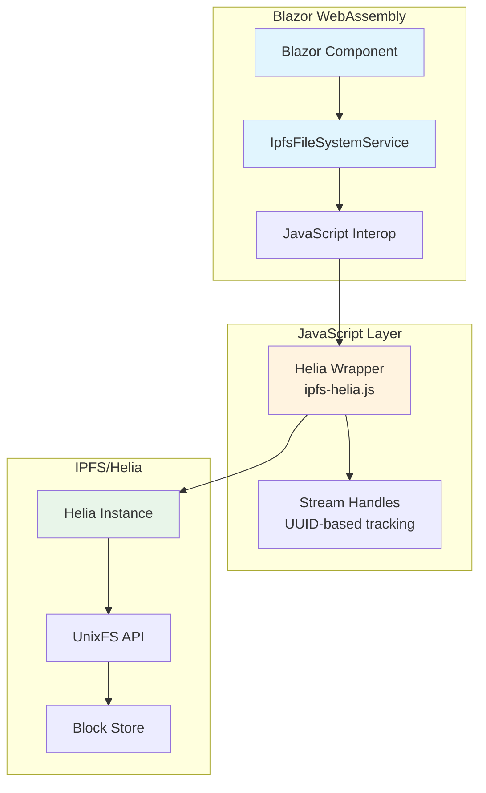
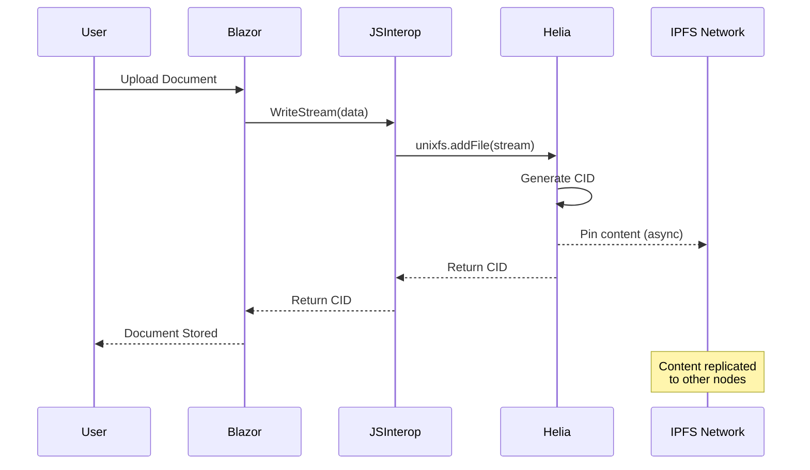

# IPFS UnixFS Architecture for NoLock.Social

## Executive Summary

**Why UnixFS, not MFS (Mutable File System)?**

UnixFS is IPFS's core content-addressed file representation - it's how IPFS actually stores and retrieves files. MFS is just a convenience layer on top that adds mutable paths. For NoLock.Social's document storage needs, we need the immutable, content-addressed foundation of UnixFS directly.

**Key Benefits:**
- **Immutable by default** - Perfect for document versioning and audit trails
- **Content-addressed** - Files are identified by their content hash (CID)
- **Deduplication** - Identical content stored only once
- **Streaming support** - Files can be read/written in chunks
- **Simple integration** - Direct JavaScript API through Helia

## Architecture Overview



## TRIZ Analysis: The Ideal Solution

### What Would the "Ideal Final Result" Look Like?

The ideal solution would have:
1. **Zero Network Latency** - Files appear instantly
2. **Zero Storage Cost** - Infinite capacity
3. **Perfect Reliability** - Never loses data
4. **No Complexity** - Works like native file system

### How UnixFS Approaches the Ideal

| Ideal Requirement | UnixFS Solution | Trade-off |
|------------------|-----------------|-----------|
| Zero Latency | Local caching in browser | Initial fetch still needed |
| Zero Storage | Content deduplication | Still uses local storage |
| Perfect Reliability | Content addressing + pinning | Requires pinning service |
| No Complexity | Simple read/write API | Must handle CIDs |

### Contradiction Resolution

**The Core Contradiction:** We want mutable file paths (easy) AND immutable content (secure).

**TRIZ Solution:** Separate the concerns:
- Use UnixFS for immutable storage (security/versioning)
- Track CID mappings in application state (mutability)
- Best of both worlds without complexity

## Simple Stream-Based API

### For Junior Developers: Think of it Like This

```
Traditional File System:
  Path → File Content
  /documents/report.pdf → [binary data]

UnixFS (Content-Addressed):
  Content → CID → Content
  [binary data] → bafybeig... → [binary data]
  
Our Wrapper:
  We handle the CID tracking, you just read/write streams!
```

### Core Concepts

1. **CID (Content Identifier)**: A unique hash of file content
   - Like a fingerprint for your file
   - Same content = Same CID always
   - Different content = Different CID

2. **Streams**: Read and write data in chunks
   - Don't load entire file into memory
   - Perfect for large documents
   - Works like .NET streams

3. **Handles**: Our UUID-based tracking system
   - Maps stream operations to IPFS operations
   - Allows cancellation and progress tracking
   - Cleans up automatically

## Why This Architecture?

### Applying KISS (Keep It Simple, Stupid)
- One JavaScript file (ipfs-helia.js)
- One C# service (IpfsFileSystemService)
- Standard .NET Stream interface
- No complex state management

### Following DRY (Don't Repeat Yourself)
- Reuse existing Helia UnixFS implementation
- Leverage browser's built-in storage
- Use standard .NET patterns

### Respecting YAGNI (You Aren't Gonna Need It)
- No custom file system implementation
- No complex caching strategies
- No premature optimization
- Just the minimum to store/retrieve documents

## Implementation Flow



## Benefits Over Alternative Approaches

### vs. Traditional Cloud Storage
- ✅ No vendor lock-in
- ✅ Content verification built-in
- ✅ Automatic deduplication
- ✅ Decentralized resilience

### vs. MFS (Mutable File System)
- ✅ Simpler mental model
- ✅ Direct content addressing
- ✅ Better for document versioning
- ✅ Less overhead

### vs. Custom Implementation
- ✅ Battle-tested Helia library
- ✅ Active community support
- ✅ Regular security updates
- ✅ Standard IPFS compatibility

## For Developers: Quick Start Mindset

Think of UnixFS as a **content-based key-value store**:
- **PUT**: Content → CID
- **GET**: CID → Content
- **DELETE**: Not needed (garbage collection handles it)

That's it! Everything else is just streaming and error handling.

## Concrete Implementation Examples

### JavaScript Wrapper - Clean and Minimal

```javascript
// ipfs-helia.js - The entire wrapper in ~100 lines
export class IpfsFileSystem {
    constructor() {
        this.streams = new Map(); // UUID → stream handle
    }
    
    // Write a file - returns CID when complete
    async writeFile(handle, chunk, isLast) {
        // Get or create stream for this handle
        let stream = this.streams.get(handle);
        if (!stream) {
            stream = { chunks: [], controller: null };
            this.streams.set(handle, stream);
        }
        
        // Add chunk to stream
        if (chunk) {
            stream.chunks.push(new Uint8Array(chunk));
        }
        
        // If last chunk, write to IPFS
        if (isLast) {
            const blob = new Blob(stream.chunks);
            const cid = await this.helia.unixfs.addFile(blob);
            this.streams.delete(handle);
            return cid.toString();
        }
        
        return null; // More chunks coming
    }
    
    // Read a file - returns chunks via callbacks
    async readFile(cid, handle, onChunk, onComplete) {
        const stream = this.helia.unixfs.cat(cid);
        
        for await (const chunk of stream) {
            onChunk(handle, chunk);
        }
        
        onComplete(handle);
        this.streams.delete(handle);
    }
}
```

### C# Service Interface - Programming by Intent

```csharp
// The interface reads like documentation
public interface IIpfsFileSystem
{
    // "Store this document and give me its unique identifier"
    Task<string> StoreDocumentAsync(Stream content);
    
    // "Retrieve the document with this identifier"
    Task<Stream> RetrieveDocumentAsync(string cid);
    
    // "Check if this document exists"
    Task<bool> DocumentExistsAsync(string cid);
}

// Clean implementation that reads like poetry
public class IpfsFileSystemService : IIpfsFileSystem
{
    private readonly IJSRuntime _js;
    private IJSObjectReference? _module;
    
    public async Task<string> StoreDocumentAsync(Stream content)
    {
        // Generate a handle for this operation
        var handle = Guid.NewGuid().ToString();
        
        // Stream the content in chunks
        var buffer = new byte[ChunkSize];
        int bytesRead;
        
        while ((bytesRead = await content.ReadAsync(buffer)) > 0)
        {
            var chunk = buffer[..bytesRead];
            var isLast = content.Position >= content.Length;
            
            // Send chunk to JavaScript
            var cid = await _module.InvokeAsync<string?>(
                "writeFile", handle, chunk, isLast);
                
            if (cid != null) return cid; // Upload complete
        }
        
        throw new InvalidOperationException("Upload failed");
    }
    
    public async Task<Stream> RetrieveDocumentAsync(string cid)
    {
        // Create a stream that reads from IPFS
        return new IpfsReadStream(_module, cid);
    }
}
```

### Usage Examples - Beautiful Simplicity

```csharp
// In a Blazor component - reads like plain English
@code {
    [Inject] IIpfsFileSystem Ipfs { get; set; }
    
    // Upload a document
    async Task UploadDocument(IBrowserFile file)
    {
        using var stream = file.OpenReadStream();
        var cid = await Ipfs.StoreDocumentAsync(stream);
        
        // That's it! Document is stored forever
        SaveDocumentReference(file.Name, cid);
    }
    
    // Download a document
    async Task DownloadDocument(string cid, string filename)
    {
        using var stream = await Ipfs.RetrieveDocumentAsync(cid);
        
        // Stream directly to user
        await ProvideDownload(stream, filename);
    }
    
    // Check document availability
    async Task<bool> IsDocumentAvailable(string cid)
    {
        return await Ipfs.DocumentExistsAsync(cid);
    }
}
```

### The Stream Handle Pattern - Why It's Elegant

```csharp
// Traditional approach - loads entire file in memory ❌
byte[] fileData = File.ReadAllBytes(path); // Could be 1GB!

// Stream handle approach - memory efficient ✅
public class IpfsReadStream : Stream
{
    private readonly string _handle;
    private readonly Queue<byte[]> _chunks = new();
    private bool _complete;
    
    public override async Task<int> ReadAsync(byte[] buffer, ...)
    {
        // Chunks arrive from JavaScript as they download
        if (_chunks.Count == 0 && !_complete)
        {
            await WaitForNextChunk();
        }
        
        // Return available data without loading entire file
        return CopyAvailableData(buffer);
    }
}
```

### Error Handling - Clean and Predictable

```csharp
// Errors are first-class citizens, not afterthoughts
public async Task<Result<string>> SafeStoreDocumentAsync(Stream content)
{
    try
    {
        var cid = await StoreDocumentAsync(content);
        return Result<string>.Success(cid);
    }
    catch (NetworkException ex)
    {
        return Result<string>.Failure("Network unavailable");
    }
    catch (QuotaExceededException ex)
    {
        return Result<string>.Failure("Storage quota exceeded");
    }
}

// Usage remains clean
var result = await Ipfs.SafeStoreDocumentAsync(stream);
if (result.IsSuccess)
{
    Console.WriteLine($"Stored as {result.Value}");
}
else
{
    Console.WriteLine($"Failed: {result.Error}");
}
```

## Next Steps

1. Implement the JavaScript wrapper (ipfs-helia.js)
2. Create the C# service (IpfsFileSystemService)
3. Add progress callbacks for large files
4. Implement proper error boundaries

## Summary

UnixFS provides the **simplest possible** solution for decentralized document storage:
- Immutable by design (perfect for documents)
- Content-addressed (automatic integrity)
- Stream-based (handles any size)
- No complex state management needed

By using UnixFS directly instead of MFS, we avoid unnecessary complexity while gaining all the benefits of IPFS's content-addressed storage.