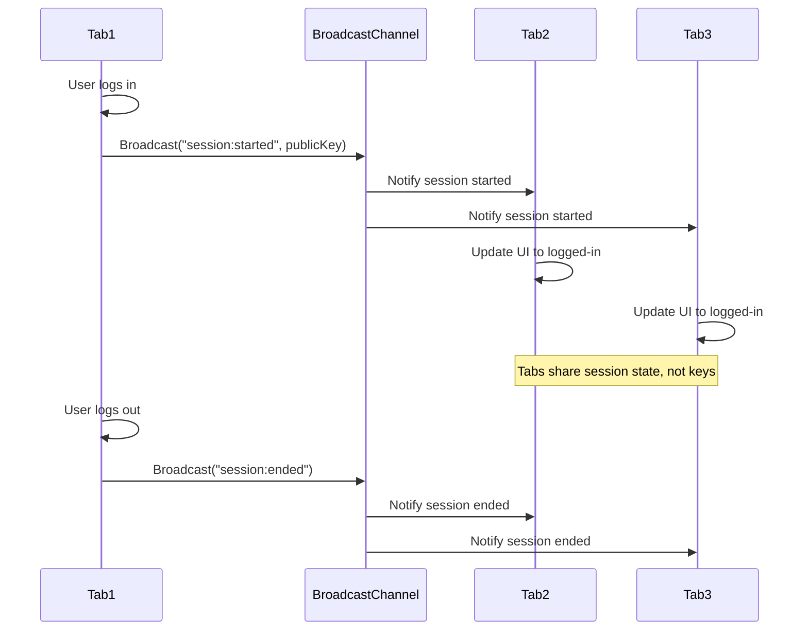
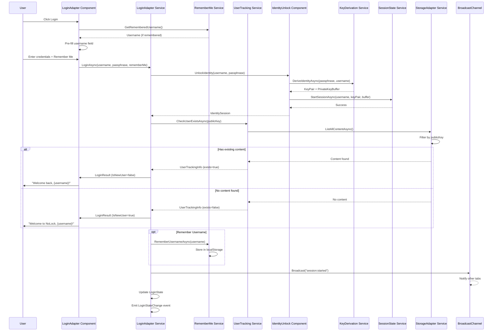
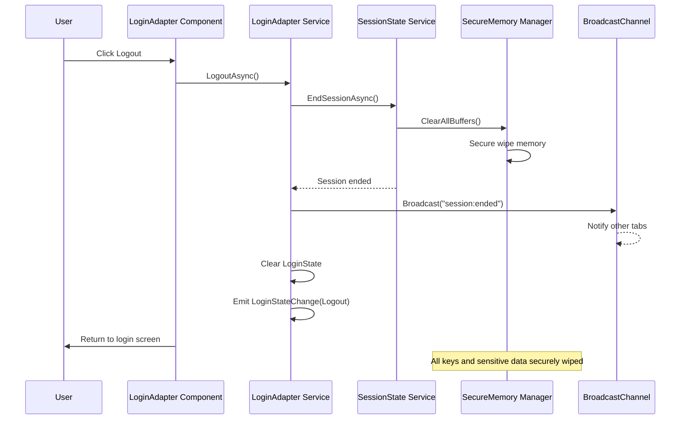
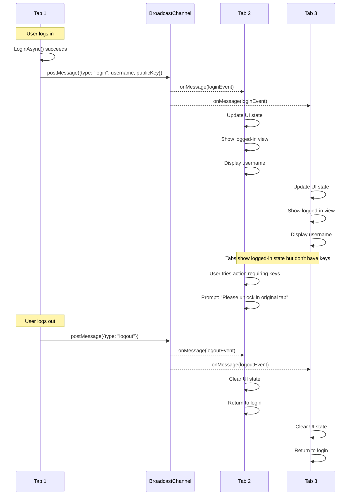

# Minimal Login Architecture

## Executive Summary

This document describes a pragmatic login system that builds directly on top of the existing identity unlock infrastructure. The design adds only the essential features needed for a proper login experience while maximizing reuse of existing cryptographic components.

**Key Principle**: The existing identity unlock IS the authentication mechanism - we're just adding minimal user experience improvements around it.

---

## 1. Problem Analysis

### What We Already Have (DO NOT REBUILD)
- ✅ Username + passphrase identity derivation (KeyDerivationService)
- ✅ Session state management with lock/unlock/timeout (SessionStateService)
- ✅ Secure key storage in memory only (SecureMemoryManager)
- ✅ Ed25519 signing for content authentication
- ✅ Reactive session monitoring (Rx.NET)
- ✅ Content-addressable storage with signatures

### What's Missing for a Login System
- ❌ Remember me functionality (optional convenience)
- ❌ Account existence verification (first-time vs returning user)
- ❌ Basic session persistence across tabs
- ❌ Logout vs Lock distinction

### Core Insight
**The passphrase + username combination IS the account.** There's no registration needed - deriving keys from these inputs creates a deterministic identity. We just need to track if this identity has been used before.

---

## 2. Minimal Architecture Overview


---

## 3. Component Design

### 3.1 LoginAdapterComponent (New - Thin Wrapper)

**Purpose**: Wraps IdentityUnlockComponent with login-specific UX


**Responsibilities**:
- Determines if user is new or returning (via UserTrackingService)
- Handles "Remember username" option (NOT passphrase)
- Provides login/logout semantics over unlock/lock

### 3.2 UserTrackingService (New - Minimal)

**Purpose**: Tracks if a public key has been used before


**Implementation**:
- Simply queries if any signed content exists with this public key
- No separate user database needed - the content IS the proof of prior use
- Automatically marks user as "returning" after first signed content

### 3.3 RememberMeService (New - Optional Convenience)

**Purpose**: Optionally remembers username ONLY (never passphrase)


**Security Note**: This is purely a UX convenience - it has no security implications since only the username is stored.

---

## 4. Session Management Enhancement

### Current State Machine (Keep As-Is)


### Login Semantics Layer (New Interpretation)


---

## 5. Multi-Tab Coordination (Optional Enhancement)

### BroadcastChannel for Session Sync


**Important**: Only session STATE is shared, never keys or passphrases.

---

## 6. Implementation Roadmap

### Phase 1: Core Login Adapter (2-3 days)
```
1. Create LoginAdapterComponent
   - Wrap existing IdentityUnlockComponent
   - Add "Remember username" checkbox
   - Implement login/logout methods
   
2. Implement UserTrackingService
   - Query CAS for existing content by public key
   - Cache result for session duration
   
3. Add basic RememberMeService
   - Store/retrieve username from localStorage
   - Add "Clear remembered data" option
```

### Phase 2: Enhanced UX (1-2 days)
```
4. Improve login flow
   - Show "Welcome back" vs "Welcome" message
   - Add last activity timestamp
   - Implement smooth transitions
   
5. Add session persistence indicator
   - Show when session will expire
   - Add "Extend session" button
   - Warn before auto-lock
```

### Phase 3: Multi-Tab Support (Optional, 1 day)
```
6. Implement BroadcastChannel coordination
   - Sync login/logout across tabs
   - Share session state (not keys)
   - Handle tab close gracefully
```

---

## 7. Key Design Decisions

### What We're Building
✅ Thin adapter layer over existing unlock mechanism  
✅ Simple user tracking via content existence  
✅ Optional username memory for convenience  
✅ Clear login/logout semantics for users  

### What We're NOT Building
❌ Separate user database (content IS the database)  
❌ Password reset (impossible with deterministic keys)  
❌ Email verification (no email needed)  
❌ OAuth/social login (defeats decentralization)  
❌ Complex session tokens (keys ARE the session)  
❌ Server-side authentication (client-only)  

### Why This Approach
1. **Maximum Reuse**: 90% of functionality already exists
2. **Minimal Complexity**: Adds ~200 lines of code total
3. **Maintains Security**: No new attack surface
4. **Fast Implementation**: 3-5 days total
5. **User Friendly**: Familiar login/logout paradigm

---

## 8. Security Considerations

### No New Attack Vectors
- Passphrase never stored (same as current)
- Keys remain in secure memory only
- No tokens to steal or replay
- No server to compromise

### Privacy Preserved
- No tracking beyond public key usage
- No analytics or metrics
- Username storage is optional
- Can use system without any persistence

### Trust Model Unchanged
- Trust derives from passphrase knowledge
- No external dependencies added
- Deterministic key generation preserved
- Content signatures remain authoritative

---

## 9. Example Integration

### Current Component Usage
```typescript
// Existing usage
<IdentityUnlockComponent OnIdentityUnlocked="@HandleUnlock" />
```

### New Login Component Usage
```typescript
// New wrapper with login semantics
<LoginAdapterComponent 
    OnLogin="@HandleLogin"
    OnLogout="@HandleLogout"
    RememberUsername="true"
    ShowNewUserWelcome="true" />
```

### Behind the Scenes
```typescript
// LoginAdapterComponent internally:
1. Check if username is remembered
2. Pass through to IdentityUnlockComponent
3. On successful unlock:
   - Check if user has existing content
   - Show appropriate welcome message
   - Store username if "remember" checked
   - Broadcast session started
```

---

## 10. Testing Strategy

### Unit Tests (Existing Components Unchanged)
- ✅ All existing crypto tests still pass
- ✅ Session state tests unchanged
- ✅ Key derivation tests unchanged

### New Integration Tests
```
- Login with new identity → Shows new user message
- Login with existing identity → Shows returning user message
- Remember username → Persists across sessions
- Forget username → Clears localStorage
- Multi-tab login → Syncs state across tabs
- Logout → Clears session in all tabs
```

### Security Tests
```
- Passphrase never in localStorage ✓
- Keys never persisted ✓
- Session cleared on logout ✓
- No sensitive data in memory after logout ✓
```

---

## Summary

This minimal login architecture adds just enough functionality to provide a familiar login experience while maximizing reuse of the existing cryptographic infrastructure. The total addition is approximately:

- **3 new small services** (~200 lines total)
- **1 wrapper component** (~100 lines)
- **0 changes to crypto layer**
- **0 new dependencies**
- **0 server requirements**

The implementation can be completed in 3-5 days and provides users with a clean, simple login experience that maintains all the security properties of the original design.

---

## 11. Concrete Interface Definitions

### 11.1 Core Login Service Interfaces

```csharp
namespace NoLock.Social.Core.Identity.Interfaces
{
    /// <summary>
    /// Service for tracking user identity existence and history
    /// </summary>
    public interface IUserTrackingService
    {
        /// <summary>
        /// Check if a public key has been used before (has content)
        /// </summary>
        Task<UserTrackingInfo> CheckUserExistsAsync(string publicKeyBase64);
        
        /// <summary>
        /// Mark a user as having created content (auto-called on first content save)
        /// </summary>
        Task MarkUserAsActiveAsync(string publicKeyBase64);
        
        /// <summary>
        /// Get user activity summary
        /// </summary>
        Task<UserActivitySummary> GetUserActivityAsync(string publicKeyBase64);
    }

    /// <summary>
    /// Service for handling "Remember Me" functionality (username only)
    /// </summary>
    public interface IRememberMeService
    {
        /// <summary>
        /// Remember username for convenience (never stores passphrase)
        /// </summary>
        Task RememberUsernameAsync(string username);
        
        /// <summary>
        /// Get remembered username if available
        /// </summary>
        Task<string?> GetRememberedUsernameAsync();
        
        /// <summary>
        /// Clear all remembered data
        /// </summary>
        Task ClearRememberedDataAsync();
        
        /// <summary>
        /// Check if username is remembered
        /// </summary>
        bool IsUsernameRemembered { get; }
    }

    /// <summary>
    /// Adapter service that provides login semantics over identity unlock
    /// </summary>
    public interface ILoginAdapterService
    {
        /// <summary>
        /// Current login state
        /// </summary>
        LoginState CurrentLoginState { get; }
        
        /// <summary>
        /// Observable for login state changes
        /// </summary>
        IObservable<LoginStateChange> LoginStateChanges { get; }
        
        /// <summary>
        /// Perform login (wraps identity unlock with user tracking)
        /// </summary>
        Task<LoginResult> LoginAsync(string username, string passphrase, bool rememberUsername);
        
        /// <summary>
        /// Logout (ends session completely)
        /// </summary>
        Task LogoutAsync();
        
        /// <summary>
        /// Lock session (keeps keys in memory)
        /// </summary>
        Task LockAsync();
        
        /// <summary>
        /// Check if current user is new or returning
        /// </summary>
        Task<bool> IsReturningUserAsync();
    }
}
```

### 11.2 Data Models

```csharp
namespace NoLock.Social.Core.Identity.Models
{
    /// <summary>
    /// Information about a tracked user
    /// </summary>
    public class UserTrackingInfo
    {
        public bool Exists { get; set; }
        public DateTime? FirstSeen { get; set; }
        public DateTime? LastSeen { get; set; }
        public int ContentCount { get; set; }
        public string PublicKeyBase64 { get; set; } = string.Empty;
    }

    /// <summary>
    /// Summary of user activity
    /// </summary>
    public class UserActivitySummary
    {
        public int TotalContent { get; set; }
        public DateTime? LastActivity { get; set; }
        public long TotalStorageBytes { get; set; }
        public List<string> RecentContentAddresses { get; set; } = new();
    }

    /// <summary>
    /// Result of a login attempt
    /// </summary>
    public class LoginResult
    {
        public bool Success { get; set; }
        public bool IsNewUser { get; set; }
        public string? ErrorMessage { get; set; }
        public IdentitySession? Session { get; set; }
        public UserTrackingInfo? UserInfo { get; set; }
    }

    /// <summary>
    /// Current login state
    /// </summary>
    public class LoginState
    {
        public bool IsLoggedIn { get; set; }
        public bool IsLocked { get; set; }
        public string? Username { get; set; }
        public string? PublicKeyBase64 { get; set; }
        public DateTime? LoginTime { get; set; }
        public DateTime? LastActivity { get; set; }
        public bool IsNewUser { get; set; }
    }

    /// <summary>
    /// Login state change event
    /// </summary>
    public class LoginStateChange
    {
        public LoginState PreviousState { get; set; } = new();
        public LoginState NewState { get; set; } = new();
        public LoginStateChangeReason Reason { get; set; }
        public DateTime Timestamp { get; set; } = DateTime.UtcNow;
    }

    /// <summary>
    /// Reasons for state change
    /// </summary>
    public enum LoginStateChangeReason
    {
        Login,
        Logout,
        Lock,
        Unlock,
        Timeout,
        SessionExtended,
        TabSync
    }
}
```

### 11.3 Browser Storage Models

```csharp
namespace NoLock.Social.Core.Identity.Storage
{
    /// <summary>
    /// Data stored in localStorage for Remember Me
    /// </summary>
    public class RememberedUserData
    {
        public string Username { get; set; } = string.Empty;
        public DateTime LastUsed { get; set; } = DateTime.UtcNow;
        public Dictionary<string, string> Preferences { get; set; } = new();
        // NEVER store: passphrase, keys, or session data
    }

    /// <summary>
    /// Session coordination data for multi-tab sync
    /// </summary>
    public class SessionCoordinationMessage
    {
        public string MessageType { get; set; } = string.Empty; // "login", "logout", "lock"
        public string? Username { get; set; }
        public string? PublicKeyBase64 { get; set; }
        public DateTime Timestamp { get; set; } = DateTime.UtcNow;
        public string TabId { get; set; } = Guid.NewGuid().ToString();
        // NEVER include: keys, passphrases, or sensitive data
    }
}
```

---

## 12. Detailed Sequence Diagrams

### 12.1 Complete Login Flow



### 12.2 Logout Flow



### 12.3 Multi-Tab Synchronization



---

## 13. Implementation Service Details

### 13.1 UserTrackingService Implementation

```csharp
public class UserTrackingService : IUserTrackingService
{
    private readonly IStorageAdapterService _storageAdapter;
    private readonly ILogger<UserTrackingService> _logger;
    private readonly Dictionary<string, UserTrackingInfo> _cache = new();
    
    public async Task<UserTrackingInfo> CheckUserExistsAsync(string publicKeyBase64)
    {
        // Check cache first
        if (_cache.TryGetValue(publicKeyBase64, out var cached))
            return cached;
        
        // Query storage for any content signed by this public key
        var contentCount = 0;
        DateTime? firstSeen = null;
        DateTime? lastSeen = null;
        
        await foreach (var metadata in _storageAdapter.ListAllContentAsync())
        {
            if (metadata.PublicKeyBase64 == publicKeyBase64)
            {
                contentCount++;
                
                if (!firstSeen.HasValue || metadata.Timestamp < firstSeen)
                    firstSeen = metadata.Timestamp;
                    
                if (!lastSeen.HasValue || metadata.Timestamp > lastSeen)
                    lastSeen = metadata.Timestamp;
            }
        }
        
        var info = new UserTrackingInfo
        {
            Exists = contentCount > 0,
            FirstSeen = firstSeen,
            LastSeen = lastSeen,
            ContentCount = contentCount,
            PublicKeyBase64 = publicKeyBase64
        };
        
        // Cache for this session
        _cache[publicKeyBase64] = info;
        
        return info;
    }
}
```

### 13.2 RememberMeService Implementation

```csharp
public class RememberMeService : IRememberMeService
{
    private const string STORAGE_KEY = "nolock_remembered_user";
    private readonly IJSRuntime _jsRuntime;
    
    public async Task RememberUsernameAsync(string username)
    {
        var data = new RememberedUserData
        {
            Username = username,
            LastUsed = DateTime.UtcNow
        };
        
        var json = JsonSerializer.Serialize(data);
        await _jsRuntime.InvokeVoidAsync("localStorage.setItem", STORAGE_KEY, json);
    }
    
    public async Task<string?> GetRememberedUsernameAsync()
    {
        try
        {
            var json = await _jsRuntime.InvokeAsync<string?>("localStorage.getItem", STORAGE_KEY);
            if (string.IsNullOrEmpty(json)) return null;
            
            var data = JsonSerializer.Deserialize<RememberedUserData>(json);
            return data?.Username;
        }
        catch
        {
            return null;
        }
    }
    
    public async Task ClearRememberedDataAsync()
    {
        await _jsRuntime.InvokeVoidAsync("localStorage.removeItem", STORAGE_KEY);
    }
}
```

### 13.3 LoginAdapterService Implementation Structure

```csharp
public class LoginAdapterService : ILoginAdapterService, IDisposable
{
    private readonly ISessionStateService _sessionState;
    private readonly IUserTrackingService _userTracking;
    private readonly IRememberMeService _rememberMe;
    private readonly IKeyDerivationService _keyDerivation;
    private readonly IJSRuntime _jsRuntime;
    private readonly ILogger<LoginAdapterService> _logger;
    
    private readonly Subject<LoginStateChange> _stateChanges = new();
    private LoginState _currentState = new();
    private IJSObjectReference? _broadcastChannel;
    
    public LoginState CurrentLoginState => _currentState;
    public IObservable<LoginStateChange> LoginStateChanges => _stateChanges.AsObservable();
    
    public async Task<LoginResult> LoginAsync(string username, string passphrase, bool rememberUsername)
    {
        try
        {
            // 1. Derive keys
            var (keyPair, privateKeyBuffer) = await _keyDerivation.DeriveIdentityAsync(passphrase, username);
            
            // 2. Start session
            var sessionStarted = await _sessionState.StartSessionAsync(username, keyPair, privateKeyBuffer);
            if (!sessionStarted)
            {
                return new LoginResult 
                { 
                    Success = false, 
                    ErrorMessage = "Failed to start session" 
                };
            }
            
            // 3. Check if returning user
            var publicKeyBase64 = Convert.ToBase64String(keyPair.PublicKey);
            var userInfo = await _userTracking.CheckUserExistsAsync(publicKeyBase64);
            
            // 4. Remember username if requested
            if (rememberUsername)
            {
                await _rememberMe.RememberUsernameAsync(username);
            }
            
            // 5. Update state
            var previousState = _currentState;
            _currentState = new LoginState
            {
                IsLoggedIn = true,
                IsLocked = false,
                Username = username,
                PublicKeyBase64 = publicKeyBase64,
                LoginTime = DateTime.UtcNow,
                LastActivity = DateTime.UtcNow,
                IsNewUser = !userInfo.Exists
            };
            
            // 6. Broadcast to other tabs
            await BroadcastSessionChange("login");
            
            // 7. Emit state change
            _stateChanges.OnNext(new LoginStateChange
            {
                PreviousState = previousState,
                NewState = _currentState,
                Reason = LoginStateChangeReason.Login
            });
            
            return new LoginResult
            {
                Success = true,
                IsNewUser = !userInfo.Exists,
                Session = _sessionState.CurrentSession,
                UserInfo = userInfo
            };
        }
        catch (Exception ex)
        {
            _logger.LogError(ex, "Login failed for user {Username}", username);
            return new LoginResult 
            { 
                Success = false, 
                ErrorMessage = "An error occurred during login" 
            };
        }
    }
    
    private async Task BroadcastSessionChange(string messageType)
    {
        // Initialize broadcast channel if needed
        _broadcastChannel ??= await _jsRuntime.InvokeAsync<IJSObjectReference>(
            "createBroadcastChannel", "nolock_session");
        
        var message = new SessionCoordinationMessage
        {
            MessageType = messageType,
            Username = _currentState.Username,
            PublicKeyBase64 = _currentState.PublicKeyBase64
        };
        
        await _broadcastChannel.InvokeVoidAsync("postMessage", message);
    }
}
```

---

## 14. Component Implementation

### 14.1 LoginAdapterComponent Structure

```razor
@* LoginAdapterComponent.razor *@
@using NoLock.Social.Core.Identity.Interfaces
@using NoLock.Social.Core.Identity.Models
@inject ILoginAdapterService LoginService
@inject IRememberMeService RememberMeService
@inject ILogger<LoginAdapterComponent> Logger

<div class="login-container">
    @if (LoginService.CurrentLoginState.IsLoggedIn)
    {
        @* Already logged in - show status *@
        <div class="logged-in-status">
            <p>Logged in as: @LoginService.CurrentLoginState.Username</p>
            <button @onclick="HandleLogout" class="btn btn-secondary">Logout</button>
        </div>
    }
    else
    {
        <div class="login-card">
            <h3>@(_isNewUserFlow ? "Create Your Identity" : "Welcome Back")</h3>
            
            @if (!string.IsNullOrEmpty(_errorMessage))
            {
                <div class="alert alert-danger">@_errorMessage</div>
            }
            
            <EditForm Model="@_loginModel" OnValidSubmit="@HandleLogin">
                <DataAnnotationsValidator />
                
                <div class="form-group">
                    <label>Username</label>
                    <InputText @bind-Value="_loginModel.Username" 
                               class="form-control" 
                               disabled="@_isProcessing" />
                    <ValidationMessage For="@(() => _loginModel.Username)" />
                </div>
                
                <div class="form-group">
                    <label>Passphrase</label>
                    <InputText type="password" 
                               @bind-Value="_loginModel.Passphrase" 
                               class="form-control" 
                               disabled="@_isProcessing" />
                    <ValidationMessage For="@(() => _loginModel.Passphrase)" />
                </div>
                
                <div class="form-check">
                    <InputCheckbox @bind-Value="_loginModel.RememberUsername" 
                                   class="form-check-input" 
                                   id="rememberMe" 
                                   disabled="@_isProcessing" />
                    <label class="form-check-label" for="rememberMe">
                        Remember my username
                    </label>
                </div>
                
                @if (_isProcessing)
                {
                    <div class="progress">
                        <div class="progress-bar progress-bar-animated" 
                             style="width: 100%">Deriving keys...</div>
                    </div>
                }
                
                <button type="submit" class="btn btn-primary" disabled="@_isProcessing">
                    @if (_isProcessing)
                    {
                        <span class="spinner-border spinner-border-sm"></span>
                        <span>Logging in...</span>
                    }
                    else
                    {
                        <span>@(_isNewUserFlow ? "Create Identity" : "Login")</span>
                    }
                </button>
            </EditForm>
            
            @if (_hasRememberedUsername)
            {
                <button @onclick="ForgetUsername" class="btn btn-link btn-sm">
                    Forget saved username
                </button>
            }
        </div>
    }
</div>

@code {
    private LoginModel _loginModel = new();
    private bool _isProcessing = false;
    private string _errorMessage = "";
    private bool _isNewUserFlow = false;
    private bool _hasRememberedUsername = false;
    
    [Parameter] public EventCallback<LoginResult> OnLogin { get; set; }
    [Parameter] public EventCallback OnLogout { get; set; }
    
    protected override async Task OnInitializedAsync()
    {
        // Check for remembered username
        var remembered = await RememberMeService.GetRememberedUsernameAsync();
        if (!string.IsNullOrEmpty(remembered))
        {
            _loginModel.Username = remembered;
            _hasRememberedUsername = true;
        }
        
        // Subscribe to login state changes
        LoginService.LoginStateChanges.Subscribe(change =>
        {
            InvokeAsync(StateHasChanged);
        });
    }
    
    private async Task HandleLogin()
    {
        _isProcessing = true;
        _errorMessage = "";
        
        try
        {
            var result = await LoginService.LoginAsync(
                _loginModel.Username,
                _loginModel.Passphrase,
                _loginModel.RememberUsername);
            
            if (result.Success)
            {
                // Clear form
                _loginModel.Passphrase = "";
                
                // Show appropriate welcome message
                if (result.IsNewUser)
                {
                    Logger.LogInformation("New user created: {Username}", _loginModel.Username);
                }
                else
                {
                    Logger.LogInformation("Returning user logged in: {Username}", _loginModel.Username);
                }
                
                // Notify parent
                if (OnLogin.HasDelegate)
                {
                    await OnLogin.InvokeAsync(result);
                }
            }
            else
            {
                _errorMessage = result.ErrorMessage ?? "Login failed";
            }
        }
        finally
        {
            _isProcessing = false;
        }
    }
    
    private async Task HandleLogout()
    {
        await LoginService.LogoutAsync();
        
        if (OnLogout.HasDelegate)
        {
            await OnLogout.InvokeAsync();
        }
    }
    
    private async Task ForgetUsername()
    {
        await RememberMeService.ClearRememberedDataAsync();
        _loginModel.Username = "";
        _hasRememberedUsername = false;
    }
    
    private class LoginModel
    {
        [Required]
        [StringLength(50, MinimumLength = 3)]
        public string Username { get; set; } = "";
        
        [Required]
        [StringLength(200, MinimumLength = 12)]
        public string Passphrase { get; set; } = "";
        
        public bool RememberUsername { get; set; } = false;
    }
}
```

---

## 15. JavaScript Interop for BroadcastChannel

### 15.1 BroadcastChannel Module

```javascript
// wwwroot/js/broadcastChannel.js

let channels = {};

window.createBroadcastChannel = (channelName) => {
    if (channels[channelName]) {
        return channels[channelName];
    }
    
    const channel = new BroadcastChannel(channelName);
    
    // Wrapper object for .NET interop
    const wrapper = {
        postMessage: (data) => {
            channel.postMessage(data);
        },
        
        subscribe: (dotNetRef, methodName) => {
            channel.onmessage = (event) => {
                dotNetRef.invokeMethodAsync(methodName, event.data);
            };
        },
        
        close: () => {
            channel.close();
            delete channels[channelName];
        }
    };
    
    channels[channelName] = wrapper;
    return wrapper;
};

// Cleanup on page unload
window.addEventListener('beforeunload', () => {
    Object.values(channels).forEach(channel => channel.close());
});
```

### 15.2 Index.html Script Reference

```html
<!-- Add to wwwroot/index.html -->
<script src="js/broadcastChannel.js"></script>
```

---

## 16. Service Registration

### 16.1 Dependency Injection Setup

```csharp
// In Program.cs or ServiceCollectionExtensions.cs

public static IServiceCollection AddLoginServices(this IServiceCollection services)
{
    // Core identity services (existing)
    services.AddSingleton<IKeyDerivationService, KeyDerivationService>();
    services.AddSingleton<ISessionStateService, SessionStateService>();
    services.AddSingleton<IStorageAdapterService, StorageAdapterService>();
    
    // New login layer services
    services.AddScoped<IUserTrackingService, UserTrackingService>();
    services.AddScoped<IRememberMeService, RememberMeService>();
    services.AddScoped<ILoginAdapterService, LoginAdapterService>();
    
    return services;
}
```

---

## 17. Testing Specifications

### 17.1 Unit Test Coverage

```csharp
[TestClass]
public class LoginAdapterServiceTests
{
    [TestMethod]
    public async Task Login_NewUser_ReturnsCorrectResult()
    {
        // Arrange
        var mockSessionState = new Mock<ISessionStateService>();
        var mockUserTracking = new Mock<IUserTrackingService>();
        var mockKeyDerivation = new Mock<IKeyDerivationService>();
        
        mockUserTracking.Setup(x => x.CheckUserExistsAsync(It.IsAny<string>()))
            .ReturnsAsync(new UserTrackingInfo { Exists = false });
        
        var service = new LoginAdapterService(
            mockSessionState.Object,
            mockUserTracking.Object,
            /* other deps */);
        
        // Act
        var result = await service.LoginAsync("newuser", "passphrase123", false);
        
        // Assert
        Assert.IsTrue(result.Success);
        Assert.IsTrue(result.IsNewUser);
    }
    
    [TestMethod]
    public async Task Login_ReturningUser_ReturnsCorrectResult()
    {
        // Similar test for returning user
    }
    
    [TestMethod]
    public async Task Logout_ClearsAllState()
    {
        // Test that logout properly clears everything
    }
}
```

### 17.2 Integration Test Scenarios

```csharp
[TestClass]
public class LoginFlowIntegrationTests
{
    [TestMethod]
    public async Task CompleteLoginFlow_NewUser_ShowsCorrectMessages()
    {
        // Test the complete flow from UI to services
    }
    
    [TestMethod]
    public async Task RememberUsername_PersistsAcrossSessions()
    {
        // Test that username is remembered correctly
    }
    
    [TestMethod]
    public async Task MultiTab_LoginPropagates()
    {
        // Test that login in one tab affects others
    }
}
```

---

## 18. Migration Path from Current Implementation

### Step 1: Add New Services (No Breaking Changes)
1. Implement `IUserTrackingService`
2. Implement `IRememberMeService`
3. Implement `ILoginAdapterService`
4. Register services in DI container

### Step 2: Create Login Component
1. Create `LoginAdapterComponent`
2. Keep existing `IdentityUnlockComponent` unchanged
3. Test both components work side-by-side

### Step 3: Gradual Migration
1. Replace `IdentityUnlockComponent` usage with `LoginAdapterComponent` in pages
2. One page at a time to ensure stability
3. Keep both components available during transition

### Step 4: Cleanup (Optional)
1. Once all pages use `LoginAdapterComponent`
2. Mark `IdentityUnlockComponent` as deprecated
3. Remove after grace period

---

*End of Enhanced Minimal Login Architecture Document*