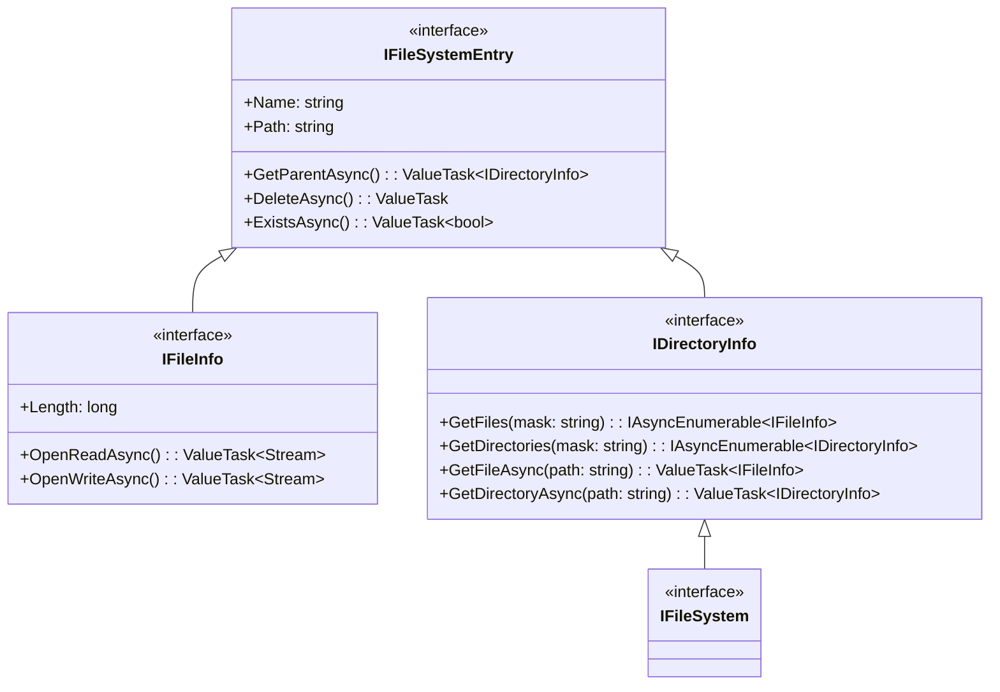
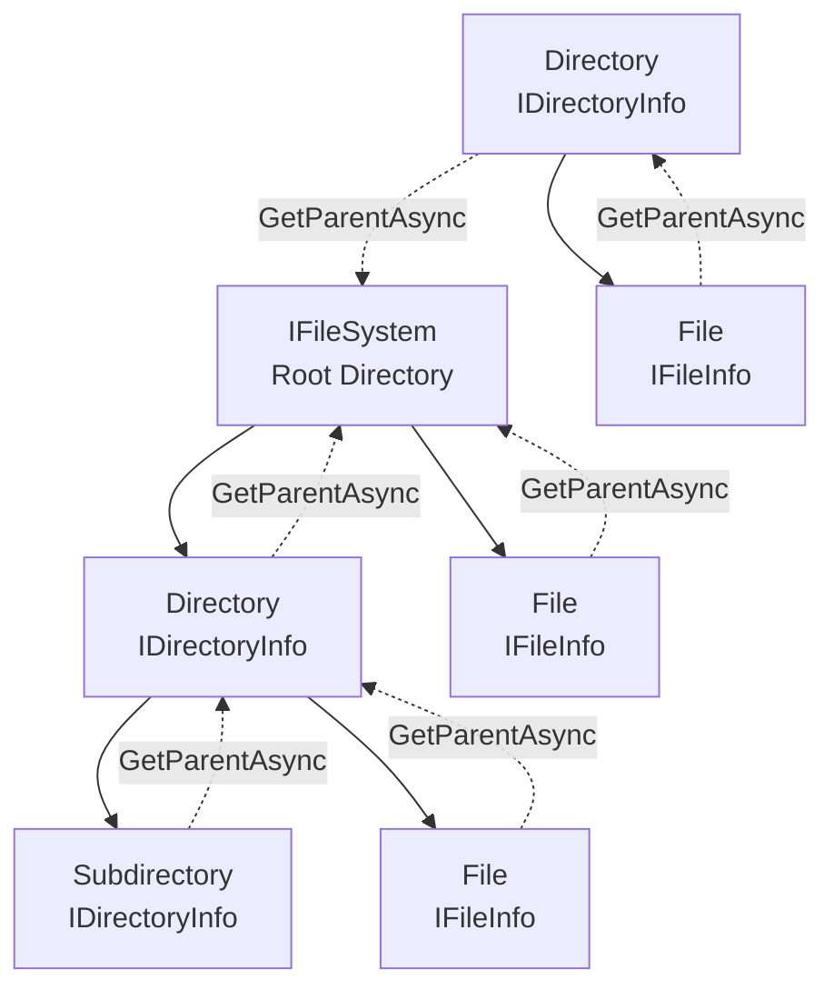

# Virtual File System for Blazor WASM - Minimalistic Design

## Overview

A dead-simple virtual file system abstraction for Blazor WASM. Just basic operations, nothing else.

## Core Requirements

1. Create and manage files and directories
2. Read and write file content
3. Navigate directory structure
4. List and search entries by pattern

That's it. Nothing else.

## Design Principles

- **SOLID**: Each component does one thing
- **KISS**: Dumbest possible abstraction that works
- **DRY**: No duplicate concepts
- **YAGNI**: No features until proven necessary

## Core Abstractions

### Interface Hierarchy

### Object Relationships

### Design Principles

**Object-Oriented Design:**
- Each file and directory is a first-class object with its own behavior
- Objects manage themselves (files can open streams, directories can list contents)
- All entries can navigate to their parent directory via `GetParentAsync()`
- The file system itself is just a special directory (the root)
- Simple, flat inheritance hierarchy

**Interface Segregation:**
- `IFileSystemEntry` - Base for all entries with common properties and operations (Name, Path, GetParent, Delete, Exists)
- `IFileInfo` - File entry with content operations (Length, OpenRead, OpenWrite)
- `IDirectoryInfo` - Directory entry with container operations (GetFiles, GetDirectories, GetFile, GetDirectory)
- `IFileSystem` - The root directory, inherits all directory capabilities

**Simplified Hierarchy:**
- `IFileSystem` inherits from `IDirectoryInfo` - the file system IS the root directory
- No separate container interface needed - directories are containers by nature
- Mask parameters in directory operations for pattern-based searches (e.g., "*.txt", "test*")
- Uniform API - the root file system has the same operations as any directory

**Async Patterns:**
- `ValueTask` for potentially synchronous I/O operations (better performance)
- `IAsyncEnumerable` for lazy enumeration (memory efficient, cancelable)
- Methods returning `IAsyncEnumerable` omit "Async" suffix (return immediately)
- Methods returning `ValueTask/Task` include "Async" suffix per .NET conventions

## Limitations (By Design)

1. **No extended metadata** - No timestamps, permissions, or custom attributes
2. **No concurrency control** - Last write wins, no conflict resolution
3. **No file locking** - Any component can read/write simultaneously
4. **No transactions** - Operations are not atomic across multiple files
5. **No change notifications** - No file system watchers or events
6. **No symbolic links** - No references or shortcuts
7. **No compression** - Files stored as-is without compression

## What This Is

- A simple abstraction for hierarchical file storage
- Files and directories as first-class objects
- Container pattern for directory operations
- No assumptions about storage backend

## Evolution Path (Future)

When (and only when) needed:

## Error Handling

**Strategy: Simple and predictable**

1. **Not found** → Return null from Get operations
2. **Invalid paths** → Throw ArgumentException immediately
3. **Container operations** → Return empty enumerables (never null)
4. **I/O failures** → Let exceptions propagate
5. **Out of space** → Throw appropriate exception

Fail fast, fail clearly.

## Summary

**A minimalist virtual file system design:**
- Hierarchical structure with files and directories
- Container pattern for unified navigation
- Mask-based searching for flexible queries
- Clean separation of concerns through interface inheritance
- Async-first design for I/O operations
- No unnecessary complexity or features

**Key Design Decisions:**
- File system IS a directory (inheritance over composition)
- Parent navigation built into base `IFileSystemEntry`
- No artificial separation between containers - directories are naturally containers
- `ValueTask` over `Task` for better performance
- `IAsyncEnumerable` for memory-efficient enumeration
- Mask parameters for pattern-based searches
- Objects manage their own lifecycle (delete, exists)

Start simple. Add complexity only when reality demands it.