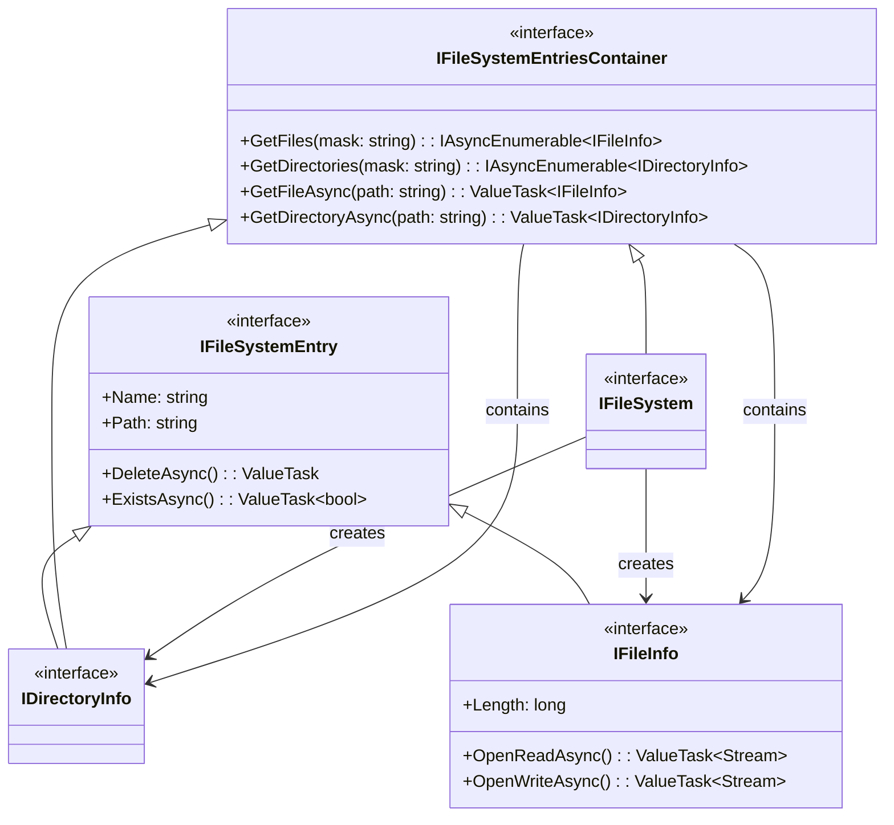
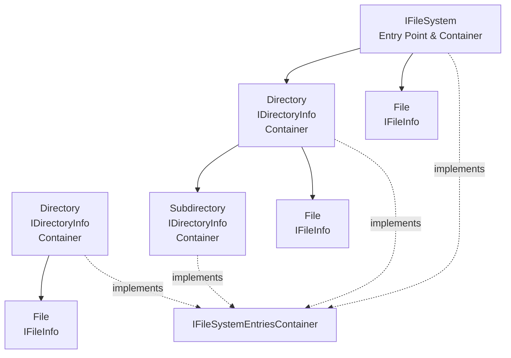

# Virtual File System for Blazor WASM - Minimalistic Design

## Overview

A dead-simple virtual file system abstraction for Blazor WASM. Just basic operations, nothing else.

## Core Requirements

1. Create and manage files and directories
2. Read and write file content
3. Navigate directory structure
4. List and search entries by pattern

That's it. Nothing else.

## Design Principles

- **SOLID**: Each component does one thing
- **KISS**: Dumbest possible abstraction that works
- **DRY**: No duplicate concepts
- **YAGNI**: No features until proven necessary

## Core Abstractions

### Interface Hierarchy

### Object Relationships

### Design Principles

**Object-Oriented Design:**
- Each file and directory is a first-class object with its own behavior
- Objects manage themselves (a file can delete itself, a directory can list its contents)
- The file system acts as a factory for creating and retrieving these objects

**Interface Segregation:**
- `IFileSystemEntry` - Common behavior for all entries (files and directories)
- `IFileInfo` - File-specific operations (read/write streams)
- `IDirectoryInfo` - A directory entry that is also a container
- `IFileSystemEntriesContainer` - Common container operations (listing, searching)
- `IFileSystem` - The root container and entry point

**Async Patterns:**
- Operations that may involve I/O use `ValueTask` for efficiency
- Enumeration uses `IAsyncEnumerable` for lazy, memory-efficient iteration
- Methods returning `IAsyncEnumerable` don't have the "Async" suffix (they return immediately)
- Only methods that return `ValueTask/Task` have the "Async" suffix

## Limitations (By Design)

1. **No metadata** - No timestamps, permissions, attributes
2. **No concurrency control** - Last write wins
3. **No locking** - Any component can modify any file
4. **No transactions** - No atomic multi-file operations
5. **No watching** - No file system change notifications

## What This Is

- A simple abstraction for hierarchical file storage
- Files and directories as first-class objects
- Container pattern for directory operations
- No assumptions about storage backend

## Evolution Path (Future)

When (and only when) needed:

## Error Handling

Simple:

1. File not found → Return null or empty
2. Invalid name → Exception

Fail fast.

## Summary

The simplest possible file system abstraction:
- Minimal interface
- No features beyond basics
- No implementation details
- Perfect starting point

Start here. Add complexity only when reality demands it.