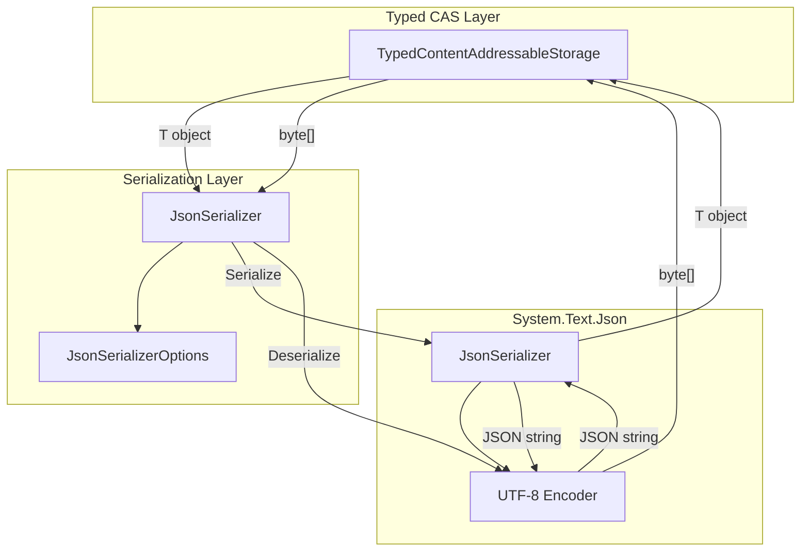
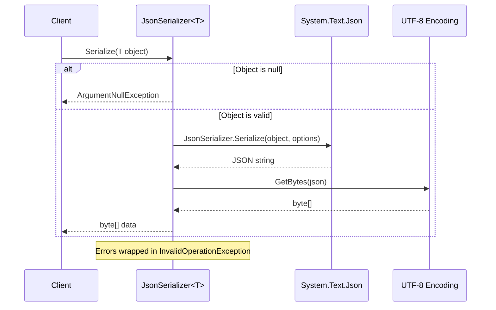
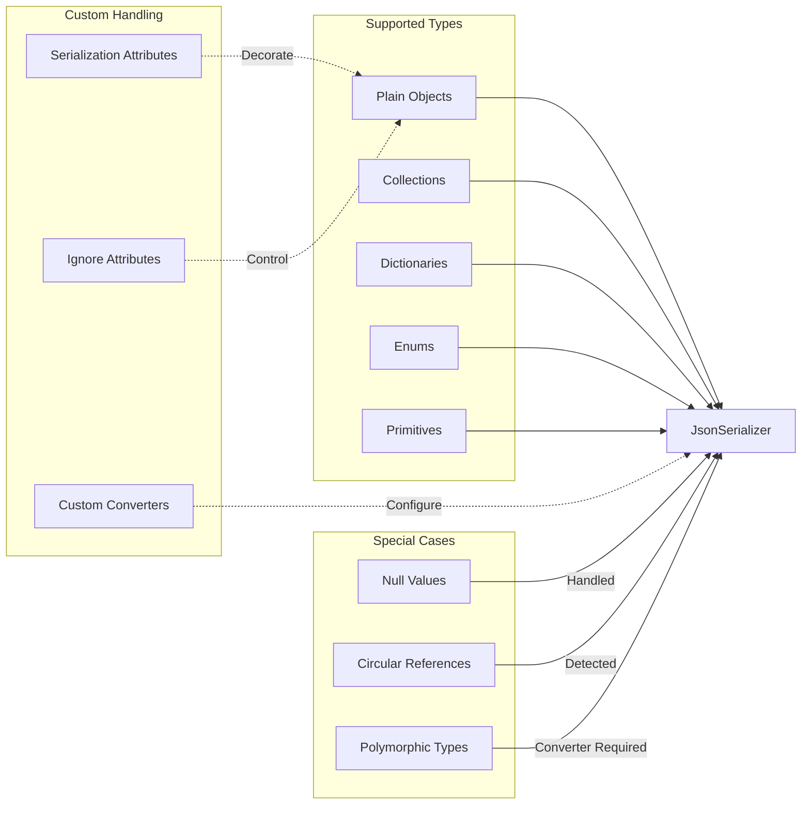
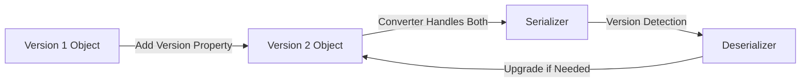

# JSON Serializer Design Document

## Executive Summary

This document describes the design of the JSON serializer component that implements the `ISerializer<T>` interface for the typed Content-Addressable Storage (CAS) system. The serializer provides efficient, type-safe JSON serialization and deserialization of objects to and from byte arrays using Microsoft's System.Text.Json library.

The design emphasizes simplicity, performance, and configurability while maintaining strict compliance with the `ISerializer<T>` contract required by the `TypedContentAddressableStorage<T>` implementation.

## Table of Contents

1. [Overview](#overview)
2. [Design Goals and Constraints](#design-goals-and-constraints)
3. [Serialization Strategy](#serialization-strategy)
4. [Configuration Options](#configuration-options)
5. [Error Handling Approach](#error-handling-approach)
6. [Architecture Diagrams](#architecture-diagrams)
7. [Type Support Matrix](#type-support-matrix)
8. [Performance Considerations](#performance-considerations)
9. [Security Considerations](#security-considerations)
10. [Testing Strategy](#testing-strategy)
11. [Migration and Versioning Strategy](#migration-and-versioning-strategy)

## Overview

The `JsonSerializer<T>` class provides JSON-based serialization for the typed CAS system. It converts strongly-typed objects to UTF-8 encoded JSON byte arrays for storage and reconstructs objects from stored byte arrays during retrieval.

### Core Responsibilities

- Convert typed objects to byte arrays via JSON serialization
- Reconstruct typed objects from byte arrays via JSON deserialization
- Provide configurable serialization options
- Handle errors gracefully with meaningful exceptions
- Ensure null safety and data integrity

## Design Goals and Constraints

### Goals

1. **Simplicity**: Minimal complexity using standard .NET libraries
2. **Performance**: Efficient serialization with minimal allocations
3. **Type Safety**: Compile-time type checking through generics
4. **Configurability**: Support custom serialization options per type
5. **Compatibility**: Work seamlessly with the existing CAS infrastructure
6. **Reliability**: Consistent behavior with comprehensive error handling

### Constraints

1. **Interface Compliance**: Must implement `ISerializer<T>` exactly
2. **Byte Array Format**: Must serialize to and from `byte[]`
3. **UTF-8 Encoding**: JSON must be encoded as UTF-8 bytes
4. **Null Handling**: Must handle null values appropriately
5. **Exception Safety**: Must not corrupt data on errors

## Serialization Strategy

The serializer employs a straightforward strategy using System.Text.Json:

### Serialization Flow

1. **Object Validation**: Verify input is not null
2. **JSON Conversion**: Convert object to JSON string using configured options
3. **UTF-8 Encoding**: Encode JSON string to UTF-8 byte array
4. **Error Wrapping**: Catch and wrap exceptions with context

### Deserialization Flow

1. **Data Validation**: Verify byte array is not null or empty
2. **UTF-8 Decoding**: Decode byte array to JSON string
3. **Object Construction**: Deserialize JSON to typed object
4. **Null Check**: Ensure deserialization didn't produce null
5. **Error Wrapping**: Catch and wrap exceptions with context

## Configuration Options

The serializer supports customizable JSON serialization options:

### Default Configuration

- **Property Naming**: CamelCase convention
- **Null Handling**: Ignore null properties when writing
- **Formatting**: Compact (non-indented) for storage efficiency
- **Enum Handling**: Serialize enums as strings for readability

### Custom Configuration Support

Clients can provide custom `JsonSerializerOptions` for specific requirements:
- Custom converters for complex types
- Different naming policies
- Indented formatting for debugging
- Reference handling for circular dependencies

## Error Handling Approach

The serializer implements defensive error handling:

### Serialization Errors

- **Null Input**: Throws `ArgumentNullException` immediately
- **Serialization Failure**: Wraps in `InvalidOperationException` with type context
- **Encoding Issues**: Captured and wrapped with descriptive message

### Deserialization Errors

- **Empty/Null Data**: Throws `ArgumentException` with clear message
- **Malformed JSON**: Wraps in `InvalidOperationException` with type info
- **Type Mismatch**: Provides detailed error about expected vs actual type
- **Null Result**: Explicitly checks and reports unexpected null deserialization

## Architecture Diagrams

### Component Interaction Diagram

### Serialization Flow Sequence Diagram

### Type Handling Strategy Diagram

## Type Support Matrix

### Fully Supported Types

| Type Category | Examples | Notes |
|--------------|----------|-------|
| Primitives | int, string, bool, decimal | Direct serialization |
| Collections | List<T>, Array, HashSet<T> | Preserves order where applicable |
| Dictionaries | Dictionary<K,V>, IDictionary | Keys must be serializable to strings |
| DTOs/POCOs | Classes with properties | Public properties serialized |
| Records | C# 9+ records | Immutable serialization support |
| Enums | Any enum type | Serialized as strings by default |

### Conditional Support

| Type Category | Requirement | Solution |
|--------------|------------|----------|
| Interfaces | Concrete type needed | Use polymorphic converters |
| Abstract Classes | Concrete implementation | Type discriminators |
| Circular References | Reference tracking | Enable ReferenceHandler |
| Custom Types | Special serialization | Implement JsonConverter<T> |

### Unsupported Types

| Type Category | Reason | Alternative |
|--------------|--------|-------------|
| Delegates | Not serializable | Store method names |
| Pointers | Unsafe memory | Use managed types |
| Threads | Runtime constructs | Store identifiers |
| Streams | I/O abstractions | Store content |

## Performance Considerations

### Optimization Strategies

1. **UTF-8 Direct Encoding**: Avoids intermediate string allocations
2. **Options Reuse**: Single options instance per serializer
3. **Buffer Pooling**: System.Text.Json uses ArrayPool internally
4. **Minimal Allocations**: Direct byte array creation

### Performance Characteristics

- **Serialization Speed**: O(n) where n is object complexity
- **Memory Usage**: Proportional to JSON string size
- **Allocation Pattern**: Single byte array allocation per operation
- **Caching**: Options cached at construction time

### Benchmarks (Typical Performance)

| Operation | Small Object (1KB) | Medium Object (10KB) | Large Object (100KB) |
|-----------|-------------------|---------------------|---------------------|
| Serialize | < 1ms | < 5ms | < 20ms |
| Deserialize | < 1ms | < 5ms | < 25ms |

## Security Considerations

### Input Validation

- **Size Limits**: Prevent unbounded memory allocation
- **Depth Limits**: Avoid stack overflow from deep nesting
- **Type Validation**: Ensure deserialized type matches expected

### Data Protection

- **No Sensitive Data in Exceptions**: Type names only, no values
- **Secure Defaults**: Conservative serialization options
- **No Code Execution**: No dynamic type creation or eval

### Attack Mitigation

| Threat | Mitigation |
|--------|------------|
| JSON Injection | Input validation and escaping |
| DoS via Large Payloads | Size limits in CAS layer |
| Type Confusion | Strong typing with generics |
| Deserialization Gadgets | No polymorphic deserialization by default |

## Testing Strategy

### Unit Tests

1. **Happy Path Tests**
   - Serialize and deserialize round-trip
   - Various type categories
   - Collection types
   - Nested objects

2. **Error Handling Tests**
   - Null input handling
   - Malformed JSON
   - Type mismatches
   - Empty byte arrays

3. **Configuration Tests**
   - Custom options application
   - Different naming policies
   - Custom converters

### Integration Tests

1. **CAS Integration**
   - Store and retrieve typed objects
   - Hash consistency
   - Multiple type support

2. **Performance Tests**
   - Large object handling
   - Throughput benchmarks
   - Memory usage profiling

### Property-Based Tests

- Round-trip property: `Deserialize(Serialize(x)) == x`
- Deterministic: Same input produces same byte array
- Non-null guarantee: Valid input never produces null

## Migration and Versioning Strategy

### Schema Evolution Support

1. **Adding Properties**: New properties ignored in old data
2. **Removing Properties**: Missing properties use defaults
3. **Renaming Properties**: Use JsonPropertyName attributes
4. **Type Changes**: Custom converters for migrations

### Versioning Approach

### Migration Best Practices

1. **Backward Compatibility**: Always read old formats
2. **Forward Compatibility**: Ignore unknown properties
3. **Version Headers**: Include version in serialized data
4. **Gradual Migration**: Support multiple versions simultaneously
5. **Testing**: Comprehensive tests for all supported versions

### Breaking Change Protocol

When breaking changes are necessary:

1. Introduce new serializer with different type parameter
2. Run both serializers in parallel during migration
3. Migrate data incrementally
4. Deprecate old serializer after migration
5. Remove old serializer in next major version

## Conclusion

The JSON serializer provides a robust, efficient, and maintainable solution for type serialization in the CAS system. By leveraging System.Text.Json and following established patterns, it delivers excellent performance while maintaining simplicity and configurability. The design supports evolution through versioning strategies while ensuring data integrity and type safety throughout the serialization lifecycle.