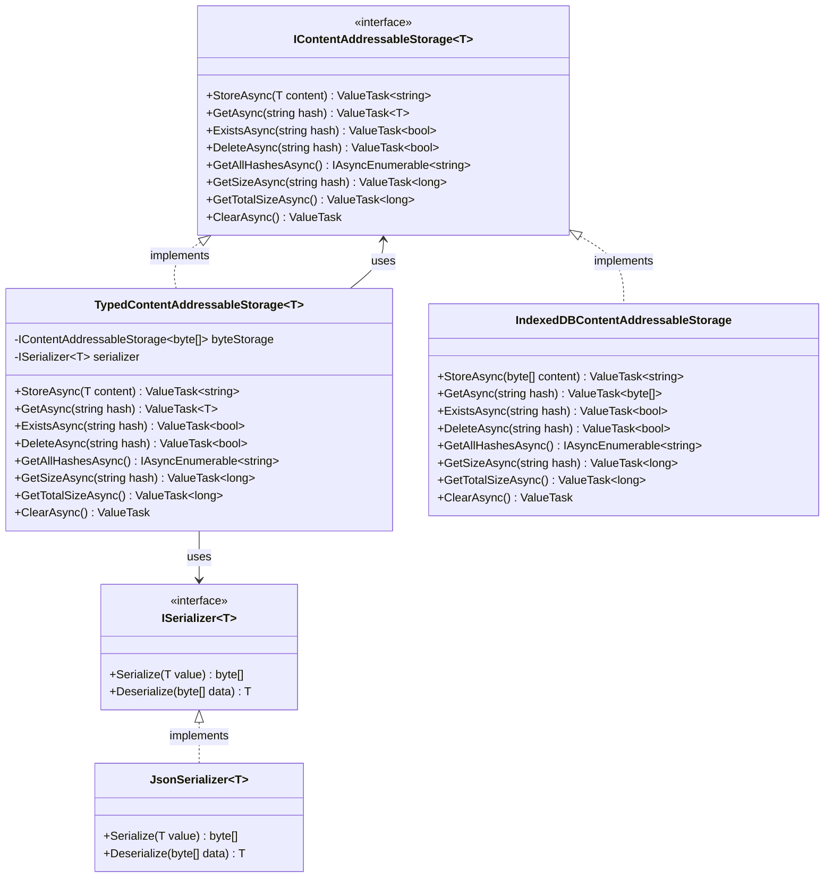
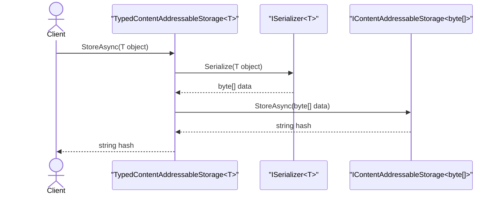
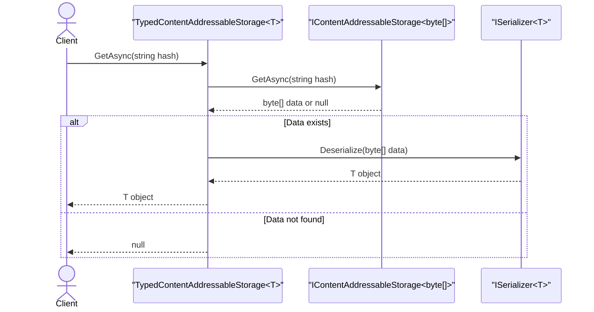
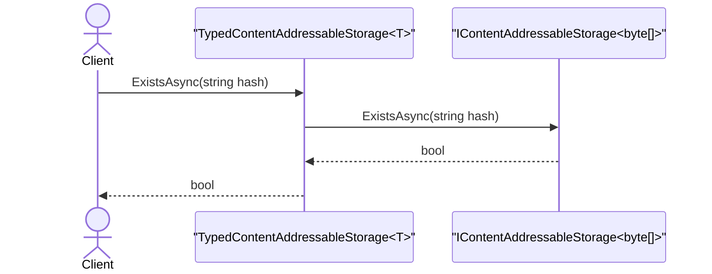
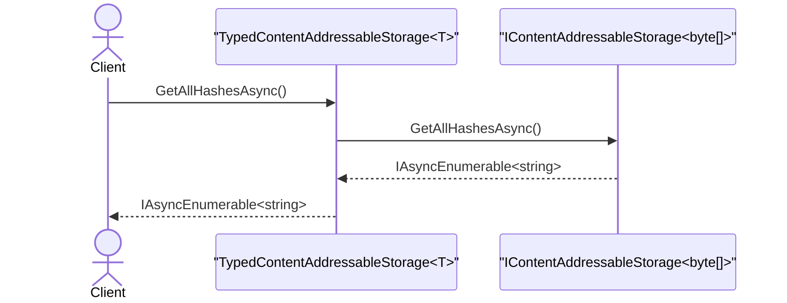
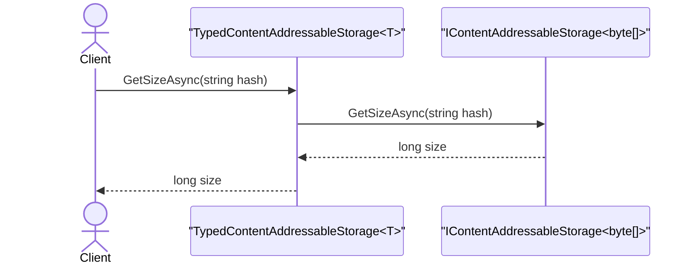
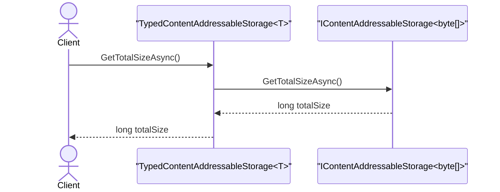
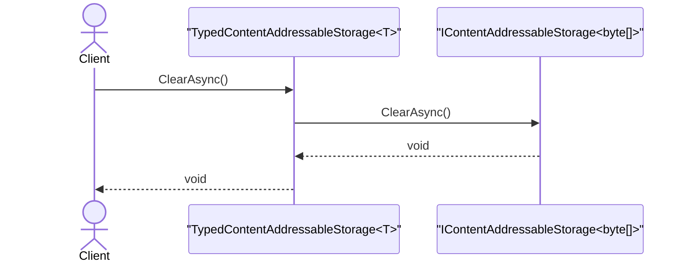

# Typed Content-Addressable Storage Design

## Executive Summary

This document outlines the design for a typed wrapper around the existing Content-Addressable Storage (CAS) interface. The solution introduces a generic `IContentAddressableStorage<T>` interface that provides type-safe operations while delegating all actual storage operations to the existing byte-array-based `IContentAddressableStorage` implementation.

The design prioritizes simplicity and maintainability by:
- Creating a thin type-safe wrapper that mirrors the existing interface exactly
- Delegating all storage operations to the proven byte-array implementation
- Handling serialization/deserialization transparently at the wrapper layer
- Maintaining full compatibility with the existing CAS infrastructure

This approach eliminates runtime type casting errors, improves developer experience through IntelliSense support, and ensures compile-time type safety without modifying the core storage implementation.

## Problem Statement

The current `IContentAddressableStorage` interface operates exclusively with byte arrays, requiring all consumers to:
- Manually serialize objects to byte arrays before storage
- Manually deserialize byte arrays after retrieval
- Handle serialization errors at every call site
- Cast results to expected types without compile-time guarantees

This leads to:
- **Repetitive boilerplate code** for serialization/deserialization
- **Runtime type errors** when casting retrieved data incorrectly
- **Poor developer experience** without IntelliSense for stored types
- **Scattered error handling** across the codebase
- **Inconsistent serialization** strategies between different consumers

The solution is to provide a generic typed interface that handles serialization transparently while preserving the robust byte-array storage implementation underneath.

## Architecture Overview

### Class Diagram

The typed CAS architecture follows a simple delegation pattern with clear interface implementations:



### Key Components

1. **IContentAddressableStorage<T>** - Unified generic interface for all storage operations
2. **TypedContentAddressableStorage<T>** - Implementation that delegates to `IContentAddressableStorage<byte[]>`
3. **IContentAddressableStorage<byte[]>** - Byte-array storage implementation (e.g., IndexedDBContentAddressableStorage)
4. **ISerializer<T>** - Serialization strategy interface for converting T to/from byte arrays
5. **JsonSerializer<T>** - Default JSON serialization implementation using System.Text.Json

### Design Principles

- **Single Responsibility**: Typed wrapper only handles type safety and serialization
- **Delegation Pattern**: All storage operations delegate to existing implementation
- **Unified Interface**: All storage uses the same generic interface pattern
- **Pluggable Serialization**: Different serializers for different types (JSON, Protobuf, etc.)
- **Transparent Operation**: Clients work with typed objects, unaware of serialization

## Interface Design

### IContentAddressableStorage<T> Interface

The generic interface defines storage operations for any type `T`:

```
public interface IContentAddressableStorage<T>
{
    // Store content of type T and return its hash
    ValueTask<string> StoreAsync(T content);
    
    // Retrieve content by hash, returning T or null if not found
    ValueTask<T?> GetAsync(string hash);
    
    // Check if content exists by hash
    ValueTask<bool> ExistsAsync(string hash);
    
    // Delete content by hash
    ValueTask<bool> DeleteAsync(string hash);
    
    // Get all stored hashes
    IAsyncEnumerable<string> GetAllHashesAsync();
    
    // Get size of content by hash
    ValueTask<long> GetSizeAsync(string hash);
    
    // Get total size of all stored content
    ValueTask<long> GetTotalSizeAsync();
    
    // Clear all stored content
    ValueTask ClearAsync();
}
```

### Method Mapping

Each typed method maps directly to its byte-array counterpart:

| Typed Method | Operation | Byte Array Method |
|-------------|-----------|-------------------|
| `StoreAsync(T content)` | Serialize T → byte[] → Store | `StoreAsync(byte[] content)` |
| `GetAsync(string hash)` | Get byte[] → Deserialize → T | `GetAsync(string hash)` |
| `ExistsAsync(string hash)` | Direct delegation | `ExistsAsync(string hash)` |
| `DeleteAsync(string hash)` | Direct delegation | `DeleteAsync(string hash)` |
| `GetAllHashesAsync()` | Direct delegation | `GetAllHashesAsync()` |
| `GetSizeAsync(string hash)` | Direct delegation | `GetSizeAsync(string hash)` |
| `GetTotalSizeAsync()` | Direct delegation | `GetTotalSizeAsync()` |
| `ClearAsync()` | Direct delegation | `ClearAsync()` |

### Serialization Interface

```
public interface ISerializer<T>
{
    byte[] Serialize(T value);
    T Deserialize(byte[] data);
}
```

## Implementation Strategy

### TypedContentAddressableStorage<T> Implementation

The implementation follows a straightforward delegation pattern:

```
public class TypedContentAddressableStorage<T> : IContentAddressableStorage<T>
{
    private readonly IContentAddressableStorage<byte[]> _byteStorage;
    private readonly ISerializer<T> _serializer;
}
```

### Method Implementation Patterns

#### Storage Operations
- **StoreAsync**: Serialize object → Call byte storage → Return hash
- **GetAsync**: Call byte storage → Deserialize if found → Return typed object

#### Direct Delegations
- **ExistsAsync**: Pass through directly (no serialization needed)
- **DeleteAsync**: Pass through directly (no serialization needed)
- **GetAllHashesAsync**: Pass through directly (hashes are type-agnostic)
- **GetSizeAsync**: Pass through directly (size is of serialized bytes)
- **GetTotalSizeAsync**: Pass through directly (aggregate size)
- **ClearAsync**: Pass through directly (clears all content)


### Sequence Diagrams

#### 1. StoreAsync - Store Operation



#### 2. GetAsync - Retrieve Operation



#### 3. ExistsAsync - Check Existence



#### 4. DeleteAsync - Delete Operation


#### 5. GetAllHashesAsync - Get All Hashes



#### 6. GetSizeAsync - Get Size by Hash



#### 7. GetTotalSizeAsync - Get Total Size



#### 8. ClearAsync - Clear All Content



### Error Handling

The typed wrapper handles serialization errors gracefully:

1. **Serialization Failures**: Wrapped in storage exceptions with context
2. **Deserialization Failures**: Returns null or throws typed exception
3. **Storage Failures**: Propagated from underlying byte storage
4. **Type Mismatches**: Caught at compile time through generics

### Dependency Injection Setup

```
// Register byte-array storage implementation
services.AddScoped<IContentAddressableStorage<byte[]>, IndexedDBContentAddressableStorage>();

// Register typed storages using extension method
services.AddTypedContentAddressableStorage<SignedDocument>();
services.AddTypedContentAddressableStorage<OcrResult>();
services.AddTypedContentAddressableStorage<ProcessingEntry>();

// The extension method internally registers:
// - TypedContentAddressableStorage<T> as IContentAddressableStorage<T>
// - JsonSerializer<T> as ISerializer<T> (by default)
```

## Benefits

### Type Safety
- **Compile-time validation**: Errors caught during development, not runtime
- **IntelliSense support**: Full IDE assistance for stored types
- **No casting required**: Retrieved objects are already correctly typed
- **Generic constraints**: Can enforce type requirements (e.g., `where T : ISerializable`)

### Code Quality
- **Reduced boilerplate**: Serialization handled once in wrapper
- **Consistent serialization**: Single strategy per type across application
- **Cleaner code**: Business logic focuses on domain objects, not byte arrays
- **Better testability**: Can mock typed interface more easily

### Maintainability
- **Zero core changes**: Existing byte storage remains untouched
- **Backward compatible**: Existing byte-array consumers continue working
- **Single responsibility**: Each layer has clear, focused purpose
- **Easy debugging**: Serialization logic centralized in one place

### Performance
- **No overhead**: Direct delegation for non-serialization operations
- **Same storage efficiency**: Identical hashing and deduplication
- **Optional caching**: Can add type-specific caching at wrapper level
- **Lazy deserialization**: Can defer deserialization until needed

### Flexibility
- **Pluggable serializers**: Different strategies for different types
- **Migration friendly**: Can change serialization without changing storage
- **Type evolution**: Can version types and handle migrations
- **Mixed usage**: Typed and byte-array interfaces can coexist

## Migration Path

### Phase 1: Infrastructure Setup
1. Implement `IContentAddressableStorage<T>` interface
2. Implement `TypedContentAddressableStorage<T>` wrapper class
3. Create `ISerializer<T>` interface and basic implementations
4. Add unit tests for typed wrapper
5. Register typed storages in DI container

### Phase 2: Gradual Adoption
1. **Start with new features**: Use typed storage for new components
2. **High-value migrations**: Convert frequently-used storage consumers
3. **Type-specific adoption**: Migrate one type at a time (e.g., SignedDocument first)
4. **Parallel operation**: Both typed and byte interfaces work simultaneously

### Phase 3: Full Migration (Optional)
1. Convert all storage consumers to typed interfaces
2. Deprecate direct byte-array usage for application types
3. Maintain byte-array interface only for binary data (images, files)

### Migration Example

**Before (Direct byte-array usage):**
```
var json = JsonSerializer.Serialize(document);
var bytes = Encoding.UTF8.GetBytes(json);
var hash = await storage.StoreAsync(bytes);

var retrievedBytes = await storage.GetAsync(hash);
var retrievedJson = Encoding.UTF8.GetString(retrievedBytes);
var document = JsonSerializer.Deserialize<SignedDocument>(retrievedJson);
```

**After (Typed storage):**
```
var hash = await typedStorage.StoreAsync(document);
var document = await typedStorage.GetAsync(hash);
```

### Zero-Risk Strategy
- No changes to existing storage implementation
- No data migration required
- Existing code continues working unchanged
- Can revert by simply not using typed interfaces
- Incremental adoption at your own pace

## Summary

This design provides a unified, type-safe Content-Addressable Storage system through a generic interface pattern. By using `IContentAddressableStorage<T>` as the single interface for all storage operations—where byte-array storage is just `IContentAddressableStorage<byte[]>`—we achieve type safety and improved developer experience. The typed implementations delegate to the byte-array implementation through serialization, maintaining separation of concerns. The solution is simple, focused, and delivers compile-time type safety for all CAS operations.